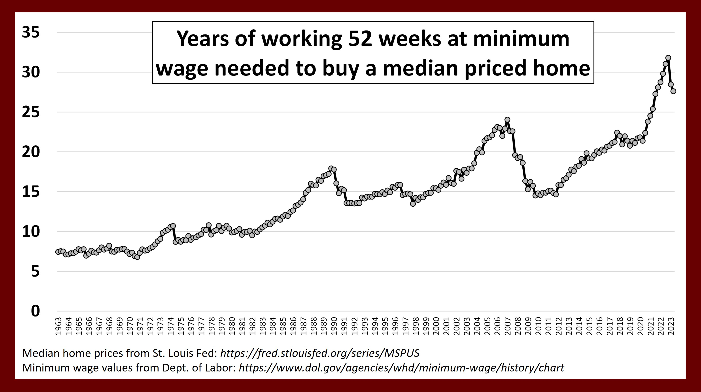

# Teoria da escadinha (Jan 23) [Tales]

A satisfacao das pessoas eh como base em s_{n} = t_{n}/e_{n}, t_{n} eh o que se tem, e_{n} eh o que se espera ter. da pra agente aproximar que e_{n} = t_{n-1}, s_{n} as vezes sobe as vezes desce o que faz a class trabalhadora ficar feliz e triste, mesmo que a longo prazo t_{n} diminua

Entao eh possivel que a qualidade material da classe trabalhadora continue caindo, e nao ocorra uma revolucao

# Teoria da satisfacao de recursos abundantes e escassos [Jan 23]

A qualidade material de materia abundante da classe trabalhadora cresce entao a classe trabalhadora fica feliz, por exemplo por avancos tecnlogicos. Mas a qualidade material de recursos escassos por exemplo terra piora, porque eh um jogo de soma zero, entao para a burguesia se dar bem a classe trabalhadora tem que se dar mal

# Don’t know

# Jan 26 2025, Application of Mary’s room

Everyone has their own Mary’s room. For example, people that live in Recife is the beach, med school, the mall drinking with friends. They cannot comprehend from a fundamental level what is a hike, or running sea wall because they like qualia to comprehend something like that

The fact that they don’t have qualia make it that to them other people’s culture seem not real or without value. It’s like saying that you have money in a different country

# February 1st

There is a lot of overlap between English names in Bristish Columbia, New Westminster, Victoria, Queen Elizabeth park. Perhaps the way Canadians distinguish themselves from US is by being closer to the UK