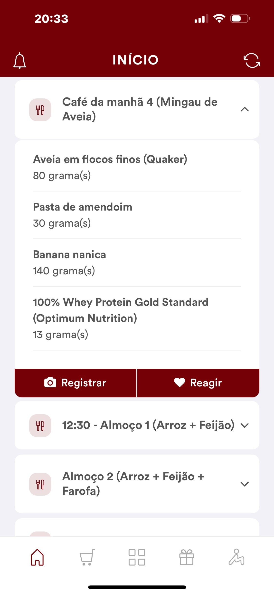
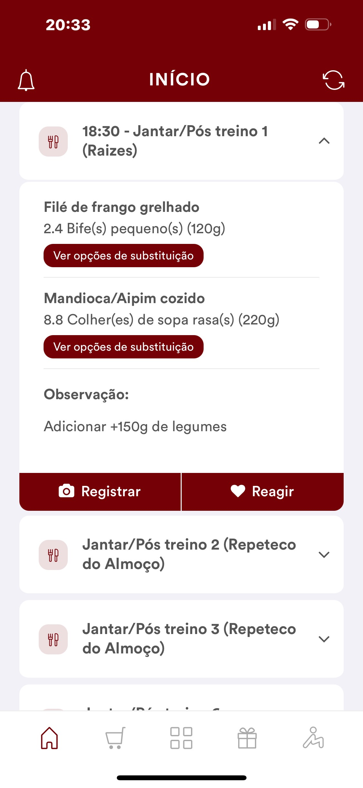

# Plan

# Main

Prepared beef
- 120 * 5 = 600g

To cook chicken
- 120 * 5 = 600g

Arroz preparado
- 220g -> 220g*5 = 1100g

Batata inglesa
- 325 + 280 = 520 * 7 = 3.7 kg
- 300 -> 300 * 7 = 2,100 g

Banana
- 3 banana per day -> 21 bananas per week

frozen vegetables
- 150g -> 150*5 = 750g

Apple
- 170 * 7 ~= 1.2 kg

Oat
- 80g + 40g = 120 per day => 840 g per week

Pasta de amendoim
- 30 g per day -> 210 g per week

Whey
- a lot

Suco de uva
- 200 * 7 ~= 1.4 L

Uva
- 168g => 1.2 kg

Chocolate
- 40g => 280g

Condiments
- Alho
- Oil
- Garlic
- Thing to put on top of food that I don't know what is