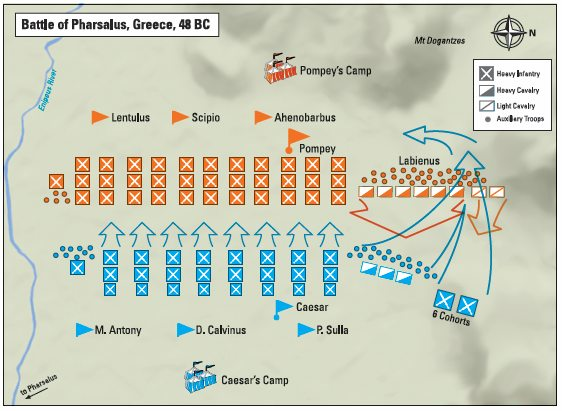
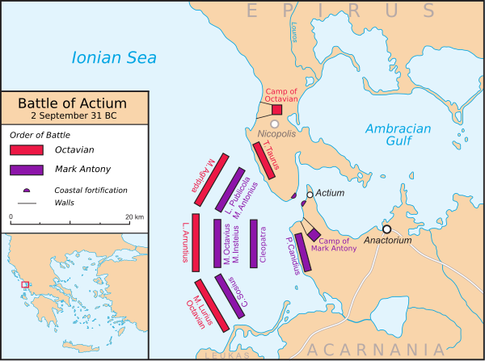

# Alea jacta est

Why crossing the rubicon?
- Basically if Julius Caesar came back to Rome he would be prosecuted, which is bad
- Julius Caesar knew that, thus he tried to negotiate with the senate some political position to obtain foro privilegiado
- The senate didn't accept that, thus we was left with not alternative

Crossing the rubicon
- In January 49 BC, Gaius Julius Caesar led a single legion, Legio XIII, south over the Rubicon from Cisalpine Gaul to Italy to make his way to Rome. In doing so, he deliberately broke the law on imperium and made armed conflict inevitable.

What the phrase means
- "passing the point of no return"

What the optimates did?
- Pompey and many senators fled south, believing that Caesar was marching quickly for Rome. They didn't believe that he only had one legion.
- Caesar was able to capture rome without any resistance because of the rule that it was not legal to have

## Battle of llerda

Context:
- Caesar aimed to secure Hispania (Spain), a critical stronghold and base for Pompeian forces.
- Pompey was the governor of spain, and therefore he had a lot of legions over there
- Afranius and Petreius commanded five legions, outnumbering Caesar’s army, and were well-positioned near Ilerda, controlling the high ground and vital supplies.

## Battle of Pharsalus
Why Julius Caesar purseud Pompey's armies?
- In early 48 BCE, after consolidating his power in Italy, Caesar knew he needed to confront Pompey directly in Greece to prevent his rival from gathering more strength.

The most important battle of 

Situation is critict for Julius Caesar

## Numbers

Caesar: 30,000 battle-hardened veterans and 2000 calvary.
Pompey: 47,000 infantry and 7,000 cavalry, with a numerical and positional advantage.
- These numbers are a bit of a lie because the Julius Caesar were more and m

## Battle of Pharsalus

Pompey wanted to keep a fabian strategy, they had a strategy to cut supplies

Julius Caesar was crazy for a fight, because he knew time would only make things worst to him

Pompey's legions were at the top of a hill, waiting, Julius Caesar pu this army at the bottom of the hill

Pompey didn't create any initiative

Julius Caesar said okay I will leave

Optimates were very confident that they would win, thus forced to go down and

### Battle of Pharsalus part 2

1) The first thing that Pompey did was to when the battle started his army would not run, the idea was to make Caesar's armies to run and get tried
- Caesar's legions showed great discipline by stopping to run

The main trick was the 6 cohorts mentioned in the picture below that scared the calvary of Pompey
- These 6 cohorts were trained exhaustively to handle calvary
- As Pompey's infantry fought, Labienus ordered the Pompeian cavalry on his left flank to attack Caesar's cavalry; as expected they successfully pushed back Caesar's cavalry.
- Dust arised 
- Caesar then revealed his hidden fourth line of infantry and surprised Pompey's cavalry charge; Caesar's men were ordered to leap up and use their pila to thrust at Pompey's cavalry instead of throwing them (this required a lot courage from their armies). Pompey's cavalry panicked and suffered hundreds of casualties, as Caesar's cavalry came about[42] and charged after them.

Pompey retreats and dies
- Pompey retreats, I don't remember why
- But the legions of his side after seeing his retreats end up retreating as well because they get desperate and start fleeing
- Pompey arrives at the camping, thinking this battle while take a while, and suddenly people arrive saying the romans are invading the camping
- Pompey is forced to run away as a slave
- He doesn't give up on the war, but when he arrives on egypt to reunite forces of the african part of the rome, the emperor of egypt kills him Pompey in order to please Julius Caesar
- Afterwards, Caesar's man take Pompey's head to Caesar, and he starts to cry because they used to be friends for so long, and he was married to his daughter, in fact Caesar's plan was as expected to pardon Pompey

## Battle of Zela

veni vidi vici

What is it?
- The Battle of Zela was fought in 47 BC between Julius Caesar and Pharnaces II of the Kingdom of Pontus. The battle took place near Zela

Strategy
- Pharnaces wanted to enrolar the most because he knew that Julius Caesar had a lot of things to worry about

Pharnaces' army marched down into the valley separating the two armies. Caesar initially laughed at this move, thinking it was merely bravado, as it meant his opponents had to fight an uphill battle. However, Pharnaces' men began climbing up from the valley, and Caesar realized they were serious. Caesar recalled the rest of his men from constructing their camp, and hastily drew them up for battle. Immediately after, the Pontic army engaged Caesar's thin line of legionaries. Pharnaces' scythed chariots broke through the thin defensive line but were met by a hail of missiles (pila, the Roman throwing spear) from Caesar's battle line and were forced to retreat. Caesar launched a counter-attack and drove the Pontic army back down the hill, where it was completely routed. Caesar then stormed and took Pharnaces' camp, completing his victory.[1][2]

## Motim das legioes de cesar

What is to do?

## Batalha de Tapso

## Result

Optimates
- Literally the oldest patricians, the optimates, the best one, the most secular elite of the romans were all killed by one man, Julius Caesar

Celebracao de 4 triunfos
- pinturas mostrando como foi a batalha
- mostrava os espolios
- prisioneiros de guerra (pessoas importantes)

Trinufo da galia
- Dobrou o tamanho do imperio romano
- no final ele estrangulava o rei das tribos gauleses

Triunfo do egito
- De certa forma nao foi um triunfo de verdade

Triunfo sobre o reino de ponto
- De certa forma nao foi um triunfo de verdade porque ele nao anexou novas terras

Triunfo sobre um rei da africa
- A galera achou muito ruim porque ele mostrou pinturas de optimates morrendo

Um talento de prata para todos os soldados
- 15 anos de salario de soldado

Para a populcacao romano ele deu 4 anos de salario minimo

Increased the senates from 300 to 1000 people

He changed the calendar to have 12 months instead of 10, as you can see Dezembro is the number 10
- The months Julho e Agosto were added

# Death of JC

Bossal
- he asked Marco anotony to crown him in public twice to see the reaction of public
- he asked built a throne of gold in the senate, and people thought that was too extravagant
- a random guy wanted to put a crown on him and the tribune of plebe complained and complained at him but then he put the tribune of the plebe in jail

RCA
- JC pardoned his enemies, but they didn't and they went to kill him
- Led by Marcus Junius Brutus and Gaius Cassius

Why kill him
- They had to murder quickly because Julius Caesar was going to travel to conquer egypt and germany
- He had declared himself ditador vitalicio, which showed he had no power of the republic
- Julius Caesar enemies were still alive because he would always pardon them

Day of death
- The religious sacerdote had a vision  that he should stay home today
- His wife had a nightmare
- He had a hangover at that day
- Brutus said how can you convocate a meeting in the senate and not come

## Aftermath

1. Since Mark Anthony had a terrible governship of Italy he lost his spot as the main heir from JC
2. JC had some campaigns from Spain that showed how smart Augustus was
3. Augustus was only 18 years old. He also chose Augustus due to lack of options since he didn’t have a son himself

# Second triumvirate

It took several years for Augustus to consolidate his position, as Julius Caesar's assassination led to an assumption of power by Antony. It was Cicero's support of Octavian—a power play in which Cicero intended to use to split Caesar's heirs—that led to the repudiation of Antony and ultimately, to Octavian's acceptance in Rome.

# Liberators' civil war

## Lex Titia (43 BCE)

Unlike Caesar, the Second Triumvirate was a legal entity with near-absolute power, established through the Lex Titia in 43 BCE.

## Battle of Philippi

However, to the south, Cassius was defeated by Antony and died by suicide after hearing a false report that Brutus had also failed.

# Fourth Civil war (Octavian vs Mark athony)

It's funny because they were fighting together before, and now they were fighting against each other

## Battle of Actium

### Pre battle
It was a decisive moment on the fall of the republic, because after that there was basically no opposition from augustus

1. Mark athony moves their troops to Actium
2. Agrippa moves to the south very fast to their south with naval (GETTING THE FOOD SUPPLY)
3. Octavian moves to its north very fast as well
4. Mark anthony gets pincado

### Battle

1. Mark anthony had to move first because Octavian got his supplies
2. He tried to bait Octavian into the battle, because he had a stronger naval, and straight confrotation was better for him
3. Octavian doesn't buy it, because he knows he can out flank if Mark Anthony gets out
4. Since Octavian is trying to outflank the enemy, the center line becomes very thin
5. Cleopatra is in the middle and sees that
6. Each side's squadrons trying to outflank the other, until Cleopatra took her Egyptian galleys and fled the battle. Antony then broke off and with a few ships managed to follow her.

### Aftermath

It wasn't all lost because Cleopatra's ship had the treasure so they could in theory rebuild an army

“Victorious warriors win first and then go to war, while defeated warriors go to war first and then seek to win”

## Octavian won

### Aftermath

1. Cleopatra killed herslef when she learnt that she would become a tropy in the victory party
2. Octavian erased Marco Antonio from Roman history, in fact all of the history documents that had his name were deleted. In fact he started to claim that the fourth civil war was a war against Egypt and not a civil war
3. He killed Cesarium
4. Unlike Gaius Julius Caesar he didn't provide any mercy on the people that opposed to him, he judged based on why loyal the person was to Marco Antonio, if he they die hard since the beginning, he would just kill, and the people that he forgave he would make a really big deal of out it to show what an amazing person he was

Eneida
- This piece of work was created by Virgil, which was backed by the Mecenas which was Augustus political advisor. In order to create political propaganda
- In fact the lineage of Augustus was set in the book to date back to Romulus and the back to Aeneid which was a Trojan hero
- Rome beats Greek is an epic resurrection of the phoenix

# Consolidation of power from Augusuts

Pantheon
- The Pantheon in Rome was first built between 27 and 25 BC by Marcus Agrippa

https://en.wikipedia.org/wiki/Constitutional_reforms_of_Augustus#:~:text=Instead%20of%20relying%20on%20the,any%20citizen%20accused%20of%20crime.

[23 BC] Imperium proconsulare maius
- This in effect gave Augustus constitutional power superior to all other proconsuls in the empire

Tribunicia potestas
- He gave up being consul because he noticed that people didn't feel sad by the fact that he was almost dying
- Instead of relying on the powers of the consulship which he gave up, he instead relied on the tribunicia potestas, or tribunician power, which enabled him to
- - propose laws to the Senate whenever he wanted
- - veto any laws he wanted
- - grant amnesty to any citizen accused of crime

Management style Augusuts vs Julius Caesar (aesthethics vs content and slow vs fast)
- Julius = apparent power and fast
- Augusuts = hidden and slowly
- Shadow leader
- Introduced a façade of restoring the Republic while consolidating power through the principate system (first citizen)
- Gradual gains, hidden power
- Relied on a complex bureaucracy, delegating authority through a well-structured administration

Family
- Agripa became too influential
- Augusuts realized he should be part of the family
- He married with Julia

## Lex Julia

Due to the fact that the roman empire was very rich, people didn't want to have kids, so they Augusuts passed a law to incentive people to have more children

Adultery
- This law punished adultery with banishment. The two guilty parties were sent to different islands ("dummodo in diversas insulas relegentur"), and part of their property was confiscated. Fathers were permitted to kill daughters and their partners in adultery
- Augustus himself was obliged to invoke the law against his own daughter, Julia (relegated to the island of Pandateria) and against her eldest daughter (Julia the Younger)

Outcome
- Long-term demographic data suggests that Roman birth rates continued to face challenges, and these laws did not lead to a sustained population boom

## Legacy
Month of Augustus
- The month of August is inspired in him. And note that it has the same size (31) as july because he wanted to be as great as juliuc caesar