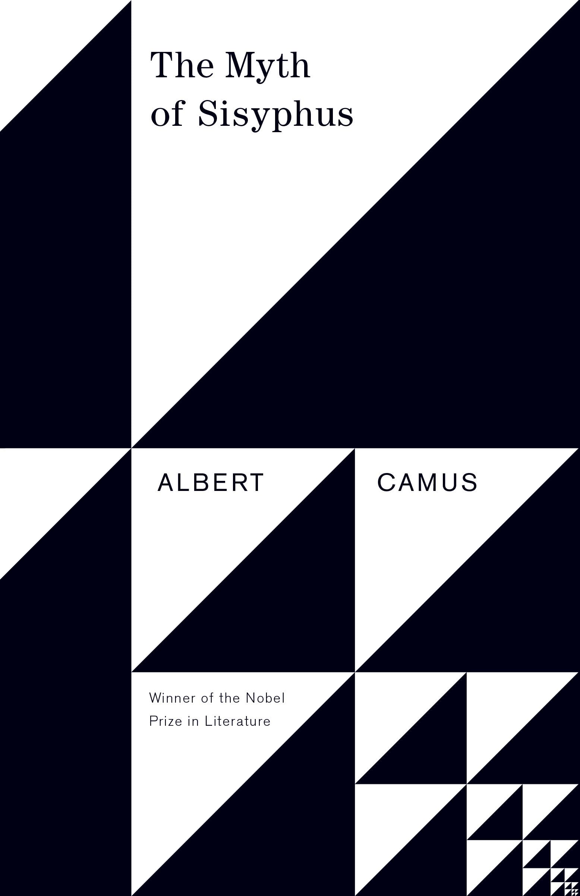
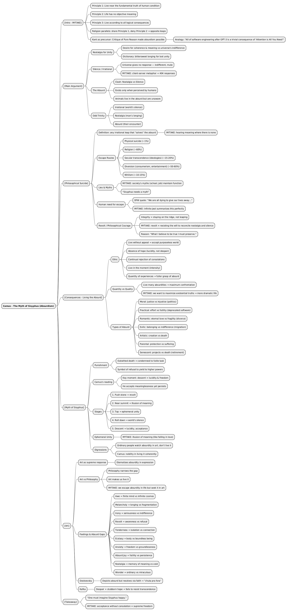

# Mind map of this blog post

# The intro

[MYTAKE] My interpretation is that Camus's philosophy (Absurdism) has three ethical principles: 
- Principle 1: Live as close as possible to the most fundamental truth of the human condition, without escape.
- Principle 2: The most fundamental truth is that life has no objective meaning
- Principle 3: Live according to all logical consequences of Principles 2 and 3
- Obviously, one needs to understand the book to verify or falsify my interpretation
- [MYTAKE] Interesting that religions have Principle 1 in common with Absurdism, but they don't agree with Principle 2. Therefore, they both go all in, in opposite directions

[MYTAKE] It's crazy how influential Kant is, because one could argue that the critique of pure reason basically made this whole book possible. Kant is completely insane. Every philosophy after Kant just seems like a trivial consequence of his ideas, in the same way that all of software engineering since Chat GPT 3.0 is a trivial consequence of the paper 'Attention is all you need.'

# The main argument
## Nostalgia for unity
- [Camus Definition] humanity's deep desire for coherence, meaning, and rational explanation in a universe that offers none.
- [Dictionary Definition] Nostalgia is a bittersweet longing for the past, often idealizing former times, places, or experiences that feel irretrievably lost.

## Silence/irrational
- We demand meaning from the universe, but the universe doesn't respond, doesn't explain itself, doesn't provide the coherence we desperately seek. It just is - indifferent, mute, absurd.
- [MYTAKE] Using a client-server metaphor. It is as if our consciousness is a client, and the server is reality (the World beyond our consciousness). We constantly send an API request for any reason or whatsoever, and the API keeps sending a 404 response.

## Absurd
- The absurd is the irreconcilable confrontation between humanity's nostalgia for unity and the World's silence/irrational refusal to provide it.
- [MYTAKE] It's interesting because the absurd only exists when there is a human being seeing the gap.
- [MYTAKE] Something interesting is the fact that only we humans can see the absurd. For example, animals live in the absurd, but they are not aware of it; therefore, they don't suffer any pain from it.

## Odd trinity
- The irrational (the World’s silence).
- The nostalgia (man’s longing).
- The absurd (their encounter).

# Philosophical suicide

## Leaps or philosophical suicide
- Is the assumption of any irrational statement that solves the absurd
- [MYTAKE] Most of them will simply mishear the silence/irrationality of the World, basically hearing meaning where there is none

## Most common ways Americans choose to escape the meaninglessness of life (and philosophically suicide)

| Escape Route (Camus)                             | Modern Equivalent                                         | Examples in U.S. Life                                                      | Rough % of Adults (2025)                            |
| ------------------------------------------------ | --------------------------------------------------------- | -------------------------------------------------------------------------- | --------------------------------------------------- |
| **Physical suicide**                             | Actual withdrawal from life                               | Suicide rates (~14 deaths per 100k/year; ~1.3M attempts annually)          | ~0.5–1% lifetime prevalence in a given year         |
| **Philosophical suicide: Religion**              | Transcendent leap to God / salvation                      | Christianity, Judaism, Islam, etc. (churchgoing down but still central)    | ~60% identify religious; ~40% “actively practicing” |
| **Philosophical suicide: Secular transcendence** | Ideologies or systems that give “absolute” meaning        | Political nationalism, utopian ideologies, cult-like devotion to movements | ~15–20% (varies, overlaps with religion)            |
| **Diversion / Distraction**                      | Filling life with entertainment, consumerism, workaholism | Streaming, sports, shopping, hustle culture                                | ~50–60% lean heavily on this daily                  |
| **Nihilism / Resignation**                       | “Nothing matters, so why try” (passive escape)            | Chronic disengagement, depressive withdrawal, fatalism                     | ~10–15% at any given time                           |

## Lies
- [MYTAKE] I think that this book changed a lot of my perspectives on society's myths, such as school, universities, and corporate jobs. It seems that there is something really important about making us believe in myths. Otherwise, no one will do anything, and society will collapse
- [MYTAKE] Sisyphus needs a myth

## The human needs to philosophically commit suicide
- “We are all dying to give our lives away to something, maybe. God or Satan, politics or grammar, topology or philately - the object seemed incidental to this will to give ourselves away, utterly. To games or needles, to some other person. Something pathetic about it. A flight in the form of a plunge. Flight from exactly what? These rooms, blandly filled with excrement and heat? To what purpose?” David Foster Wallace
- [MYTAKE] This quote is from Infinite Jest, and it summarizes the book of Infinite Jest very well
## Revolt/Philosophical courage
- "The real 'danger' is not the leap itself but the instant before it, when you’re looking into the void and could go either way. Integrity = staying there, not leaping. All else is 'subterfuge' (self-deception)." - Quote from the book Myth of Sisyphus
- This is Camus’s definition of philosophical courage: remaining on that dizzying ridge between nostalgia and silence without reconciling them.
	- [MYTAKE] For me, it was a little odd why Camus defined Revolt in such a way. It's because you are revolting against your own intense will to conciliate the nostalgia for unity and the silence
- Why does he think revolt is a good choice to live life? “What I believe to be true I must therefore preserve.”

# Consequences of living the Absurdism

## Ethic
- To Live without appeal
	- Means to accept a world stripped of ultimate purpose
- Absence of hope (not despair, but lucidity: no ultimate meaning is waiting).
- Continual rejection (refusal of consolations, myths, leaps).
- Feeling the absence of nostalgia(staying awake to the contradiction, not closing it off).
- Living in the moment (Intensity)
- Quantity
	- The actor is the perfect example. An actor would live all the absurdities listed below with high intensity. Don Juan does the same, but in terms of loving women.
	- Important to mention that Don Juan and actors don't live the absurd fully, since they don't feel the pain of the nostalgia for unity, for example

## Quantity vs Quality
- For Camus, in order to live in accordance with Absurdism, one must face as many absurdities as possible, and that can be achieved with more experiences and more flavours of absurd, so we have a full grasp of the absurd as a whole
- [MYTAKE] The previous statement can be proved by my axioms, because not only do we want to live in accordance with the existential truths, but we also want to maximize them, which makes it more dramatic

### Types of Absurd (Numbered from 2)

| #   | Absurd Type      | Clash Description                                                              | Everyday example                                                                                                  |
| --- | ---------------- | ------------------------------------------------------------------------------ | ----------------------------------------------------------------------------------------------------------------- |
| 1   | Moral Absurd     | Need for justice vs. apparent injustice of the world                           | Politics in the US or Brazil (Lula, Bolsonaro, Trump)                                                                 |
| 2   | Practical Absurd | Human effort vs. futility of tasks                                             | Spend a whole year writing code to create a service, when that same service will be deprecated in 3 years at most |
| 3   | Romantic Absurd  | Desire for perfect, eternal love vs. the fragility of human relationships      | 50% divorce rates in the US                                                                                           |
| 4   | Exilic Absurd    | Nostalgia for belonging vs. foreign indifference                               | Missing the Brazilian culture and family, while the US pays money                                                     |
| 5   | Artistic Absurd  | Passion to create meaning vs. awareness that art changes nothing of death      | ?                                                                                                                 |
| 6   | Parental Absurd  | Dream of protecting one’s child vs. the inevitability of their suffering and death | Every parent faces that absurdity |
| 7   | Senescent Absurd | Lifetime of projects vs. the void of retirement and approaching death          | Every retired person                                                                                              |

# Myth of Sisyphus

## Punishment
- He got that punishment because he sought to **outwit death and control fate**, so his punishment was a task that **denies progress and control**.
- Disobedience
- Relationship with the absurd
	- Camus interprets this as an affirmation of the absurd: the refusal to yield to higher powers even under these dire consequences
	- Maybe Sisyphus doesn't take the same principles as the absurdists, but he takes actions that an absurdist should take, thus becoming a role model in some sense
	- Key: Moment of descent of the ball, because it becomes extremely obvious that his efforts are meaningless, but he doesn't care, he accepts life as meaningless, and he continues doing this shit

| **Stage**                          | **Literal action**       | **Psychological state**     | **Philosophical meaning**                      |
| ---------------------------------- | ------------------------ | --------------------------- | ---------------------------------------------- |
| 1. **He begins to push the stone** | The climb starts         | Revolt, striving            | Man acting despite knowing there is no goal    |
| 2. **He approaches the summit**    | Moment before completion | Illusion of meaning         | “Maybe it _does_ matter.” The feeling of unity |
| 3. **The stone reaches the top**   | Temporary pause          | Ephemeral unity             | The emotional high — sense of fulfillment      |
| 4. **The stone rolls back down**   | Collapse of the illusion | Encounter with indifference | The world’s silence returns                    |
| 5. **He walks back down**          | Acceptance, awareness    | Lucidity                    | Realizes absurdity and continues, freely       |

## Ephemeral unity
- [MYTAKE] For a moment, we interpret the World's silence incorrectly, and we start to see meaning where there is none. This happens when we start reaching the end of the summit, and that creates ephemeral unity KKKKKKKKKKKKKKKK, for example, when you fall in love. But when the ball rolls down, we get back to reality, and we see that our interpretation of the World was wrong.

## Diregressions
- The everyday person watches plays to glimpse other lives without suffering them. They want to see the absurd, but not live it.
- For Camus, there is an enormous nobility in living the absurd, due to its logical coherence, and facing every consequence for not philosophically suiciding yourself

# Art

## Artistic creation as the supreme response to the absurd
- By replicating your experiences through art, you are kind of eternalizing the absurdity of that moment in some sense, or at least partially

## Art is the opposite of Philosophy with respect to the absurd
- Philosophy (or at least most philosophers) attempts to narrow the gap of the absurd
- Whereas art attempts to make you live it
- [MYTAKE] So our life is a lot based on trying to escape the absurd, to find meaning for our lives, climbing the social ladder, college, marriage, kids. But for some reason we voluntarily look for the absurd in the arts, which is contradictory, for me it doesn't make much sense yet.
- 

## Feeling -> type of absurd

| #   | **Feeling / Mood** | **Type of Absurd Gap**                          | **Description**                                              | **Typical Artistic Expression**                    |
| --- | ------------------ | ----------------------------------------------- | ------------------------------------------------------------ | -------------------------------------------------- |
| 1   | **Awe**            | Finite mind ↔ Infinite cosmos                   | The mind glimpses immensity it cannot contain.               | Sublime art, cosmic poetry, metaphysical painting. |
| 2   | **Melancholy**     | Desire for unity ↔ Fragmented world             | The self longs for coherence amid disjointed experience.     | Romanticism, elegy, slow cinema.                   |
| 3   | **Irony**          | Human seriousness ↔ World’s indifference        | The World refuses to match our moral or emotional gravity.   | Comedy, satire, postmodern fiction.                |
| 4   | **Revolt**         | Awareness of absurd ↔ Refusal of resignation    | Conscious resistance without illusion.                       | Existential heroism, punk, Camus’s _The Rebel_.    |
| 5   | **Tenderness**     | Isolation of self ↔ Need for connection         | Compassion that arises from knowing everyone’s exile.        | Chekhovian realism, quiet humanist film.           |
| 6   | **Ecstasy**        | Limited body ↔ Boundless being                  | Momentary dissolution of boundaries in love, art, or nature. | Mystical music, dance, Rilke.                      |
| 7   | **Anxiety**        | Consciousness of freedom ↔ Lack of ground       | The vertigo of infinite possibilities with no foundation.    | Existentialism, Kierkegaard, expressionism.        |
| 8   | **Absurd Joy**     | Knowledge of futility ↔ Continuation of effort  | Sisyphus smiling as he pushes the stone.                     | Beckett, minimalist repetition, and absurdist theater. |
| 9   | **Nostalgia**      | Memory of meaning ↔ Present void                | Yearning for a lost harmony — childhood, God, ideal love.    | Proust, melancholic pop, impressionism.            |
| 10  | **Wonder**         | Habitual perception ↔ Revelation of strangeness | Suddenly seeing the ordinary as miraculous or alien.         | Surrealism, magical realism, childlike gaze.       |

## Dostoevisky
- [MYTAKE] He is mentioned multiple times in the book, the name of Dostoevsky. Because Doestoevisky goes deep into the psychology of the absurd, but it always resolves through the path of faith, as in Camus's language. It is as if he "fica na cara do gol, e chuta para fora"

## Kafka
- For Camus, he described the despair well. But we couldn't resist the temptation of the stubborn hope.

# Takeaway
- One must imagine Sisyphus happy

