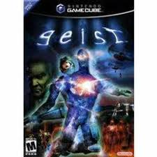
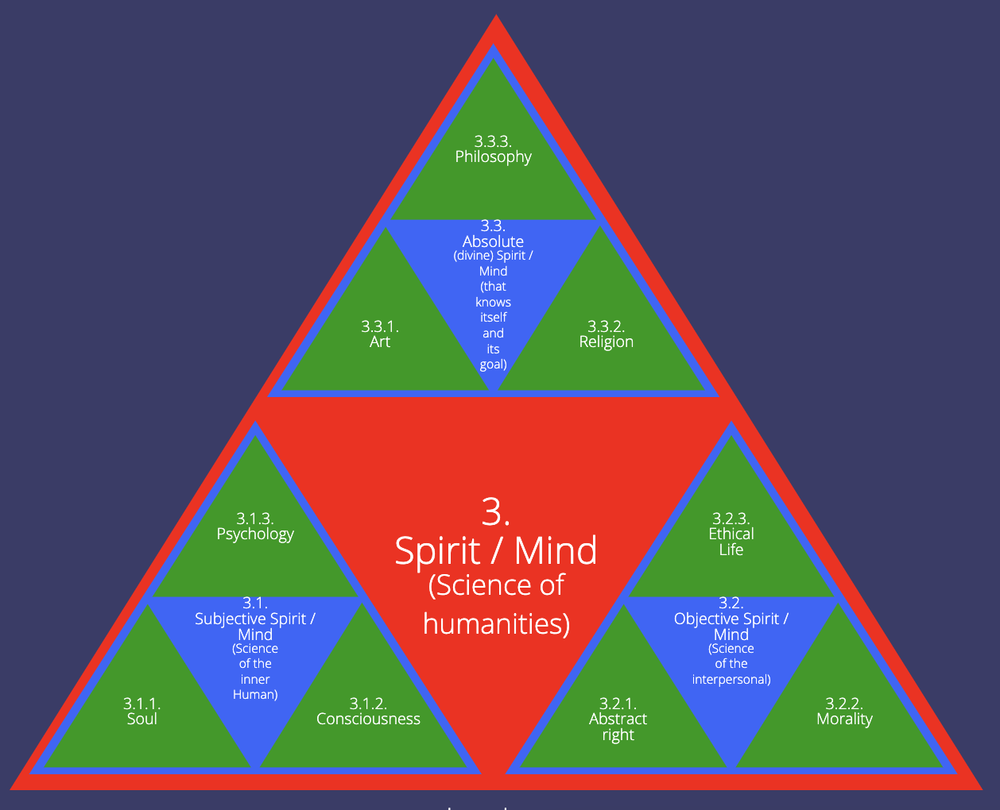
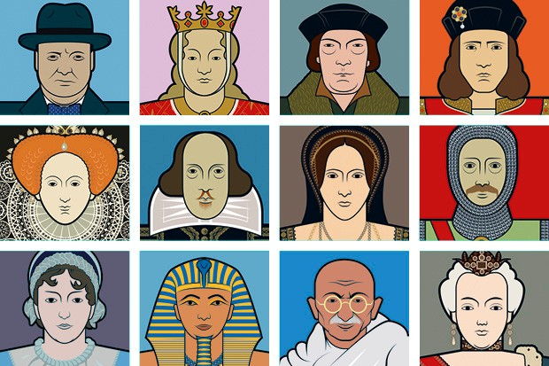

# Memory Trigger

1. What is Geist
2. What is Freedom
3. Geist goals

# Geist definition

What is Geist
- Geist is a central concept in Hegel's philosophy. According to most interpretations, the Weltgeist ("world spirit") is not an actual object or a transcendent, godlike thing, but a means of philosophizing about history
- - For a long time I didn't understand that
- Weltgeist is effected in history through the mediation of various Volksgeister ("national spirits")

What is freedom
- Consciousness that progressively gains more insight into reality and its working, thus increasingly experiencing the world as a place in which it recognizes itself (maximize knowledge and/or capability)

What is the Geist goals
- Hegel regards history as an intelligible process moving towards a specific condition—the realization of human freedom
- The geist would be the driver of history

Geist decomposition
- Subjective Spirit: This involves individual consciousness and personal development
- - It's the driving force in ourselves
- Objective Spirit: This includes social institutions, laws, and ethical life
- - The objective spirit, is simply the means to obtain freedom, for example we work to gain money to be free
- Absolute Spirit: This encompasses art, religion, and philosophy, representing the highest form of self-awareness and freedom
- - Therefore in some ways the absolute spirit is full realization of the freedom, because it is the moment where we are actually more free to choose
- - This is to a certain extent our ultimates goals (the end itself), for example capitalist ethic is a type of absolute spirit
- - Since it's the end itself it displayes the ultimate expression of our freedom

World historical individual
- Hegel uses the phrase “world-historical individuals” to describe those rare personages who play a major role in world history. Examples Julius Caesar and Napoleon Bonaparte. World-historical individuals benefit from the partial coincidence of their own subjective passions with the universal will of Spirit as it is expressed in the Spirit of the people. That people's Spirit is unconscious until it is brought to consciousness by the world-historical individual. Thus, world-historical individuals serve to bring Spirit to a new stage of self-consciousness and help to establish a new State
- - For me that makes a lot of sense when I think of Bolsonaro, for example he satisfies: "That people's Spirit is unconscious until it is brought to consciousness by the world-historical individual", also that he is the concrete and universal because the absolute spirit is something abstract because it's universal, but Bolsonaro is concrete, even though he represents something very abstract which is the right wing in Brazil, he is still concrete
- For Hegel, the great hero is unwittingly utilized by Geist or absolute spirit, by a "ruse of reason" as he puts it, and is irrelevant to history once his historic mission is accomplished; he is thus subjected to the teleological principle of history, a principle which allows Hegel to reread the history of philosophy as culminating in his philosophy of history

# Concrete and Universal

Definition
- ‘Concrete universal’ is a notion originated in Hegel’s philosophy, which provocatively questions possible modes of relationship between the abstract and the concrete. Contrary to the traditional hypothesis that universals are necessarily abstract, Hegel notably maintains the possibility for the universal to be both abstract and concrete. These two apparently contradictory features must not be understood as static properties, but rather as dynamic and changing conditions that can integrate in complex ways.

Through this challenging and apparently paradoxical view, Hegel invites us to think of the concrete universal as being able to overcome the dichotomy between mere abstraction and mere particularity, in order to think universality together with concreteness.
- Hegel invites to think about the synthesis of the abstract and the concrete. Because the concrete and universal is the speculative stage of the dialecti

# History

Direction/Meaning of history
- Hegel’s philosophy of history is perhaps the most fully developed philosophical theory of history that attempts to discover meaning or direction in history
- Hegel regards history as an intelligible process moving towards a specific condition—the realization of human freedom
- “History is the process whereby the spirit discovers itself and its own concept”
- - This is interesting, because for hegel the meaning of history is not to discover like anything "new" it's more to fully comprehend itself, the geist
- Hegel finds reason in history; but it is a latent reason, and one that can only be comprehended when the fullness of history’s work is finished
- - For example Bolsonaro winning the elections, a lot of people would see as bad, but it is a necessary step in the development of the spirit

Important events in human history
- For example, Napoleon’s conquest of much of Europe is portrayed as a world-historical event doing history’s work by establishing the terms of the rational bureaucratic state

Criticism
- It is worth observing that Hegel’s philosophy of history is not the indefensible exercise of speculative philosophical reasoning that analytic philosophers sometimes paint it.
- - I believe this is true.
- - His defense for that is that he is a transcendental idealist, and that adds to reason to the historical events.
- Hegel’s prescription is that the philosopher should seek to discover the rational within the real—not to impose the rational upon the real.