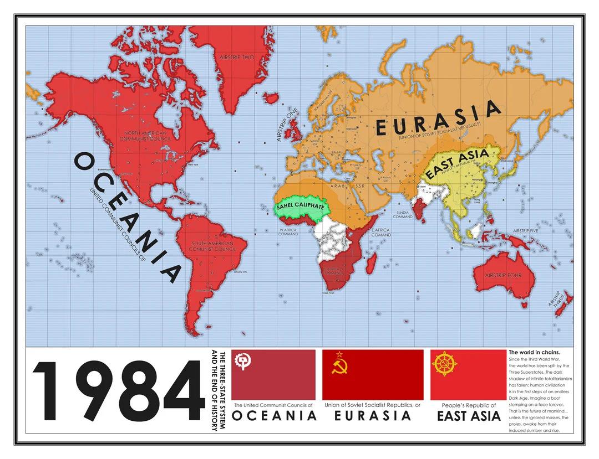

The telescreen received and transmitted simultaneously. Any sound that Winston made, above the level of a very low whisper, would be picked up by it. Moreover, so long as he remained within the field of vision which the metal plaque commanded, he could be seen as well as heard. 

It is interesting because Google or other tech companies can do that (Brasil mostra a tua cara).

The Ministry of Truth is crazy!!!!!!!!!!  
This is the party slogan:  
**WAR IS PEACE**  
**FREEDOM IS SLAVERY**  
**IGNORANCE IS STRENGTH**

The Ministry of Truth contained, it was said, three thousand rooms above ground level, and corresponding ramifications below.  

The Ministry of Love was the really frightening one. There were no windows in it at all. Winston had never been inside the Ministry of Love, nor within half a kilometre of it. It was a place impossible to enter except on official business, and then only by penetrating through a maze of barbed-wire entanglements, steel doors, and hidden machine-gun nests.  

It is quite asymptomatic that the name of the book is *1984*, when they don’t even know whether the year is 1984.  

He disliked nearly all women, and especially the young and pretty ones. It was always the women, and above all the young ones, who were the most bigoted adherents of the Party, the swallowers of slogans.  

As usual, the face of Emmanuel Goldstein, the Enemy of the People, had flashed on to the screen. There were hisses here and there among the audience. The little sandy-haired woman gave a squeak of mingled fear and disgust. Goldstein was the renegade and backslider who once, long ago (how long ago, nobody quite remembered), had been one of the leading figures of the Party, almost on a level with Big Brother himself, and then had engaged in counter-revolutionary activities, had been condemned to death, and had mysteriously escaped and disappeared. The programmes of the Two Minutes Hate varied from day to day, but there was none in which Goldstein was not the principal figure. He was the primal traitor, the earliest defiler of the Party’s purity. All subsequent crimes against the Party, all treacheries, acts of sabotage, heresies, deviations, sprang directly out of his teaching. Somewhere or other he was still alive and hatching his conspiracies: perhaps somewhere beyond the sea, under the protection of his foreign paymasters, perhaps even—so it was occasionally rumoured—in some hiding-place in Oceania itself.  

It is interesting how much our body impacts our mind. For example, if I keep screaming "Bolsonaro is the myth," it is impossible not to have some deep liking for him (22 é bolsonarooo, vota vota e confirma 22 é Bolsonaro).  

For a second, two seconds, they exchanged an equivocal glance, and that was the end of the story. But even that was a memorable event, in the locked loneliness in which one had to live.  

Parsons was Winston’s fellow employee at the Ministry of Truth. He was a fattish but active man of paralyzing stupidity, a mass of imbecile enthusiasms—one of those completely unquestioning, devoted drudges on whom, more even than on the Thought Police, the stability of the Party depended.  

We as humans definitely need rituals—a way to bond us over something, like a family dinner.  

It is interesting how young people can be directed towards two directions: hard right (which is purification, that is, following exactly the current doctrine) and the other which will be a revolution. In both ways, you are extreme. I think young people are always seduced by the extreme.  

He dreamed about a girl. I wonder what girl it is.  

I think it is quite interesting the relationship of the character with the past, but also our species with the past. For example, when it comes to politics, most historians are left-wing, so people that remember history have a certain bias/beliefs, whereas the rest of us don't know much of what we are doing. It is very hard to understand anything when you don't have enough context.  

But definitely, we can't lose our history, because if we do, it is like missing the git history.  

For me, it is quite astonishing that historians don’t have that much power in politics. To a certain extent, they control the past; they are the authorities about how we got here. This only shows that western society doesn’t have much love for intellectual authorities. Maybe that’s why religion is still a big thing. It is very impressive how much opinião própria people actually have.  

It is quite interesting how keeping the facts is important. If you change the facts, if you change reality, it doesn’t matter how good your logic is; you will eventually arrive at the conclusion that the Party wants.  

Big Brother has this habit of rewriting history, rewriting books, speeches, and newspapers.  

Google is the new Big Brother.  

They actually have pleasure from seeing people’s hangings—that is very disgusting.  

The level of control is crazy. They are literally removing words from the dictionary so that we can’t even easily construct a reasoning beyond Big Brother’s will.  

"Don’t you see that the whole aim of Newspeak is to narrow the range of thought? In the end, we shall make thoughtcrime literally impossible."  

Winston’s friend indeed said: "Don’t you see that the whole aim of Newspeak is to narrow the range of thought? In the end, we shall make thoughtcrime literally impossible."  

How could you have a slogan like ‘freedom is slavery’ when the concept of freedom has been abolished?  

I think that problems start to appear when we hide ourselves from too many contradictions. If that happens, then we are going through a very dangerous path. I see that clearly with Bolsonaro and his supporters. When contradicting yourself becomes hidden and has no consequences, then the relationship becomes pure loyalty.  

"One of these days," thought Winston with sudden deep conviction, "Syme will be vaporized. He is too intelligent. He sees too clearly and speaks too plainly. The Party does not like such people. One day he will disappear. It is written in his face."  

I can’t help but relate this to the current work of politics. It doesn’t matter how much you live, how much people are making, or how much is the purchase power. That is why you need a lot of media intervention to actually make people believe the opposite of what is going on.  

This book also reveals how important our memory is, because nobody actually reads history books. So the best way for us to see the contradictions is through our own memory.  

It was terribly dangerous to let your thoughts wander when you were in any public place or within range of a telescreen.  

There was even a word for it in Newspeak: FACECRIME, it was called.  

When Winston talked about his wife, he said that there wasn’t a thought in her head that wasn’t a slogan. That is quite a strong statement. That makes me wonder whether all thoughts in my head are slogans. In the end of the day, we are just sheets; our thoughts are mostly slogans or small theorems from slings. The truth to me seems that it will either be given by the elites, or we won’t find them at all. We definitely won’t find them by ourselves.  

Desire (sexual) was considered thoughtcrime (lembra aquele tempo amor, quando a gente se encontrou).  

At the start of part 2, it seems like the story is starting to move up in a better way. Things are actually happening.  

It is interesting how to avoid thinking, they also have to avoid loneliness.  

### Chapter 3  

I like Julia as a character, especially because she is not nice, which in some contexts would be meaningless. But since we are in a world where everyone is supposed to be, according to the definition of the Party, "good," she wants to be the opposite of the Party, even if that means being "bad."  

It is crazy that sex is the thing that made Winston break the marriage, and that his wife called it "our duty with the Party." The privacy of sex is just a way for the Party to control the people because they can direct their energy toward the Party. It is very hard to have all that hate after having sex, and they don’t love it to happen because then they would love something more than the Party.  

Winston has no hope that they will eventually get rid of the Party. Julia doesn’t have that hope.  

This book is a big reference to what can go wrong with socialism and with big government in general. In fact, only people in the Inner Party have access to coffee, while nobody else has access to it. Maybe that extends to be true for all concentrations of power.  
