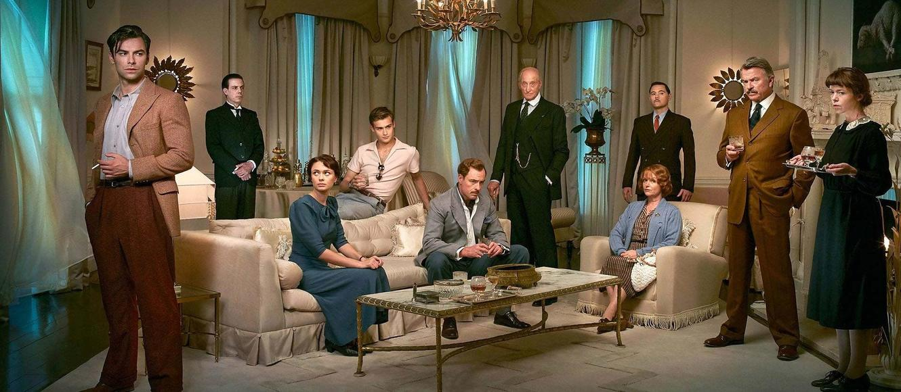

# Chapter 1

Soldier Island is rumored to have been bought by an American actress.

Wargrave invited someone to the island, which is odd since the island is not his. He appears to be a judge.

The island is described as “the last word in luxury” and has been featured prominently in the news.

Hugo expressed his love for Vera.

Armstrong observes: “Half the women who consulted him had nothing the matter with them but boredom, but they wouldn’t thank you for telling them so!”

Tony is poor and seems interested in women.

Mr. Blore was warned: “I’m talking to you, young man. The day of judgment is very close at hand.”
- Who told him that?

Subsiding into his seat, Mr. Blore thought: “He’s nearer the day of judgment than I am! But there, as it happens, he was wrong….”

Mr. Owen is revealed to be the owner of the island.

Critics:
- This chapter doesn’t have much action and isn’t a strong introduction, but it does provide glimpses into each character’s personality, sparking curiosity about them.
- It hints that Mr. Blore will face trouble, which adds intrigue.
- Soldier Island is established as a significant and mysterious location.

# Chapter 2

Vera appears to be Mr. Owen’s secretary, possibly recently hired.

Davis observes: “He might have noticed that a curious constraint came over the other members of the party. It was as though the mention of their host and hostess had a curiously paralysing effect upon the guests.”

Mr. Davis claims to be from South Africa and seems to know more about the island’s owner than the others.

“Down the steep track into the village a car was coming. A car so fantastically powerful, so superlatively beautiful that it had all the nature of an apparition. At the wheel sat a young man, his hair blown back by the wind. In the blaze of the evening light he looked, not a man, but a young God, a Hero God out of some Northern Saga.

He touched the horn and a great roar of sound echoed from the rocks of the bay. It was a fantastic moment. In it, Anthony Marston seemed to be something more than mortal. Afterwards more than one of those present remembered that moment.”

Fred Narracott, observing the group, thinks: “Everything ordered and paid (the party, travelling) for by that Mr. Morris.”

Fred finds the group suspicious, noting they don’t match his expectations of Mr. Owen’s guests, who he imagined would be more sophisticated.

Vera reads the following rhyme:
“Ten little soldier boys went out to dine;
One choked his little self and then there were Nine.
Nine little soldier boys sat up very late;
One overslept himself and then there were Eight.
Eight little soldier boys travelling in Devon;
One said he’d stay there and then there were Seven.
Seven little soldier boys chopping up sticks;
One chopped himself in halves and then there were Six.
Six little soldier boys playing with a hive;
A bumble bee stung one and then there were Five.
Five little soldier boys going in for law;
One got in Chancery and then there were Four.
Four little soldier boys going out to sea;
A red herring swallowed one and then there were Three.
Three little soldier boys walking in the Zoo;
A big bear hugged one and then there were Two.”
- A very intriguing way to introduce the main plot.

It is revealed that Vera has a past involving drowning.

General Macarthur seems to distrust Lombard’s character.
- Why?

Emily Brent is seen reading the Bible.

Critics
- The narrative structure of revealing each character’s personality through their thoughts in “rounds” is engaging. It builds anticipation as you move from one character to the next.
- The mystery surrounding Mr. Owen deepens as he remains absent.

# Chapter 3

The rhyme predicting deaths is displayed in every room.
- This adds an intriguing element to the story.
- It suggests someone will choke, as mentioned in the rhyme.

Emily Brent reveals she has never met an Owen in her life, which is surprising given her role as his assistant.

“Into that silence came The Voice. Without warning, inhuman, penetrating….

“Ladies and gentlemen! Silence please!”

Everyone was startled. They looked round—at each other, at the walls. Who was speaking?

The Voice went on—a high clear voice:

“You are charged with the following indictments:

“Edward George Armstrong, that you did upon the 14th day of March, 1925, cause the death of Louisa Mary Clees.

“Emily Caroline Brent, that upon the 5th of November, 1931, you were responsible for the death of Beatrice Taylor.

“William Henry Blore, that you brought about the death of James Stephen Landor on October 10th, 1928.

“Vera Elizabeth Claythorne, that on the 11th day of August, 1935, you killed Cyril Ogilvie Hamilton.

“Philip Lombard, that upon a date in February, 1932, you were guilty of the death of twenty-one men, members of an East African tribe.

“John Gordon Macarthur, that on the 4th of January, 1917, you deliberately sent your wife’s lover, Arthur Richmond, to his death.

“Anthony James Marston, that upon the 14th day of November last, you were guilty of the murder of John and Lucy Combes.

“Thomas Rogers and Ethel Rogers, that on the 6th of May, 1929, you brought about the death of Jennifer Brady.

“Lawrence John Wargrave, that upon the 10th day of June, 1930, you were guilty of the murder of Edward Seton.

“Prisoners at the bar, have you anything to say in your defence?”

The group discovers that the message was played from a gramophone.

Miss Brent remains motionless in her chair after the announcement.

Mr. Rogers, the butler, admits to turning on the gramophone under Mr. Owen’s orders.

“The next minute or two was spent in dispensing drinks. General Macarthur had a stiff whisky and so did the judge. Every one felt the need of a stimulant. Only Emily Brent demanded and obtained a glass of water.”

As expected, Rogers has never met Mr. Owen.

It is revealed that Davis and Blore are the same person, and Lombard accuses Blore of not being from South Africa.

Lombard appears to be a detective.

The name "Ulick Norman Owen" is deduced to be a play on "Unknown."

The group begins to realize that Owen is a madman.

Critics:
- The revelation that the characters are murderers is shocking, as there was no prior indication of their guilt. This challenges the reader’s instinct to view them as good people.
- The group does not question the truth of the announcement, which adds to the tension and mystery surrounding Owen.
- The strange events and the intriguing nature of the accusations make the story compelling and encourage further reading.

# Chapter 4

The invitations to the island suggest that Owen has detailed knowledge about the characters, including their friends and even the style of letters they would send.

It is revealed that Wargrave was the judge in a case involving a man who was executed after being accused of a crime, as mentioned in the announcement.

The group acknowledges that the deaths mentioned in the announcement were real. While they admit some responsibility, they argue it was not entirely their fault.

Owen’s knowledge of deeply personal secrets, such as a doctor causing a death due to drunkenness during surgery, is particularly unsettling.

General MacArthur: “Arthur Richmond. Richmond was one of my officers. I sent him on a reconnaissance. He was killed. Natural course of events in wartime. Wish to say resent very much—slur on my wife.”

Anthony Marston is the only one who refuses to leave the island. Shortly after, he dies, just as the rhyme predicted.

# Chapter 5

Critics
- How did  “Owens” put the poison in Anthony Marston food even though he wasn’t there?
- Also, did he want to kill Marston in particular or was it just random?
- I also think it is interesting that they compass all professions such as doctor, nurse, judge general and many others

They think it is. A suicide, even though it clearly is not

General Mac Arthur killed a guy (in the past) because his wife cheated with him

Crazy that after her affair died, she died as well. There was a soldier that

Suspected that he intentionally killed his wife affair 

Critics
- As mentioned earlier, one of the reasons why I enjoy this book is because of its clear structure. Every part of the book is a for loop for each character telling something, the story they tell other people about their deaths, the deaths that really happened to people and stuff like that

# Chapter 6

Dr Armstrong had some weird dreams I need to Google to understand more about it

For some reason Emily Blent was in the dream as well

The wife/husband of Rogers died in the sleep as expected

This is very unexpected, Emily Brent is actually saying that the death of Mrs Rogers was an act of God (she deserved to die because of her bad acts)

I feel very excited about when they are going to tell each other that their crimes were actually true. Very exciting because they are a bunch of killers, that don’t admit to each other that they are, and people are mysteriously dying, therefore they will be against each other soon, just like among us

Also every time someone dies one of the Chinese figures get removed, funny that Rogers realized that

Good chapter, specially because the story moves one step ahead, we understand more about it, but not enough to know what we really want to know

# Chapter 7

Emily Brent tells a weird story that one girl that worked for her killed herself after Emily kicked out of her house. She seems to be Avery harsh character, one that Highly believes in morality, and that wants to do things in a straight way

Also interesting that the worst people are the ones that expect the worst of the

Other people. Lombard is quite bad.

As Armstrong pointed out, it is possible to create a decent theory about one of the deaths, but not one that explains both deaths

Also they finally noticed the coincidence of the rhyme and what actually happened

Critics
- Very good chapter

# Chapter 8

Clearly the General is going to die, he is in oblivion thinking about life and confused. Said that has little time. He clearly will die because of the rhyme/prophecy 

Something clearly happened to him, he knows he will die, which is crazy, and if people were smarter they would have realized that too

# Chapter 9

Lombard : “I allowed you all to think that I was asked here in the same way as most of the others. That’s not quite true. As a matter of fact I was approached by a little Jew-boy—Morris his name was. He offered me a hundred guineas to come down here and keep my eyes open—said I’d got a reputation for being a good man in a tight place.”

“Yes. I believe now that I’m in the same boat as the rest of you. That hundred guineas was just Mr. Owen’s little bit of cheese to get me into the trap along with the rest of you.”

GENERAL DEAD. Clearly Armstrong is guilty

# Chapter 12

Emily brent was killed. The killer inserted on her kneck

There are only 5 people alive now

Lombard's revolver went missing, they searched in the house but they couldn't find it

Critics
- can't they simply understand that if they get alone they will die
- the narrator says in a very interesting style when someone dies, it is like this: he keep talking about things moving to a certain direction, and then the person dies lol
- it seems that everyone starts losing their senses before they get killed
- also very interesting to think how much tension the characters must be going through, by seeing people getting killed one by one

# Chapter 13

“Armstrong was in a pitiable condition of nerves. He twitched and his hands shook. He lighted cigarette after cigarette and stubbed them out almost immediately. The forced inaction of their position seemed to gall him more than the others. Every now and then he broke out into a torrent of nervous speech.”
- Maybe Armstrong is not on the killer, unless he is a good actor

They seem to be careful now about making sure nobody gets lonely

Ligths are not working

Who dressed the judge before he got killed by a gun

Critics
- Agatha Chirstie shows impressive skills when it comes to story telling
- In fact she creates a good story with very basic elements, 10 "ordinary" characters with dark backgrounds, a house, and that's it, she manages to create events to keep the story going in a non trivial matter
- The story doesn't seem realistic sometimes, Vera started screaming because of seaweed in a room, and since there was no light she someone got her kneck, then she started to scream, with the noise the judge was killed. This chain of events doesn't sounds like something one could plan on
- also since the story has a very clearly well defined structure, it starts to be a bit tiring in the end

# Chapter 14

Armstrong disappeared, Lombard and Blore went searching for him but didn't find him

Lombard's revolver magically showed up in his room again
- Why would the killer put the revolver back in his room

Perhaps it makes sense that Armstrong is the killer, since he "disappeared"

They found Armstrong dead

Critics
- starting to get tired of this, once again they left Vera alone, and then she will die, what a surprise
- I reall think it is annoying the fact that they don't consider the rhyme before they act, they already have a clue of how the killer wants to kill them
- Something interesting about this moment of the story is that none of them seem to be the killer, which is weird because then who is it? Someone that have already "died"?
- The way that Blore died was so stupid, how can they be so "arrogant", the killer killed so many people, of course he would be able to kill Blore
- really crazy that Armstrong is dead, then who is the killer?

# Chapter 15

Vera stoled the gun from Lombard, and then shot him

Critics
- Vera thinks taht she is alon in the island, but clearly she is not
- Very interesting because the last person killed itself, so the killer knew so much about her that she knew that she would kill herself because of Hugo

# Epilogue

Very interesting the fact that since only the 10 people were in the island, and nobody else was there, then the killer must have been one of them

# The letter

The judge is behind all of the kills. In fact he is quite an interesting character,
because he simultaneously likes justice and killing people, also it makes sense he is the killer because all of the people that only someone that cares about "justice" would kill people that are actually guilty, also interesting the way he choose the order of the death, he decided to put those more guilty in the end, and the ones less guilty died in the beginning