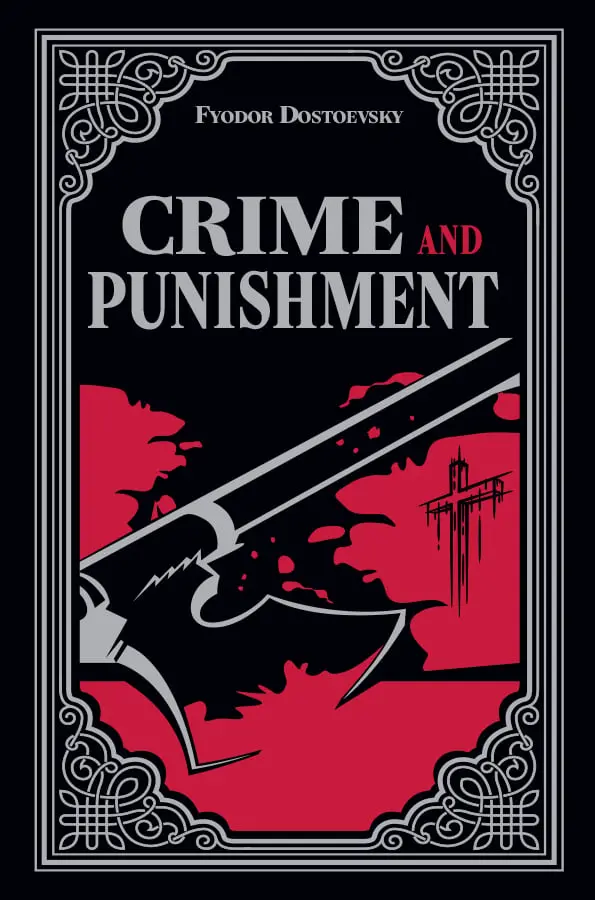
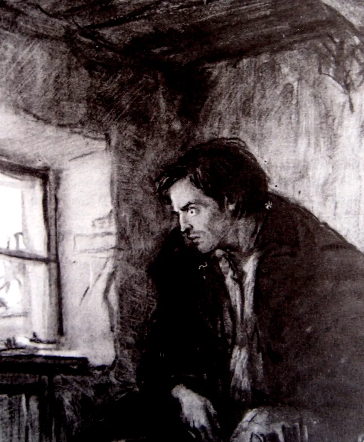
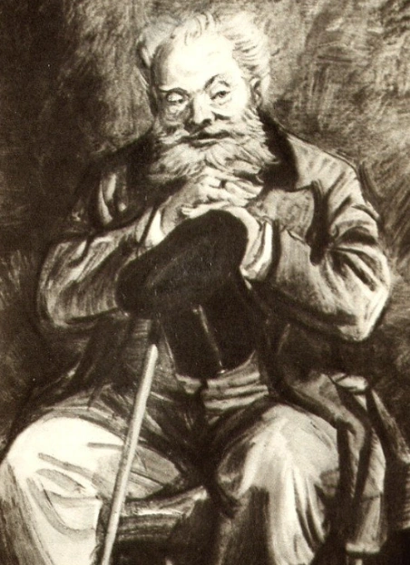
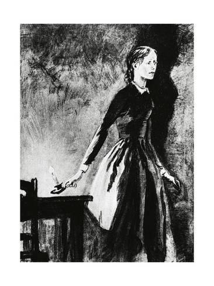

# When people ask me about it

## Crime and Punishment

### What is a Crime?
- The concept of crime is explored through the lens of modern relativism.
- Raskolnikov's victim, the old pawnbroker, is portrayed as an annoying and unpleasant person. This raises the question: is it truly so bad that he killed her? Does her character justify the act in any way?
- The philosophical undertone of the book delves into the moral ambiguity of crime, questioning whether morality is absolute or subjective.

### What is a Punishment?
- Punishment is intricately tied to the definition of crime. The novel suggests that if you are suffering from punishment, then you have likely committed a crime, whether by societal standards or your own conscience.
- Raskolnikov's internal turmoil reflects classic philosophical debates on crime and punishment. His guilt and psychological suffering serve as a form of self-imposed punishment, even before external consequences are enforced.
- The psychological depth of the book reveals how punishment manifests internally, regardless of external judgment or societal norms.
- The novel intertwines philosophical and psychological perspectives, making the reader question the true nature of justice and retribution.

# Philosophy

## Existentialism and Morality in Crime and Punishment

### What is Existentialism?
Dostoevsky was part of the existentialist movement—a group of writers and philosophers who explored profound questions about the meaning of life, morality, and the existence of God. All of Dostoevsky's works revolve around these existential themes, with *Crime and Punishment* focusing particularly on morality. The novel examines the tension between rationality and morality, challenging readers to confront the complexities of human existence.

### Consequences of Nietzschean Philosophy
*Crime and Punishment* was written during a time when Nietzsche's ideas were gaining prominence. The rejection of God, fueled by the Enlightenment and Darwinian morality, led to the rise of relativism—the belief that there is no absolute right or wrong, only subjective morality. Without an objective reference frame, such as God's nature, morality becomes a matter of personal preference. Dostoevsky critiques this relativism by illustrating its destructive consequences on the human soul.

### Philosophical Archetypes in the Characters
Each major character in *Crime and Punishment* embodies a distinct philosophical perspective:
- **Sonya**: Represents Christianity, embodying unconditional love, forgiveness, and moral objectivism.
- **Svidrigailov**: Represents hedonism, living a life driven by pleasure and self-will, yet haunted by guilt and despair.
- **Luzhin**: Represents the *Übermensch* theory, believing in self-interest and superiority over others.

### A Trilogy of Ideas
*Crime and Punishment* can be seen as the first part of a thematic trilogy in Dostoevsky's works. It examines the personal consequences of a man who believes that rationality can replace morality. Through Raskolnikov's journey, Dostoevsky explores the psychological and spiritual toll of rejecting moral absolutes, setting the stage for deeper explorations in his later works.

## Morality

## Morality

### What is Morality?
- Did Raskolnikov truly commit a crime? Why would his actions be considered a crime? The novel challenges readers to reflect on the nature of morality and justice.
- Are poor people more amoral than the rich? Dostoevsky explores how poverty and desperation can blur moral boundaries, forcing individuals into situations where survival takes precedence over ethical considerations.

### The Übermensch Theory
- The theory suggests that the world is divided between ordinary people and extraordinary people, with the extraordinary ones being entitled to commit crimes if it serves a higher purpose.
- Raskolnikov's belief in this theory drives his actions, as he seeks to prove whether he is extraordinary by stepping over moral boundaries. This internal conflict mirrors the struggles of individuals who grapple with their own sense of purpose and identity.
- Personally, I once resonated with this theory, especially during university when I resisted the idea of becoming a software engineer. Perhaps I was more ordinary than extraordinary, contrary to what I had initially believed.

### Consequences of Rejecting Christian Morality
- Dostoevsky illustrates that the desire to assert oneself above morality ultimately destroys the soul. Whether you are a psychopath like Svidrigailov or a seemingly normal person like Raskolnikov, rejecting moral absolutes leads to despair and self-destruction.
- The novel critiques the dangers of abandoning Christian values, emphasizing that morality rooted in faith provides a foundation for inner peace and redemption.
- Through Raskolnikov's journey, Dostoevsky warns against the hubris of attempting to transcend morality, showing that such attempts result in psychological and spiritual ruin.
- This theme underscores the importance of humility and the acceptance of moral absolutes as a path to healing and reconciliation.

# Psychology

## Punishment

- One of the aspects that makes *Crime and Punishment* a masterpiece is Dostoevsky's realistic portrayal of Raskolnikov's behavior after the murder. His actions align closely with the psychological tendencies of the average murderer, as later psychoanalytic studies have shown.
- Raskolnikov's neurotic tendencies lead to overwhelming feelings of guilt that cannot be eradicated. These feelings explain his subconscious desire for punishment even before he commits the crime. He engages in self-sabotaging behavior, almost as if he wants to be caught, because he believes suffering will alleviate his guilt.
- This guilt and subsequent yearning for punishment become so overpowering that they drive him to commit the murder in the first place.
- His mental and physical health deteriorates rapidly after the crime, manifesting in severe illness and psychological torment.

## Healing

### Part 1: Confronting the Problem
- A key theme in *Crime and Punishment* is the danger of internalizing one's struggles. Raskolnikov, due to his arrogance and mistrust of others, isolates himself and keeps everything bottled up. He constructs a single, obsessive narrative in his mind, which perpetuates his misery and psychological turmoil.
- It is only when he confesses to Sonya that he begins to confront the things that have been haunting him. This act of opening up marks the first step toward his healing, as it allows him to break free from the prison of his own thoughts.

### Part 2: The Power of Love
- Raskolnikov's ultimate redemption comes through the unconditional love of Sonya. Even after being sentenced to Siberia, he initially views his crime as merely a mistake, continuing to rationalize his actions. This rational mindset prevents him from fully confronting the moral and spiritual implications of his deeds.
- It is only when he allows himself to embrace Sonya's love that he begins to heal. Her unwavering compassion helps him let go of his obsessive rationality and accept his humanity. Through her love, he finds the strength to forgive himself and move toward redemption.
- Dostoevsky uses this transformation to highlight the redemptive power of love and the importance of human connection in overcoming guilt and despair.

# Characters

## Raskolnikov

He represents the non philosophical suicide, and philosophical experimentation
- after his crime, he lied a lot, but whenever his lie is about
something related to his own dignity he won't lie even if that
makes obvious that he is the killer, for example when the 
investigator asked whether he was extraordinary or not and he
said yes
- for me his excess of rationalism is what destroyed his life
- The motivation of the student revo lutionary is quite evident.
Raskolnikov killed an old lady in ineffectual fury, to protest the
condition of the insulted and the injured. He killed the old woman to
protest the wretched conditions of the Marmeladovs, his own wretched
condition, and the co ndition of man who from poverty of soul and
body strikes in frustration at the symbol of the wre tchedness which
chains him. Motivated thus by social consc iousness, Raskolnikov
emerges as a scapegoat figure, carrying on his back to the martyrdom of
Siberia the accumulated guilt, shame, and injustice of the social order. 
- Alienation is the primary theme of Crime and Punishment. At first, Raskolnikov's pride separates him from society. He sees himself as superior to all other people and so cannot relate to anyone.
- to me it is crazy the consequences of a murder in someone's mind,
as discussed many times in the novel, Raskolnikov is correct, he has
the good reasons, but still in the end he doesn't turn himself in 
because of fear of getting caught, he turns himself in because of guilt.
The joy of Raskolnikov kissing the ground (in the end of the book), shows
that us as human beings have an instictive way of write and wrong,
regardless of our own reasoning
- No matter how morally justified he once might have considered his actions, they have devastating collateral effects, harming acknowledged innocents.
- - this is an interesting moral dillema should he feel guilty for killing the sister? It was an accident
- Epilogue
about the reasoning and embrace on a new life
- The growing guilt, to the point that he hides the stolen money and doesn't touch them at all, along with the urge to confess his crimes, are highly typical of criminals.
- - this is very crazy because in fact he the trauma is so big of the murderer that he doesn't even want to take a look at the money
- Why did he kill her?
- - he became Sulky, he says that when he is explaning to Sonya
- - Then I saw, Sonia, that if one waits for 
everyone to get wiser it will take too long.... Afterwards I 
understood that that would never come to pass, that men 
won't change and that nobody can alter it and that it's not 
worth wasting effort over it. Yes, that's so. That's the law 
of their nature, Sonia,... that's so!... And I know now, Sonia, 
that whoever is strong in mind and spirit will have power 
over them. Anyone who is greatly daring is right in their 
eyes. He who despises most things will be a lawgiver 
among them and he who dares most of all will be most in 
the right! So it has been till now and so it will always be. A 
man must be blind not to see it!"  
Though Raskolnikov looked at Sonia as he said this, he 
no longer cared whether she understood or not. The fever 
had complete hold of him; he was in a sort of gloomy 
ecstasy (he certainly had been too long without talking to 
anyone). Sonia felt that his gloomy creed had become his 
faith and code.  
"I divined then, Sonia," he went on eagerly, "that power 
is only vouchsafed to the man who dares to stoop and pick 
it up. There is only one thing, one thing needful: one has 
only to dare! Then for the first time in my life an idea took 
shape in my mind which no one had ever thought of before 
me, no one! I saw clear as daylight how strange it is that 
not a single person living in this mad world has had the 
daring to go straight for it all and send it flying to the 
devil! I... I wanted to have the daring... and I killed her. I 
only wanted to have the daring, Sonia! That was the whole 
cause of it!"
- - Perhaps I should never have committed a murder again. I 
wanted to find out something else; it was something else 
led me on. I wanted to find out then and quickly whether I 
was a louse like everybody else or a man. Whether I can 
step over barriers or not, whether I dare stoop to pick up 
or not, whether I am a trembling creature or whether I 
have the right..."

## Svidragaliov

Character as a tool to defend christian existentialism
- Dostoevisky uses svidrgaliov as a way to show how bad the consequences of strictly following hedonism
- - Svidrigailov and Raskolnikov both crossed moral lines. Both felt guilty, though Svidrigailov less so. The nightmare he had shows that it still bothered him
- He doesn't rape Dunia
- He kills himself
- He raped a 5 year old, male prostitution
- Essentially, Svidrigailov is someone who embodies Raskolnikov's ideology of the great man who asserts his self will beyond the “prejudice” that is the Christian morality that Russian society at the time ascribed to. Svidrigailov manages to overcome moral boundaries with impunity and without a shred of remorse or hesitation, believing only his self will to be a basis on which to act, and essentially creating his own morals, acting in accordance with his desires.
- We as a society when we look at "terrible" people such as Hitler, we think of them as cold blood that have no regret,
but this character shows to us that deep down even if it is at their subconscious (Svi's dreams with the girl raped) we have a moral because we are all human, not only that
even people like Svi have feelings, at the first time that I read, I remember being astonished by the fact that Svi
doesn't rape Dounia, but now I see that's no surprise because deep down he is also human, and that there is more to
life than strict pleasure, and he manage to feel that with Dounia, and by knowing that he will never be able to feel that again, he decides to kill himself

## Sonya

Epitomization of christ
- Christianity = loves, maximize love in no matter circustance
- She is the epitomization of christ internally, but externally she is just a whore
- Not too sure how accurate my reading of Sonya's character is, but from my understanding she's something of an allegory for Christ. Unconditional love, her position of freedom from bondage, the reception of confessions, and her otherwise unlikely position to be in a genuine caring relationship with someone as misguided as Raskolnikov all seem to point to this
- It is interesting that fact that Sonya is very religious and a prostitute, which is a very big contradiction, and for sure created a lot of suffering for her
- She loves a murderer

- Rodya defended Sonya publicly, and most important is this: Rodya is the only one who does not look down on Sonya, as Sonya is the only one who does not seek to condemn Rodya. Whereas every character contains the seed of blame, and would out Rodya as soon as they learned he murdered the pawnbroker (and her sister!), just as how all of them would dismiss sonya as a prostitute, the couple fully accept and understand one another. They can only find true consolation in one another.
- Rodya defended Sonya publicly, and most important is this: Rodya is the only one who does not look down on Sonya, as Sonya is the only one who does not seek to condemn Rodya. Whereas every character contains the seed of blame, and would out Rodya as soon as they learned he murdered the pawnbroker (and her sister!), just as how all of them would dismiss sonya as a prostitute, the couple fully accept and understand one another. They can only find true consolation in one another
- - We could never a life worthy of God on our own. So Jesus lived a life without sin on our behalf. And then he died the painful death our sins deserve. John 3:17 says, “God did not send the Son into the world to condemn the world, but in order that the world might be saved through him.” By sacrificing himself for us on the cross, he took the punishment for all of our sins at once. This made him the ultimate sacrifice —once and for all satisfying the demands God’s justice required. That is why we call Jesus “Lamb of God.”
- - she was a prostitute just like Maria Madalena was

### Details

Her name
- It is fascinating that her name, "Razumihin," translates to "reason" or "intellect," yet she is not portrayed as particularly intelligent in the conventional sense. This contrast highlights an important theme: wisdom transcends mere intelligence. Her profound wisdom and emotional depth enable her to guide and ultimately redeem Raskolnikov. This serves as a reminder that true wisdom often lies in understanding, compassion, and the ability to inspire change in others.

## Marmeladov
- Marmeladov is a very peculiar character. Despite being a drunkard, there are still remnants of the great man he once was, especially evident when he speaks. His eloquence and depth of thought shine through his intoxicated state, revealing a tragic complexity to his character.
- His speeches often carry a sense of profound despair and self-awareness, as he acknowledges his own failures and the suffering he has caused his family. Yet, within this despair, there is also a glimmer of hope and a yearning for redemption, making him one of the most human and relatable characters in the novel.
- Marmeladov's character serves as a poignant commentary on the destructive nature of addiction and poverty, as well as the resilience of the human spirit in the face of overwhelming adversity.
- His interactions with Raskolnikov provide critical insights into the themes of guilt, suffering, and the possibility of salvation, which are central to the novel's philosophical and moral exploration.

# Symmetries
Perhaps all of thse symmetries in this book are somehow related to hegel

Raskolnikov, Sonya: choose to do crime, forced to do crime (prostitution)
Raskolnikov, Sonya: moral relativist, moral objectivism
Raskolnikov, Sonya: saved her (against Luzhin), saved him from himself
Raskolnikov, Sonya: fully rational/modern, emotional/religious

Raskolnikov, Razumihin: murderer, naive
Raskolnikov, Razumihin: isolated, social
Raskolnikov, Razumihin: lier, honesty

(Svidrigailov, Dunia) (Raskolnikov, Dunia): impure, pure
(Svidrigailov, Dunia) (Raskolnikov, Dunia): sex/blackmail, love

# Resources

https://www.reddit.com/r/dostoevsky/comments/uh70ib/finished_reading_crime_and_punishment_and_i_have/

https://www.sparknotes.com/lit/crime/analysis/

https://www.reddit.com/r/books/comments/uc9bg6/comment/i69wmjy/?utm_source=share&utm_medium=web2x&context=3

# Topics

## Money

The novel vividly portrays the impact of poverty on people's lives, serving as a catalyst for many of the characters' struggles and decisions. Dostoevsky's world-building highlights how financial hardship can lead to a cascade of problems and moral dilemmas.

- **Poverty as a Catalyst for Conflict**: For instance, Dounia works as a servant to make ends meet, only to face harassment from her landlord. Despite the abuse, she cannot leave because she

### Poverty and Money

The novel vividly portrays the harsh realities of poverty and its profound impact on people's lives. Dostoevsky uses this theme to explore how financial hardship can lead to moral dilemmas, personal struggles, and societal conflicts.

- **The Reality of Poverty**: Dostoevsky's detailed descriptions of poverty make the characters' suffering more tangible and relatable. The depiction of their struggles evokes a deep sense of sadness and empathy, as it highlights the harsh conditions faced by the less fortunate.
- **Money as Self-Worth**: For many characters, money becomes synonymous with self-worth. It dictates their choices, relationships, and even their sense of identity. This theme underscores the dehumanizing effects of financial desperation.
- **Alcohol as a Vice**: The novel also explores how poverty often drives individuals to destructive habits, such as alcoholism. This vice becomes both a symptom and a perpetuator of their suffering, creating a vicious cycle of despair.
- **The Utility of Money**: The story demonstrates how even a small amount of money can significantly impact the lives of the impoverished. It serves as a stark reminder of the disparity between the wealthy and the poor.

### Human Nature and Decision-Making

One of the most striking themes in *Crime and Punishment* is the exploration of human nature and the complexity of decision-making. Dostoevsky challenges the notion that humans are purely logical beings, revealing instead the chaotic and often irrational forces that drive our actions.

- **The Illusion of Rationality**: Humans like to believe that their decisions are based on logic and reason, but the novel suggests otherwise. Raskolnikov provides multiple justifications for killing the pawnbroker, yet none of them fully explain his actions. This ambiguity reflects the unpredictable and instinctive nature of human behavior.
- **Acting Before Thinking**: The novel portrays humans as impulsive creatures who often act without fully understanding their motivations. It is only after the fact that we attempt to rationalize our actions, creating a narrative to justify what we have done.

### The Escalation of Problems

Dostoevsky masterfully illustrates how unresolved issues can spiral out of control, especially when they are not confronted or discussed openly.

- **Obsession and Isolation**: Raskolnikov's inability to confront his guilt and his obsessive thoughts exacerbate his internal turmoil. His isolation from others only deepens his suffering, showing the dangers of bottling up emotions and avoiding difficult conversations.
- **Stress and Anxiety**: The novel viscerally depicts the overwhelming stress and anxiety that lead to Raskolnikov's crime. Small details and minor problems accumulate, creating a crushing weight that ultimately drives him to act. One of the most memorable moments is when he becomes paralyzed by stress, unable to move or think clearly.
- **Nowhere to Turn**: The story captures the despair of having no escape from one's circumstances. Raskolnikov's sense of entrapment and hopelessness resonates deeply, illustrating the psychological toll of living without support or direction.

### Final Reflection

*Crime and Punishment* is a visceral and thought-provoking exploration of human nature, morality, and the consequences of poverty. It forces readers to confront uncomfortable truths about themselves and society, making it a timeless masterpiece that continues to resonate across generations.
