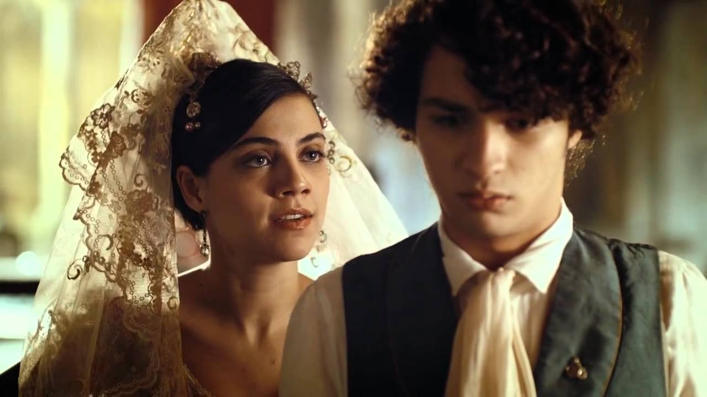

# When people ask me about it

1. The Romance of Capitu and Bentinho
2. Bentinho's trajectory as a metaphor for life and growing old

## Playlist inspired in the book

<iframe style="border-radius:12px" src="https://open.spotify.com/embed/playlist/3jEjdddMHaoNmCyHNOmtfN?utm_source=generator" width="100%" height="352" frameBorder="0" allowfullscreen="" allow="autoplay; clipboard-write; encrypted-media; fullscreen; picture-in-picture" loading="lazy"></iframe>

# Characters

🧔‍♂️ Bentinho / Dom Casmurro
- Narrator and protagonist of the novel.
- As a young man, known as Bentinho, he's sensitive, romantic, and deeply in love with Capitu.
- As an older man, he becomes Dom Casmurro, bitter and withdrawn, telling his life story and expressing his doubts and jealousy.

👩 Capitu (Capitolina)
- Bentinho's childhood friend and later his wife.
- Described as intelligent, witty, resourceful, and mysterious.
- Famous for her "oblique and sly eyes" (olhos de cigana oblíqua e dissimulada), which symbolize her enigmatic nature.
- Central to the novel’s big question: Did she cheat on Bentinho with Escobar?

👨 Escobar
- Bentinho’s best friend from seminary.
- Marries Sancha, Capitu’s best friend.
- Friendly and charismatic.
- His close relationship with Capitu is the root of Bentinho’s suspicions.

👩 Dona Glória
- Bentinho’s devout and loving mother.
- Wants him to become a priest to fulfill a vow she made, which creates the initial conflict in the story.

# Plot Summary

## 📘 Chapters 1–25: Introduction & Childhood

- Bento Santiago, the narrator, explains how he became known as *Dom Casmurro*.
- He sets out to reconstruct his past by writing his memoirs.
- Introduces his mother Dona Glória, his childhood friend Capitu, and his home in Rio de Janeiro.
- His mother has vowed to make him a priest, conflicting with his love for Capitu.
- José Dias, a family friend, plays a key role in persuading his mother.

---

## 🎓 Chapters 26–50: Seminary Life

- Bento enters the seminary reluctantly.
- He becomes close friends with Escobar, another seminarian.
- His longing for Capitu grows stronger.
- With Escobar’s help, he convinces his family to let him leave the seminary.

---

## 💍 Chapters 51–75: Love & Marriage

- Bento studies law in São Paulo.
- Capitu and Bento continue their relationship through letters.
- After finishing his studies, Bento returns and marries Capitu.
- Escobar marries Sancha (Capitu’s best friend).
- Both couples enjoy a happy social life.

---

## 🧠 Chapters 76–100: Suspicion & Doubt

- Capitu gives birth to a son, Ezequiel.
- Escobar dies in a drowning accident.
- At Escobar’s funeral, Bento believes Capitu’s behavior reveals hidden feelings.
- He becomes suspicious of an affair between Capitu and Escobar.
- Ezequiel’s physical resemblance to Escobar deepens his jealousy.

---

## ⚖️ Chapters 101–125: Confrontation & Separation

- Bento’s jealousy turns obsessive.
- He accuses Capitu of infidelity, leading to a breakdown in their relationship.
- He sends Capitu and Ezequiel to live in Europe.
- Capitu dies abroad, and Bento never reconciles with her.

---

## 🕯️ Chapters 126–148: Solitude & Reflection

- Ezequiel grows up and returns to visit Bento, now a young man interested in archaeology.
- Bento, still emotionally distant, cannot embrace him as a true son.
- Ezequiel dies on an expedition abroad.
- Bento remains alone, filled with regret, writing his story in an attempt to understand what happened.

# Capitu
- ENTP
- [MYTAKE] I feel like Capitu is the heart of this book. When she is not in a scene, I don't want to read it, and whenever she is in the scene I want to read it
- - Perhaps this is the intent of the author, his intent is to make us feel what Bentinho felt. The wait to see Capitu again. For example one of the main parts of the book is the "seminario", and that is so fucking boring, oh my god I just wanted that part to end
- [MYTAKE] For me what is great about Capitu, is that she creates so much tension, her misteriousness creates a tension on the reader that it is fascinating
- "O que me fascina em Capitu é a sua maneira de ser, misteriosa, carismática, esquisita, engraçada, anti santinha do pau ôco, mas com uma melancolia chique."
- - PERFECTLY describes her
- 'Tinha-me lembrado a definição que José Dias dera deles, "olhos de cigana oblíqua e dissimulada." Eu não sabia o que era obliqua, mas dissimulada sabia, e queria ver se podiam chamar assim. Capitu deixou-se fitar e examinar. Só me perguntava o que era, se nunca os vira; eu nada achei extraordinário; a cor e a doçura eram minhas conhecidas.'
- "Capitu, isto é, uma criatura muito particular, mais mulher do que eu era homem".
- I think that a big part of the success of Capitu's character comes from the fact that she is very authentic, in the sense even when she was younger, she changed her mind quickly and gave mixed signs for Bento, which is exactly how real-life girls are
- "Agora , por que é que nenhuma dessas caprichosas me fez esquecer a primeira amada do meu coração? Talvez porque nenhuma tinha os olhos de ressaca, nem os de cigana oblíqua e dissimulada. Mas não é este propriamente o resto do livro. O resto é saber se a Capitu da Praia da Glória já estava dentro da de Mata-cavalos, ou se esta foi mudada naquela por efeito de algum caso incidente. Jesus, filho de Sirach, se soubesse dos meus primeiros ciúmes, dir-me-ia, como no seu cap. IX, vers. 1: "Não tenhas ciúmes de tua mulher para que ela não se meta a enganar-te com a malícia que aprender de ti". Mas eu creio que não, e tu concordarás comigo; se te lembras bem da Capitu menina, hás de reconhecer que uma estava dentro da outra, como a fruta dentro da casca. E bem, qualquer que seja a solução, uma cousa fica, e é a suma das sumas, ou o resto dos restos, a saber, que a minha primeira amiga e o meu maior amigo, tão extremosos ambos e tão queridos também, quis o destino que acabassem juntando-se e enganando-me... A terra lhes seja leve! Vamos à "História dos Subúrbios."
- - [MYTAKE] I love this quote because there is something that feels odd about this book, like Capitu seems to be a sexy and intriguing young lady in the beginning, whereas in the end it seems like a completely detatched characther that one doesn't know who is she. What changed? Maybe nothing changed, perhaps she has always been like this.
- [MYTAKE] Capitu's insane seducing abilities make me realize that she can bring you both to heaven or hell depending on the circumstances. On the other hand, a girl that can't bring you to heaven, can't bring you to hell either, but that's not the case for Capitu

# Bentinho
- INFP
- That is a perfect nickname (Dom Casmurro). I must admit, I think it is very "carinhoso" but ironic and gloomy.
- This book invites us to reflect on the circumstances that lead individuals to unhappiness. They weren't always this way; life, with its twists and turns, shapes their fate.
- The transformation from being called Bentinho in his youth to earning the nickname Dom Casmurro in his later years reflects the trajectory of life itself. In our youth, we are full of blessings and vitality, but as we age, we often become consumed by complaints and grievances.
- "A imaginação foi a companheira de toda a minha existência, viva, rápida, inquieta, alguma vez tímida e amiga de empacar, as mais delas capaz de engolir campanhas e campanhas, correndo. Creio haver lido em Tácito que as éguas iberas concebiam pelo vento; se não foi nele, foi noutro autor antigo, que entendeu guardar essa crendice nos seus livros. Neste particular, a minha imaginação era uma grande égua ibera; a menor brisa lhe dava um potro, que saía logo cavalo de Alexandre; mas de ixemos de metáforas atrevidas e impróprias dos meus quinze anos. Digamos o caso simplesmente. A fantasia daquela hora foi confessar a minha mãe os meus amores para lhe dizer que não tinha vocação eclesiástica. A conversa sobre vocação tornava-me agora toda inteira, e, ao passo que me assustava, abria-me uma porta de saída. “Sim, é isto, pensei; vou dizer a mamãe que não tenho vocação, e confesso o nosso namoro; se ela duvidar, conto-lhe o que se passou outro dia, o penteado e o resto...”
- - KKKKKKKKKKKKKKKKK he is one of us

# Confrontation
- "Se eu não olhasse para Ezequiel, é provável que não estivesse aqui escrevendo este livro, porque o meu primeiro ímpeto foi correr ao café e bebê-lo. Cheguei a pegar na xícara, mas o pequeno beijava-me a mão, como de costume, e a vista dele, como o gesto, deu-me outro impulso que me custa dizer aqui; mas vá lá, diga-se tudo. Chamem-me embora assassino; não serei eu que os desdiga ou contradiga; o meu segundo impulso foi criminoso. Inclinei-me e perguntei a Ezequiel se já tomara café. — Já, papai; vou à missa com mamãe. — Toma outra xícara, meia xícara só. — E papai? — Eu mando vir mais; anda, bebe! Ezequiel abriu a boca. Cheguei-lhe a xícara, tão trêmulo que quase a entornei, mas disposto a fazê-la cair pela goela abaixo, caso o sabor lhe repugnasse, ou a temperatura, porque o café estava frio... Mas não sei que senti que me fez recuar. Pus a xícara em cima da mesa, e dei por mim a beijar doidamente a cabeça do menino. — Papai! papai! exclamava Ezequiel. — Não, não, eu não sou teu pai!" - "Quando levantei a cabeça, dei com a figura de Capitu diante de mim. Eis aí outro lance, que parecerá de teatro, e é tão natural como o primeiro, uma vez que a mãe e o filho iam à missa, e Capitu não saía sem falar-me. Era já um falar seco e breve; a maior parte das vezes, eu nem olhava para ela. Ela olhava sempre, esperando. Desta vez, ao dar com ela, não sei se era dos meus olhos, mas Capitu pareceu-me lívida. Seguiu-se um daqueles silêncios, a que, sem mentir, se pode chamar de um século, tal é a extensão do tempo nas grandes crises. Capitu recompôs-se; disse ao filho que se fosse embora, e pediu-me que lhe explicasse... — Não há que explicar, disse eu. — Há tudo; não entendo as tuas lágrimas nem as de Ezequiel. Que houve entre vocês? — Não ouviu o que lhe disse? Capitu respondeu que ouvira choro e rumor de palavras. Eu creio que ouvira tudo claramente, mas confessá-lo seria perder a esperança do silêncio e da reconciliação; por isso negou a audiência e confirmou unicamente a vista. Sem lhe contar o episódio do café, repeti-lhe as palavras do final do capítulo. — O quê? perguntou ela como se ouvira mal. — Que não é meu filho."

- "Grande foi a estupefação de Capitu, e não menor a indignação que lhe sucedeu, tão naturais ambas que fariam duvidar as primeiras testemunhas de vista do nosso foro. Já ouvi que as há para vários casos, questão de preço; eu não creio, tanto mais que a pessoa que me contou isso acabava de perder uma demanda. Mas, haja ou não testemunhas alugadas, a minha era verdadeira; a própria natureza jurava por si, e eu não queria duvidar dela. Assim que, sem atender à linguagem de Capitu, aos seus gestos, à dor que a retorcia, a coisa nenhuma, repeti as palavras ditas duas vezes com tal resolução que a fizeram afrouxar. Após alguns instantes, disse-me ela: — Só se pode explicar tal injúria pela convicção sincera; entretanto, você que era tão cioso dos menores gestos, nunca revelou a menor sombra de desconfiança. Que é que lhe deu tal ideia? Diga, — continuou vendo que eu não respondia nada, — diga tudo; depois do que ouvi, posso ouvir o resto, não pode ser muito. Que é que lhe deu agora tal convicção? Ande, Bentinho, fale! fale! Despeça-me daqui, mas diga tudo primeiro. — Há coisas que se não dizem. — Que se não dizem só metade; mas já que disse metade, diga tudo. Tinha-se sentado numa cadeira ao pé da mesa. Podia estar um tanto confusa, o porte não era de acusada. Pedi-lhe ainda uma vez que não teimasse. — Não, Bentinho, ou conte o resto, para que eu me defenda, se você acha que tenho defesa, ou peço-lhe desde já a nossa separação: não posso mais! — A separação é coisa decidida, redargui, pegando-lhe na proposta. Era melhor que a fizéssemos por meias palavras ou em silêncio; cada um iria com a sua ferida. Uma vez, porém, que a senhora insiste, aqui vai o que lhe posso dizer, e é tudo. Não disse tudo; mal pude aludir aos amores de Escobar sem proferir-lhe o nome. Capitu não pôde deixar de rir, de um riso que eu sinto não poder transcrever aqui; depois, em um tom juntamente irônico e melancólico: — Pois até os defuntos! Nem os mortos escapam aos seus ciúmes! Concertou a capinha e ergueu-se. Suspirou, creio que suspirou, enquanto eu, que não pedia outra coisa mais que a plena justificação dela, disse-lhe não sei que palavras adequadas a este fim. Capitu olhou para mim com desdém, e murmurou:"
- [MYTAKE] I love this part of the book, as Machado de Assis would say, "a alma é cheia de mistérios", I can't even start to explain rationally or linguistically the epicness of the magic of this confrontation. So many things arise in my heart when I read this, the main thing that comes to mind is where has the love gone? I can hear Elephant gun on the background when I read this, why? Couldn't life be simpler? Why did this happen? Life can be so bittersweet when we have a gret youth, but an unpleasant adulthood.

# Great writing
- Style
- - The language is highly cultured, full of references, but informal, in a conversational tone with the reader, almost proto-modernist, filled with intertextuality, metalanguage and irony
- "Assim, apanhados pela mãe, éramos dois e contrários, ela encobrindo com a palavra o que eu publicava pelo silêncio."
- - KKKKKKKKKKKKKKKKKKKKKKKKKKKK
- "Mas a vontade aqui foi antes uma idéia, uma idéia sem língua, que se deixou ficar quieta e muda,"
- "Capitu quis que lhe repetisse as respostas todas do agregado, as alterações do gesto e até a pirueta, que apenas lhe contara. Pedia o som das palavras. Era minuciosa e atenta; a narração e o diálogo, tudo parecia remoer consigo."
- "Mas eu creio que Capitu olhava para dentro de si mesma, enquanto que eu fitava deveras o chão,"
- "A vida é cheia de obrigações que a gente cumpre, por mais vontade que tenha de as infringir deslavadamente."
- "Que as pernas tambem sao pessoas, apenas inferiores ao bracos, e valem pro si mesmas quando a cabecao nao rege por ideas."
- KKKKKKKKKKKKKKKKKKKK
- "— Sou homem!
Quando repeti isto, pela terceira vez, pensei no seminário, mas como se
pensa em perigo que passou, um mal abortado, um pesadelo extinto; todos
os meus nervos me disseram que homens não são padres. O sangue era da
mesma opinião. Outra vez senti os beiços de Capitu. Talvez abuso um pouco
das reminiscências osculares; mas a saudade é isto mesmo; é o passar e
repassar das memórias antigas. Ora, de todas as daquele tempo creio que a
mais doce é esta, a mais nova, a mais compreensiva, a que inteiramente me
revelou a mim mesmo."
- - After sleeping with Capitu
- "Ficamos naquela luta, sem estrépito, porque apesar do ataque e da defesa, não perdíamos a cautela necessária para não sermos ouvidos lá de dentro; a alma é cheia de mistérios. Agora sei que a puxava; a cabeça continuou a recuar, até que cansou; mas então foi a vez da boca. A boca de Capitu iniciou um movimento inverso, relativamente à minha, indo para um lado, quando eu a buscava do outro oposto. Naquele desencontro estivemos, sem que ousasse um pouco mais, e bastaria um pouco mais... Nisto ouvimos bater à porta e falar no corredor. Era o pai de Capitu, que voltava da repartição um pouco mais cedo, como usava às vezes: “Abre, Nanata! Capitu, abre!” Aparentemente era o mesmo lance da manhã, quando a mãe deu conosco, mas só aparentemente; em verdade, era outro. Considerai que de manhã tudo estava acabado, e o passo de D. Fortunata foi um aviso para que nos compuséssemos. Agora lutávamos com as mãos presas, e nada
estava sequer começado.
Ouvimos o ferrolho da porta que dava para o corredor interno; era a
mãe que abria. Eu, uma vez que confesso tudo, digo aqui que não tive tempo
de soltar as mãos da minha amiga; pensei nisso, cheguei a tentá-lo, mas
Capitu, antes que o pai acabasse de entrar, fez um gesto inesperado, pousou a boca na minha boca, e deu de vontade o que estava a recusar à força.
Repito, a alma é cheia de mistérios."
- - [MYTAKE] I like this quote because it describes very well two things, one is Capitu's abilities to drive someone mad, and the fact that people behaving in unexplainable ways probably mean that there is a logic, but the logic is so complex that we can't understand it KKKKKKKKKKKKKKKKK
- "Conhecia as regras do escrever, sem suspeitar as do amar, tinha orgias do latim e era virgem de mulheres."

# Other

## Jeitinho brasileiro
- It is remarkable how old and Brazilian this book is; a promise to make the Bentinho become a priest
- - KKKKKKKKKKKKKKKK
- - And the worst part, is when they start trading with god the promises to allow him to become an attorney
- Jose dias actually admits who he is: "é o talento de saber o que é bom e digno de admiração e de apreço"
- - KKKKKKKKKKKKKKKKKKK

## Romance
- There is nothing like a good romance, I don't know the words to describe it. Beautiful,  poetic, cathartic,
Smooth. There are certain things that only a girl can do to a man, and Capitu is one of them
- It's crazy how much power she has over him, how she can with mannerism looks and gestures completely control a man
- The fact that they have known each other since they were kids adds up to the epicness of their romance
- She knew him very well, what the fuck

### Loss of Romanticism in Modern Times
- It feels like modernity has stripped away some of the romanticism of life. Take Bentinho, for example—he went as far as faking an illness and traveling to Europe just to be with one girl. Compare that to today, where we have Tinder in cities with millions of people. The contrast is striking and almost absurd.

## Nostalgic
- I don't think this is precisely a considerable merit of the book, but....  the fact that this book was passed in 1857 feels enough to make it think it is from a different universe, making it so much vintage.
- It is not Brazilian, Latin American, or poor country-related. But there is this thing which is not exactly pressure, but this force, I don't  know how to describe it very well to push the kids to good careers (he does a good job in describing that)

## Jealousy
- One of the problems with this part of the story is that there is no major conflict, which we know will come when he suffers a Gaia
- He does a good job introducing jealousy, but Machado doesn't do it in a rush.
- Now, I believe he took way too long to introduce the jealousy.

