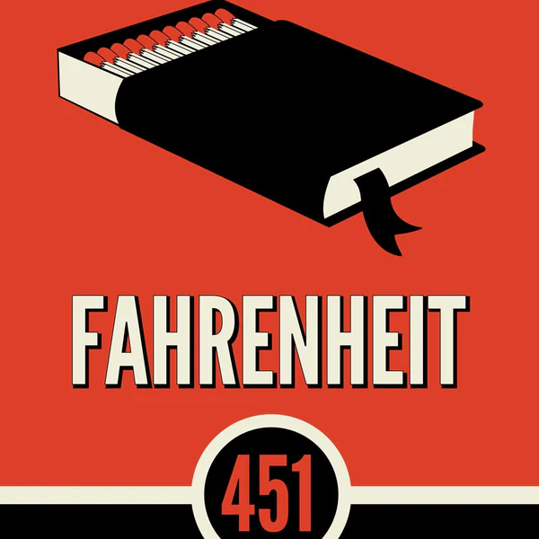

The character Clarisse is fascinating—original, exciting, and peculiar. She embodies the "manic pixie dream girl" archetype in a refreshing way.

The government's approach to education reminds me of Taleb's theory: a willingness to suppress an entire system to eliminate volatility, which ultimately harms humanity.

When Clarisse mentions that pictures once talked, it serves as a compelling commentary on how we approximate probabilities based on past events, often overlooking the potential for unexpected outcomes with significant consequences.

Certain people ask profound questions that linger in our minds, shaping our thoughts. Clarisse, despite being vastly different, has a presence akin to Coach Carter—memorable and impactful.

The idea that firemen once prevented fires rather than starting them is a striking reversal of expectations.

When Montag confesses to his wife about burning a woman, her indifference is unsettling. It aligns with the notion that human behavior is largely constructed and that people can adapt to almost anything.

The story of how books became forbidden, while exaggerated, resonates with modern trends. Today, there are far more trivial forms of entertainment than intellectual pursuits, even if we don't read more than previous generations.

Montag's wife's reaction to discovering his hidden books is both humorous and intriguing, treating them as if they were the ultimate taboo.

Faber's explanation of why books are valuable is thought-provoking. He highlights that reading is an active process, unlike passive media like TV. This resonates with me; consuming commentary on platforms like YouTube often leads to uncritically accepting the narrator's opinions. Reading, by contrast, fosters critical thinking and resists indoctrination.

It's fascinating that people in the story stopped reading books on their own, not solely due to top-down enforcement.

The looming war creates a sense of shared ignorance with the characters, as both they and the readers are left in the dark about the unfolding events.

Montag's wife and her friends in the parlor seem utterly indoctrinated, living in a "matrix" of their own making. They choose to ignore reality and embrace mundane lives.

The normalization of absurdities, like a mother interacting with her children only three days a month, is chilling. This book vividly illustrates humanity's capacity to adapt to anything.

The elections are a farce, designed to ensure a predetermined outcome by pitting a "loser" against a "winner."

Mildred's disdain for the past, particularly books, is nonsensical. Her beliefs are clearly the result of indoctrination.

The plot twist where Montag is ordered to burn his own house is gripping.

It seems contradictory that Mildred showed poetry to her friends. Their ignorance and conformity are both frustrating and tragic.

Montag and Faber's awakening mirrors my own feelings of occasionally "sleepwalking" through life. Taking risks and doing what feels right can be profoundly liberating.

The line about "old Harvard degrees" being hunted is a stark reminder of how society can irrationally vilify or revere certain things.

The mechanical hound evokes the chilling potential of technology to worsen our lives. With great power comes great responsibility.

Montag's escape from the Hound is beautifully written: "he felt as if he had left a stage behind and many actors."

The depiction of country life offers a refreshing escape from indoctrination, even in our real world.

The portrayal of professors as both sexy and dangerous is intriguing.

The image of a looming war, with bombs about to fall while people remain oblivious in their parlors, is hauntingly powerful.

The ending, though inconclusive, is unusually optimistic for a dystopian novel. The totalitarian society has seemingly destroyed itself, leaving room for a wiser, more humane world to emerge from the survivors.
