--- 
title: Inferno
order: 2
description: My favourite book of the middle ages
types: Literature
--- 

# Memory Trigger

1. Sins of each level
2. Definition of each sin
3. The punishment
4. Conselours of fraud
5. Details about the cocito
6. Legacy/Importance

# Importance

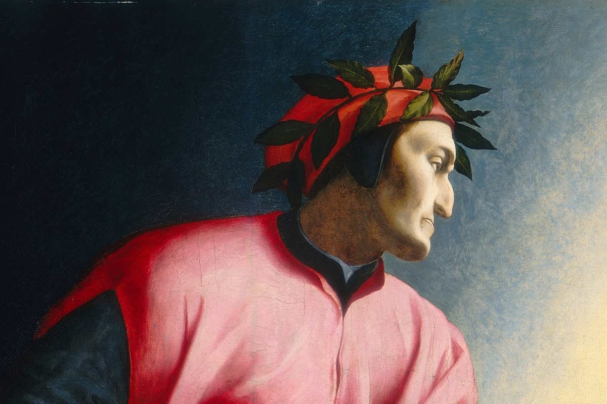

Kickstarter of renaissance
- Written even before the renaissance (1300)
- We can see that much of the western thought is a continuation of the greek thought, this book is a starting point of re integration with the greek culture, which would include the greek thought as well

Artistic Impact
- Several representations of hell in modern culture, from T.S Elliot to video games whenever hell exists, it's based on Dante's

Culture
- Touchstone of medieval/antiquity culture of morality through greek/roman mythology

Quality
- Dante’s Inferno has become a cultural touchstone, representing the archetypal journey through darkness to enlightenment

# Virgilio

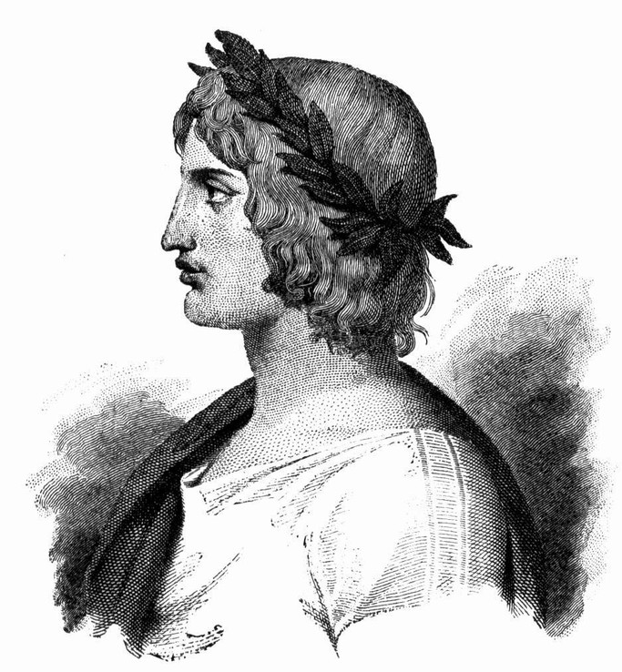

Author meets his idol

Virgílio (70 a 19 a.C.) foi grande poeta da antiguidade e autor de várias obras 
entre as quais as Geórgicas e a Eneida. Esta última conta a história da fundação de 
Roma pelo troiano Enéas (veja nota 4.11). Dante conhecia as obras de Virgílio e 
louva-o por ter influenciado seu estilo poético. De acordo com vários dantólogos, 
Virgílio também tem um sentido alegórico: simboliza o intelecto, a razão do peregrino Dante (veja nota 1.1). É a razão “que apagada estivera, talvez por excessivo silêncio” que pode guiá-lo para fora da selva escura. 

# Contrapasso

Definition
- Is the punishment of souls by a process either resembling or contrasting with the sin itself.

# Visualization

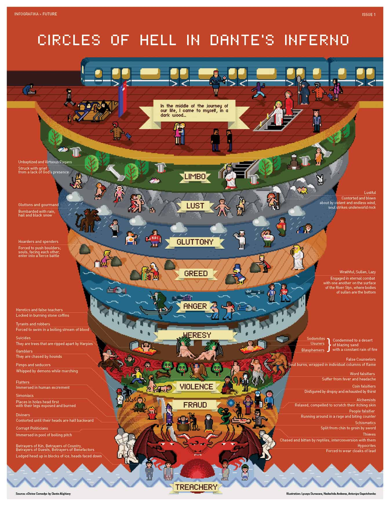

- Botticelli

- The main focus is on the intent of the sin, rather than what it was done
- incontinencia eh melhor porque tem culpa mais nao tem dolo
- violencia nao eh tao ruim porque eh de ocasiao, e nao premeditado.
- a traicao eh o pior de todos porque tira a confianca de alguem que voce conhece ao em
vez de um desconhecido
- segue a etica de nico a nicomanico 

# Limbo (Level 1)

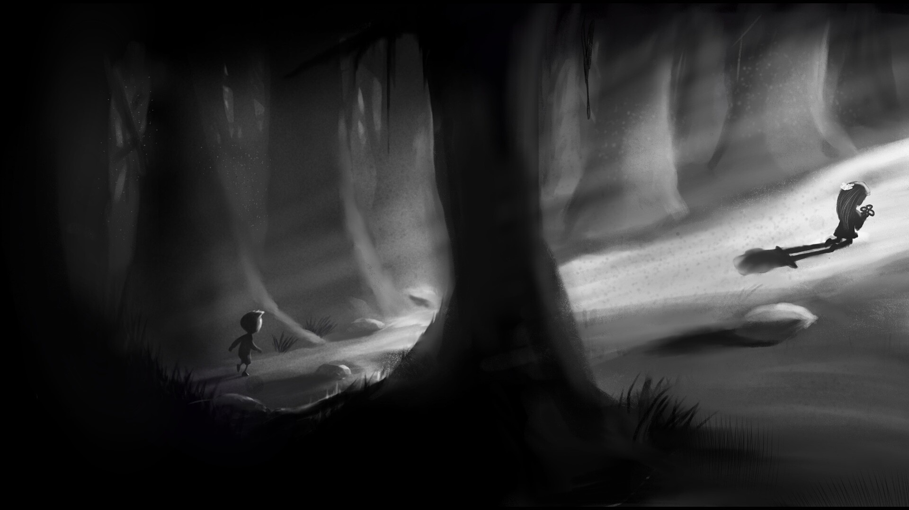

The first level of Inferno is called Limbo. It is home to the unbaptized and virtuous pagans who lived and died before the birth of Christ.

# Lust (Level 2)

Punishment
- Lustful sinners, regardless of the duration of their sin, are tossed about eternally by violent winds in the Second Circle. This represents how their desires carried them away uncontrollably in life
- Could also the opposite of what their sin, instead of expansion, into desires, retractions

Cleopatra and Mark Anthony
- Even though the killed themselves, they negotiated with the devil in order to have their own space in hell

# Glutonny (Level 3)

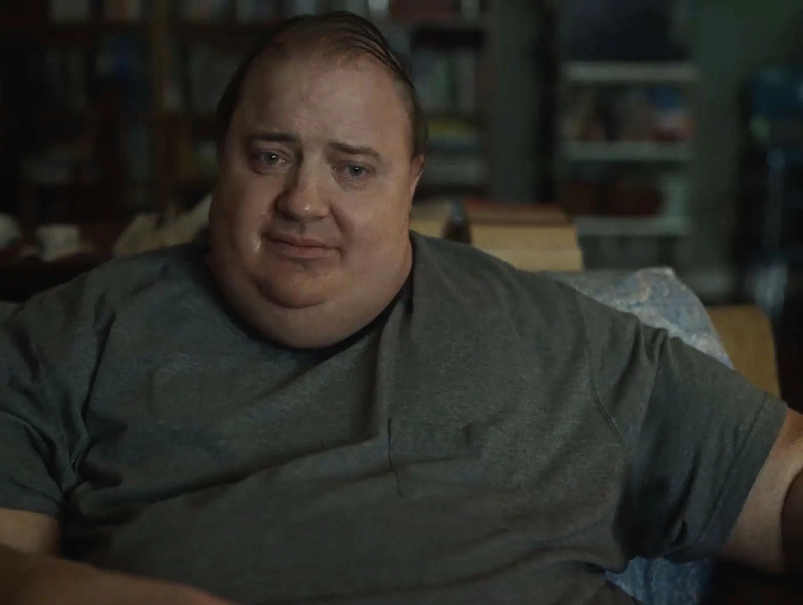

Punishment
- Forced to wallow in disgusting smelling mud, are constantly pelted by endless rain, sleet, snow, and hail, and are attacked by Cerberus.

Cerberus
- Cerberus (described as il gran vermo, literally 'the great worm', line 22), the monstrous three-headed beast of Hell

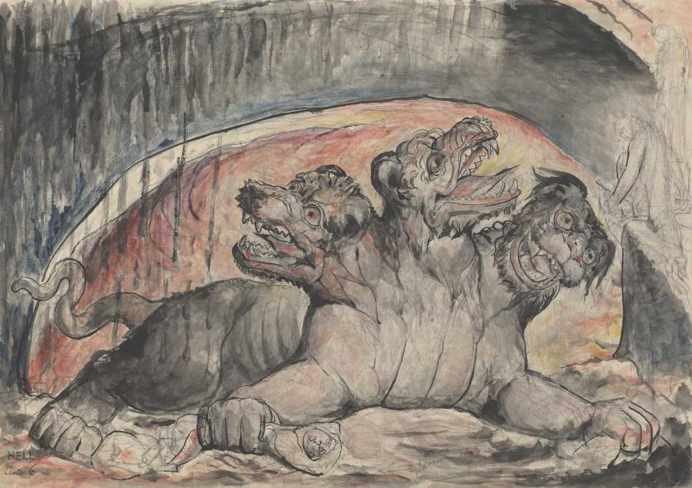

# Greed (Level 4)

Pluto (similar to hades) deus infernal da riqueza

La vi mais almas que eu todos o circulos precedentes

Punishment
- Divisao entre os que gastaram demais, e os avarentos
- Neste círculo repleto de montanhas, suas riquezas materiais se transformaram em grandes pesos de barras e moedas de ouro que um grupo deve empurrar contra o outro e também trocarem-se injúrias, pois suas atitudes em relação à riqueza foram opostas

# Anger (Level 5)

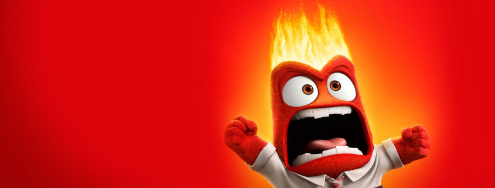

Rancor 
— Filho — disse o bom mestre —, aqui tu vês as almas dos 
vencidos pela ira, e vou dizer-te ainda, se me crês, que embaixo 
d'água há gente que suspira, fazendo-a borbulhar. São aqueles vencidos pelo rancor, a ira contida e passiva, porém igualmente destrutiva. Eles gorgolam o lodo e formam as bolhas que pipocam sobre esta lama fétida

Rage
- Being in a constant physical battle with one another that takes place on the surface of the River Estige

Medusa

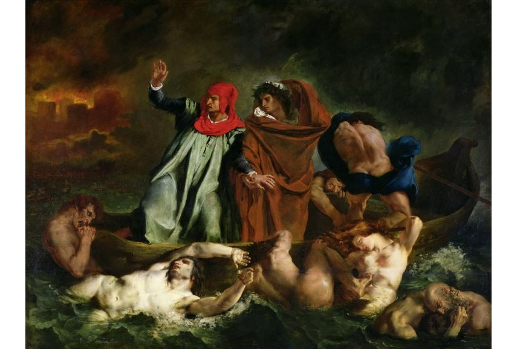
- Eugène Delacroix - The Barque of Dante, 1822

# Hereges (Level 6)

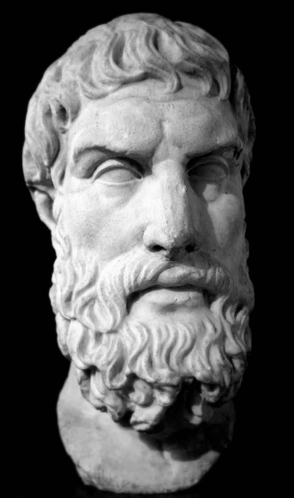

Definition
- Teoria, ideia, prática etc. que nega ou contraria a doutrina estabelecida (por um grupo, no caso a igreja)

Start the city of dite
- Divides between inner parts of hell, and outer parts. Which is divided between the people that performed sins due to lack of self control and people that performed sins deliberately betraying god's directions, it makes sense to punish those people more because they are a bigger threat to the church

São os hereges e seus seguidores
— Em cada tumba repousam os réus de uma mesma seita, que são 
torturados pelo fogo eterno

Epicuro (341-270)
- Interesting Epicuro is here because materialism is the most convincing doctrine that explains the world against it
- filósofo grego que ensinou em Samos e Atenas. Sua filosofia materialista defende que todas as coisas são formadas por átomos cujas 
combinações dão ao mundo sua estrutura particular. 
- A moral de Epicuro – diferentemente da reputação que adquiriu junto à igreja – recomenda gozar os 
bens materiais e espirituais com ponderação e medida, de forma que seja possível perceber o que neles há de melhor. O Epicurismo na opinião da Igreja era 
uma heresia, pois considerando todas as coisas materiais, negava a existência da 
alma e da vida após a morte. [Larrousse 98]

# Violence (Level 7)

## Primeiro giro (Assassinos)

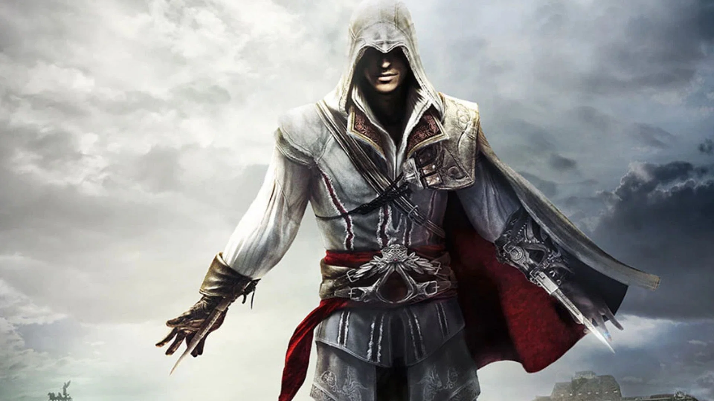

Rio Flegetone
- River of fire
- Quanto mais grave o crime, maior a parte imersa. Como sua função era torturar as "almas" ele tinha que preservá-las, para torturá-las por mais tempo. Entretanto, para isso ele possuía águas curativas, e por isso, é chamado por alguns, de "Rio da Cura"

Niveis de submerso no rio flegetone
- Os violentos contra pessoas e seus bens, estão mergulhados no rio de sangue daqueles que oprimiram, quanto mais grave o crime, maior a parte imersa
- Os assaltantes dentro do rio têm apenas o peito de fora, eles são punidos por terem praticado violência contra os bens de suas vítimas
- Os homicidas só mantêm fora a cabeça. Também estão aqui Átila
- Os tiranos mantém acima da superfície somente as sobrancelhas, eles atentaram contra a vida e contra os bens de suas vítimas, dentre eles está Alexandre, Dionísio, Azolino, Opizzo da Esti

## Segundo giro (Suicidas)

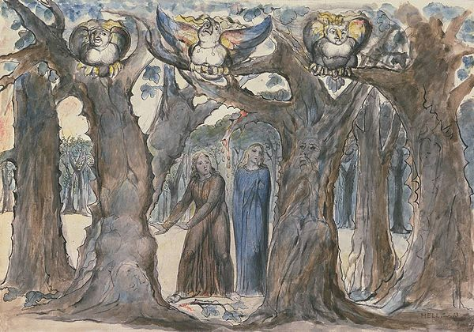

Woods of the suicides
- The souls are transformed into the gnarled, disfigured and brittle trees

## Terceiro giro (Violencias contra Deus)

The third round of the seventh circle is a great Plain of Burning Sand scorched by great flakes of flame falling slowly down from the sky, an image derived from the fate
- The punishment resembles the world without god, supposed they have killed god, what would world would they get? That's the punishment they get, hell, itself burning flames. They are attacked by what person they attacked protect them from

# Fraud (Level 8)

Definition
- Abuse of intellect
- Since fraud can only be done by human beigns [betrayed a gift from god], it displeases god more, and therefore it has a higher hell than Violence

Maleboge
- It is a large, funnel-shaped cavern, itself divided into ten concentric circular trenches or ditches

## First Bolgia (Panderers and Seducers)

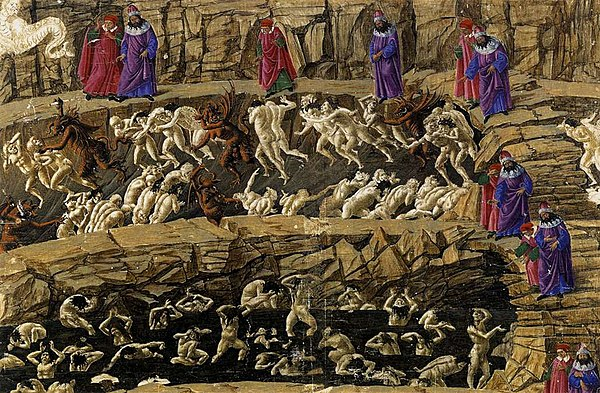
- Botticelli

Panderers and seducers are punished here. They are forced to march, single file around the circumference of their circle, constantly lashed (whipped) by horned demons.

Panderer
- A panderer is a person who takes advantage of others' weaknesses or vices, especially for personal gain

Went to buy cigarettes
- Fathers that seduced woman and then left them to raise by themselves are in this part of hell

## Second Bolgia (Flatterers)

Sinners guilty of excessive flattery are punished in this bolgia, immersed forever in a river of human excrement, similar to what their flatteries were. Thaïs the hetaira is found there

## Sixth Bolgia (Hypocrites)

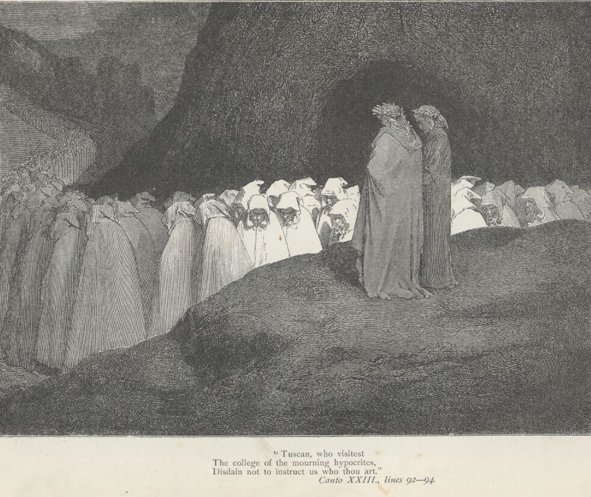

They are forced to wear heavy lead robes as they walk around the circumference of their circle. 
The robes are golden and resemble a monk's cowl but are lined with heavy lead, symbolically representing hypocrisy. 
Also, Caiaphas, the Pharisee who insisted on the execution of Jesus, and all of the Sanhedrin are crucified in this circle, 
staked to the ground so that the ranks of the lead-weighted hypocrites march across him

The Pharisee who insisted on the execution of Jesus
- They taught the law but did not practice some of the most important parts of the law: justice, mercy, faithfulness to God

## Seventh Bolgia (Thieves)

In Inferno 24, the thieves are trapped in a self-perpetuating cycle of being bitten and bound by serpents, dragons and other vengeful reptiles.

## Eigth Bolgia (Counselors of Fraud)

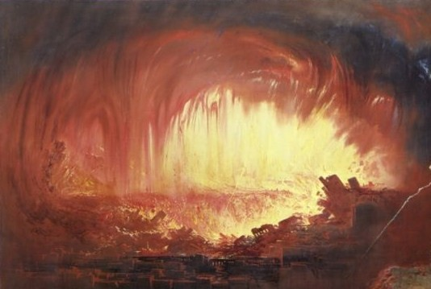

Here, the souls are burned in brilliant flames.

Ulysses is guilty of fraudulent counsel: in Dante's account he urges his men to sail with him past the pillars of Hercules, and so leads them to their deaths.

## Ninth Bolgia (Sowers of Discord)

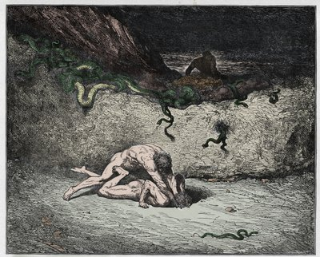

They are forced to walk around the circumference of the circle bearing horrible, disfiguring wounds inflicted on them by a great demon with a sword.
- in portuguese: Os semeadores de discórdias são esfaqueados pela espada de um demônio, que os pune causando mutilações em partes do corpo representativas do tipo de discórdia que provocaram. Eles estão com as entranhas para fora, aparecendo seus estômagos; alguns têm a cabeça cortada; outros, os braços e as pernas; outros, a língua, as orelhas ou o nariz.

Among those who are tormented here is Muhammad, prophet of Islam and his son-in-law and successor Ali

## Tenth Bolgia (Falsifiers)

Falsificadores da materia punishment
- Covered with sardas, and suffer uma coceira incessante
- Cheiro forte de carne podre por conta da lepra
- Pessoas se cocando uma as outras, esfregando seus corpos

Falsificadores de identidade
- sofrem com insanidade e ficam correndo como loucos por esse bolgia

Falsificadores de palavra
- febre tao intensa que ficam imoveis
- Falso sinon em Troia

Falsificadores de dinheiro
- sentem uma sede incassiavel, mas nos seus sonhos so veem rios, lagos e mares

# Treachery (Level 9, Cocito)

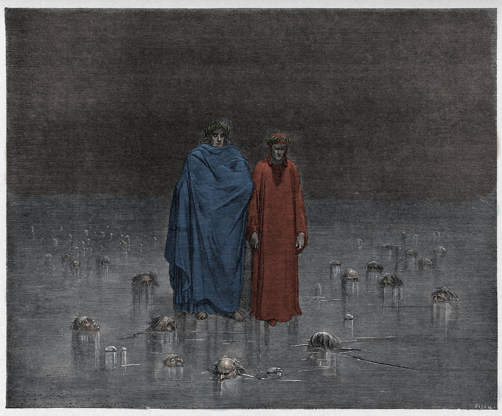

- Gustave Dore

Definition
- Treachery involves a conscious and premeditated act of betrayal. It is not driven by passion or impulse but by a calculated decision to violate trust for personal gain, harm, or other selfish motives.
- Calculated betrayal, malice in their heart

Punishment
- It's is a contradiction because the very deep of hell is basically ice
- The sinners stay with their whole body under ice except for their heads and chests
- This reflects how cold the hearts of the sinners were

Geography
- This part of hell is divided in outerior circumferences, whereas the Caina is outer one

Long causeway bridges run from the outer circumference of Malebolge to its center, 
pictured as spokes on a wheel. At the center of Malebolge is the ninth and final circle of hell, 
known as Cocytus

## Caina (Betrayed relatives)

## Antenora (Betrayed their country)

Punishment
- The sinners stay with their whole body under ice except for the head

Name
- Inspired on Antenor, the prince of troy that betrayed his country by creating a conspiracy with the greeks against his own country

## Judeca (Betrayed their benefeitores)

Punishment
- The sinners stay with their whole body under ice including their heads

## Fosso do Cocito (Dite, center of the earth)

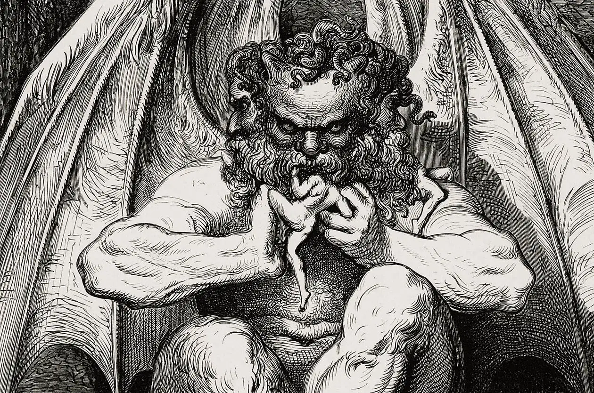

Giant
- There is a giant so large, that even its arm has the size of a giant
- The giant eats three heads, Cassius, Brtus, and Judas
- Lucifer himself has three mouths to chew every single one of his heads
- The Giant cries with his six eyes for all eternity
- Lucifer's virilha is the center of the earth