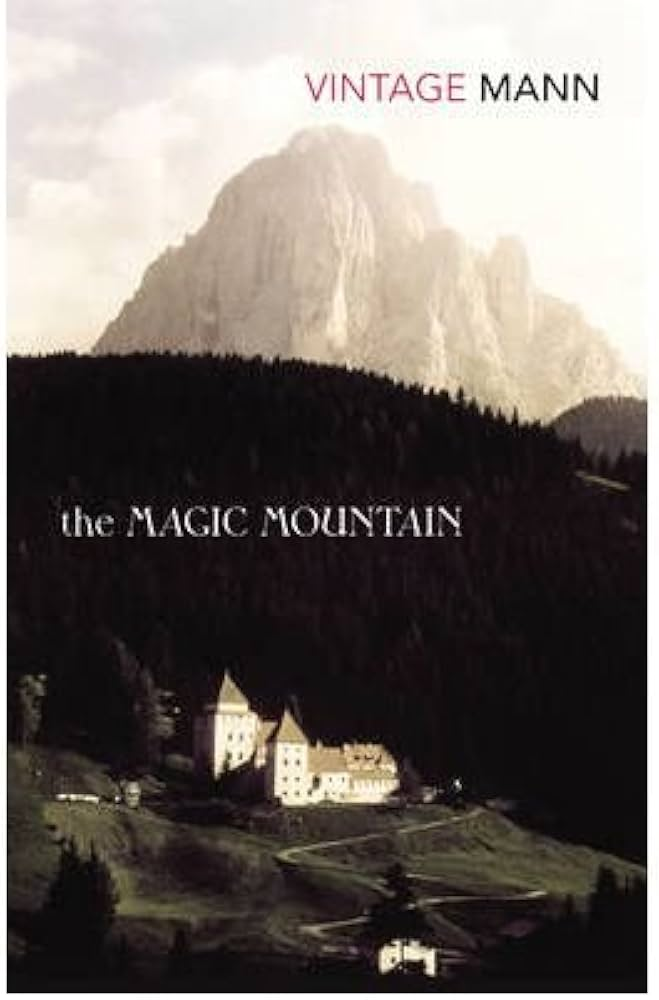
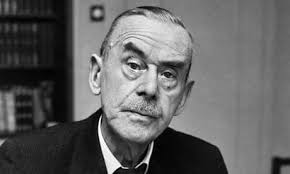

---

title: Literature/The Magic Mountain
order: 2
description: The book I want to read the most
---

Setting
- Hans gets sick and goes to a sanatory (named Berghof)
- In this Sanatory, time passes differently
- Completely distant and detatched from society

Ideological debate
- Every single ideology of the beginning of the WW1 is represented by a character
- Marxism, secularism, capitalism, fascism
- They all try to convince Hans that their ideology is correct

Bildungsroman
- [Parody] Instead of the main character figuring out the correct way of life after the experience different points of view, in the magic mountain the main character doesn't learn anything in these 7 years and is left with answers, as in the real life
- It is considered the "ultima palavra" of a Bildungsroman, in fact there hasn't been many innovative books on this genre anymore, as if it is a solved problem

Author
- Won Nobel of Literature in 1929

