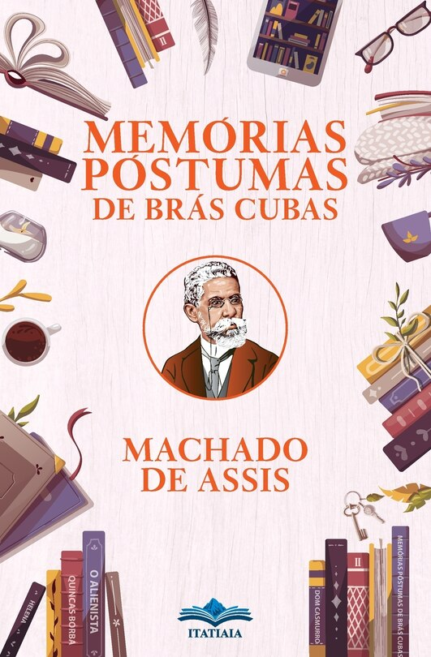

O romance é considerado um marco do realismo brasileiro, inaugurando essa escola literária no país.
- Machado de Assis não adere ao determinismo rígido característico de outros autores realistas.

Iniciou a carreira madura de Machado de Assis

# Criticas a burguesia

## Exemplos
- “Marcela amou-me durante quinze meses e onze contos de réis”.
- - Meio ridiculo o fato dele ter dado todo aquele dinheiro
- Após a morte de seu pai, Brás Cubas, por causa da herança, fica brigado, por um tempo, com sua irmã Sabina e seu cunhado Cotrim. É de se notar que, até o momento, o narrador-personagem não produziu nada seu, apenas teceu planos fracassados, como o casamento, e desfrutou do dinheiro de seu pai. O autor Machado de Assis parece querer mostrar a inutilidade desse personagem na sociedade da época, uma espécie de sanguessuga que nada produz, que nada contribui para o crescimento da nação.
- Virgília amua-se sempre que Brás fala no filho de ambos e Brás não percebe o motivo, aparentemente se trata de “medo do parto” e da “privação de certos hábitos da vida elegante”.

## Humanitismo
- Para os críticos, o "Humanitismo" constitui-se da ideia "do império da lei do mais forte, do mais rico e do mais esperto".[4] Antonio Candido escreveu que a essência do pensamento machadiano é "a transformação do homem em objeto do homem, que é uma das maldições ligadas à falta de liberdade verdadeira, econômica e espiritual."[5] Os críticos notam que o "Humanitismo" de Machado não passa de uma sátira ao positivismo de Auguste Comte e ao cientificismo do século XIX e à teoria de Charles Darwin acerca da seleção natural.[6] Desta forma, a teoria do "ao vencedor, as batatas" seria uma paródia da ciência da época de Machado e sua divulgação, uma forma de desnudar ironicamente o caráter desumano e anti-ético da "lei do mais forte
- ao vencedor, as batatas
- É interessante como ele utiliza a ironia, comparando-a à teoria da evolução, que, apesar de sua complexidade, pode ser resumida de forma sarcástica na expressão "ao vencedor, as batatas".

## Adulterio
- Aliás, a temática do adultério é recorrente em romances realistas do século XIX e aparece como uma crítica à hipocrisia burguesa, já que essa classe defendia valores morais e familiares, que, ao que parece, só serviam para manter as aparências. Assim, Brás Cubas pensa em fugir com a amante, mas descobre uma melhor solução, pois permitiria manter as aparências, isto é, alugar uma “casinha” para os encontros. Como fachada, a personagem D. Plácida é escolhida para viver lá, como se a casa fosse dela.

KKKKKKKKKKKKKKKKK
- Seria um beneficiário cínico que, como ele mesmo escreve no capítulo final, não trabalhou, não pagou o pão com o suor do rosto,[45] em alusão à Gênesis: "No suor do teu rosto comerás o teu pão",[46] mostrando que a propriedade herdada era muito importante para as personagens e a época, daí a luta constante entre ele e sua irmã Sabina e o cunhado Cotrim em ficar com o dinheiro do pai recém-morto e também da preocupação da divisão do espólio após a morte do próprio narrador.[47] Schwarz refere-se à obra como um retrato do liberalismo de fachada que convivia com o regime escravocata.[48]
- Os críticos sociológicos também acreditam que o fato do protagonista ser morto o faz narrar sua vida com "total isenção" e inteiramente "desvinculado de qualquer relação com a sociedade" e, neste descomprometimento propiciado pela morte, possui o poder de dizer, falar, zombar e criticar quem e o que quiser.

# Estilo
## Ironia e Estilo de Escrita

- Machado de Assis utiliza a ironia de forma magistral, adotando um tom debochado e indireto para criticar a sociedade e os valores da época.
- É interessante observar como o brasileiro tende a colocar afetos em tudo, como exemplificado pela "casinha" de D. Plácida, usada como fachada para os encontros de Virgília e Brás Cubas.
- Ao contrário de autores como Castro Alves, José de Alencar e Rui Barbosa, que abusavam do uso de adjetivos e advérbios, Machado é sóbrio e parcimonioso em sua escrita, evitando exageros.
- Ele consegue descrever aspectos essenciais das relações sociais de forma esteticamente bela, sofisticada e precisa.
- Apesar de sua profundidade, o livro não se leva a sério, repleto de brincadeiras e ironias que desconstroem a seriedade tradicional da literatura da época.
- A obra é rica em metáforas e figuras de linguagem, que contribuem para sua sofisticação e beleza estilística.

## Modernidade

- **Estilo fragmentário**: A narrativa é composta por capítulos curtos e não segue uma ordem linear, refletindo a complexidade da vida real e a maneira como as histórias são contadas no cotidiano.
- **Ruptura com o realismo tradicional**: Diferentemente da objetividade característica do narrador em obras de Flaubert, Machado de Assis rompe com essa tradição, trazendo um narrador subjetivo e irônico.
- **Intertextualidade e ironias**: A obra dialoga com outras correntes literárias e utiliza ironias para criticar a sociedade e os valores da época.
- **Metalinguagem**: O autor frequentemente comenta sobre o próprio ato de narrar, criando uma relação direta com o leitor e destacando a artificialidade da narrativa.

A pateticidade de Brás Cubas lembra, em certa medida, os personagens de Woody Allen, com suas reflexões irônicas e autodepreciativas, que expõem as fragilidades humanas de forma cômica e melancólica.

- "Aqui, ousadamente, varriam-se de um golpe o sentimentalismo, o moralismo superficial, a fictícia unidade da pessoa humana, as frases piegas, o receio de chocar preconceitos, a concepção do predomínio do amor sobre todas as outras paixões; afirmava-se a possibilidade de construir um grande livro sem recorrer à natureza, desdenhou-se a cor local, colocou-se o autor pela primeira vez dentro das personagens. [...] A independência literária, que tanto se buscara, só com este livro foi selada. Independência que não significa, nem poderia significar, autossuficiência, e sim o estado de maturidade intelectual e social que permite a liberdade de concepção e expressão. Criando personagens e ambientes brasileiros, bem brasileiros. Machado não se julgou obrigado a fazê-los pitorescamente típicos, porque a consciência da nacionalidade, já sendo nele total, não carecia de elementos decorativos. [...] e por isso pode entre nós ser universal sem deixar de ser brasileiro."