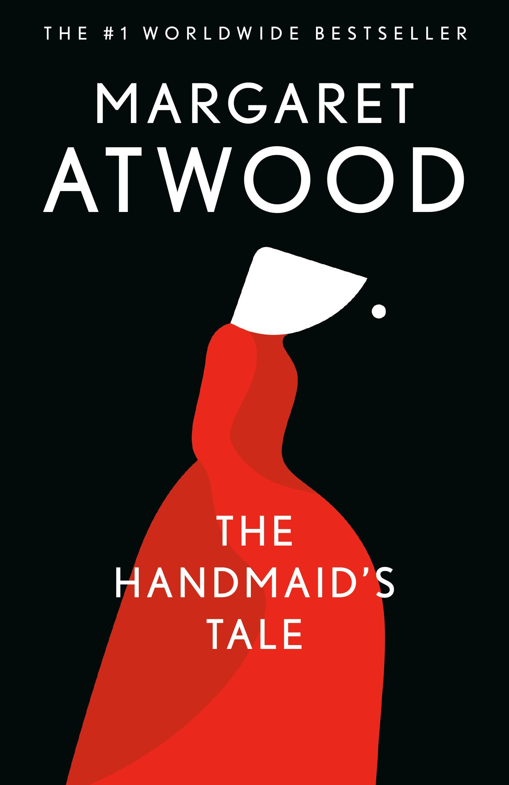

# Offred

Offred is one of the most compelling characters I have encountered. As a woman, she possesses an extraordinary combination of traits: the intuitive "sixth sense" often attributed to women, a profound sensitivity, and remarkable rationality. This unique blend makes her an exceptional storyteller—someone who not only feels deeply but also articulates those feelings with clarity and insight. Her ability to both experience and explain the world around her creates a powerful narrative voice that resonates deeply with readers. This duality of emotional depth and intellectual sharpness makes her perspective invaluable in understanding the complexities of her dystopian reality.

She is a brilliant writer
- He leans back, fingertips toeghter, a gesture familiar to me now. We have built up a repertoire of such gestures, such familiarities, between us. He's looking at me, not unbenevolently, but with curiosity, as if i am a puzzle to be solved.

This epitomizes her inquisitiveness
- "I would like ..." i say. "I would like to know." It sounds indecisive, stupid even,  I say it wihout thinking.
- "Know what" he says.
- "Whatever there is to know" i say; but that's too flippant. "What's going on"

This epitomizes her inquisitiveness:
- "What a luxury it would be. Not that we did it much. These days I script whole fights, in my head, and reconciliation afterwards too."
- Offred's introspection and her ability to imagine scenarios, even in a repressive environment, highlight her relentless curiosity and need to make sense of her world. Despite the dystopian constraints, her mind remains active, seeking understanding and resolution, even if only internally.

But some items must have survived the burning; they couldn't possibly have destroyed everything. He must have acquired this in the same way he obtained the magazines—not through honest means. It reeks of the black market. And it's not new; it's been worn before. The cloth under the arms is crumpled and slightly stained with another woman's sweat.

This detail highlights the clandestine nature of Gilead's underground economy and the remnants of the old world that persist despite the regime's efforts to erase them. The stained garment serves as a poignant reminder of the humanity and individuality of the women who came before, their presence lingering even in the smallest, most mundane details.

- I think if I were in her situation i would also become scientist, it is as if some people were born too inquisitive to simply leave those questions without answer, it seems like our subconscious don't have enough power to block those questions from showing up.

# Harvard

Harvard is lost
- "The Salvaging takes place in Harvard Yard, in front of what was Widener Library. As a university, Harvard once symbolized the free pursuit of knowledge; as the location for the Salvaging, it symbolizes the denial of access to knowledge. Gilead has turned the old world upside down, making a former liberal arts university the seat of the secret police"

- This is deeply symbolic, illustrating the transient nature of human institutions and achievements. It prompts us to reflect on the impermanence of even the most revered places. Imagine what Harvard might represent in 3,000 years—it could just as easily become a site of debauchery or something entirely unrecognizable. This malleability of meaning is one of the true powers of literature, allowing us to explore countless interpretations of a single scenario.

- There is a poignant irony in the fact that this repressive regime has taken root in Harvard, a place once synonymous with secularism, intellectual freedom, and the pursuit of knowledge. The stark contrast between its past and present underscores the fragility of progress. The secularists who once thrived there are now absent, replaced by the religious zealots of Gilead. The transformation of Harvard into a symbol of oppression is both tragic and darkly ironic, highlighting how even the most hallowed institutions can be co-opted and repurposed by authoritarian regimes.

# Social structures

Econowife
- Rather than being married to Commanders, Econowives are fertile women who are married off to Gilead's more ordinary men

Unbaby
- is the term used in the Republic of Gilead to describe infants that are suffering from birth defects or physical deformities

Handmaid
- Origin = "The Old Testament story of Rachel and her handmaid, Bilhah, is the basis of Gilead's strategy to combat its fertility crisis. Back in the days of sanctioned polygamy, Rachel and Leah are sisters married to Jacob. Leah has no trouble having son after son, but her sister, Rachel — the woman whom Jacob loves — can’t get pregnant. Rachel convinces Jacob to impregnate her handmaid, Bilhah, so Rachel can have children “through” her. Bilhah gives birth to two sons, and Rachel names them both. Notably, Bilhah’s voice is never heard at any point in the Bible"

It's crazy how she is treated as a basic machine, without anything
- "Offred’s flashbacks continue to flesh out the story of her life before becoming a Handmaid. Few people appear in Offred’s flashbacks—only Luke, Moira, Offred’s mother, and her daughter make appearances. Each of these characters fulfills a different human need. Moira satisfies the need for friendship, Offred’s mother the need for family, her daughter the need for children, Luke the need for romantic love. Offred must satisfy her human needs as best she can by living partially in the past, for none of her needs can be satisfied in her new life"
- We are just like her

## Religion

KKKKKKKKKKKKKKK
- "Yet to justify Jezebel’s existence, the Commander snatches at the rhetoric of late-twentieth-century evolutionary psychologists, lecturing Offred on how men need multiple sexual partners because “Nature demands variety . . . it’s part of the procreational strategy.” The Commanders pick and choose from earlier traditions as they please. The Old Testament is useful for subjugating women, but modern sociobiology provides justification for their own philandering"
- [MYTAKE] for me this quote is very strong, because we all know marx's main theorem, that the superstructure is a consequence of the material reality, therefore this shouldn't be a surprise to me, but ... this is sad to hear because I am very attatched to the superstructure for example the romanticness of religion, and seeing that this is just an instrument to get man what they want, it's so sad. And in fact reveals something about me myself, because that theorem applies to ourselves.

## Feminism

### Sex

KKKKKKKKKKKKKKKKKKKK
- "My arms are raised; she holds my hands, each of mine in each of hers. This is supposed to sgnify that we are on flesh, one bing. What it really means is taht she in control, of the process and thus of the product. If any. The ings of her left hand cut into my fingers. It may or may not be revenge"
- This is so fucked up in so many ways.
- This sex scene makes me remember Woody Allen's scene  that his girfriend is thnking about something else while having sex. It's insane how much stuff she can do while having sex. Why would they remove everysingle joy from sex, and the craziest thing is that this has happened somewhere in human history, which is crazy.
- And a crazy fact, is that we can't simply look at this and say, hey this is so absurd, it doesn't even make sense at all, because everything in this book as happened in some society along history.

KKKKKKKKKKKKKKKKKKKK
- "At least he's an improvement on the previous one, who smelled like a church cloackroom in the rain; like your mouth when the dentists starts pickinga at your teeth; like a nostril. THe COmmmander instead, smells of mothballs, or is this odour some punivitive form of aftershave? wHY DOES HE HAVE TO WEAR THAT STUPID UNIFORM? but would I like his white, tufted raw body any better?"
- I mean I am not a very progessive person. But this so unfair.

Umas e outras de Chico Buarque
- "Atwood draws a parallel between the nuns forced to become Handmaids and the Handmaids themselves. The Handmaids resemble nuns: both groups are cloistered, consecrated to a religious duty, and required to wear long garments referred to as “habits.” But whereas nuns vow to remain celibate and serve God by ignoring their fertility and their sexual urges, Handmaids’ sole religious and social duty is to reproduce."

Rape
- "Fake it, I scream at myself inside my head. You must remember how. Let's get thsi over with or you' be here all night. bestir yourself. Move your flesh around, btreahe audibly. OIt's the least you can do."
- The number of rapes in this book is so compeling, poor girl it's like her vagina is owned by the government. The assumption that is all equal seems like a stupid assumption, but if that's broken the consequences can be drastic.

Atwood suggests that patriarchal societies tend to divide women into two types: the virgin and the whore. In Gilead, the virginal women are the nearly sexless Wives and daughters, the invisible Marthas, and the holy Handmaids—all of whose sexual lives are tightly restricted.
- I don't know why this feels so nature? I just feels like if the girl had a lot sex, instinctively she had a lot of changes of getting pregnant, and therefore don't value herself?

Sex with Nick
- It's very interesting how much sex is something important. In a patriarchal society, it seems that sex it's the womans only weapon, only resource that she can use to get stuff. And it's kinda of the other way around as well, sex is the only thing men as class don't have, therefore sex is in the center of society, which is a thought that I never had. 
- When Ofred has sex with Nick, that is so profound because it is a merge of so many feelings, let's list a few of them.
- In this society in particular, it feels like her sex is useful but she doesn't have any control over it, it's owned by the government, but the passion that's the only thing left for her, and decides to give it to Nick probably in despite.
- Imagine being lonely all the time, for a decade maybe, not having human contact even with other woman, it just feels like Nick could be anyone and she would still fall in love with him, human desperateness is so touching.
- Perhaps she fell in love because she knew she would have children with him?

### Woman's objetification

It's very sad the situation of most women in history
- "We are containers, it's only the inside of our bodies that are important."
- This is very sad, but so true for most of societies in history

- "When Offred wonders how he can imagine Gilead to be better than the old world, the Commander callously replies that “[b]etter . . . always means worse, for some.” The Commander thinks he has made men happier and more fulfilled. If that means that life is ghastly and oppressive for women, so be it."
- it's crazy that this objetification of woman is something that really "junta o inutil ao agradavel", it's so conveniant and easier to unhumanize other people.

- "Even before she knew what it meant, Offred cherished the Latin scrawl Nolites te bastardes carborundorum as a connection between her and the previous Handmaid, and as a symbol of her resistance to Gilead. Now, thanks to the Commander, she learns that it means “don’t let the bastards grind you down”—an appropriate response to a totalitarian, patriarchal society. Offred and the other Handmaids must struggle to hold on to their humanity and to resist their oppressors. The translation of the phrase is not an entirely joyous moment, however, for it signals to Offred that someone came to the Commander’s study before her. It is not clear whether this upsets her because she feels jealous of her connection with the Commander, or because she worries about whether she will meet the same fate as the Handmaid before her."
- Simply stating that woman are commodities in this society is something plane and simple, but when you have an example like this is so much more concrete.

- "Yes, I say. It's true, and I don'task why, because I know. Give me children, or else I die. There's more than one meaning to it."

- "He doesn't mind this, I thought. He doesn't mind it at all. Maybe he even likes it. We are not each other's any more. Instead, I am his."
- I was not the best boyfriend to my ex, is it part of woman's self discovery that all man are sexist to a certain degree? Is this symmetric, do woman also have a similar flaw, perhaps is the hypergamy?

### Romance

Love doesn't exist
"As for my husband, she said, he's just that. My husband. I want that to be perfectly clear. Till death do us part. It's final.
- KKKKKKKKK

"God is love, they said once, but we reversed that, and love, like Heaven, was always around the corner. The more difficult it was to love the paritcular man beside us, the more we believed in Love, abstract and total. We were waiting, always, for the incarnation. That word made flesh"
- That's a very powerful reflection on love, the fact that she has so much time for herself means she can reflect very deeply on stuff

She can only cling to her memories of Luke and the feelings of love they shared. She reflects on how the next generation will lack such memories, affirming Aunt Lydia’s chilling observation that Gilead will eventually “become ordinary.” Atwood highlights the insidious power of a totalitarian society: once people lose the ability to imagine a reality beyond oppression, that oppression becomes normalized.

- There is a striking parallel with *Mrs. Dalloway*, where both protagonists are deeply tethered to their memories. Offred clings to hers as a means of survival in the face of Gilead’s oppressive regime, while Clarissa Dalloway does so as she confronts the passage of time and her advancing age. For both women, this reliance on memory feels imposed by external forces—whether societal or natural. This deprivation of the ability to fully engage with the present reflects a universal human struggle: the tension between what has been lost and what can no longer be felt.

- This also evokes the concept of "docking," where individuals metaphorically anchor themselves to past experiences or emotions as a way to navigate the void created by their current circumstances. In both cases, memory becomes a lifeline, preserving identity and meaning in the face of external forces that strip them of agency. 

# Politics

Offred
- It's interesting because

"There is more than one kind of freedom, said Aunt Lydia. Freedom to and freedom from. In the days of anarchi, it was freedom to. Now you are being fiven freedom from. Don't underrate it"
- I love this quote, because it shows that every ideology is justifiable, therefore in the end of the day we are not that rational, we all have faith, and we choose to believe in certain things because we have faith not in the argument itself, but in the people that said, and the fact that their arguments are reaching at us. Therefore what we believe is shaped by the loudest voices, and what we constructed socially as credible sources.

"These women could be gested the possibilities of the world  undone. These women could be undone or not. Thyseemed to be able tho choose. We seemed to be able to chosse, then. We were a society dying, said Aunt Lydia, of too much choice"
- I find this brilliant, because in fact the secularist ideology has problems without a doubt, therefore we can construct arguments that there is something better, and times of crisis and perfect control those ideologies can be very powerful.

Gilead shows to me that religion and state cannot be separated, because every soceity has their own axioms, and that is as close as possible to a religion in my opinion.

How do you keep a represive state?
- Offred remembers her mother saying that people can grow accustomed to almost anything “as long as there are a few compensations,” and Offred’s relationship with Nick shows the truth of this insight. Offred’s situation restricts her horribly compared to the freedom her former life allowed, but her relationship with Nick allows her to reclaim the tiniest fragment of her former existence.

## Fascism

[MYTAKE] What we have seen for human history is that whenever people are desperate, and situation is complicated, there is a demand for leadership to point the way, and thus whoever shows up will be able to take the spot 

The big question that comes with this book is, since we have all being raised in a society framed with humanist, equalitarian values, how can we simply give up on those values and turn into a gilead's tale. The answer comes with my personal experience with Bolsonaro.
1) In complicated situations we can forgot about those values because we see higher menaces such as Lula. Peoples eagerness to have order will be more important in the end of the day than computing precisely if the new social order will be better than the current one.
2) Those whole control the means of production can do enough propaganda to change our minds, more importantly, we are emotional human beings, and in complicated scenarios we can take unwise decisions.
3) In particular, the main rights that were lost were related to woman's, but in the end anyone can loose their rights under the right circumnstances, it depends on those who take the power.

Bolsonaro all the way
- "Again and again in the novel, the voice of Aunt Lydia rings in Offred’s head, insisting that women are better off in Gilead, free from exploitation and violence, than they were in the dangerous freedom of pre-Gilead times."
- This is crazy man, in fact that's how bolsonaro emerged.

Gilead creation
- "Offred’s extended flashback provides an explanation of how Gilead was created. The pre-Gilead United States is our world in the near future—all money has been computerized, and pornography and prostitution have become more accepted and available. Offred mentions “Pornomarts” and “Feels-on-Wheels” as if the terms needed no explanation, leaving the details to the imagination but conveying a sense of a society more sexually liberated than our own. The extent of this sexual liberation may prompt the extremism of the conservative backlash. Offred mentions “porn riots” and “abortion riots” that take place before Gilead—the conservative precursor to the uprising against the liberal government. In the epilogue, an expert on Gilead’s history says its founders used a “CIA pamphlet on the destabilization of foreign governments as a strategic handbook” to topple the U.S. government. First, governmental officials are assassinated; then martial law is declared “temporarily”; finally, the new regime consolidates its power and squashes dissent."

Bolsonaro all th way
- "It was after the catastrophe, when they shot the President and machine=gunned the Congress and the army declared a state of emergency. They blamed it on the Islamic fanatics, at the time."
- This is so incredibly real
- "Luke was in the living room. He put his arms around me. We were both feeling miserable. How were we know we we were happ even then? Because we at least had that; arms, around."
- Bro this remembers a lot about hate politics "petralhada", "esquerdopatas", because in the end of the day our social fabric is completely based on other human being's life also being worth as much as ours, when we loose this assumption we can very easily treat human beings like shit.

"No mother is ever, completely, a child's idea of what a mother should be, and I  suppose it works the other way around as well. But despite  everything, we didn't do abadly by one another, we did as well as most."

# Purpose in life

Objetification of woman
- "Sometimes I think these scarves aren't sent to the anGELS AT ALL, BUT THE UNRAVELLED AND THRUBED BACK INTO BALLS of yarn, to be  knitted again in their turn. Maybe it's just something to keep the Wives busy, to give them  a sense of purpose. But I envy the Commander's wivefe her knitting. It's good to have small goals that can be easily atttained."
- The objectification of the woman, entails that meaning is provided to them only as way to avoid them from dying, it's the logic of the more to myself, and the less for others.

How can a woman create a meaning of life for her?
- "So. I explored this room, not hastily, then, like a hotel room, wasting it. I didn'tg want to do it all at once, i wanted to make it last. I divided the room into sections, in my head; I allowed myself one section a day. This one section I would examine with the greatest minuteness; the uneveness of the paster under the walllpaper."
- Man, removed the most precious things from woman, which is the ability to even want anything.

How can a woman create a meaning of life for her?
- "In the household, a mood of loneliness and isolation exists. As a Handmaid, Offred is not only denied friends, she is denied a family. She must eat dinner apart from the rest of the household; her baths and movements are regulated as if she is an animal; the servants hardly speak to her."
- omg, poor girl, she is so amazing.

One notable observation is that if you choose to believe the rhetoric propagated by the government, you are essentially handed a predefined and well-structured meaning of life. This belief system, while potentially comforting, comes at the cost of personal agency and critical thinking. It simplifies existence by providing a framework that dictates purpose, values, and actions, but it also demands unquestioning acceptance of the narrative, often suppressing individuality and dissent.

This trade-off highlights a central tension in totalitarian regimes: the allure of certainty and order versus the loss of freedom and self-determination. By surrendering to the government's ideology, individuals may find solace in the clarity of their roles and goals, but they also risk becoming mere instruments of the state, stripped of their ability to question or imagine alternative realities.

Infinite Jest
- This book perfectly problematizes the problems the logical consequences of taking pleasure as a meaning of life, whereas Handmaid's tale shows us the problems of giving our minds completely to an institution, or an ideology, because if that's wrong as well, we are in bad shape.

