# Childhood

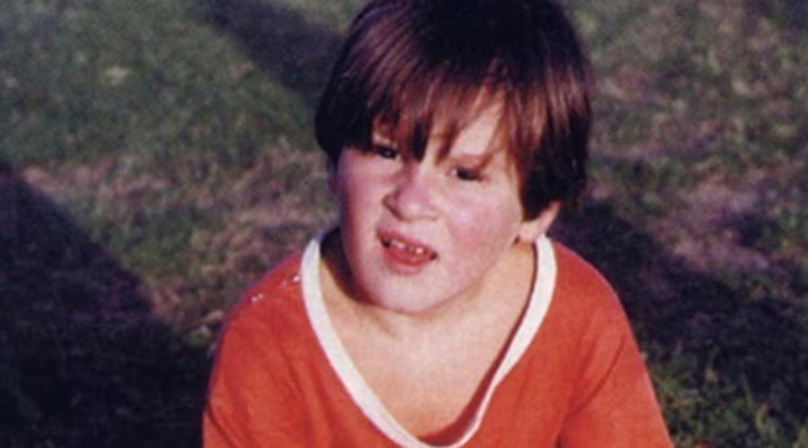

Background
- Messi was born in 1987, a year after Maradona's World Cup
- - [MYTAKE] For me, this is a true prophecy. It even sounds like Avatar the Airbender; after one of the gods of football peaked, the next one was born
- Descendant of Italians and Spaniards; in fact, the Spanish part was from Catalonia
- - [MYTAKE] Oh my god, this is so prophetic; I can't imagine anything more prophetic than this
- Since he was a child, he showed great attachment to the ball, to the point of refusing to go shopping with his family when they wouldn't let him take a ball
- - [MYTAKE] KKKKKKKKKKKKKK
- His grandmother played a fundamental role in his career, even when he was still very young
- - There was no youth team for him, so she convinced the coach to let him play; she was the only person in the family who encouraged him to really 
play
- At the age of eleven, Ceila (his grandmother died)

Romance
- "I've liked Antonela since I was a boy. I love her more than anything. I'd say it was love at first sight."

Growth problem
- However, at eleven, a hormonal problem was detected that slowed Messi's bone development and, consequently, his growth.[22][23] For a year and a half, the $900 monthly treatment,[22] which consisted of alternating injections in each leg every night, was paid for by the foundation where his father worked until the source dried up.[22] Since Newell's did not want to pay for the continuation of the treatment, the father offered his son to River Plate.[22][23] The interest of the capital club made Newell's back down, but not enough, offering two hundred pesos a month.[22]
- [MYTAKE] Once again, a sign of prophecy, he had a "disease" that sounds like something terrible, but in fact, it contributed to his footballing skills because of the positioning of his center of mass. It's interesting because Messi's early childhood reminds of the book Outliers, where basically, for someone to be exceptional at something, literally all stars need to line up for example for Messi was: autistic, Argentinian, low hormone growth so many if statements had to be true so he could become what he became
- [MYTAKE] Perhaps everyone satisfies a certain set of if statements that make them perfect for something

Messi goes to Barcelona
- The father then decided to try his luck abroad, also to spare the family from the effects of the economic crisis that was occurring in Argentina.[24] A cousin of Jorge Messi's mother lived in Lleida, Catalonia, and took the Messis in. Lionel began to be observed by a Barcelona scout,[24] who recommended him for trials at the club. At thirteen years old and 1.40 meters tall, he managed to do well against boys two years older. However, President Joan Gaspart and sporting director Carles Rexach were hesitant to buy the youngster since they would have to pay not only for his treatment but also for his family's relocation. 

Messi is EXTREMELY shy
- Pique said that in Messi's first month on the professional team, people thought he was dead; he didn't say anything for the whole month. Cesc Fabregas: he spoke in a very low Argentinean; he hardly spoke either, and it was very difficult to talk to him. 

Ronaldinho's prophecy
- After Ronaldinho's first training session with Messi, he called a journalist friend of his and said: I just trained with someone who is going to be better than me. When Kobe went to Barcelona, ​​Ronaldinho told him that Messi would be the best. Ronaldinho noticed his shyness and saw that he needed help, so he invited him to join his group of friends in Barcelona with other players. Messi and Ronaldinho lived on the same street; one even taught the other Spanish and Portuguese. To this day, Messi says that R10 was a father to him. Not Too long after that, two legends were talking before a friendly between giants Barcelona and Juventus. One, Samuel Eto'o, warned the other, Patrick Vieira, about this kid and told him that one day, he would seem like every player who came before him was playing a different sport.

# 2004/2005
Messi scores his first goal for Barcelona,
- He climbs on Ronaldinho's back, meaning R10 knows how historic that moment was, and that's why he wanted to honor him
- [MYTAKE] this is goal is legendary, first of all, Ronaldinho who was the best player at the time, asking for a 16 year old kid to climb  his back, Ronaldinho was both a visionary and so humble by this action. Second of all, of all possible goals that Messi would score, he scored a chip which is his trademark

# 2005/2006

Nothing happend in this season as far as i know

# 2006/2007

Ankara Messi
- Masterpiece
- Copa del Rey semi-final
- [MYTAKE] My second favourite Messi goal all time. Truly beautiful, truly amazing

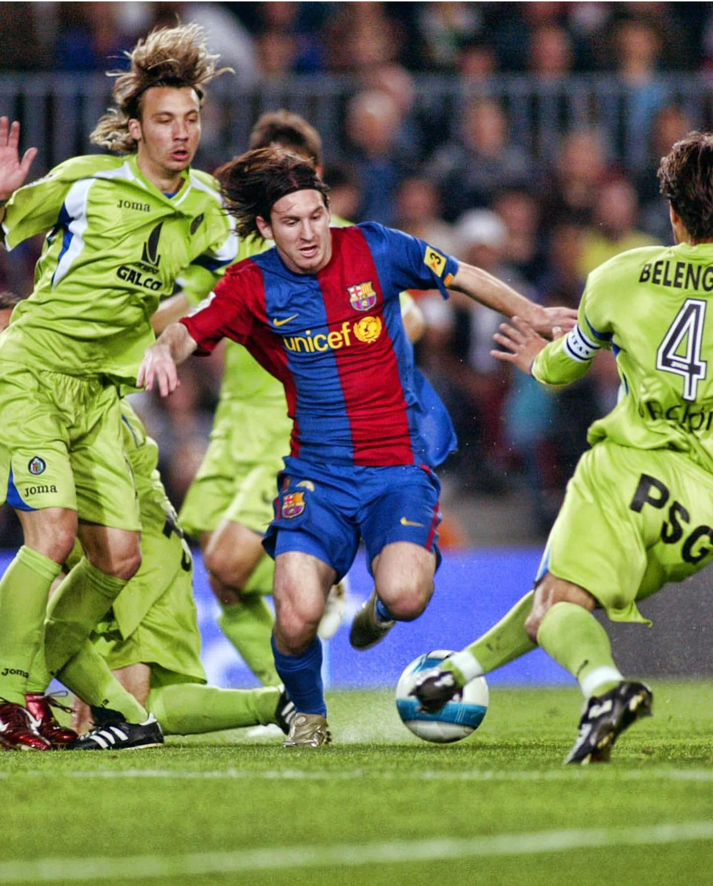

Comparisons with Maradona
- At the beginning of his career, he scored a goal with his hand and a goal in which he dribbled past everyone,
- These goals were even scored in a short period of time. Creating comparisons with the classic game between Argentina and England in 1986. In other words, he already seemed destined to be the next Maradona
- [MYTAKE] Messi's career is filled with prophetic signs that it even feels like it was an act of god

## Copa América

Runner-up, lost to Brazil in the final by 3-0; all the best Brazilian players were not there, like Ronaldinho, Roberto Carlos, Kaka, etc.

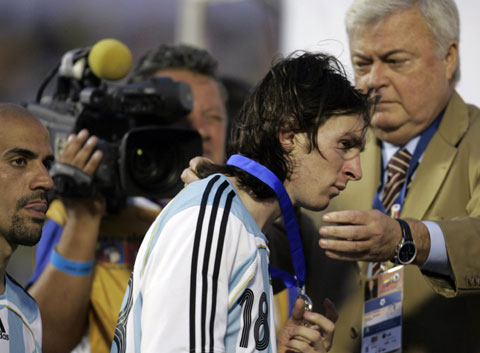

# 2007/2008

## Champions League

First match between him and Ronaldo
- He faced Cristiano for the first time in the Champions League semi-final.
It was a tight game with few opportunities; Scholes scored only one goal in the two matches.
- [MYTAKE] Those that watched this game could never imagine how great those two would become

# 2008/2009

Ronaldinho foi dispensado do time por Guardiola, por conta do estilo de vida boêmio

## Champions League

### Quartas de final vs Bayern Munich

First leg
- 4 - 0
- 2 goals and one assist for Messi

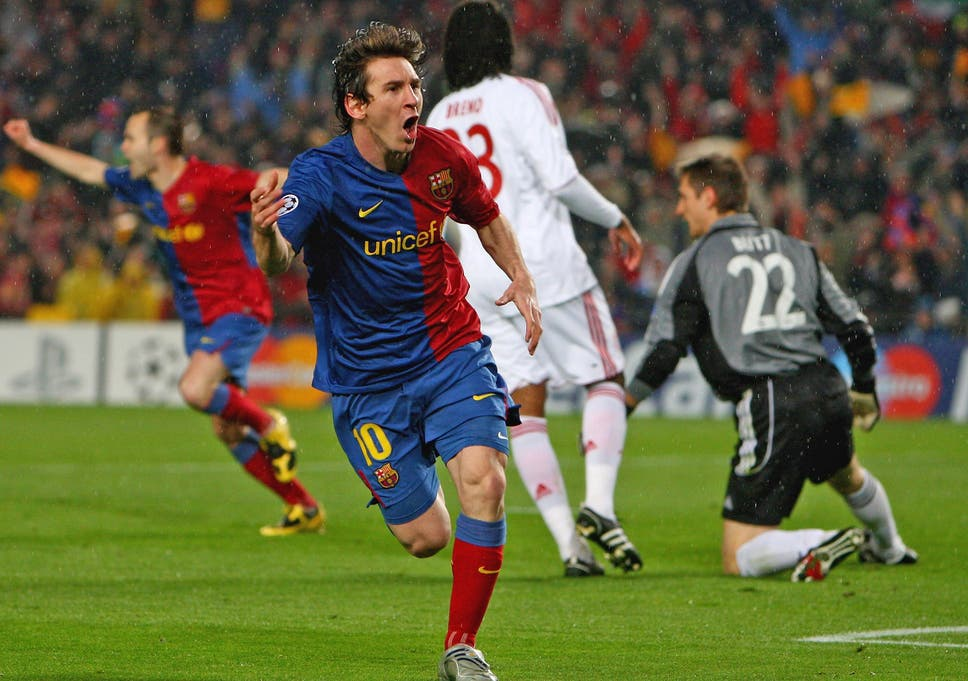

### Semi final vs Chelsea

Second leg
- 0 - 1
- At the buzzer
- First leg was 0-0 at the Camp Nou
- Second leg was stolen
- No ultimo minuto Messi deu uma assistência para Iniesta fazer um golaço de trivela

### Final vs Manchester United

Prelude
- Na final da champions ele enfrentou Cristiano e o Manchester United pela segunda vez
Eto'o fez um golaço, e 

2-0
- Messi fez um gol icônico de cabeça um dos poucos da carreira dele de cabeça
- Cena épica em que ele beija a chuteira

Victory
- First Champions league of the trio Messi, Xavi and Iniesta

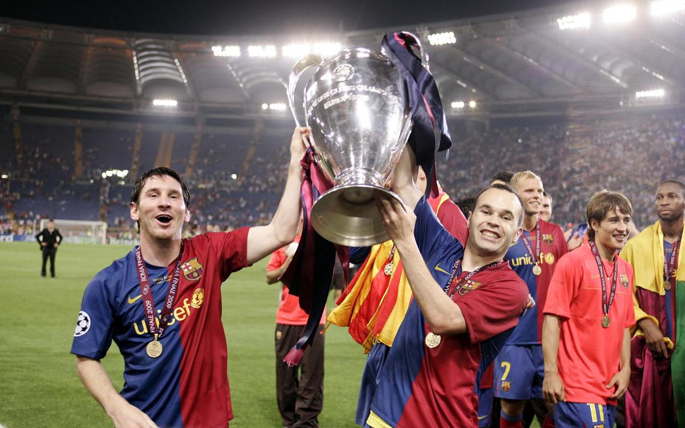

## Ballon d'or, #1

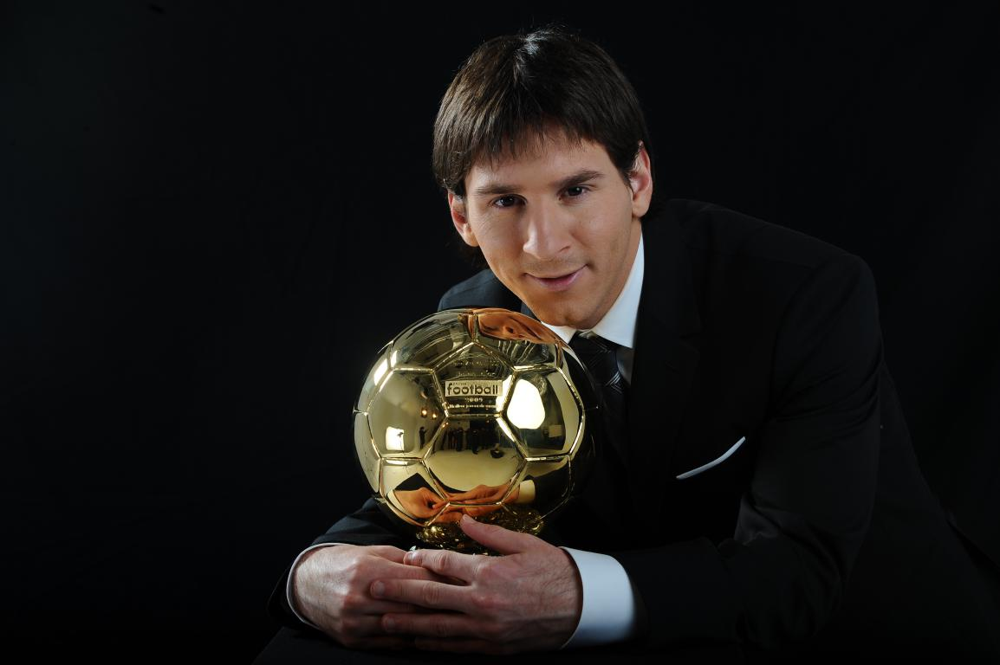

# 2009/2010
Prelude
- Ronaldo foi para o Real Madrid

Masterpiece
- Dribbled 4 defenders vs Zaragoza

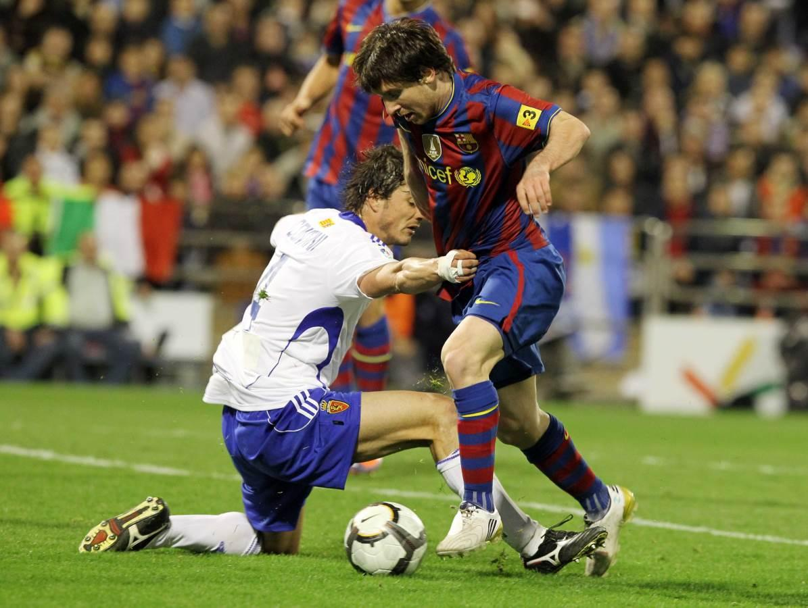

## Champions

### Quartas de final vs Arsenal

First leg
- 4 - 0
- Fez quatro gols, loucura

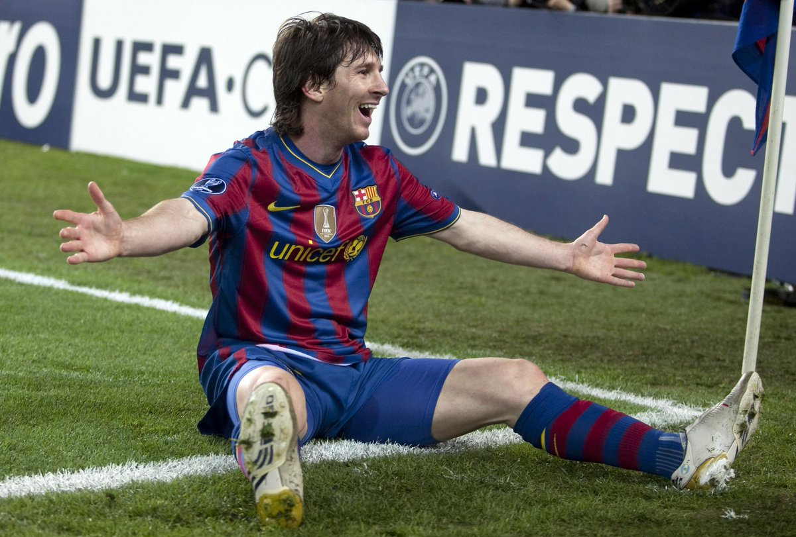

### Semi final vs Inter de Milan

First leg
- 3 - 1
- Mourinho's air bus de Sneijder Eto'o, Maicon, Lucio, Julio Cesar

## World Cup
Maradona was the coach
Messi não fez nenhum gol, mas ele deu uma assistência

A Argentina foi eliminada numa pisa contra a Alemanha, Argentina
Estava muito desorganizada naquela época defensivamente, terceira
Vez seguida que a argentina perdia para Alemanha
Depois da derrota Maradona disse que alguns jogadores ja estavam
Vendo passagens no dia de amanha, enquanto Messi "I saw Messi crying like a 5-year-old child"

A Espanha ganhou a copa e muito foi dito porque
Ele poderia se quisesse ter jogado pela Espanha
Foi duro para ele ver todos os companheiros dele
Do Barcelona sendo campeões do mundo

## Ballond d'or, #2

# 2010/2011

## Champions League

### Group Stage

Masterpiece
- Tiki taka vs Panathatinakos

### Oitavas de final vs Arsenal

First leg
- 1 - 2

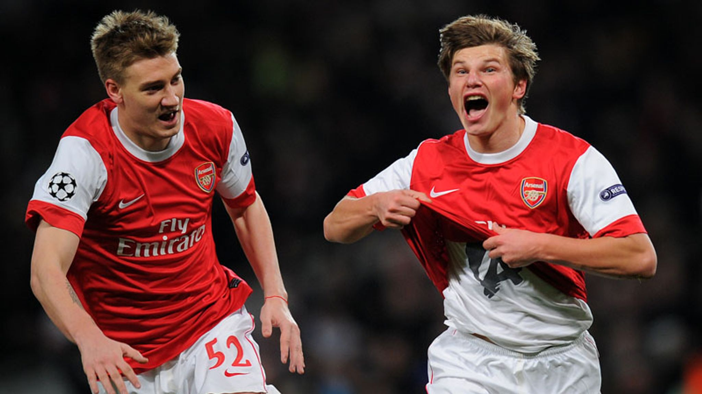

Second leg
- 3 - 1
- Messi fez 2 gols e 1 assistencia dos 5 gols do Barcelona contra o arsenal, e todos eles Foram clutch dado que o Barcelona quase nao passou, e um desses gols foi belissimo, Iniesta's pass was so beautiful on that goal

### Quartas de final vs Shakthar

### Semi finals vs Real Madrid

Prelude
- In fact Mourinho was the coach of Madrid (Messi lost to Mourinho in the Champions in the previous year), and he faced 4 times Real Madrid, including a Champions league semi final

First leg
- 0 - 2
- Masterpiece
- "away from two, three four wonderful wonderful wonderful how good is he?"
- [MYTAKE] This is my favourite Messi goal, he simply produced a masterpiece at a FUCKING CHAMPIONS LEAGE SEMIFINAL AGAINST REAL MADRID AT SANTIAGO BERNABEU AGAINST HIS ARCH RIVAL, truly divine

### Final vs Manchester United

1 - 0
- Beautiful goal outside the box

3 - 1
- Iniciou a jogada do terceiro, desbalanceado a defesa

Legacy
- Esse time eh historico, por ser or apice de um maiores quartetos da historia do futebol, Messi, Xavi, Iniesta e Guardiola

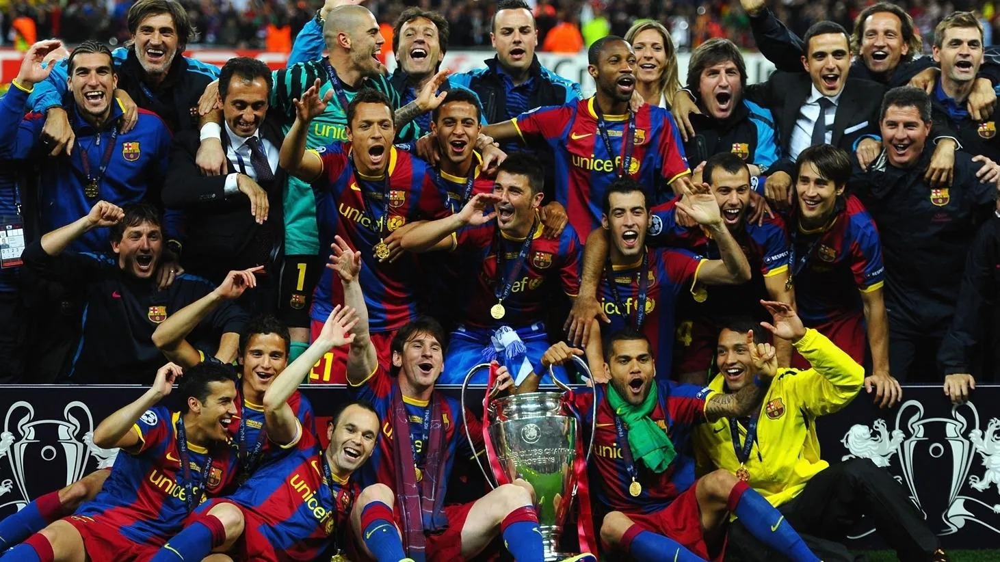

## Ballon d'or, #3

# 2011/2012

Pep Guardiola, who said: “Don’t write about him, don’t try to describe him. Just watch him.”

## Champions League

### Group stage

vs Bayern Leverkusen
- 5 goals from the king

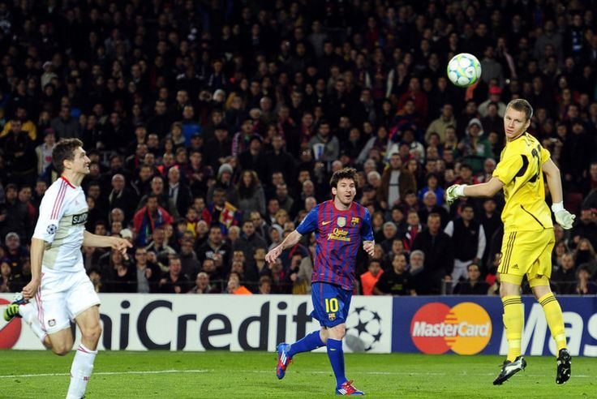

### Quartas de final

### Semi final

Prelude
- Repeteco do confronto do chelsea de 2009 nas semis

First leg

Second leg
- 0 - 2
- Messi penalty hit the cross bar

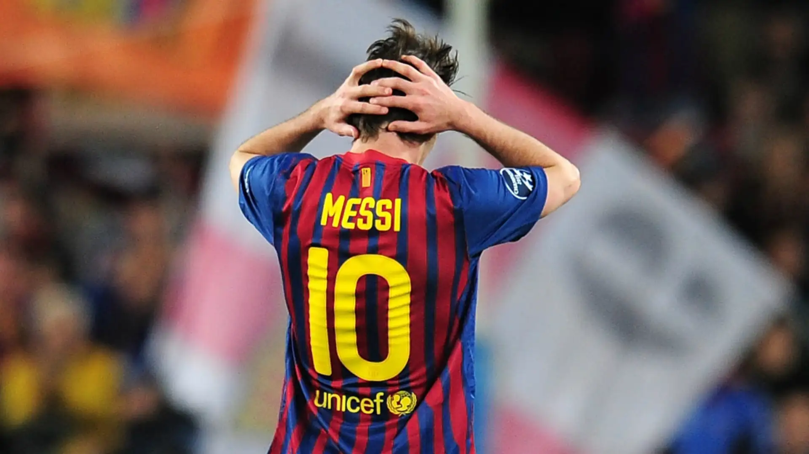

After math
- When Barcelona diserved to win they lost, when they diserved to loose they won
- Guardiola was fired

## Ballon d'or, #4

He became the player with the most ballon d'ors of all time

# 2012/2013

91 goals, the most goals in a calendar year

Messi was injured against the Champions league Bayern Munich Semi finals
Tomaram uma varrida

# 2013/2014
Villanova convinced Messi to stay in Barcelona, because he wanted to leave to Chelsea

Masterpiece
- Contra o Getafe, dribla 4 jogadores (incluindo goleiro)

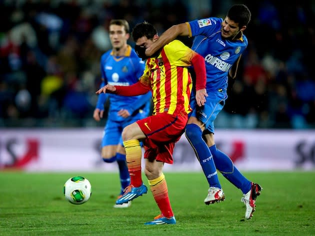

## World Cup

Stage Group
- Foi muito importante na fase de grupos, fez vários gols inclusive um golaço contra o Ira

Oitvas de final
- No mata-mata so deu uma assistência na prorrog ação contra a suica e so

### Final

Tempo regulamentar
- Higuain perdeu um gol muito facil
- Ele perdeu um gol na cara do gol

The Rip Tide
- Goetze fez um gol no ultimo minuto

Aftermath
- A argentina perdeu de 1-0 logo depois do brasil perder de 7-1
- Ele ganhou o premio de melhor jogador na copa
- Foto epica dele olhando para o taca

Similarity with Maradona
- (Note que ele perdeu a copa para a Alemanha assim como Diego) num jogo também por 1-0. 
- Com um gol também no finalzinho do jogo
- [MYTAKE] it's interesting how we need to wait in order to conclude something, many would have conclude that Messi was a fake messiah because he lost to germany, but in fact, his loss to Germany was the exact same thing of what Maradona did, so this loss in to Germany in long term would increase even more his messiah lore, but at that time it was not obvious

Impact after the final
- O ex agente dele Fabian Saldin citou uma conversa com ele "Fabi, I've been waking up at night thinking about the final in Brazil for a year, I can't sleep".

# 2014/2015

## Champions League

### Quarter finals vs PSG

Second leg
- Messi with the assist
- Suarez with a beautiful nugmet goal

### Semi finals vs Bayern Munich

Prelude
- Against Guardiola (ex Barcelona coach)
- Against Neuer (faced him in the last year's world cup final)

First leg
- 3 - 0
- "here he is again, he here is again, it' s astoninshing, absolutely world class"
- Messi with 2 goals

Second leg
- 3 - 2
- Neymar with two goals

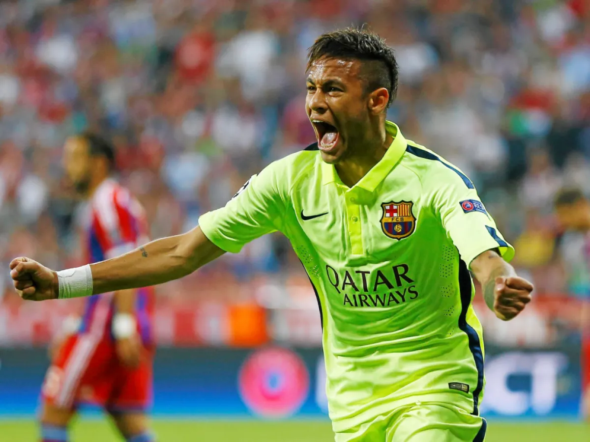

### Final vs Juventus

1- 0

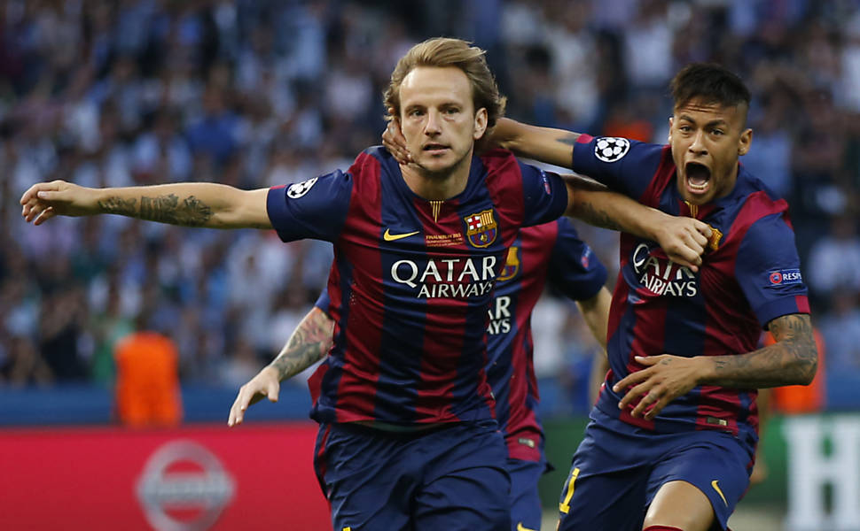

2 - 0

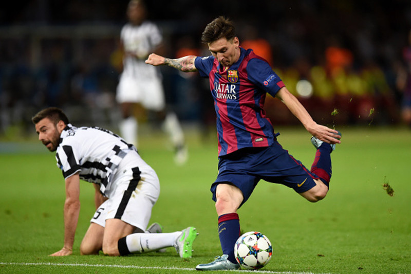

3 - 0

The only champions league win of MSN

## Copa América
No ano seguinte foi vice-campeão da Copa América de 2015 com a Argentina. Messi foi peça importante para a campanha argentina, tendo marcado um gol na estreia contra o Paraguai. Na final, os hermanos foram batidos pelo Chile nos pênaltis, onde somente Messi converteu para os argentinos. Dessa forma, o título ficou com os anfitriões do torneio

# 2015/2016

Masterpiece
- Tiki Taka contra o Roma

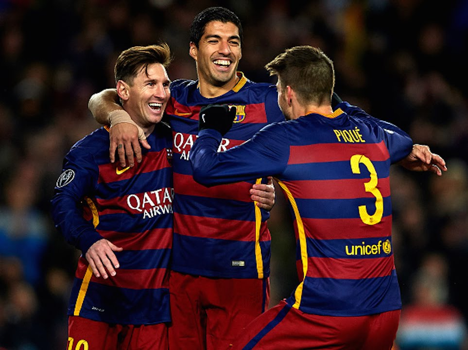

## Copa America

Prelude
- Messi let his bear grow, which felt very chad, and that he was ready to do something different for Argentina

Masterpiece vs United States

### Final

Na final da competição, assim como na edição anterior, a Argentina foi derrotada pelo Chile. Após um empate em 0-0, a equipe foi derrotada por 2–4 nos pênaltis e Messi acabou desperdiçando sua cobrança.

Aftermath
- The Argentinians turned on him, shouting in their fury that he cared more about Barcelona than he did for Argentina.
Esse foi o quarto vice-campeonato de Messi com a Seleção.

Desabafo
- "É incrível, mas não dá. Não passamos outra vez nos pênaltis. É a terceira final seguida. Nós buscamos, tentamos. É difícil, o momento é duro para qualquer análise. No vestiário pensei que acabou para mim a Seleção, não é para mim. É o que sinto agora, é uma tristeza grande que volto a sentir. Foram quatro finais, infelizmente não consegui. Era o que mais desejava. É para o bem de todos. Por mim e por todos. Muitos desejam isso. Não se conformam com chegar a final, nós também não nos conformamos. Perdemos outra vez nos pênaltis."

Mardona Comparison
- O proprio Maradona disse depois do jogo que Messi nao tinha personalidade para ser líder.
Muitas pessoas compararam Messi Maradona, chamando ele de pipoqueiro

# 2016/2017

## La Liga

Masterpiece
- Dribbled 4 players against eibar

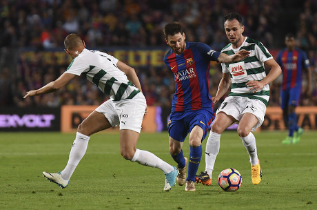

Masterpiece
- O gol antologico em que ele dribla quatro jogadores chuta e no rebote o Suarez faz o gol

Legendary El Classico
- O gol antologico no ultimo minuto contra o real Madrid, ali que eu virei fa dele

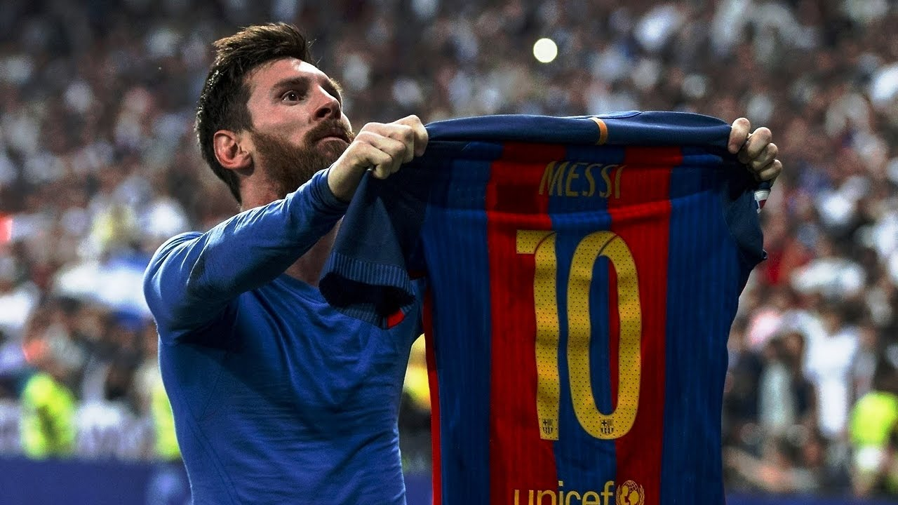

## Eliminatorias

Quando messi voltou a jogar pela argentina, a argentina estava quase sem se classificar para
A copa. Ai messi fez um hatrick contra o equador e conseguiu classificar para a copa. O ultimo gol
Ele faz perdendo o equilíbrio e fazendo um gol por cobertura

Durante essa epoca, Maradona fez um evento com Pele, e Pele perguntou o que ele achava de Messi
Ele disse "nao tiene personalidad, non tiene personalidad para ser un líder"

Mardona quote
- Maradona also said: "it is useless trying to make a man into a leader when he goes to the toilet twenty times before a match."

Assitencia incrivel na final da copa do rei

Neymar saiu no final da temporada

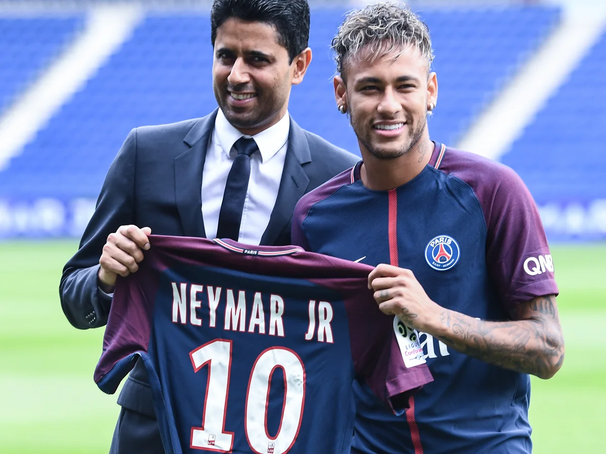

# 2017/2018

## World Cup

### Stage Group

O time era muito desorganizado, Sampaoli era um merda

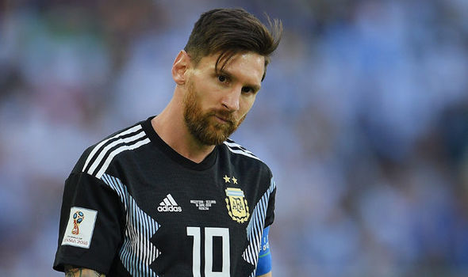

First game, Island
- O primeiro jogo foi contra a Islândia, foi um empate 1-1 onde Messi perdeu um pênalti
- Aumentando a fama dele de pipoqueiro
- Aguero fez um gol naquele jogo

  

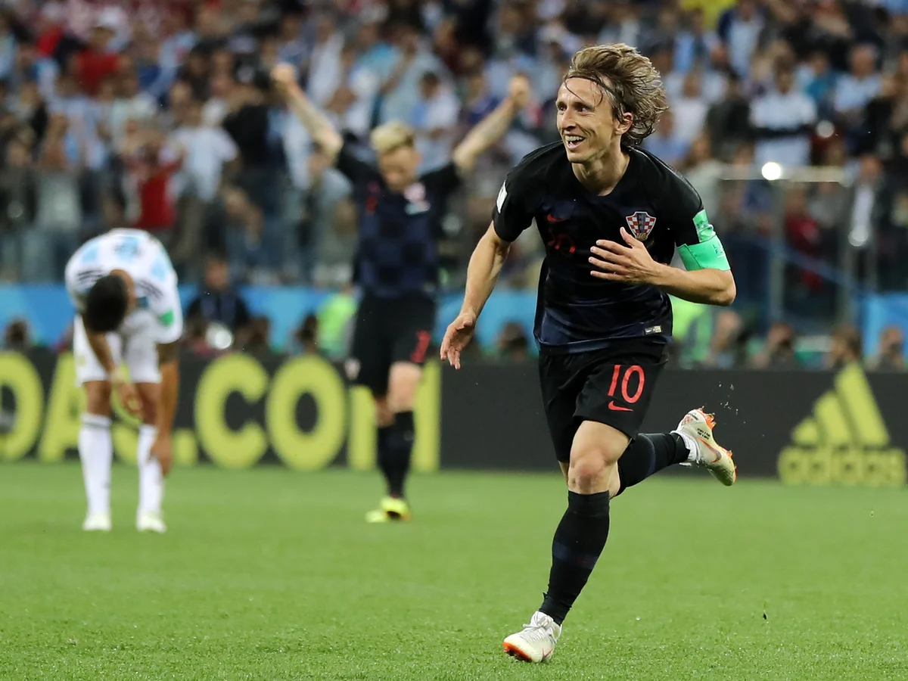

Second game, Croatia
- A argentina enfrentou a Croacia em um clima de final, porque se perdesse. Porque tinha empatado o primeiro jogo, e numa falha ridícula do Caballero
- A Argentina se fudeu
- O ultimo gol de Modric foi uma obra prima

  

Third game, Nigeria
- Na ultimo jogo da fase de grupos a Argentina enfrentou a Nigeria, precisando vencer
- O primeiro gol de Messi foi uma obra prima um dos gols que eu mais gosto
- Depois a nigeria empatou, e na raça a argentina consegui marcar um gol se passar da fase de grupos

  

### Oitvas de final vs France
- Mbappe teve a atuação da vida dele naquele jogo, no primeiro gol ele percorreu o campo todo ate
- Sofrer um penalti. Di Maria fez um Golaço e empatou, depois na cagada a argentina virou
- O sistema defensivo da argentina era muito fragil, e acabou levando mais 3 gols e perdendo por 4-3
- Depois do jogo, eu lembro do narrado falando que essa era a ultima chance do messi ganhar a copa

After math
- Lionel Scaloni pegou seu primeiro trabalho como treinador, como técnico da argentina depois da copa
- Nao parecia algo muito promissor

## Champions League

### Quarter finals vs Roma

Second leg
- 3 - 0
- very sad

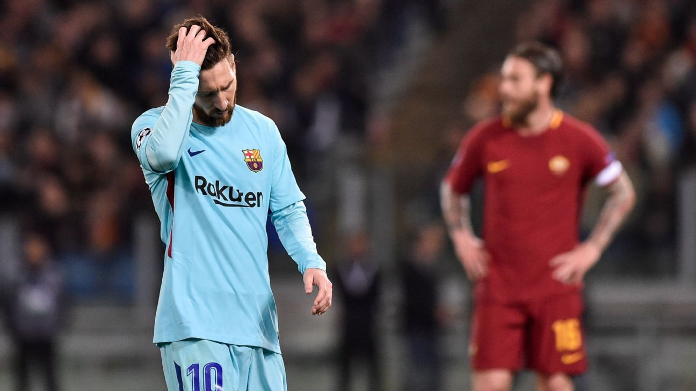

# 2018/2019

## La Liga

Messi estava muito bem no campeonato espanhol e o Barcelona era um time muito forte

Masterpiece
- outside of the box, cover goal

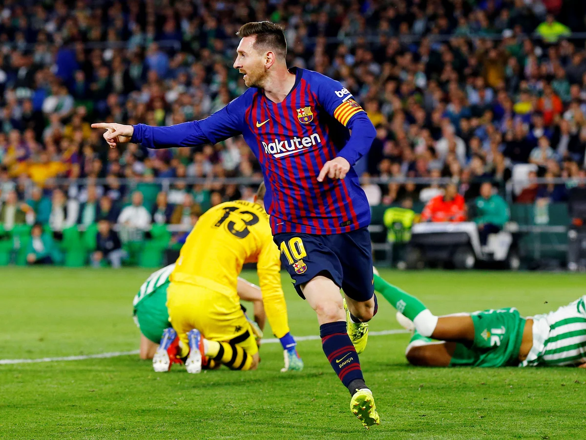

## Champions League
Na fase de grupos Messi fez vários masterclass, incluindo um Hat trick contra o Ajax com um belo
Gol de falta. Ele também fez vários gols contra o Tottenham e um gol incrível em que ele corre o campo todo.

### Oitavas de final vs Lyon 

Ele enfrentou o Lyon fazendo gols muito bonitos

### Quarter finals vs Machester United 

- Messi fez um gol belíssimo contra o Manchester United em que ele bota na saia Do Fred, e fez outro gol também naquele jogo

### Semi finals vs Liverpool

First leg
- 3 - 0
- Quando chegou nas semi finais da champions, Messi ganhou fez um partidaço contra o Liverpool
- Fazendo dois gols, onde um deles eh uma obra prima

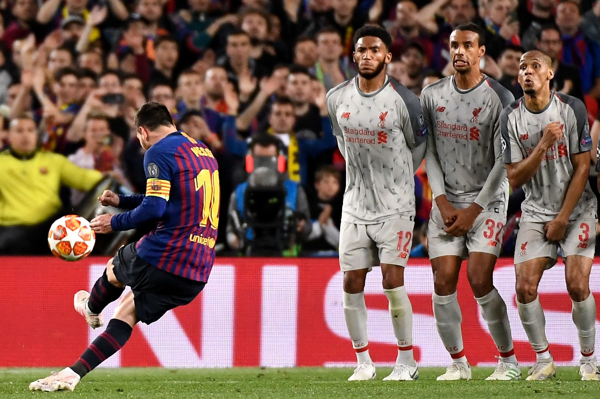

Second leg
- 4 - 0
- Mais uma vez que o Barcelona foi desqualificado tomando uma goleada fora de casa

## Copa América

Perdeu para o Brasil nas semifinais, o time levou gols por desorganização defensiva, ele inclusive
Meteu uma bola na trave. Mas eles ganharam do Chile pelo menos no terceiro lugar que ja foi melhor
do que as ultimas duas copas americas (as duas ultimas eles perderam para o Chile)

## Ballon d'or, #6

Messi surpasses Ronaldo with the most ballond d'ors

# 2019/2020

## Champions League

Prelude
- This champions happend during covid, therefore there was no home and away games. All confronts were decided in one game

## Quarter final vs Bayern Munich

Game
- 8 - 2
- It was humilating, it was definetly the end of an era for Barcelona. They have beaten Bayern in 2015, and now lost with a humilliating defeat, showing how the tables have turned
- This was the mark of the end of messi's history at barcelona
- [MYTAKE] How was he able to believe, he could still win the world cup after a loss like this is something I will never know

Aftermath
- He wanted to leave the club, but Barcelona cheated him

# 2020/2021

Still very good Messi

## Champions League

## Oitavs de final vs PSG

First Leg
- Barcelona foi eliminado da Champions contra o PSG, de Mbappe (que jogaria com ele no futuro, e tinha
Destroido a Argentina na copa passada)

Second leg
- Messi perdeu um pênalti naquele jogo aumentando. A fama de pipoqueiro

## Copa América

Messi jogou muito bem naquela Copa América fazendo muitos gols e assistências exceto pela final

### Final

Prelude
- Final no Maracana
- Argentina estava 28 anos sem ganhar um titulo (desde 1983)
- [MYTAKE] it's kinda funny how bad was the title drought for Argentina, because a copa america which is such a shitty title became the most important thing in the world

0 - 1
- Gol de Di Maria, grande falha de renan lodi

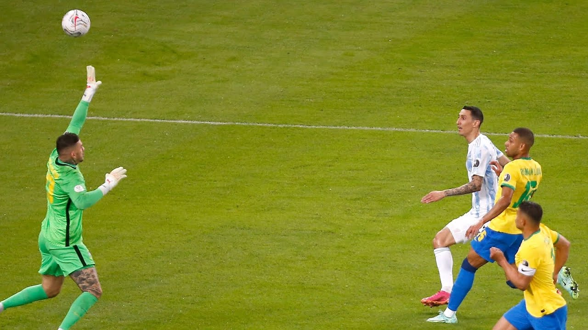

The final wissle
- Quando o juiz apitou o termino da partida, messi se ajoelhou e começou a chorar abracado pelos companheiros

Aftermath
- Essa Copa América fez com que ele ganhasse o premio de melhor do mundo de novo
- Esse titulo mudou completamente o clima da seleção albiceleste, de 28 anos de derrota para um clima esperancoso

Mbappé had said before the World Cup that South American football was not as advanced as European football

## Ballon d'or, #7

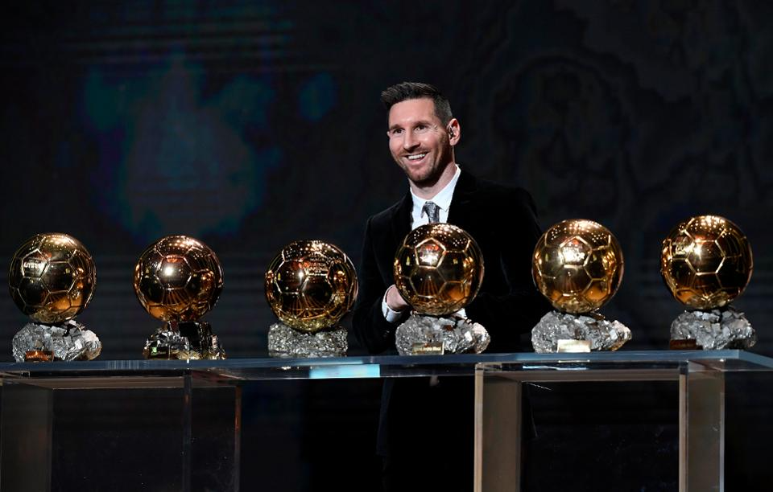

# 2021/20222

He left Barcelona to PSG
- Followed Neymar steps 4 years later
- [MYAKE] There was a lot of optimism from my part, since PSG was a really good team, they hit champions league semi finals in the previous year. Would this finally be the moment where I would be able to see Messi win a champions league?

## Champions League

PSG lost to Real Madrid, Messi missed a penalty that game
- [MYTAKE] so many years of failure how was he able to support that

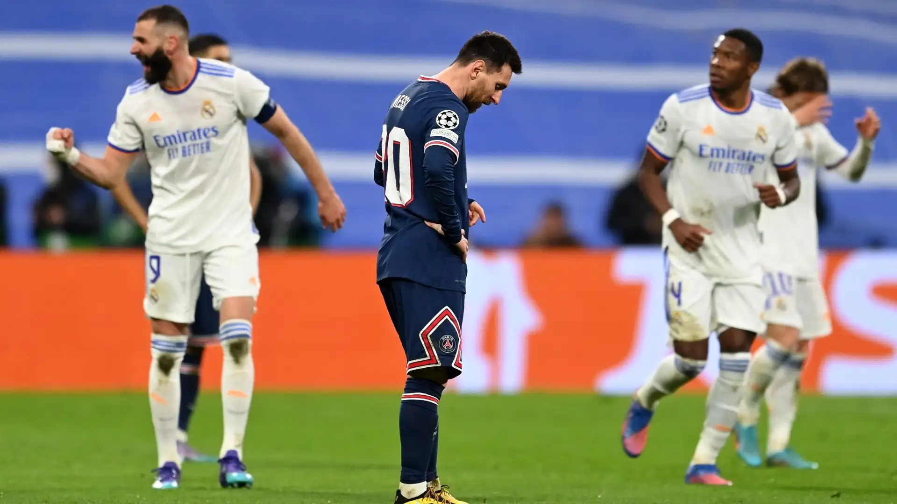

# 2022/2023

## World Cup

Prelude
- Depois de 1986 a argentina nao ganhava um titulo de copa do mundo
- Primeira copa sem o Maradona vivo
- Messi tinha 35 anos de idade
- A argentina chega a copa depois de 36 jogos invictos

### Group Stage

vs Saudi Arabia
- 0 - 1
- Perde contra a Arábia Saudita na estreia (acordei 2 horas da manha em Seattle para ver esse jogo)

vs Mexico
- 2 - 0
- O Jogo contra o Mexico fez bem difícil, a Argentina tava uma
Porcaria, mas Messi tirou um coelho da cartola.
O tecnico foi muito bem, porque ele fez duas alterações complicadas
- No time contra o Mexico, colocou Julian Alvarez (no lugar de Lautaro, o seguro melhor jogador do
Time em termos de grife, e colocou um Enzo, um cara super novo)
- Messi inclusive disse que esse foi o jogo mais difícil da copa
- [MYTAKE] it's hard to tell when Messi winning the world cup stopped being a daydreaming hobby for me, and became an event that could happen in the real world with at least let's say 10% probability

Masterpiece
- https://www.youtube.com/watch?v=zXbffJARk1Q
- - The first touch had to be very precise, with only 0.7 seconds 
- - The shot had a 1.25 degree margin

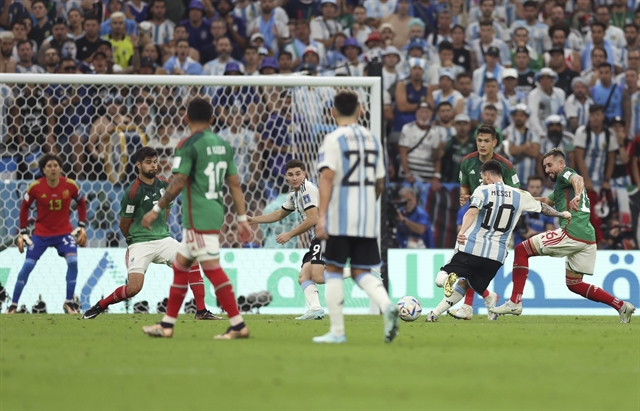

vs Poland
- Messi perde um penalti contra Polonia, depois daquilo ali eu fiquei desesperado, mas Mac Allister fez o gol da vitoria (jogo com a camisa roxa)
- Em 1978 kempes perdeu um penalti no terceitro jogo da copa, em 86 maradona perdeu um um penalti no terceitro jogo tambem
- [MYTAKE] One would shoul come up with a list with all the prophetic signs of Messi's career. I understand overfit things, but come on this is absolutely insane

### Oitavas de final vs Australia

### Quarter finals vs Holland

1 - 0
- Messi fez um passe antológico no primeiro gol
- [MYTAKE] One of my favourite Messi's career moments, he was truly divine on that goal

2 - 0
- Depois do gol de Messi de penalti
- Fez sinal de fala muito pro van gaal (técnico da Holanda que tem brigas com vários jogadores sul americanos)
- Fez a comemoração do Riquelme das orelhas

Paredes chutou a bola no banco de reserva da Holanda fazendo uma confusão

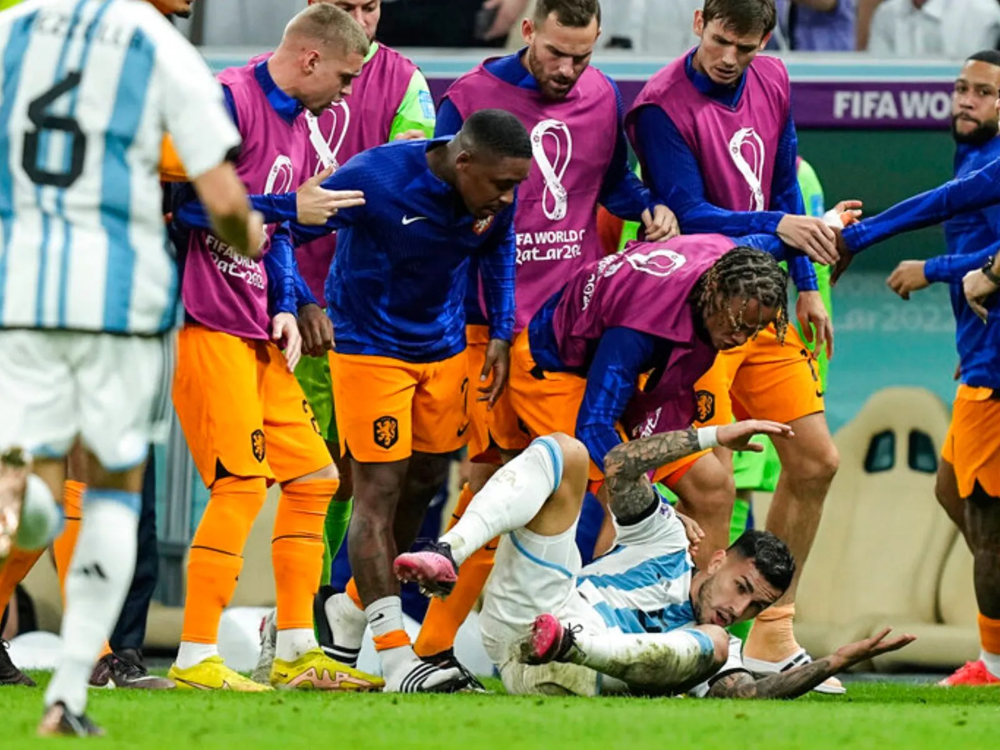

Drama
- Mas a Argentina levou o empate no ultimo minuto do tempo normal (com uma jogada ensaiada)
- Foi para os penaltis
- O time da Argentina provocou o da holanda quando eles ganharam os penaltis
- Messi falou "miras bobo" durante a entrevista pos jogo
- [MYTAKE] the "miras bobo" is epic, after decades of argentinians beign mad with Messi for his lack of "argentine behavioiur", he finally delivers a a true argentinian comment, something that Maradona would do

### Semi final vs Croatia

Prelude
- Argentina enfrentou a Croacia na semifinal. Na copa anterior a Argentina enfrentou a Croacia na fase de grupos. E perdeu por 3 a 0, dessa vez a argentina ganhou de 3 a 0. Uma vinganca simetrica
- O Brazil perdeu para Croacia nos penaltis. A argentina ganhou tranquilamente

Masterpiece
- Comparable to Maradona's goal of the century
- History doesn't repeat itself, but it often rhymes (Mark Twain)
- [MYTAKE] oh captain my captain

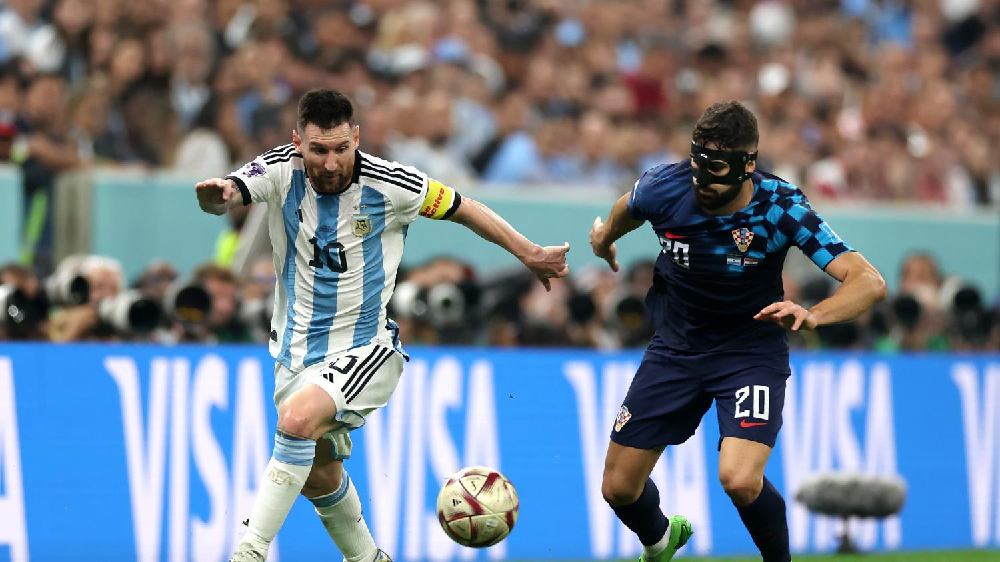

### Final vs France

Prelude
- A Argentina tinha perdido para a Franca em 2018 por 4-3 em um jogo eletrizante
- Messi se tornou o jogador com maior número de jogos em copas
- Di Maria estava machucado a copa inteira e voltou para jogar contra a Franca

1 - 0
- Di Maria sofreu o penalti
- [MYTAKE] oh captain my captain

- 2 - 0
- Contrataque belissimo do argentinao, com direito a passe dificilimo de Messi

- 2 - 1
- - penatil bobo, minha nossa senhora

- 2 - 2
- Comeca com o Messi perdendo a bola o gol da franca
- Me lembrou os fiascos anteriores de Messi no barcelona, estava se pintando um clima horrivel, apagoes assim como contra a roma e o liverpool pelo barcelona
- [MYTAKE] For me this feels like the downside of all we ever knew by the head and the heart, so much effort, years and years of wait so many lost games, 15 years of football for all to be lost due to one penalty. How could that be possible? Why would god do that to us. This is a tipping point in the history of football, will he Messi be forever remembered as the GOAT, high up there with Pele and Maradona or will he be remembered for a joke international career

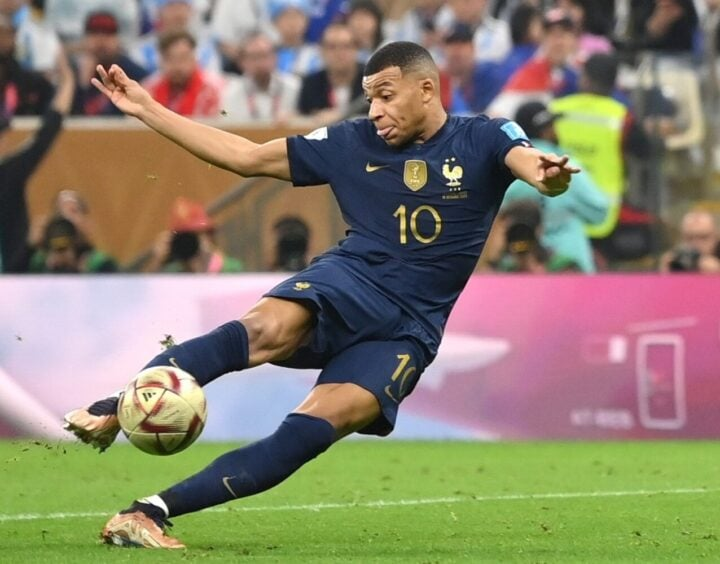

Extra time

- 3 - 2
- O terceiro gol teve um suspense porque nao sabia se a bola tinha entrado ou nao

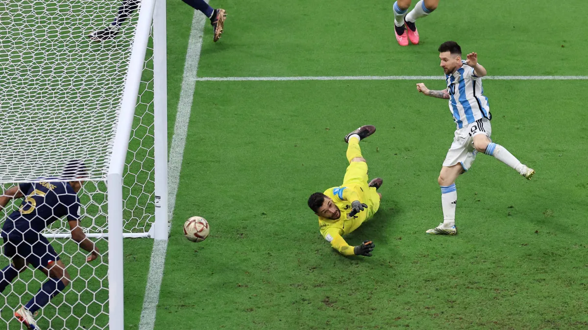

- 3 - 3
- Mbappe de novo (fez um hat-trick)
- Bruno Formiga destruiu uma parede no estudio quando mbappe empatou pela segunda vez
- [MYTAKE] KKKKKKKKKKKKKKKK it can't get more argentinian than this

Milagre
- Emiliano fez um milagre quando o jogo estava preste a acabar, e jogo foi para os penaltis
- [MYTAKE] KKKKKKKKKKKKKKKKK an unknown aston villa goalkeeper saving the GOAT's career

Penalty kicks
- Emiliano pegou um penalti
- Puede ser Hoy Abu (messi disse isso antes do gol do Montiel)
- [MYTAKE] Montiel fez o gol de penalti do titulo (ele que fez o penalti o penalti no mbappe do 3-3)
- [MYTAKE] Montiel's cry of is the perfect of representation of years of wait and expectation for this moment to happen
- [MYTAKE] It's kinda of funny because for most people on earth, this game was simply entertainement, "oh today we have the world cup final, let's take a look at it, it will be fun", whereas for me this is literally WHAT I HAVE BEEN WAITING MY WHOLE LIFE, how many times have I day dreamed about this moment, I still can't believe that this is actually happened, in the real world, how unlikely was that even to happen after the 2018 world cup, how is that possible, this is fucking crazy. How come a shitty argentinian team that two years ago was struggling at South America's "eliminatorias" with a fading Messi that no longer had power in Europe would win the World Cup, if this is not a miracle from God I have no idea what else would be

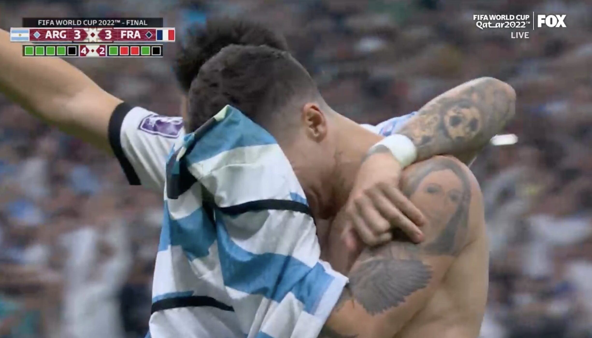

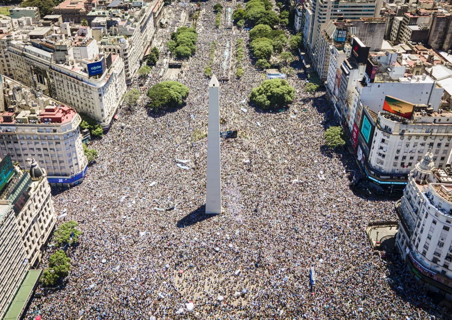

Celebration with the team
- 5 million people went to the celebration in Buenos Aires, a total of 15 million people live in Buenos Aires

Aftermath
- Maior final das copas
- Emiliano fez a sarrada no trofeu de melhor goleiro
- 1 billion people watched
- Ele consegui a foto mais curtida no instagram

## Ballon d'or, #8

A premiacao da oitava bola de ouro, foi no aniversario do maradona e ele fez uma homenagem a ele

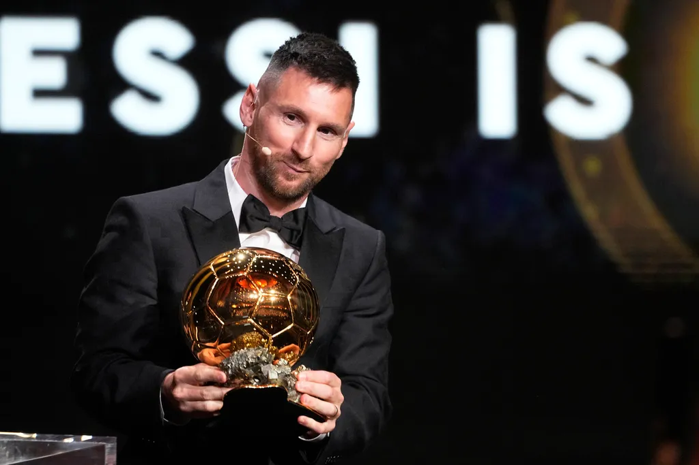

## World Cup recap
When Messi retired, dejected and heartbroken in 2016, a 15-year-old boy from San Martin tweeted to Messi, telling him that it was the Argentinian fans who had let Messi down rather than the other way around, urging him to think about staying even though they did not deserve him. “Play for fun, because when you’re having fun, you have no idea how much fun you’re making us. Thank you and forgive us,” tweeted the young boy. Little would that boy have known that six years later, he would have the pleasure of watching Messi have fun alongside him or that he, Enzo Fernández, would win the young player of the tournament award.

Eh bem loco que Messi tenha feito tanto gols de penalti nessa copa porque isso sempre foi um calcanhar de Aquiles deles especialmente em momentos decisivos

Goalkeeper lore
- A Argentina sofreu muito com goleiros ruins through the years, e Emiliano surgiu como um herói
Improvavel fazendo um excelente trabalho durante a copa, salvando a argentina algumas vezes

Mbappe lore
- Loucura que a final contra o Mbappe, quando ele eliminou Messi na copa em 2018 e na champions
Em 2021, e eles jogavam juntos no PSG

Autism
- Também uma loucura que Messi finalmente tenha conseguido se tornar um verdadeiro líder dado
Que esse sempre foi um dos principais problemas dele na seleção argentina

kkkk
- Loucura também ele ter ganho a copa do mundo o primeiro titulo importante (dele) nos últimos 7 anos justamente com
O calcanhar de Aquiles que era a seleção argentina

Parallels to Maradona
- Note que na epoca Messi jogava pelo PSG time frances, que cria um paralelo com Maradona, porque Maradona derrotou a Italia na copa de 1990 quando ele jogava na Italia
- Messi was born one year after the win of the 1986 world cup, just like the avatar

Parallels to Jesus
- Finalmente Messi (o messias) conseguiu cumprir a promessa de salvar a nação argentina. Nacao da qual Maradona (Deus) foi o fundador

# 2024

He moved to Inter Miami
o time era o pior colocado e desde que ele chegou o time ganhou uma copa, e chegou na final em outra, mas
perdeu porque messi se machucou, se eu nao me engano acho que ele perdeu so um jogo jogando como titular

David Beckham era dono do Inter miami

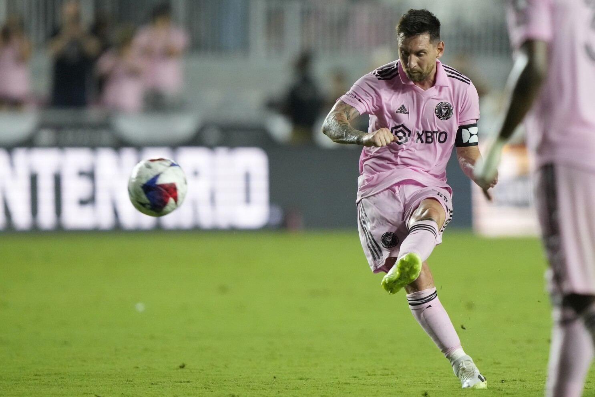

# Videos

https://www.youtube.com/watch?v=1nbavGjEtIM&t=65s
Mauro Cezar sobre Messi quando ele ganhou a copa

Ronaldinho e Messi
https://www.youtube.com/watch?v=GA2z49VWR6U&t=324s

Bruno Formiga depois da copa
https://www.youtube.com/watch?v=TtQfaMBCI1o&t=1078s

# My favourite things of Messi

1) arquetipo do genio

2) sindrome de Shinji

3) arquétipo do filho que nao consegue suceder o pai

4) torcedores da argentina são loucos (Boca Juniors são os terceiros fas mais loucos e os Newell's Old Boys eram o sétimo)

5) ele conseguiu virar um líder e ganhar uma copa aos 35 anos, muito improvável que ele conseguisse tao velho

6) Ele perdeu infinitos títulos pela selecto argentina