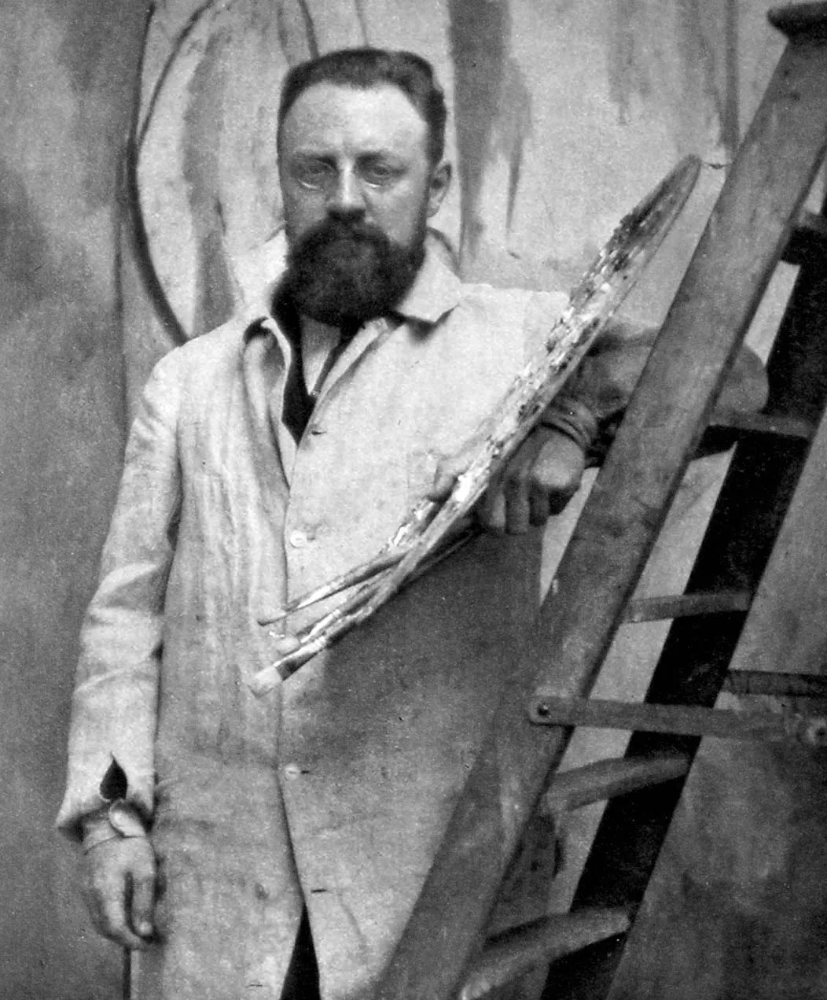
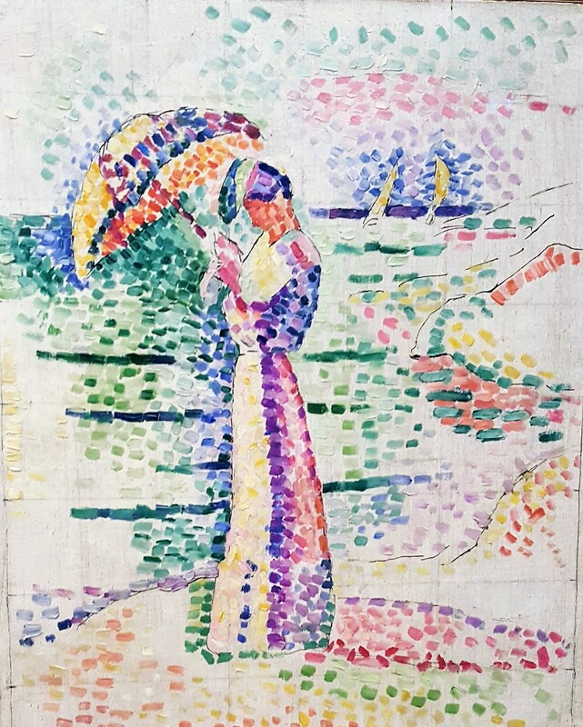
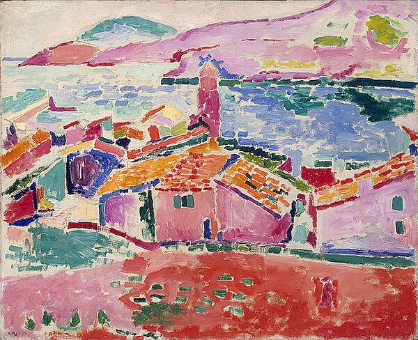
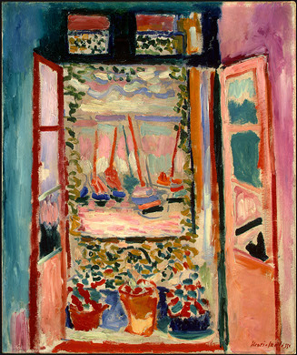
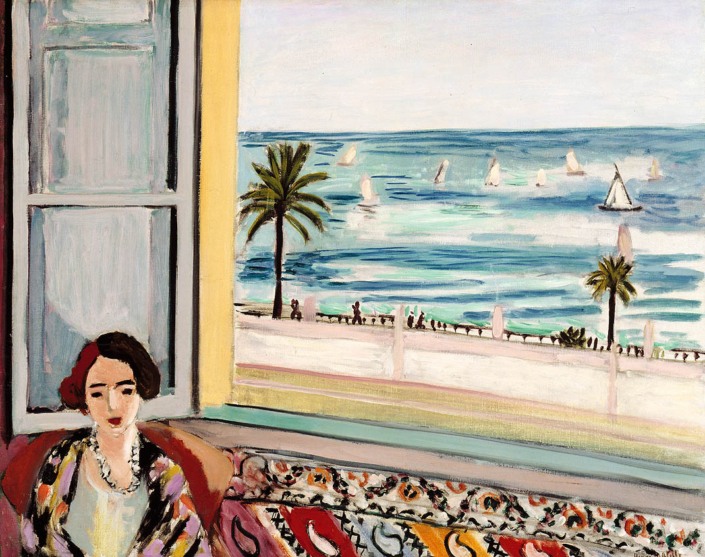
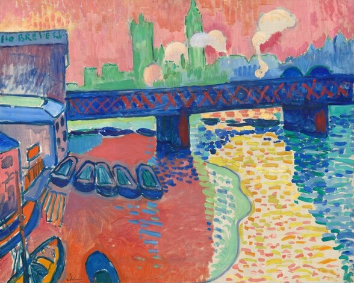
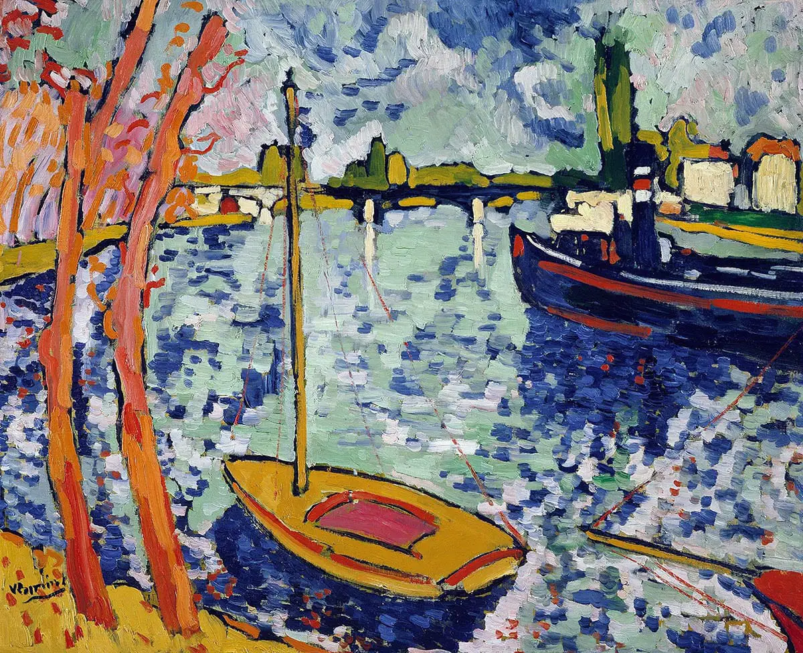

---

title: Painting/Fauvism
order: 5
description: Very nice as well
---

# History

Origin
- Fauvism vem de fauves - fera
- Foundation on the Salon 1905
- The name originated from a remark of the French art critic Louis Vauxcelles at the Salon of 1905; coming across a quattrocento-style statue in the midst of works by Matisse and his associates, he is reputed to have said, 'Donatello au milieu des fauves! ' ('Donatello among the wild beasts').

# Characteristics

IMPORTANT - IT'S PART OF EXPRESSIONISM

1. Impulsive lines
2. Simplifixed drawing
3. Vibrant colours

Why I like it
- I gives a playful vibe because of the diversity of colours, it incites in me something imaginative
- It is as if it is okay and even respectable to be "childish"

# Matisse

Observation
- His most important paintings

The woman with umbrella
- Located at metropolitan
- Museu Mattise, Nice Franc
- He painted this when he was Collioure in a vacation with his family
- Matisse said later he was tired about the tirany of the pointilhado style
- 1905, very beginning of the fauvism
- "a tela eh quase um efeito de luz intensa que irradia em uma onda de cores
projetada da figura neoimpressnista da mulher"

View of Collioure
- Museum Hermitage (Russia)
- "Tive a sensacao da tonalidade de uma cor. Entao, estendia a primeira cor,
acrescentava uma segunda e, depois se me parecia nao concordar com a primeira,
no lugar de corrigi-la, aplicava uma terceira, que tinh aa capacidade da harmoniza-las,
ate a harmonia final"
- "Abandonada a impressao - o motivo, o tom local - o que passa a guiar a obra eh unica
e exclusivamente uma busca pela harmonia na expressao. Dessa forma, as cores abitrarias
(rosas no releveols, lilas nas paredes) sao justapostas a cores naturlistas (o azul no mar)
e verossimeis (o laranja nas telhas)
- "as cores se tornam um veiculo expressov priveligado e o caminho em direcao a abstracao"

The open window
- National Gallery of Washington (DC)
- For him the windows were like an escape of a prison, so he very commonly used window
in his painting

Seated woman back turned to the open window
- Musée des beaux-arts de Montréal
- Reminds me of Recife

# André Derain

Charing Cross Bridge, London
- Same name as the Monet series
- National Gallery of art
- There is part in Moma

# Maurice Vlamik

The River Seine at Chatou
- Very strong impasto, reminds me of Van Gogh
- Metropolitan museum

