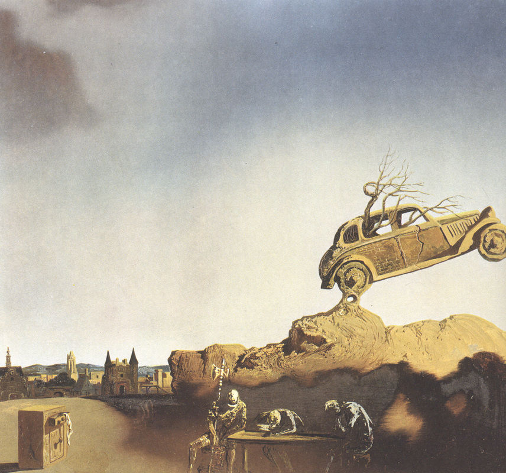
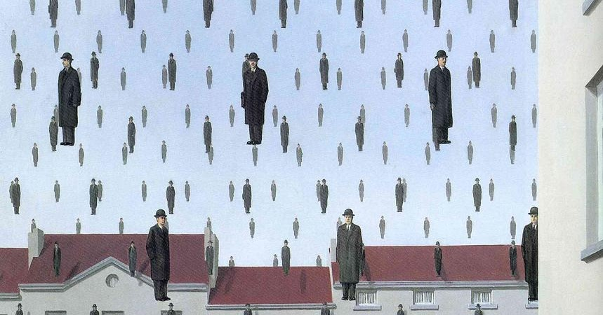
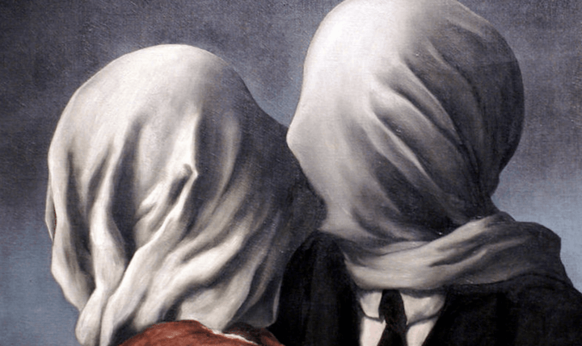
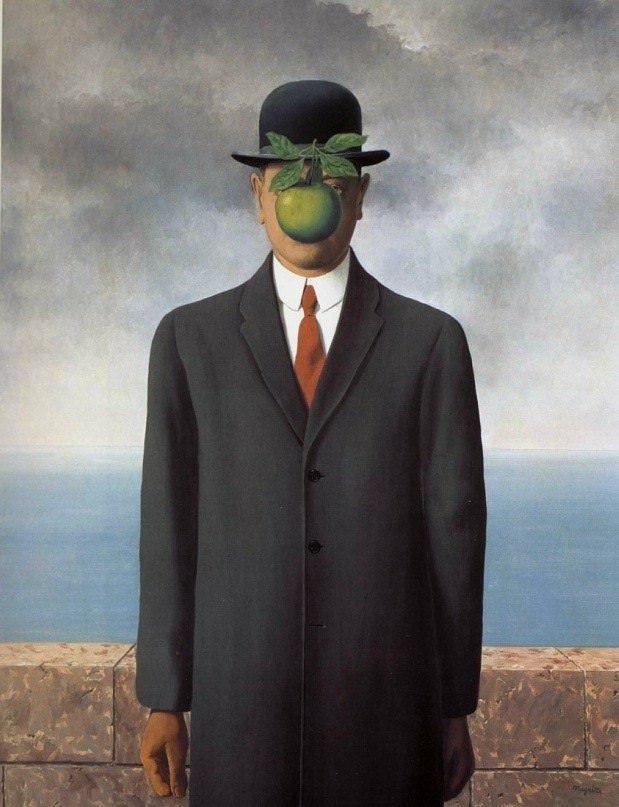

# History

Charateristics
1. Bizzarre
2. Alucinatory
3. The fruits of human imagination freed from the task of imitating nature

Pintor de imagens insólitas, às quais deu tratamento rigorosamente realista, utilizou-se de processos ilusionistas, sempre à procura do contraste entre o tratamento realista dos objetos e a atmosfera irreal dos conjuntos.

## Salvador dali

Apparation Of The Town Of Delft
- 

## Magritte

Prelude
- However, Magritte himself did not like the interpretations of his work, he used to say he was not a painter but a man who communicated his thought by painting
- He is Belgian

Golconda
- Magritte tinha espírito travesso, e em 'A queda', os seus bizarros homens de chapéu-coco despencam do céu absolutamente serenos, expressando algo da vida como conhecemos
- It is as if there is something very out of place with normality, that they themselves don't see that's why I love this painting
- A sua arte, pintada com tal nitidez que parece muitíssimo realista, caracteriza o amor surrealista aos paradoxos visuais: embora as coisas possam dar a impressão de serem normais, existem anomalias por toda a parte: A Queda tem uma estranha exatidão, e o surrealismo atrai justamente porque explora a nossa compreensão oculta da esquisitice terrena
- It is housed at the Menil Collection in Houston, Texas

The Lovers
- When he was 14, he witnessed the body of his mother being taken out of the Sambre river, with her wet nightgown wrapped around her face. Some have speculated that the trauma of his mother's suicide inspired a series of works in which he obscured his subjects’ faces, but there's no evidence of this being true
- Others have interpreted it as a depiction of the inability to fully know our intimate companions, as we cannot unveil them completely
- I personally like the fact that he wears a suit, it feels like since they have a role in society they can't show their true selves anymore

The Princes of autumn
- I like this one because it has a very dream like experience, the color of the sky and the ground seem like a different planet, but the tree looks like a plant earth, it feels like a trip to my subconscious

The Son of a man
- At least it hides the face partly well, so you have the apparent face, the apple, hiding the visible but hidden, the face of the person. It's something that happens constantly. Everything we see hides another thing, we always want to see what is hidden by what we see. There is an interest in that which is hidden and which the visible does not show us. This interest can take the form of a quite intense feeling, a sort of conflict, one might say, between the visible that is hidden and the visible that is present

