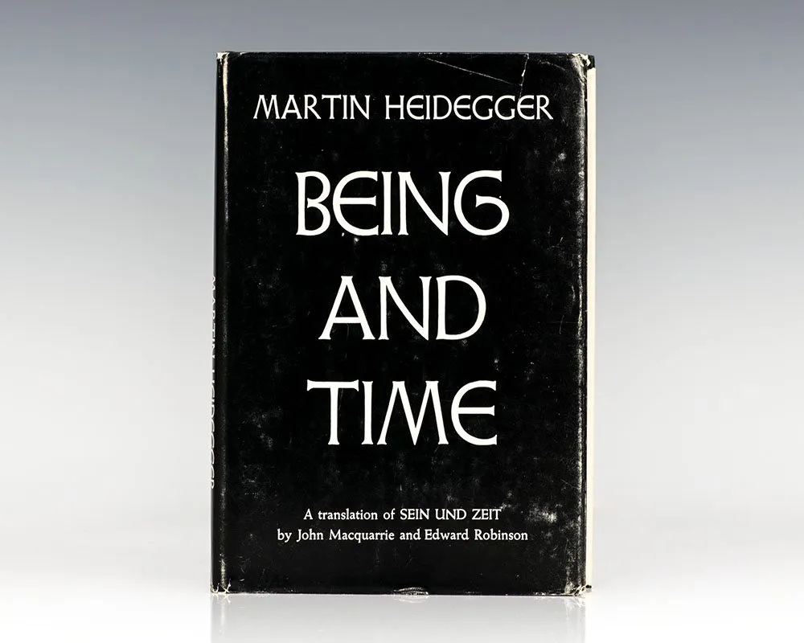

# Resources

- [Heideggerian Terminology - Wikipedia](https://en.wikipedia.org/wiki/Heideggerian_terminology)

---

# Key Concepts and Notes

## **Ente** and **Ser**
- Something can be both "ente" (concretely existing) and "ser" (yet to be defined, with multiple possible "ente"s).

---

# **Kinds of Being**

## **Ready-to-hand (Zuhandenheit)**
- Describes how we interact with things in everyday life, focusing on their practical utility and how they facilitate our actions.

## **Present-at-hand (Vorhandenheit)**
- Refers to how things appear when they are not immediately useful, but instead exist as objects with specific properties.

## **Dasein**
---

# **Dasein**

## Revitalizing the Question of Being
- Dasein seeks to understand what it means *to be*.

## Characteristics of Being
1. **Being-in-the-world**  
     - Involves space and time.
2. **Being-toward-death**  
     - Mortality drives action; without it, time would feel infinite.

## Dasein and Possibilities
- Dasein always understands itself in terms of possibilities.  
- It can either follow "The They" self or strive for a more authentic understanding.

## Essence of Dasein
- Dasein is not static; it changes constantly, much like the atoms and cells that make up our bodies.
---

# **Being-in-the-world**

## **DEFINITION**

IMPORTANT DEFINITION OF WORLD
- network of meaningful involvement
- [MYTAKE] I think it's very interesting, because for example in Vancouver my friends and I have a very similar existence because we live in the same world, the same spatial world, same meaning for same the same things: panaroma ridge, visa, same sorge (concern) team onboarding, learning Azure, and same meaning for the same things in general
- [MYTAKE] I love how phenomenologist and subjective Heidegger's understanding is for, it is as if his vision of world is completely real and personal
- [MYTAKE] I think one of the reasons why spouses are so similar is that they share so much of the same world

Parts of the world
- Referential Totality (Verweisungszusammenhang)
- - The world is made up of things that refer to one another in a network of practical relations
- Significance (Bedeutsamkeit)
- Concern (Besorgen)
- - - Producing, attending, making use of, letting go, accomplishing, interrogating, considering, and discussing.
- Publicness / The “They” (das Man)
- Mood or Attunement (Befindlichkeit)
- - We are always already in a mood or emotional tone before thinking or acting.  
    - Examples: waking up anxious, feeling awkward in a room, or being thrown into grief.  
- These moods reveal how we are situated in the world.
- Thrownness (Geworfenheit)
- Projection (Entwurf)
- Discourse and language
- - Heidegger emphasizes the power of language:
    - “Man acts as though he were the shaper and master of language, while in fact language remains the master of man.”

| **Heidegger’s World**  | **Is...**                                               | **Is Not...**                                  |
| ---------------------- | ------------------------------------------------------- | ---------------------------------------------- |
| A web of significance  | Where entities show up as useful, threatening, relevant | A set of physical locations or objective facts |
| Structured by care     | Shaped by our goals, emotions, and mortality            | Independent of human involvement               |
| Contextual and dynamic | Formed through action and breakdown                     | Static or universal                            |

Example 3: Losing a Job.
When someone loses their job, they don’t just lose income—they may feel like their world collapses:

Social roles,

Daily routines,

Future projects,

Sense of purpose.

# Everydayness

## Verfallen

| **Aspect**                               | **Description**                                                           |
| ---------------------------------------- | ------------------------------------------------------------------------- |
| **Absorption in the "they"** (*das Man*) | Living according to what “one does” or “people say.”                      |
| **Idle Talk** (*Gerede*)                 | Speaking in clichés, unexamined opinions, or gossip.                      |
| **Curiosity** (*Neugier*)                | Restless seeking of novelty without depth—e.g. compulsive news-scrolling. |
| **Ambiguity** (*Zweideutigkeit*)         | Lack of clarity—everything seems understood, but nothing really is.       |

# Authenticity

# 🧠 20 Key Concepts in Heidegger's Philosophy

## 1. **Being (Sein)**
The central philosophical question: what does it mean *to be*?

## 2. **Dasein**
Human existence; literally “being-there.” The being that asks about being.

## 3. **Being-in-the-world**
Dasein is always already embedded in a meaningful world — never isolated.

## 4. **Thrownness (Geworfenheit)**
We are “thrown” into a world not of our choosing (language, culture, history).

## 5. **Disposition / Disposedness (Befindlichkeit)**
We are always in some mood or attunement that reveals our world.

## 6. **Understanding (Verstehen)**
We always interpret the world in terms of possibilities for action.

## 7. **Care (Sorge)**
Dasein is defined by care — concern for the world, others, and itself.

## 8. **The They (Das Man)**
The anonymous “they” who dictate norms — how people usually live.

## 9. **Falling (Verfallen)**
Our tendency to drift into distraction, gossip, and conformity.

## 10. **Authenticity (Eigentlichkeit)**
Owning one’s life, choices, and death — living true to oneself.

## 11. **Inauthenticity**
Living passively or in denial, absorbed in social norms.

## 12. **Being-toward-death**
Awareness of our mortality as a key to authentic existence.

## 13. **Temporality (Zeitlichkeit)**
Time is not linear — it’s the horizon through which we exist.

## 14. **Existential vs. Existentiell**
Existential = structures of being; existentiell = content of life.

## 15. **Worldhood**
The meaningful structure of the world we inhabit.

## 16. **Equipment (Zeug)**
We engage with things as tools in use, not just objects.

## 17. **Ready-to-hand (Zuhandenheit)**
How tools show up in smooth, everyday use.

## 18. **Present-at-hand (Vorhandenheit)**
How things appear when broken or theorized — objectified.

## 19. **Clearing (Lichtung)**
A metaphor for the openness where being can be revealed.

## 20. **Language as the House of Being**
Later Heidegger: language is not a tool — it *reveals* being.
