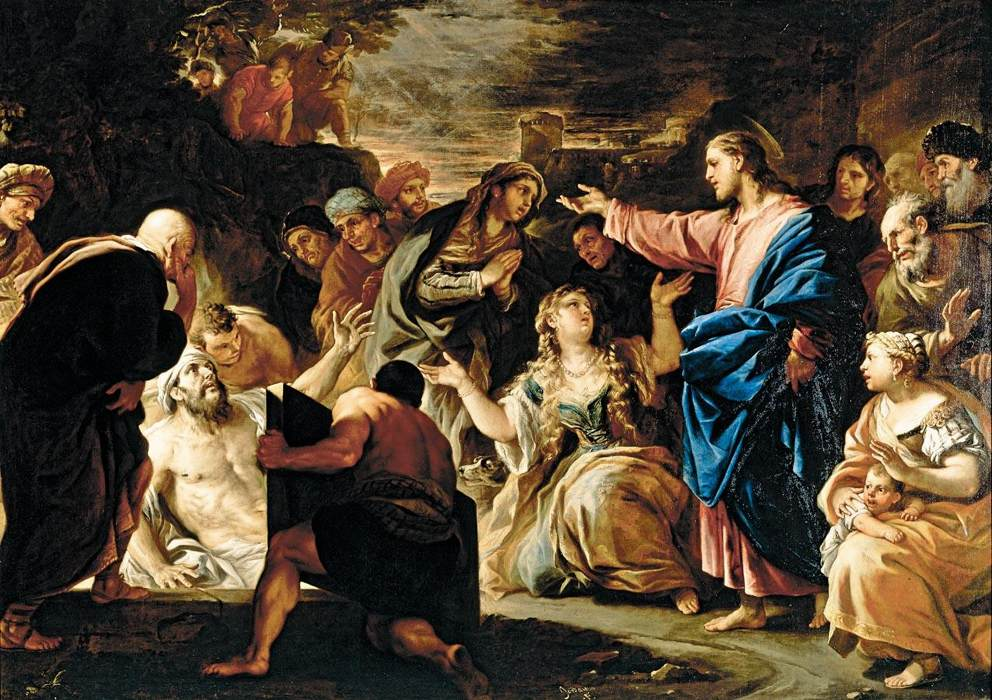

# When people ask me about it

1. What is self
2. What is despair
3. Types of despair

# Sickness unto death

## Chapter 1

The self
- In Kierkegaard's philosophy, the self is a synthesis between the finite and the infinite. The temporal and the eternal

Understanding despair
- despair emerges between when there is a imbalance in the synthesis of finite and infinite aspects of the self
- for example overemphasis on social roles, physical needs, On the other hand overemphasis on abstract ideals, and eternal truths can also lead to despair
- - this resonates a lot with me, since I am constantly running away from the real world
- it's basically not being oneself (which is hard to compreheend)

# Chapter 2

Self-realization
- aka getting rid of despair, requires the person to achieve a balance between the infinite and finite aspects of the 
- Similar to the hegelian dialectic, this process doesn't happen at once. In fact it requires constant effort to achieve this wholeness, which is the equilibrium between those two forces

# Chapter 3 (despair types)

## Unconsciouness despair
- the individual is in despair without realizing
- this is due to lack of self awareness
- they are not aware that they are far awaZy from the real meaning of life which is the combination of the soul and the body

## Conscious despair

It's important that the same person can be suffering both types of despair at once, which is very important.

despair of the weakness
- "not willing to be oneself"
- unable to reconcile their inner infinite potential to the finite reality of their existence
- this resonates with myself and lack of skill with girls

despair of defiance
- are aware of their inner infinite potential but are not willing to accept the limitations of the finite nature
- for Kierkegaard, people on this type of despair are 
- this resonates with myself when I thought I could just do my own thing, and become a GOD, and not having to program at all
- IMPORTANT: that's exactly me: Conversely, the despair of defiance can be illustrated through the figure of a person who rejects all given frameworks - be they moral, social, or religious - in a bid to establish their own identity entirely from withing theselves. This persona challenges traditional values and refuses to acknowledge any depenence on the eternal or the divine, striving instead for an absolute self-sufficiency that leads to isolation and, paradoxically a profound sense of emptiness

# Chapter 4

Faith
- For Kierkegaard faith is not about an intellectual assent to certain religious doctrines but a passionate commitment to God. This commitment involves a profound leap beyond rational evidence and wordly assurances, oftehn referred to as the "leap of faifth

Relationship between self and divine
- despair is basically a misllaginment or not being able to be oneself, which is fundamentally a relationship with GOD, since he is the one that defined what your "self" is
- Kierkegaard argues that secular approaches to dealing with despair are fundamentally flaowed because they fail to address the spiritual dimension of the human condition
- For Kierkegaard, no amount of human effort can truly overcome despair; it requires divine intervention and the individual's willinginess to trust in that divine power
- IMPORTANT: For Kierkegaard, the person must confront the despair head-on and use it as a catalyst to reach out the divine
- IMPORTANT: The faigth siginfies a radicaul trust in God which reorients the self towards its true nature and purpose. By embracing faifth, an individual not only finds a resolution to despair but also discovers a deeper and more meaningful existence

# Chapter 5 (The Dialectical Process of Despair and Faifth)

Confronting despair
- Kierkegaard descibes this moment as the existenail crossroads where one faces the ultimate anxiety of whether to continue living in a state of despair or to take what he terms the "leap of faifth". This leap sifinies movement away from self-reliance towards a reliance on something greater, namely, the divine
- Faifth, in Kierkegaard's view, is not a passive acceptance but an active commimtment that trascneds raiontally. It involves embracin the pradoex of existence and the limitations of human understanding

# Chapter 6 (Practical Implications - Living authentically in the face of Despair)

1. Develop a higher self-awareness that allows ones to recognize and confront their own despair. This involves an honest assessment of one's internal conflicats and struggles, understaind that despair, at is core, is tied to one's relationship with the self
2. Living authentically means making choices that align with one's true nature and valuess, rather thatn succumbing to societal pressures/ external expectations or running away from its finite componets
3. By recognizing and addressing despair with authenticity and faith, one can navigate existential crises and lead a life imbued with purpose and meaning

