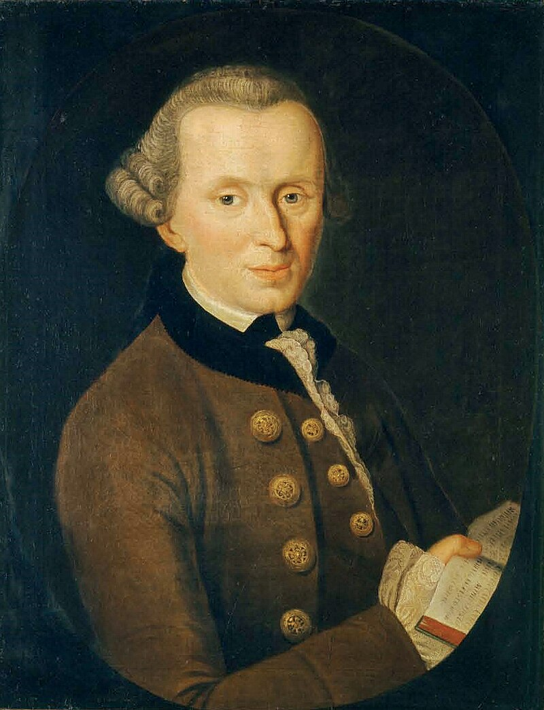
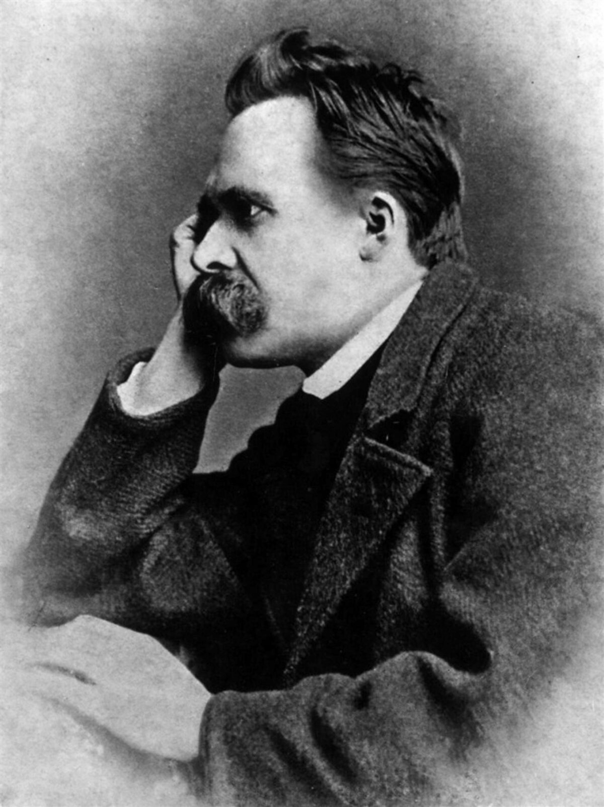
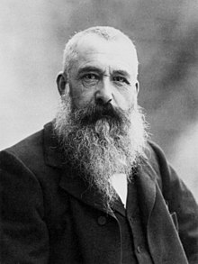
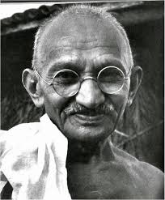
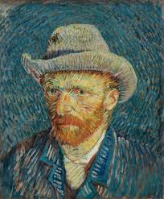
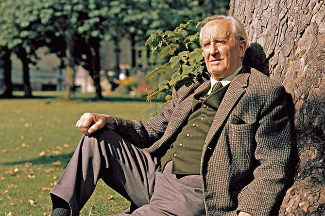
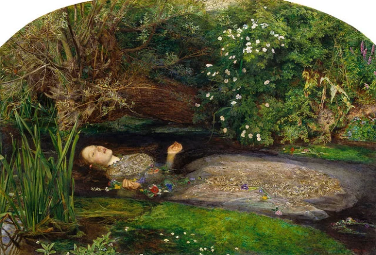

DISCLAIMER: THIS IS CONSIDERED PSEUDOSCIENCE

# Components

E,I - External vs Internal

S,N - Sensors, Intuitives (racionalist vs empricist)

T,F - Thinking, Feeling

J,P - Judging, Perceiving

# Statistics

Among men, ISTJ is most common (16%) [USA]

About 19% of women in the US are ISFJs [USA]

## My theories

According to MBTI-ninja.com, 45.5% of the population are Sentinels
- Due to evolution, most people became sentinels for survivial. Judging and sensing are very useful traits otherwise you can die very easily at the Stone-Age

Most Villans are INTJ
- I think 'I' makes sense, because extroversion is associated with sociability, and therefore good character, because in some sense being good is about being functional in society after all. 'N' also makes sense because most villans need to create diabolic plans. 'T' also make sense because if the more rational you are the more selfish you will be, and 'J' I am not sure, maybe a villan also needs to execute plans.

# Analysts (IT)

## Architect (INTJ)

Qualities
- Rational – People with the INTJ personality type (Architects) pride themselves on the power of their mind. They can reframe nearly any challenge as an opportunity to hone their rational thinking skills and expand their knowledge – and with this mindset, they can devise inventive solutions to even the most arduous of problems.
- Informed – Few personality types are as devoted as INTJs to developing rational, correct, and evidence-based opinions. Rather than hunches or half-baked assumptions, they base their conclusions on research and analysis. This gives them the conviction that they need to stand up for their ideas, even in the face of disagreement.
- Independent – For people with this personality type, conformity is more or less synonymous with mediocrity. - - - - Creative and self-motivated, INTJs strive to do things their own way. They can imagine few things more frustrating than allowing arbitrary rules or conventions to stand in the way of their success. Moreover, they are happy to make decisions without outside input or opinions. These individuals prefer to take matters into their own hands.
- Determined – This personality type is known for being ambitious and goal-oriented. INTJs won’t rest until they’ve achieved their own definition of success – which usually entails mastering the subjects and pursuits that matter to them. They are not known for taking the easy way out. They feel that the only way to achieve greatness is to face challenges head on.
- Curious – INTJs are open to new ideas – as long as those ideas are rational and evidence based, that is. Skeptical by nature, people with this personality type are especially drawn to offbeat or contrarian points of view. And if the facts prove them wrong, these types are generally happy to revise their opinions.
- Original – Without INTJs, the world would be a far less interesting place. This personality type’s rebellious streak is responsible for some of history’s most unconventional ideas and inventions. Even in their everyday lives, these personalities force the people around them to consider new (and sometimes surprising) ways of looking at things

Weakness
- Arrogant – INTJs might be knowledgeable, but they’re not infallible. Their self-assurance can blind them to useful input from other people – especially anyone they deem to be intellectually inferior. These personalities can also come across as needlessly harsh or single-minded in trying to prove others wrong.
- Dismissive of Emotions – For this type, rationality is king. But emotional context often matters more than people with this personality type care to admit. INTJs can get impatient with anyone who seems to value feelings more than facts. Unfortunately, ignoring emotion is its own type of bias – one that can cloud this personality type’s judgment.
- Overly Critical – These personalities tend to have a great deal of self-control, particularly when it comes to thoughts and feelings. When the people in their lives fail to match their level of restraint, INTJs can appear scathingly critical. But this criticism can be unfair – based on arbitrary standards rather than a full understanding of human nature.
- Combative – People with this personality type hate blindly following anything without understanding why. This includes restrictions and the authority figures who impose them. INTJs can get caught up in arguing about useless rules and regulations – but sometimes these battles are distractions from more important matters.
- Socially Clueless – INTJs’ relentless rationality can lead to frustration in their social lives. Their efforts to defy expectations may leave them feeling isolated or disconnected from other people. At times, these personalities may become cynical about the value of relationships altogether, questioning the importance of love and connection.

- Interesting because most villans are INTJ, whereas the heroes are ENFP, but that is the opposite for the batman.

## Logician (INTP)

Qualities
- Analytical – People with the INTP personality type (Logicians) analyze everything that they come across. This gives them a knack for spotting unexpected patterns and connections that other personalities might overlook.
- Original – Thanks to their unrelenting imagination, these personalities can come up with creative, counterintuitive ideas that wouldn’t occur to most people. Not all of these ideas are feasible, of course, but INTPs’ willingness to think outside the box can produce remarkable innovations.
- Open-Minded – INTPs are driven by curiosity and an intense desire to learn. As they learn, they’re rarely afraid to shift their perspective – even in matters of politics, religion, and philosophy. People with this personality type tend to be receptive to new ideas, as long as those ideas are something that they connect with on an intellectual level.
- Curious – These personalities are always casting about for new things to learn about. One week, they might be obsessed with geophysics, and the next, they might lose themselves in videos about guitar building. When inspiration strikes, INTPs go all in on their newfound interest, learning everything that they can.
- Honest – INTPs care about the truth. Rather than taking comfort in ideology or received ideas, they want to understand what’s really going on beneath the surface of things. As a result, they can be relied upon to combat bias and misinformation even when it isn’t easy to do so – and they expect other people to be honest with them in return.

Weakness
- Disconnected – INTP personalities can get lost in their own train of thought even when they’re with other people. After finally resurfacing with something to say, they may find that the conversation has moved on without them. This can cause people with this personality type to feel disconnected from others, especially in large social gatherings.
- Insensitive – INTPs see rationality as the key to a better, happier world. At times, they may underestimate the importance of such irrational values as emotion, compassion, etiquette, and tradition. As a result, these personalities may inadvertently come across as insensitive or unkind even though their intentions are generally good.
- Dissatisfied – People with this personality type can’t help but imagine how things could be better than they already are. INTPs are constantly on the lookout for problems to solve, topics to learn, and new ways to approach things. Taken too far, this mindset can become overwhelming, with these personalities constantly trying to reinvent the wheel rather than reliably addressing their needs and responsibilities.
- Overthinkers – INTPs’ minds are ceaselessly active, toiling away even when they’re not consciously thinking. While their rapid-fire thoughts can be beneficial at times, they can also cause them to overthink and fall prey to analysis paralysis. When this occurs, INTPs can struggle to reach a decision or take action because they’re too caught up in considering every possible outcome or angle.
- Impatient – INTP personalities take pride in their knowledge and in sharing their ideas. When it comes to explaining their rationale, however, they aren’t always patient. If their conversation partner doesn’t follow along or seem sufficiently interested, they may give up with a dismissive “never mind.”

- Woody Allen is very P, he always looking for something, even when there are topics that have a definte answer such as no clear meaning of life, he keeps thinking about this subject endlessly. In fact Woody shows why being perspective can be bad, because it can make you run in circles.

## Commander (ENTJ)

Qualities
- Efficient – People with the ENTJ personality type (Commanders) see inefficiency not just as a problem in its own right but as something that pulls time and energy away from all their future goals, an elaborate sabotage consisting of irrationality and laziness. They will root out such behavior wherever they go.
- Energetic – ENTJ personalities approach their responsibilities with vigor and drive. This is not a type to shy away from busy schedules or complex challenges. In fact, the more they are able to accomplish throughout the day, the more energized they feel, and they will happily share this infectious enthusiasm for productivity with the people around them.
- Self-Confident – ENTJs generally make their opinions known, trust in their abilities to get things done, and believe in their capacities as leaders. They are the most likely personality type to say they feel confident facing life’s day-to-day challenges.
- Strong-Willed – People with the ENTJ personality type don’t give up when the going gets tough. Instead, they relentlessly strive to achieve their goals. Nothing is quite as satisfying to them as accomplishing something that they’ve set their mind to.
- Strategic Thinkers – ENTJ personalities exemplify the difference between moment-to-moment crisis management and navigating the challenges and steps of a bigger plan. They are known for examining every angle of a problem and not just resolving momentary issues but moving the whole project forward with their solutions.
- Charismatic and Inspiring – All of the strengths listed above combine to create individuals who are able to inspire and invigorate others, and this in turn helps ENTJs to accomplish their most ambitious goals, which could never be finished alone.

Weakness
- Stubborn and Dominant – Sometimes all this confidence and willpower can go too far. ENTJ personalities are all too capable of digging in their heels, trying to win every single debate, and only pushing for their vision without considering the input of others.
- Intolerant – “It’s my way or the highway” – People with the ENTJ personality type are notoriously unsupportive of ideas that distract from their primary goals and even more so of ideas based on emotional considerations. They won’t hesitate to make that fact clear to those around them.
- Impatient – Some people need more time to think than others – an intolerable delay to quick-thinking ENTJ personalities. They may misinterpret contemplation as stupidity or disinterest in their haste – a terrible mistake to make.
- Arrogant – ENTJs respect quick thoughts and firm convictions and may look down on those who don’t match up. This is a challenge for most other personality types, who are perhaps not timid in their own right but will seem so beside this sometimes overbearing type.
- Poor Handling of Emotions – At times, ENTJ personalities can be distant from their own emotional expression and sometimes downright scornful of others’. People with this personality type often trample others’ feelings, inadvertently hurting their partners and friends, especially in emotionally charged situations.
- Cold and Ruthless – Their obsession with efficiency and unwavering belief in the merits of rationalism, especially professionally, make ENTJs fairly insensitive in pursuing their goals, dismissing personal circumstances, sensitivities, and preferences as irrational or irrelevant.

## Debater (ENTP)

Qualities
- Knowledgeable – People with the ENTP personality type (Debaters) rarely pass up a good opportunity to learn something new, especially abstract concepts. This information isn’t usually absorbed for any planned purpose as with dedicated studying – they just find it fascinating.
- Quick Thinkers – ENTP personalities have tremendously flexible minds and are able to shift from idea to idea with little effort, drawing on their accumulated knowledge to prove their points, or their opponents’, as they see fit. In fact, ENTPs are the most likely personality type to quickly jump from one topic to another when they are enthralled in a conversation, never missing a beat.
- Original – Having little attachment to tradition, ENTP personalities are able to discard existing systems and methods and pull together disparate ideas from their extensive knowledge base to formulate bold new ideas. If presented with chronic, systemic problems and given rein to solve them, they respond with unabashed glee.
- Excellent Brainstormers – Nothing is quite as enjoyable to people with the ENTP personality type as analyzing problems from every angle to find the best solutions. Combining their knowledge and originality to splay out every aspect of the subject at hand, rejecting without remorse options that don’t work, and presenting ever more possibilities, ENTPs are irreplaceable in brainstorming sessions.
- Charismatic – People with the ENTP personality type have a way with words and wit that others find intriguing. Their confidence, quick thought, and ability to connect seemingly separate ideas in novel ways create a style of communication that is charming, even entertaining, and informative at the same time.
- Energetic – When given a chance to combine these traits to examine an interesting problem, ENTP personalities can be truly impressive in their enthusiasm and energy, having no qualms with putting in long days and nights to find a solution.

Weakness
- Very Argumentative – If there’s anything ENTPs enjoy, it’s the mental exercise of debating an idea. More consensus-oriented personality types rarely appreciate the vigor with which these personalities tear down their beliefs and methods, sometimes leading to a great deal of tension.
- Insensitive – Being so rational, ENTPs often misjudge others’ feelings and push their debates well past others’ tolerance levels. People with this personality type don’t really consider emotional points to be valid in such debates either, which magnifies the issue tremendously.
- Intolerant – Unless people are able to back up their ideas in a round of mental sparring, ENTPs are likely to dismiss not just the ideas but the people themselves. Either a suggestion can stand up to rational scrutiny, or it’s not worth bothering with.
- Can Find It Difficult to Focus – The same flexibility that allows ENTP personalities to come up with such original plans and ideas makes them readapt perfectly good ones far too often or to even drop them entirely as the initial excitement wanes and newer thoughts come along. Boredom comes too easily for these active types, and fresh thoughts are the solution, though not always a helpful one.
- Dislike Practical Matters – ENTPs, with their preference for spontaneity and novelty, often struggle with organization, structure, and all things practical. People with this personality type are interested in what could be – malleable concepts like ideas and plans that can be adapted and debated. When it comes to hard details and day-to-day execution, these personalities tend to lose interest, often with the consequence of their plans never seeing the light of day.

# Dipolmat (IF)

## Advocate (INFJ)

Qualities
- Insightful – People with the INFJ personality type (Advocates) know all too well that appearances can be misleading. These personalities strive to move beyond superficiality and seek out the deeper truths in life. This can give them an almost uncanny ability to understand people’s true motivations, feelings, and needs.
- Principled – INFJs tend to have strong beliefs and values, particularly when it comes to matters of ethics. They consider lying to be morally wrong, and they make a concerted effort to not deceive others – even when they could directly benefit from doing so. In fact, they are the least likely personality type to say they sometimes take advantage of other people.
- Passionate – INFJ personalities crave a sense of purpose in life. Rather than living on autopilot or sticking to the status quo, they want to chase after their dreams. This isn’t a personality type that shies away from shooting for the stars – they are energized and impassioned by the beauty of their visions for the future.
- Altruistic – People with this personality type aren’t happy to succeed at another person’s expense. INFJs want to use their strengths for the greater good, and they rarely lose sight of how their words and actions might affect others. In their heart of hearts, they want to make the world a better place, starting with the people around them.
- Creative – INFJ personalities aren’t exactly like everyone else – and that’s a wonderful thing. They embrace their creative side, always on the lookout for opportunities to express themselves and think outside the box.

Weakness
- Sensitive to Criticism – INFJs are often averse to criticism, especially if they believe that someone is challenging their most cherished principles or values. When it comes to the issues that are near and dear to them, people with this personality type can become defensive, dismissive, or angry.
- Reluctant to Open Up – INFJ personalities value honesty and authenticity, but they’re also private. They may find it difficult to open up and be vulnerable about their struggles, not wanting to burden someone else with their issues. Unfortunately, when they don’t ask for help, they may inadvertently hold themselves back or create distance in their relationships.
- Perfectionistic – These visionary personalities are all but defined by idealism. While this is a wonderful quality in many ways, it doesn’t always leave room for the messiness of real life. INFJs might find it difficult to appreciate their jobs, living situations, or relationships if they’re continually fixating on imperfections and wondering whether they should be looking for something better.
- Avoiding the Ordinary – INFJs yearn to do extraordinary things with their lives. But it’s hard to achieve anything extraordinary without breaking it down into small, manageable steps. Unless they translate their dreams into everyday routines and to-do lists, they may struggle to turn their grand visions into reality.
- Prone to Burnout – INFJs’ perfectionism and reserve leave them with few options for letting off steam. People with this personality type can exhaust themselves if they don’t balance their drive to help others with necessary self-care and rest.

- It makes sense the J because he has a have a very well defined world view of what is right or wrong, I think Russian people in general are very J

- Ted Mosby is not simply looking for his love, he is an advocate of love, he defends the idea of idealized love.

- I thought that she would be an architect (INTJ), but considering how much is involved with causes such as vegetarianism, buddhism and so many others, I think (INFJ) is reasonable

## Protagonist (ENFJ)

Qualities
- Receptive – People with the ENFJ personality type (Protagonists) have strong opinions, but they’re far from closed-minded. They recognize the importance of allowing others to express themselves fully. Even when they don’t agree with someone, they recognize that person’s right to voice their truth.
- Reliable – Few things bother ENFJs more than the prospect of letting down a person or cause that they believe in. People with this personality type can be counted on to see their promises and responsibilities through – even when it’s difficult to do so.
- Passionate – ENFJ personalities brim with interests, and they take great pleasure in pursuing their hobbies – whether that’s hiking, cooking, dancing, growing houseplants, or something else entirely. As a result, they rarely find themselves at a loss for something interesting to do.
- Altruistic – ENFJs are known for harboring a deep desire to be a force for positive change in both their personal lives and their professional pursuits. Their unwavering inclination toward fairness often compels people with this personality type to advocate for those who are unable to do so for themselves. Their joy lies in seeing those around them thrive, making their altruism heartfelt and sincere.
- Charismatic – Determined and inspiring, ENFJs often find their way into leadership roles. Whether they’re captain of their softball team or a leader on the world stage, they excel at engaging in conversation, captivating people’s attention, and rallying people together behind a common goal. ENFJ personalities also have a profound capacity for empathy that oftentimes causes the people they come across to feel truly seen and valued, further bolstering their natural allure.

Weakness
- Unrealistic – Many ENFJs put pressure on themselves to right every wrong that they encounter. But no matter how hard these personalities try, it just isn’t realistic for them to solve all of the world’s problems. If they aren’t careful, they can spread themselves too thin – and be left unable to help anyone.
- Overly Idealistic – ENFJ personalities tend to have clear ideas about what’s right and what’s wrong. They often think that everyone shares these fundamental principles – or, at least, that everyone should share these principles. So it can come as a genuine shock to ENFJs when people violate their core values, such as truth or justice.
- Condescending – People with this personality type enjoy teaching others, particularly about the causes and beliefs that matter so much to them. But at times, ENFJs’ attempts to “enlighten” others may come across as patronizing – not the most effective strategy for persuading other people, unfortunately.
- Intense – When it comes to self-improvement, ENFJs are rarely short on energy or determination. But they may not recognize that not everyone shares these qualities. At times, these personalities may push others to make changes that they aren’t ready for – or simply aren’t interested in making in the first place.
- Overly Empathetic – Compassion is among this personality type’s greatest strengths. But ENFJs have a tendency to take on other people’s problems as their own – a habit that can leave them emotionally and physically exhausted.

## Meditator (INFP)

Qualities
- Empathetic – People with the INFP personality type (Mediators) don’t just care about those around them in an abstract sense – they can actually feel another person’s emotions, from joy and elation to sorrow and regret. Because of their sensitivity, these personalities tend to be thoughtful and kindhearted, and they hate the idea of hurting anyone, even unintentionally.
- Generous – INFPs rarely enjoy succeeding at others’ expense. They feel called to share the good things in their lives, give credit where it’s due, and uplift the people around them. These personalities want to contribute to a world where every voice is heard and no one’s needs go unmet.
- Open-Minded – Tolerant and accepting, INFPs try not to judge anyone else’s beliefs, lifestyles, or decisions. This is a personality type that prefers compassion to faultfinding. Many feel empathy even for those who have done wrong. Because they’re so accepting, INFPs often become confidants for their friends and loved ones – and occasionally for total strangers.
- Creative – INFP personalities love to see things from unconventional perspectives. Few things give them more pleasure than allowing their mind to wander through all sorts of ideas and possibilities and daydreams. It’s no wonder, then, that many INFPs are drawn to creative pursuits – or that this personality type is well represented among writers and artists.
- Passionate – INFPs contain a deep well of passion, primarily driven by their profound empathy, strong internal values, and ceaseless curiosity about the human experience. When an idea or movement captures their imagination, these individuals want to give their whole heart to it. People with the INFP personality type may not always be outspoken, but that doesn’t diminish their strong feelings for a cause that speaks to their beliefs and convictions.
- Idealistic – INFP personalities strive to follow their conscience even when doing the right thing isn’t easy or convenient. They rarely lose sight of their desire to live a meaningful, purpose-filled life – one that helps others and leaves the world a better place.

Weakness
- Unrealistic – Nothing in this world is perfect – and that can be a difficult truth for INFPs to accept. People with this personality type can be hopeless romantics, with rose-colored visions of what their lives should be like. This can set them up for disappointment when reality inevitably falls short of their dreams.
- Self-Isolating – INFP personalities long to connect with others, but they don’t always know how. Especially in new environments, they may be reluctant to put themselves out there in ways that would help them make new friends or become involved in a new community. As a result, people with the INFP personality type may sometimes feel lonely or isolated.
- Unfocused – INFPs’ imaginative, introspective nature doesn’t always lend itself to productivity. Many people with this personality type get frustrated by how difficult they find it to buckle down and get things done. The problem isn’t that they are incapable – rather, it’s that INFPs run into problems when they become so caught up in different ideas and ideals that they fail to commit to a course of action.
- Emotionally Vulnerable – The emotional attunement of these personalities is among their greatest strengths. But unless they establish boundaries, they can be at risk of absorbing other people’s negative moods or attitudes. And this can be detrimental to their personal peace and productivity, as INFPs are the most likely personality type to say negative emotions get in the way of their ability to think clearly.
- Too Eager to Please – Conflict tends to be stressful for INFPs, who yearn for harmony and acceptance. When someone dislikes or disapproves of them, these personalities may become fixated on trying to clear the air and change that person’s mind. They might even take responsibility and apologize for things that are not their fault at all in an effort to make sure that they are in everyone’s good graces. Unfortunately, INFPs’ desire to please others can drain their energy, eclipsing their inner wisdom and their awareness of their own needs.
- Self-Critical – INFPs believe in their unique potential, and they desperately want to live up to it. But this can cause them to have unrealistic expectations for themselves. When these personalities fail to live up to these visions, they may accuse themselves of being useless or selfish or woefully inadequate. Taken too far, this self-criticism can discourage INFPs, leading them to give up on even their dearest dreams.
- Feeling self-critical right now? Before going to the next section, scroll up to reread your strengths – and let them serve as a reminder of how much you can give to this world.

## Activist (ENFP)

Qualities
- Curious – People with the ENFP personality type (Campaigners) can find beauty and fascination in nearly anything. Imaginative and open-minded, ENFP personalities aren’t afraid to venture beyond their comfort zone in search of new ideas, experiences, and adventures. Moreover, their curiosity extends beyond simply seeking novelty. They also have a deep desire to understand how things work and why they are the way they are.
- Perceptive – To people with this personality type, no one is unimportant – which might explain how they can pick up on even the subtlest shifts in another person’s mood or expression. Because they’re so sensitive to other people’s feelings and needs, ENFPs can make full use of their caring, considerate nature.
- Enthusiastic – When something captures their imagination and inspires them, ENFP personalities want to share it with anyone who will listen. And they’re just as eager to hear other people’s ideas and opinions – even if those thoughts are wildly different from their own.
- Excellent Communicators – People with the ENFP personality type brim with things to say, but they can be caring listeners as well. This gives them a nearly unmatched ability to have positive and enjoyable conversations with all sorts of people – even people who aren’t particularly sociable or agreeable.
- Easygoing – ENFPs may live for deep, meaningful conversations, but they can also be spontaneous and lighthearted. These personalities know how to find fun and joy in the present moment – and few things give them more pleasure than sharing their joy with others.
- Good-Natured and Positive – All of these strengths come together to form a person who is warmhearted and approachable, with an altruistic spirit and a friendly disposition. ENFPs strive to get along with pretty much everyone, and their circles of acquaintances and friends often stretch far and wide.

Weakness
- People-Pleasing – Most people with the ENFP personality type are uncomfortable with the prospect of being disliked. To maintain the peace, they may compromise on things that matter to them or allow others to treat them poorly. And when they fail to win someone over, they might lose sleep trying to figure out what to do about it.
- Unfocused – The thrill of a new project – especially one that involves collaborating with other people – can bring out the best in these personalities. But ENFPs are known for having ever-evolving interests, meaning that they may find it challenging to maintain discipline and focus over the long term.
- Disorganized – ENFPs’ focus on the big picture and their love for exploring new ideas and experiences can sometimes overshadow their attention to everyday practical matters. Specifically, people with this personality type may try to avoid the routine tasks that they view as boring like household chores, basic maintenance, or paperwork. The resulting sense of disorganization can become a major source of stress in their life.
- Overly Accommodating – ENFP personalities feel called to uplift others, and they may find themselves saying yes whenever anyone asks them for guidance or help. But unless they set boundaries, even the most energetic among them can become overcommitted, with too little time and energy to tackle the necessities of their own life.
- Overly Optimistic – Optimism can be among this personality type’s key strengths. But ENFPs’ rosy outlook can lead them to make well-intentioned but naive decisions, such as believing people who haven’t earned their trust. This trait can also make it difficult for these personalities to accept hard but necessary truths – and to share those truths with others.
- Restless – With their positive, upbeat attitude, ENFPs rarely seem upset or dissatisfied on the outside. But their inner idealism can leave them with a nagging feeling that some major areas of their life just aren’t good enough – whether that’s their work, their home life, or their relationships.

- Strawberry fields forever is very ENFP

# Sentinels (SJ)

## Defender (ISFJ)

Qualities
- Supportive – People with the ISFJ personality type (Defenders) truly enjoy helping others, and they happily share their knowledge, attention, and expertise with anyone who needs it. ISFJs strive for win-win situations, choosing teamwork over competition whenever possible.
- Reliable – Rather than working in sporadic, excited bursts that leave things half finished, ISFJ personalities are meticulous and careful. They take a steady approach, ensuring that things are done to the highest standard – often going well beyond what is required. Further, most ISFJs agree that sustaining discipline and reliability becomes easier with time.
- Observant – ISFJ personalities have a talent for noticing things, particularly about other people. They pay attention to the smallest details of what someone says and does, giving them unexpected insights into other people’s lives and emotions.
- Enthusiastic – When the goal is right, ISFJs apply all of their gifts to something that they believe will make a real, positive difference in people’s lives – whether that’s fighting poverty with a global initiative or simply making a customer’s day at work.
- Hardworking – ISFJs don’t just get their work done – they take pride in going above and beyond all of their tasks and responsibilities. People with this personality type often form an emotional attachment to the projects and organizations that they’ve dedicated themselves to, and they won’t rest until they’ve done their share – or more than their share – to be of help.
- Good Practical Skills – The ISFJ personality type offers the rare combination of an altruistic nature and hard-won practicality. They don’t just hope to help others. They take action – meaning that they’re more than happy to roll up their sleeves and do what’s necessary to care for their friends, family, and anyone else who needs it.

Weakness
- Overly Humble – ISFJs are so concerned with other people’s feelings that they may refuse to make their thoughts known or to take any duly earned credit for their contributions. They often downplay their efforts entirely when they think that they could have done some minor aspect of a task better.
- Taking Things Personally – Although they might try to hide it, people with this personality type are deeply sensitive to others’ opinions, and they can be thrown off-balance if someone doesn’t appreciate, approve of, or agree with them. When they encounter criticism or disagreement – even if it’s well-intentioned – ISFJs may feel as if they’re experiencing a personal attack.
- Repressing Their Feelings – Private and reserved, ISFJ personalities tend to internalize their feelings, particularly negative ones. This can create misunderstandings in their relationships. Eventually, all of their repressed feelings and resentments may boil over in a sudden, uncharacteristic outburst of frustration.
- Reluctant to Change – ISFJs are among the personality types that struggle the most with change. Breaking with tradition isn’t easy for these steady personalities, who place great value on history and precedent. Even when change is necessary, they may wait until the situation reaches a breaking point before altering course.
- Too Altruistic – ISFJs’ giving, generous nature can leave them vulnerable to being taken advantage of by others. It can be hard for them to rock the boat and stand up to someone who isn’t pulling their own weight. In fact, ISFJs are the most likely personality type to say they would rather clean up someone else’s mess than confront them about it directly.

- For me she is the steoretypical defender, also because she is the steoretypical mom as well.

## Executive (ESTJ)

Qualities
- Dedicated – Seeing things to completion borders on an ethical obligation for people with the ESTJ personality type (Executives). Tasks aren’t simply abandoned because they’ve become difficult or boring. Often refusing to cut corners or shirk responsibilities, they showcase their dedication through their unwavering commitment to high standards. In fact, they tend to strive for perfection in most things that they take on in life.
- Strong-willed – A strong will makes this dedication possible, and ESTJs don’t give up their beliefs because of simple opposition. They defend their ideas and principles relentlessly and must be proven clearly and conclusively wrong for their stance to budge.
- Direct and Honest – ESTJs trust facts far more than abstract ideas or opinions. Straightforward statements and information are king, and people with this personality type return the honesty (whether it’s wanted or not).
- Loyal, Patient, and Reliable – ESTJs work to exemplify truthfulness and reliability, considering stability and security very important. When ESTJs say they’ll do something, they keep their word, making them very responsible members of their families, companies, and communities.
- Enjoy Creating Order – Chaos makes things unpredictable, and unpredictable things can’t be trusted when they are needed most. With this in mind, ESTJs strive to create order and security in their environments by establishing rules, structures, and clear roles. They tend to exemplify this need for order in their home lives as well, as they are the most likely personality type to have a very structured schedule that includes fixed times for waking up and going to sleep.
- Excellent Organizers – A commitment to truth and clear standards makes ESTJs capable and confident leaders. People with this personality type have no problem distributing tasks and responsibilities to others fairly and objectively, making them excellent administrators.

Weakness
- Inflexible and Stubborn – The problem with being so fixated on what works is that they too often dismiss what might work better. Everything is opinion until proven, and ESTJ personalities are reluctant to trust an opinion long enough for it to have that chance.
- Uncomfortable with Change – ESTJs are strong adherents to tradition. When suddenly forced to try unvetted solutions, they become uncomfortable and stressed. New ideas suggest that their methods weren’t good enough, and abandoning what has always worked before in favor of something that may yet fail risks their image of reliability.
- Judgmental – People with the ESTJ personality type have strong convictions about what is right, wrong, and socially acceptable, and their compulsion to create order often extends to all things and everyone, ignoring the possibility that there is more than one right way to get things done. They do not hesitate to let people they disagree with know what they think, considering it their duty to set things right.
- Too Focused on Social Status – ESTJs take pride in the respect of their friends, colleagues, and community, and while difficult to admit, they are very concerned with public opinion. These personalities can get caught up in meeting others’ expectations, failing to address their own needs.
- Difficulty Relaxing – This need for respect fosters a need to maintain their dignity, which can make it difficult for ESTJs to cut loose and relax for risk of dropping the ball or looking the fool, even in good fun.
- Difficulty Expressing Emotion – People with the ESTJ personality type get so caught up in the facts and most effective methods that they forget to think of what makes others happy – they forget to express emotions and empathy. For example, a detour can be breathtakingly beautiful and a joy for the family, but this type may only see the consequence of arriving at their destination an hour late, hurting their loved ones by rejecting the notion too harshly.

- For me she is the steoretypical executive, which showcases the annoying side of being an executive.

## Logistician (ISTJ)

Qualities
- Honest and Direct – Integrity is at the heart of people with the ISTJ personality type (Logisticians). Emotional manipulation, mind games, and lies of any kind all run counter to their preference for managing the reality of the situations that they encounter with plain and simple honesty.
- Disciplined – ISTJs embody integrity through both their words and their actions. Patient and determined, people with this personality type meet their obligations and keep their promises, period. They value structure, follow rules strictly, and respect authority, showcasing their strong will and dutiful nature.
- Very Responsible – ISTJs would rather power through and lose sleep than fail to deliver the results that they said they would. Loyal and reliable, they almost always fulfill their duties to the people and organizations that they’ve committed themselves to, and they do so on time and with strict adherence to whatever guidelines were set in place.
- Calm and Practical – None of their promises would mean much if ISTJ personalities lost their tempers and broke down at every sign of hardship – they tend to keep their feet on the ground and make clear, rational decisions. Other people’s preferences might be taken into consideration in the process, but ultimately, their decisions are made with practicality in mind.
- Organized and Effective – The primary goal of any ISTJ personality is to be effective in what they’ve chosen to do, and they believe that this is accomplished best when everyone involved knows exactly what is going on and why. Clear rules and regulations help people with this personality type maintain order and work in a productive manner.
- Research-Oriented – ISTJs are proud repositories of knowledge, with an emphasis on procedures and techniques that enable reliable outcomes. This allows ISTJ personalities to apply themselves to a variety of situations with success, picking up and applying new data as needed to maintain functionality.

Weakness
- Stubborn – The facts are the facts, and people with the ISTJ personality type tend to resist any new idea that isn’t supported by those facts. This factual decision-making process makes it difficult for them to accept that they were wrong about something – but anyone can miss a detail, even ISTJs.
- Insensitive – While not intentionally harsh, ISTJs often hurt more sensitive types’ feelings by the simple mantra that honesty is the best policy. These personalities may take emotions into consideration, but really only so far as to determine the most effective way to say what needs to be said.
- Always by the Book – ISTJs believe that things work best with clearly defined rules, but this makes them reluctant to bend those rules or try new things even when the downside is minimal. Truly unstructured environments tend to leave these personalities stressed and dissatisfied.
- Judgmental – Because ISTJs tend to highly value facts and empirical evidence, they are unlikely to respect people who disagree with proven information – especially those who remain willfully ignorant. When others disregard concrete evidence and instead rely on assumptions or emotions, ISTJs can become judgmental, viewing these individuals as irrational or misguided.
- Prone to Burnout – All this can combine to make people with the ISTJ personality type believe that they are the only ones who can see projects through reliably. As they load themselves with extra work and responsibilities, turning away good intentions and helpful ideas, they sooner or later hit a tipping point where they simply can’t deliver. Since they’ve heaped the responsibility on themselves, ISTJs may then believe that the responsibility for failure is theirs alone to bear.

## Consul (ESFJ)

Qualities
- Strong Practical Skills – People with the ESFJ personality type (Consuls) are excellent managers of day-to-day tasks and routine maintenance, enjoying making sure that those who are close to them are well cared for.
Strong Sense of Duty – ESFJs have a strong sense of responsibility and always strive to meet their obligations. This often makes them hardworking and efficient in the workplace and very loyal in their personal relationships. They also tend to uphold the traditions that they hold close to their heart with diligence and consistency.
- Very Loyal – Valuing stability and security very highly, ESFJs are eager to preserve the status quo, which makes them extremely loyal and trustworthy partners and employees. True pillars of any groups that they belong to – whether it is their family or a community club – people with this personality type can always be counted on to show up and lend a helping hand.
- Sensitive and Warm – ESFJs naturally offer others the security and stability that they themselves want and need. They tend to seek out harmony and care deeply about other people’s feelings, being careful not to offend or hurt others. They are strong team players, and win-win situations are the stuff that their smiles are made of.
- Good at Connecting with Others – These qualities come together to make ESFJ personalities social, confident, and generally well-liked. They have a strong need to “belong” and have no problem with small talk or following social cues in order to help them take an active role in their communities.

Weakness
- Worried about Their Social Status – ESFJs can become preoccupied with social status and influence, which affects many of the decisions that they make, potentially limiting their creativity and open-mindedness. They can tie too much of their identity to others’ expectations, losing a sense of themselves.
- Inflexible – ESFJ personalities place a lot of importance on what is socially acceptable and can be very cautious, even critical, of anything unconventional or outside the mainstream. They may also be unwilling to step out of their own comfort zone, usually for fear of being (or just appearing) different.
- Vulnerable to Criticism – It can be especially challenging to change these tendencies because they are so conflict averse. ESFJ personalities can become very defensive and hurt if someone, especially a person close to them, criticizes their habits, beliefs, or traditions.
- Often Too Needy – ESFJs need to hear and see a great deal of appreciation. If their efforts go unnoticed, these individuals may start fishing for compliments in an attempt to get reassurance of how much they are valued.
- Too Selfless – The other side of this is that ESFJ personalities sometimes try to establish their value with doting attention, something that can quickly overwhelm those who don’t need it, making it ultimately unwelcome. Furthermore, they often neglect their own needs in the process.

# Explorers (SP)

## Virtuoso (ISTP)

Qualities
- Diligent and Observant – People with the ISTP personality type (Virtuosos) are usually up to their elbows in some project or another. As hands-on individuals, they love readily engaging with their environment and transforming their observations into practical solutions.
Handy and Resourceful – This personality type is very imaginative when it comes to practical things, mechanics, crafts, and skills. Novel ideas come easily to ISTPs, and they love using their hands to put them into action.
- Spontaneous – They are generally able to go with the flow and think on their feet. This flexibility comes with some unpredictability, but ISTPs are able to store their spontaneity for a rainy day, releasing their energy just when it’s needed most.
- Direct and Authentic – ISTPs value straightforward and honest communication. They speak their mind without sugarcoating, reflecting their authenticity. This directness often fosters clarity in their relationships and helps them advocate for their wants and needs.
- Independent – Very self-reliant individuals, ISTPs thrive on regularly undertaking tasks alone, which helps them foster their creativity along with strong problem-solving abilities.
- Grounded – ISTPs have the uncanny ability to stay rooted in the present moment. With a keen focus on what’s happening now, this personality type is less likely to get swept up in hypothetical future scenarios or past regrets

Weakness
- Unapologetic – As easily as ISTPs go with the flow, people with this personality type can also ignore it entirely and move in another direction with little consideration for others’ preferences. If someone tries to propose a different direction, ISTPs can become quite blunt in their irritation.
Insensitive – ISTPs rely on logic, and even when they try to meet others halfway with empathy and emotional sensitivity, it rarely seems to come out quite right, if anything is even said at all.
Private and Reserved – This personality type is notoriously difficult to get to know. They keep their personal matters to themselves and often just prefer silence to small talk.
Easily Bored – ISTPs enjoy novelty, which makes them excellent tinkerers, but they are much less reliable when it comes to focusing on things as novelty wanes. Once something is understood, they tend to simply move on to something new and more interesting.
Independent – While also listed as a strength, ISTP personalities’ independence can be a challenge in their social relationships, including in romance. Having someone else’s schedule – especially a social calendar – imposed on them is unlikely to sit well for long. Their tolerance can be quite low for having others take their time away from what they’d prefer to be doing.
Overly Skeptical – ISTPs’ generally skeptical outlook can help them avoid unfounded assumptions, but unchecked skepticism may lead them to dismiss more subjective truths or unquantifiable aspects of the human experience. It can also lead to missed opportunities – they may not take risks or explore unfamiliar concepts due to a lack of definitive proof. Similarly, excessive skepticism may also strain social relationships due to perceived negativity and lack of trust

## Adventurer (ISFP)

Qualities
- Charming – People with the ISFP personality type (Adventurers) are relaxed and warm, and their “live and let live” attitude naturally makes them likable and popular.
- Sensitive to Others – ISFPs easily relate to others’ emotions, helping them establish harmony and goodwill and minimize conflict. Many people with this personality type are even able to perceive others’ emotions just by listening to their voices.
- Kind and Encouraging – These individuals possess an innate kindness and fairness that fuels their understanding and empathy toward others and often helps them to create a safe space for others to express their thoughts and feelings. They generally adopt an encouraging disposition, always ready to cheer others on in the pursuit of their passions.
- Imaginative – ISFPs use creativity and insight to craft bold ideas that speak to people’s hearts. While it’s hard to explain this quality on a resume, their vivid imagination and exploratory spirit help people with this personality type in unexpected ways.
- Passionate – Beneath their quiet shyness beats an intensely feeling heart. When these personalities are caught up in something exciting and interesting, they can leave everything else in the dust.

Weakness
- Difficulty with Structure – Freedom of expression is often ISFP personalities’ top priority. Anything that interferes with that, like traditions and hard rules, creates a sense of oppression. This can make more rigidly structured contexts a challenge.
- Unpredictable – ISFPs dislike long-term commitments and plans. The tendency to actively avoid planning for the future can cause strain in their romantic relationships and financial hardship later in life.
- Easily Stressed – People with the ISFP personality type live in the present, full of emotion. When situations get out of control, they can shut down, losing their characteristic charm and creativity in favor of gnashing teeth.
- Difficulty with Technical Problem-Solving – ISFPs are not the type to build, repair, or try a hands-on approach when faced with technical issues. Their preference for observation over direct, practical involvement often holds them back from dealing effectively with mechanical or technical problem-solving.
- Fluctuating Self-Esteem – It’s demanded that skills be quantified, but that’s hard to do with ISFP personalities’ strengths of sensitivity and exploration. Their efforts are too often dismissed, a hurtful and damaging blow, especially early in life. These individuals can start to believe the naysayers without strong support.

- His goals are adventures

- It makes a lot of sense because his songs are very realistic, they don't have a lot of layers of interpretation, sometimes they are
just a list of facts

## Entertainer (ESFP)

Qualities
- Bold – People with the ESFP personality type (Entertainers) aren’t known for holding back. Wanting to experience everything there is to experience, they don’t mind stepping out of their comfort zones when no one else is willing.
Original – Traditions and expectations are secondary to this personality type, if a consideration at all. ESFPs love to experiment with new styles and constantly find new ways to stand out in the crowd. Not stopping at mere outfits, they inject stylistic creativity into their words and actions too. Every day is a performance, and they love to put on a show.
- Positive and Enthusiastic – ESFPs are known for their zest for life and infectious enthusiasm. They naturally exude the kind of positivity that lights up a room and draws people to them, and this often translates into an engaging charisma that can inspire those around them. They tend to approach life and its multitude of experiences with an open mind, ready to immerse themselves in the new, the delightful, and the unexpected.
- Hands-on and Observant – To ESFPs, the world is meant to be felt and experienced. They prefer to see and do than to wax philosophical about “what-ifs.” With all this focus on the here and now, on doing and acting, it makes sense that ESFP personalities are naturals when it comes to noticing real, tangible things and changes.
- Excellent People Skills – More so than things, though, ESFPs love to pay attention to people. They are talkative, witty, and almost never run out of things to discuss. For these personalities, happiness and satisfaction stem from the time they spend with the people they enjoy being with.

Weakness
- Sensitive – ESFPs are strongly emotional and often vulnerable to criticism – they can feel like they’ve been backed into a corner, sometimes reacting badly. This is probably their greatest weakness, because it makes it so hard to address any other weaknesses brought to light.
- Conflict-Averse – ESFP personalities sometimes ignore and avoid conflict entirely. They tend to say and do what’s needed to get out of such situations, then move on to something more fun.
- Easily Bored – Without constant excitement, people with this personality type often find ways to create it themselves. Risky behavior, self-indulgence, and the pleasures of the moment over long-term plans are all things that ESFPs get into a little too often.
- Poor Long-Term Planners – ESFP personalities rarely make detailed plans for the future. To them, things come as they come, and too often they don’t bother with taking the time to lay out steps and consequences, believing that they could change at any moment.
- Unfocused – Anything that requires long-term dedication and focus is a particular challenge for people with the ESFP personality type. In academics, dense, unchanging subjects are much more difficult than more dynamic, relatable subjects. The trick for them is to find day-to-day joy in broader goals and to tough it out with those tedious things that must be done.

- His goals are entertaining

## Entreprenuer (ESTP)

Qualities
- Bold – People with the ESTP personality type (Entrepreneurs) are full of life and energy. There is no greater joy for them than pushing boundaries and discovering and applying new tools and ideas.
- Rational and Practical – These personalities love knowledge and philosophy, but not for their own sake. What’s fun for ESTPs is finding ideas that are actionable and drilling into the details so they can put them to use. If a discussion is completely arbitrary, there are better uses for their time.
- Original – Combining their boldness and practicality, ESTP personalities love to experiment with new ideas and solutions. They put things together in ways that no one else would think to.
- Perceptive – Their originality is helped by their ability to notice when things change – and when they need to change! Small shifts in habits and appearances stick out to ESTPs, and they use these observations to help create connections with others.
- Direct – ESTPs’ perceptiveness isn’t used for mind games – they prefer to communicate clearly, with direct and factual questions and answers. What you see is what you get with this personality type.
- Sociable – All these qualities pull together to make ESTP personalities natural group leaders. This isn’t something that they actively seek – they just have a knack for making excellent use of social interactions and networking opportunities.

Weakness
- Insensitive – Feelings and emotions come second to facts and pragmatism for people with the ESTP personality type. Emotionally charged situations are awkward, uncomfortable affairs, and blunt honesty doesn’t help here. They often have a lot of trouble acknowledging and expressing their own feelings as well, preferring not to dwell on heavy topics or the past for too long.
- Impatient – ESTPs move at their own pace to keep themselves entertained. Slowing down because someone else “doesn’t get it” or having to stay focused on a single detail for too long is extremely challenging for them.
- Impulsive – Impatience can lead ESTPs to push into uncharted territory without thinking of the long-term consequences. These personalities sometimes intentionally combat boredom with extra risk.
- Unstructured – ESTPs see an opportunity – to fix a problem, to advance, to have fun – and seize the moment, often ignoring rules and social expectations in the process. This can result in them getting things done, but it can also create unexpected social fallout if it rubs more traditional personality types the wrong way.
- May Miss the Bigger Picture – Living in the moment can cause ESTPs to miss the forest for the trees. People with this personality type love to solve problems here and now – perhaps too much. All parts of a project can be perfect, but the project will still fail if those parts do not fit together.
- Defiant – This type won’t be boxed in. Repetition, hardline rules, and sitting quietly while being lectured at are things that ESTP personalities don’t normally enjoy. They are action oriented and hands-on. Environments like school and much entry-level work can be so tedious that they’re intolerable, requiring extraordinary effort from ESTPs to stay focused long enough to get to freer positions.

- Initially I thought he would be a ESFP but given how much thought he puts on his activities, pranks ESTP makes sense

