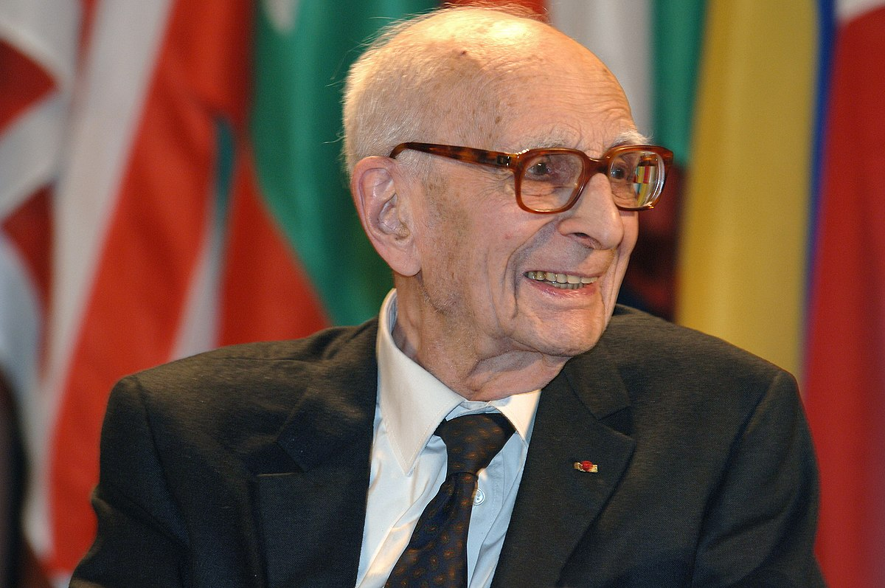
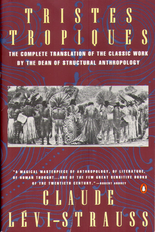

# Memory Trigger

Structuralism
- Definition
- Argue in favour of it

Sad Tropics
- Why it is sad?
- Why we have rituals
- Why we have myths
- Globalization
- Better understand our own ethnicity

# Structuralism

Definition
- Anthropological structuralism is a method of analyzing culture by examining the structures that underlie it. These relations constitute a structure, and behind local variations in the surface phenomena there are constant laws of abstract structure."

Argument in favour of structuralism
- Incesto is a a tabu in many societies
- - A pergunta do porque? Poderia ser pelo horror ou por experiencia de que isso causa doencas geneticas.
- - Para o Levi Strauss, se o pai mantivesse relacoes sexuais com a filha, isso nao seria optimo dentro de uma perspectiva material, porque se a filha casa com outro homem, eh como se estivesse acontencendo uma troca entre dois homens, que benefeciam o pai.

Another argument for structuralism
- Santa Claus and Katchina
- - Katchina: in ceremonies, adults dressed as Kachinas interact with children, teaching them cultural stories and sometimes admonishing or rewarding them for their behavior.
- - Kachinas: Through ceremonies and rituals, Kachinas teach moral lessons, cultural values, and proper behavior to community members, especially children.
- - same myth that come from both the same social structure that there is a division between mature and imature people, and how to teach the immature people how to behave correctly

# Sad tropics

Title
- He laments the loss of cultural diversity as traditional ways of life are eroded by globalization, exploitation, and modernity.
- The Diminishment of cultural diversity reduces the human experience as a whole, for example when you travel to japan, don't you like seeing different things, isn't that enjoyable? Due to globalization everywhere we go is just a differnt implementation of amercanism.

This book is about many tribes he met in Brazil and his research on it

How culture is kinda stupid
- It's crazy that when we see that guy having a tattoo denoting social status in a tribe, we think it's stpuid but if we see something very similar on our culture we think it is normal.

Why participant observation is important
- Because if we simply observe their culture, we won't be able to identify the root causes of their own culture, we need to immerse themselves to fully understand them

The purpose of rituals
- By applying the rituals, individuals participate in their culture and internalize/perpetuate their society/culture

The purpose of myths
- Even though myths can vary a lot they underly the same structure
- - Myths work to mediate and resolve fundamental oppositions in human experience, such as
- - - Life vs. Death.
- - - Nature vs. Culture.
- - Expression of the Inexpressible
- - - Myths address existential questions and human dilemmas that cannot be easily explained or resolved in literal terms.
- - - They use symbolic language and narrative to explore the mysteries of existence.

Western vs native
- Environment
- More community and belonging

Etnography can makes us better understand our own etnhicity
- Defamiliarization of the Familiar
- - In a similar way that the person that struggles the most to solve a problem is the one facing it, by defamilirazing with our culture, we can more clearly denormalize our own society and see more clearly its problems
- Identifying the essence/universal structures