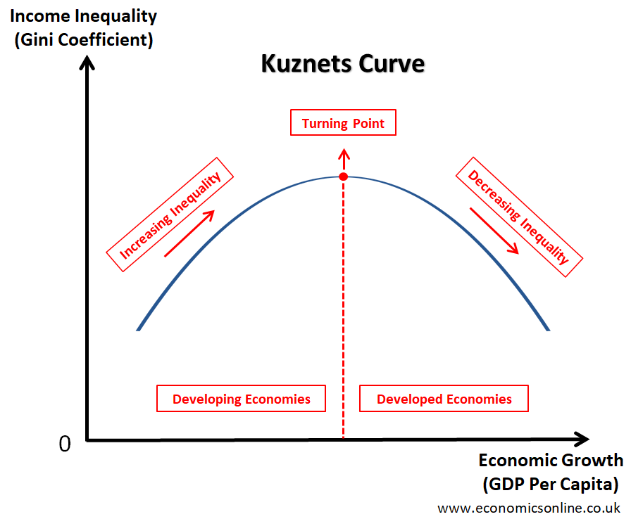

# r > g

r = NOPAT/Average invested capital (net operating income after tax)/(net operating assets)
- You can think like this, this capital (company for example) is valued X, and it returned Y this year, for example a house is valued a million and you won 100 thousand from it in a year
- https://en.wikipedia.org/wiki/Return_on_capital

g = yearly growth of (GDP = Total Wages + Rent + Interest + Profits)

Central thesis
- Part 1: return on capital (r) is greater than the rate of economic growth (g) over the long term
- Part 2: IF return on capital (r) is greater than the rate of economic growth (g) over the long term the result is concentration of wealth
- - Part 2 is easy to argue

- Capital as % of national income = Income of capital / National income = r * Capital_{n-1} / g*GDP_{n-1}. We can see that r/g is the acceleration of the inequality. The main point is that the numerator increases in an r rate, and the denominator increases as a g. Therefore if we have r > g, the tendency is for a higher percentage of the national income to be destined to capital, which in theory is concentrated among few
- https://www.khanacademy.org/economics-finance-domain/macroeconomics/macroeconomics-income-inequality/piketty-capital/v/piketty-spreadsheet-1

# Graphs

- How can people still think Reagan was a good president. Was it worth it selling your soul for less inflation?

- The 20th century is one of the few moments in the history of man kind where GDP increases was larger than ROC (return of capital). Maybe that's why people remember so highly of that time, for example they refer to so many self made men
- This graph shows how interesting is the difference between feudalism and capitalism, because in feudalism g = 0, which is crazy. This is an evidence that burgeousie and proletariat and not 100% against each other, because both improved their own growth metrics at least
- I think this graph might be a bit misleading, because the people that own the capital is changing, which can lead to problems of interpretation. The owners of the means of production increasingly become more and more rich compared to the rest, but the persons that belong to that group change
- This graph represents good empirical proof that r > g in the long term

# Chapter 2

Kuznet is a nobel prize that believes the opposite of Krugman
- Kuznets put the theory that the relationship between income inequality and economic growth was a inverted U-curve shaped. Therefore after the economy grew a lot, the inequality would be low

Recognition
- At 1913 the 10% earners in the United States earned about half of the nantion's total annual income, but by the late 1940s that number plummeted to 35%. He even received a nobel prize of economics. During the 20st century it seemed that capitalism would naturally take care of inequality, Ricardo and Marx worries didn't materalize

Krugman counterargument
- Piketty's counter argument is that in fact, this graph is s U-curve (the opposite of Kuznet's claim). Marx's time was at the beginning of the curve, the 20st century is the middle, and now we would be in the right hand side. One of the reasons why 20st century was so good for inequality is because growth was very large to massive capital depreciation, and due to extensive wealthfare after WWII. High taxes were also true, https://www.urban.org/sites/default/files/publication/59856/1000459-A-Brief-History-of-the-Top-Tax-Rate.PDF shows that top marginal tax rate reached 90% in the US, and after the Reagan revolution it decayed to 28%

Impact of the industrial revolutions
- By reading this chapter we see how crazy important was the industrial revolution. Imagine you had a fucking cottage that does some grapes, before the industrial revolution, it had a lot of power. But suddenly those grapes are not an important commodity in the economy anymore. Therefore inheritance stopped being something relevant, and the people that were able to obtain market share were the key winners. Outside of the tech industry we don't see a lot of g in the economy anymore, which makes us back to the old days

Inequality today
- Now as of now we have two main sources of inequality, the super manager and the super inheritors

# Chapter 3

It's crazy how much society has changed. In agricutural societies, the rate growth rate was 0.2%, whereas in the industrial society it can easily be 1%, which makes an insance difference in the superstructure, in the middle age  life truly didn't change for centuries

It's crazy that Marx argues that in the long run, if R > G, the percentage of the return of capital as the national income will be 99%, which will clearly lead to a revolution

Piketty agrees with the principle of infinite accumulation, but not necessarily with the TRPF(tendency of the rate profit to fall) from Marx
- One counterargument is that competition in capitalism eventually stops in duopoly, therefore TRPF doesn't hold
- Another counterargument is that rich people can hire very fantsy investiment advisors

# Chapter 4

Piketty's solution is to impose a progressive tax on the capital itself across borders
- Seems hard to do, and a big mess
- This is necessary according to Piketty because if a rich country is not part of this tax netwrok, the capital will rush there

The social democratic solution
- Another solution is increase of welfare, but in reality bigger government might lead to more problems alongside the fact that it is unpopular