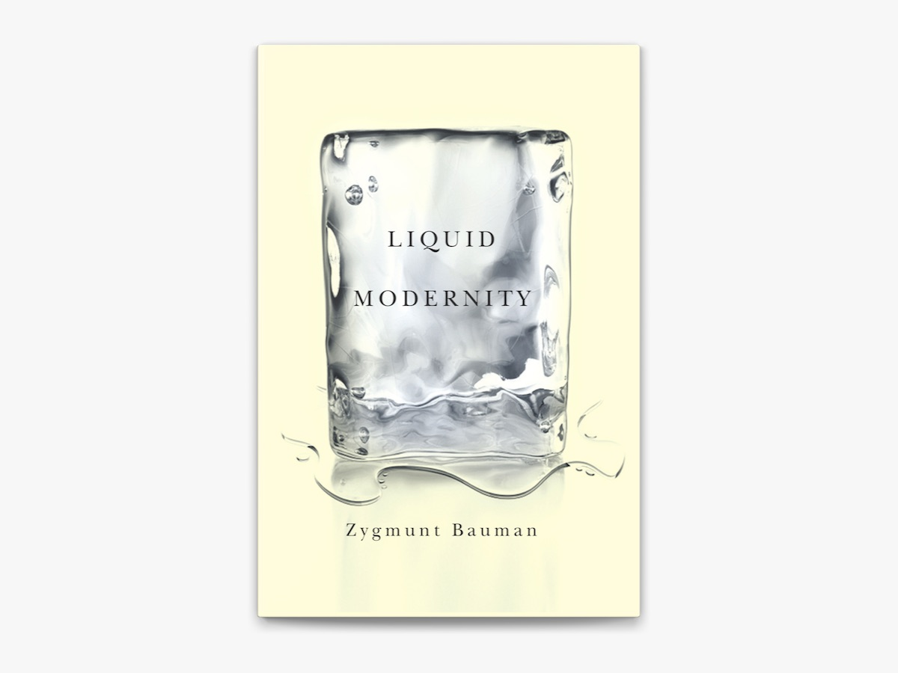

# When People Ask Me About It

1. What is fluidity?
   - A shift in material reality driven by technological advancements, leading to an overwhelming number of options.
   - Objective functions: social validation (market value) and short-term pleasure.
   - These objectives are not consciously chosen but are imposed on us through the constant bombardment of options.

2. What is capitalism?
   - Consumerism: The pursuit of happiness through consumption.
   - Market: The measurement of happiness through economic value.
   - Commodification:
     - Everything loses its intrinsic value and "magic" when reduced to a commodity.

3. Applying these principles to various aspects of human life reveals their impact on well-being:
   - Relationships
   - Work
   - Values
   - Personality (identity)

4. What is the Root Cause of Liquid Modernity
   - By Marx's main theorem, every change in the superstructure needs to come from a change in material reality.
   - Neoliberalism, Globalization, Technological acceleration

# The Concept of Liquid Modernity - An Overview of Fluid Social Structures

Liquid modernity is characterized by the constant flux and transformation of norms, values, and practices.
- Religion, as a relatively rigid institution, faces significant challenges in adapting to this fluidity. This may explain the growing appeal of evangelical movements in Brazil.

Individuals face constant uncertainty in nearly all aspects of life, from careers to personal relationships. Modern life demands navigating a landscape of temporary jobs and relationships that can dissolve as quickly as they form.
- This aligns with the principles of Buddhism, which may offer a fitting philosophy for modern times.

This uncertainty often leads to heightened levels of anxiety and insecurity.
- This contrasts sharply with the Buddhist definition of happiness, which emphasizes detachment and inner peace.

# Liquid Individuality - The Quest for Identity in a Changing World

# The Market as the Dominant Institution - Commodification of Everyday Life

In liquid modernity, the market has become the central force shaping human experience and social interactions.

The abundance of options in the market creates an addictive cycle, similar to a child watching TikTok. As a result, individuals begin to define themselves by their roles in the market.

The market promotes the idea that personal fulfillment and identity can be achieved through consumption. Instead of consuming products, we consume identities and meanings. This leads to the commodification of everything, including identities and meanings.

In a market-driven society, everything is reduced to price and value, extending even to personal relationships.

The commodification of everything ultimately strips things of their intrinsic value.

# Work and Labor in Liquid Modernity - Flexibility, Insecurity, and Precarity

Historically, work was synonymous with stability and predictability, offering long-term security (e.g., working in a power plant) and solid social standing.

However, in liquid modernity, work has become transient, making workers more commodifiable and diminishing their perceived value.

This shift has profound socio-economic implications, leading to widespread job insecurity and precarity.

The transient nature of modern workplaces also weakens personal ties among colleagues, further eroding the sense of community.

# 🧱 From Solid to Liquid: What Changed?

## 1. **Global Capitalism and Economic Deregulation**
- Erosion of long-term employment and social safety nets.
- Rise of flexible labor markets and outsourcing.
- Security replaced by competitiveness and precarity.

## 2. **Neoliberal Individualism**
- Personal freedom replaces collective responsibility.
- Individuals must construct their own identities without institutional guidance.
- Life becomes a series of short-term projects and relationships.

## 3. **Technological Acceleration**
- Digital communication and fast-paced change reinforce instability.
- Relationships, information, and trends are temporary and disposable.
