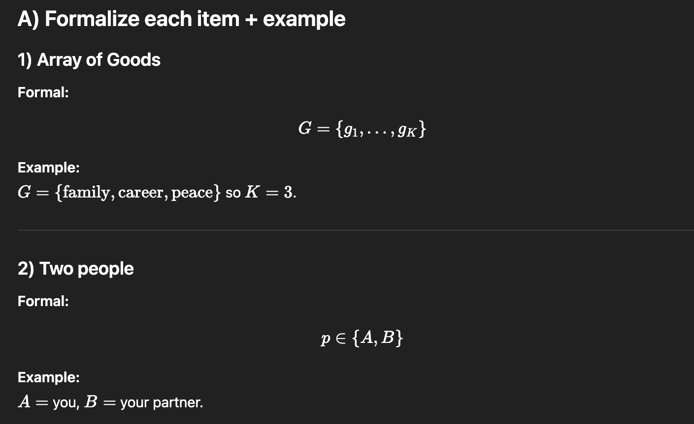
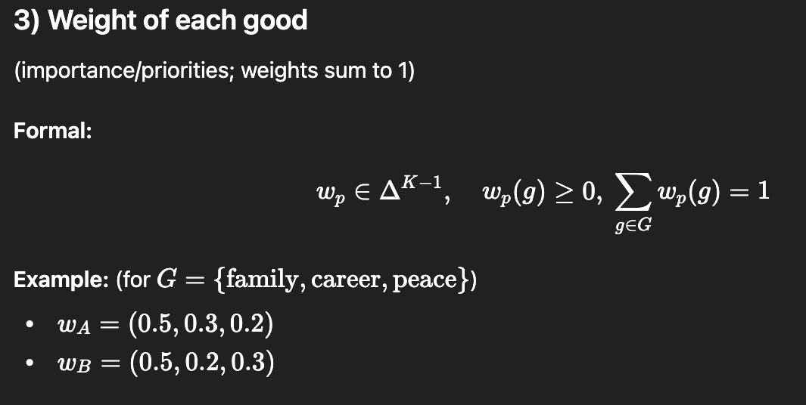
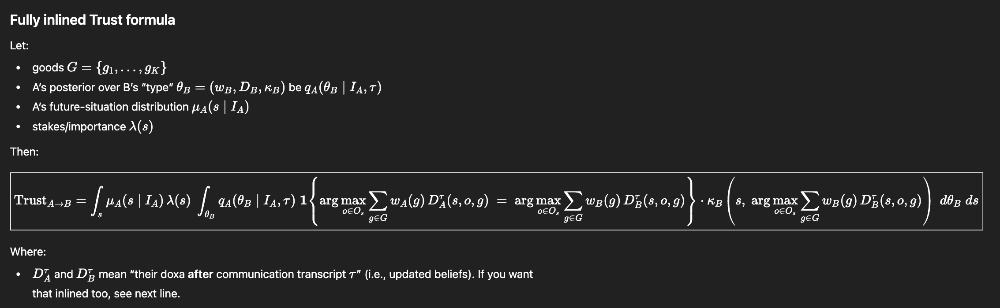

# Memory Trigger
- What is good?
- Doxas
- Communication
- Leadership

## Practical Alignment Defined
- In this post, practical alignment means being long-term aligned on which decisions are best and having the ability to implement those decisions together.

