# Childhood

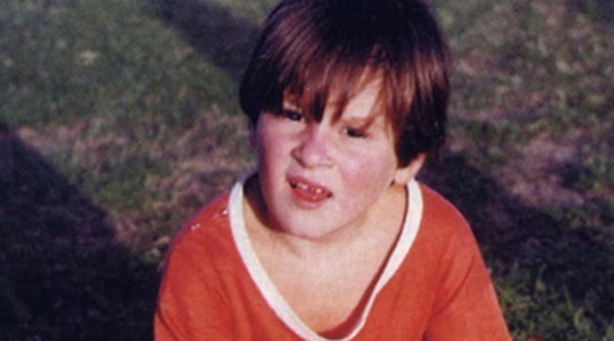

## Background
- Messi was born in 1987, a year after Maradona's World Cup victory.
    - [MYTAKE] For me, this feels like a prophecy. It even sounds like something out of Avatar: The Last Airbender; after one football god peaked, the next one was born.
- He is a descendant of Italians and Spaniards; in fact, the Spanish side of his family came from Catalonia.
    - [MYTAKE] This is incredibly symbolic; I can't imagine anything more fitting.
- From a young age, Messi showed great attachment to the ball, refusing to go shopping with his family unless he could take a ball with him.
    - [MYTAKE] Hilarious!
- His grandmother played a fundamental role in his career, even when he was very young.
    - There was no youth team for him, so she convinced the coach to let him play. She was the only person in the family who truly encouraged him to pursue football.
- At the age of eleven, his grandmother, Celia, passed away.

## Romance
- "I've liked Antonela since I was a boy. I love her more than anything. I'd say it was love at first sight."

## Growth Problem
- At eleven, Messi was diagnosed with a hormonal problem that slowed his bone development and, consequently, his growth.[22][23] For a year and a half, the $900 monthly treatment,[22] which involved alternating injections in each leg every night, was paid for by the foundation where his father worked until the funding ran out.[22] Since Newell's Old Boys did not want to cover the treatment costs, his father offered Messi to River Plate.[22][23] River's interest made Newell's reconsider, but they only offered 200 pesos a month.[22]
    - [MYTAKE] This feels like another sign of destiny. What seemed like a terrible condition actually contributed to his footballing skills, such as his low center of gravity. Messi's early life reminds me of the book *Outliers*, where exceptional success requires a perfect alignment of circumstances. For Messi, it was being Argentinian, having low hormone growth, and so many other factors aligning perfectly.
    - [MYTAKE] Perhaps everyone has a unique set of circumstances that make them perfect for something.

## Messi Goes to Barcelona
- To escape Argentina's economic crisis, Messi's father decided to try his luck abroad.[24] A cousin of Jorge Messi's mother lived in Lleida, Catalonia, and took the family in. Lionel was observed by a Barcelona scout,[24] who recommended him for trials at the club. At thirteen years old and 1.40 meters tall, Messi impressed against boys two years older. However, President Joan Gaspart and sporting director Carles Rexach hesitated to sign him due to the costs of his treatment and relocating his family.

## Messi's Shyness
- Gerard Piqué said that during Messi's first month on the professional team, people thought he was mute because he didn't say a word. Cesc Fàbregas noted that Messi spoke in a very low Argentine accent, making it difficult to talk to him.

## Ronaldinho's Prophecy
- After Ronaldinho's first training session with Messi, he told a journalist friend: "I just trained with someone who is going to be better than me." When Kobe Bryant visited Barcelona, Ronaldinho told him that Messi would be the best. Ronaldinho noticed Messi's shyness and invited him to join his group of friends in Barcelona. They lived on the same street, and Ronaldinho even taught Messi Spanish and Portuguese. To this day, Messi considers Ronaldinho a father figure. Before a friendly match between Barcelona and Juventus, Samuel Eto'o warned Patrick Vieira about Messi, saying that one day, Messi would make every player before him seem like they were playing a different sport.

# 2004/2005

## Messi's First Goal for Barcelona
- After scoring his first goal, Messi climbed on Ronaldinho's back, symbolizing how much Ronaldinho valued the moment.
    - [MYTAKE] This goal is legendary. Ronaldinho, the best player at the time, asking a 16-year-old to climb on his back shows his humility and vision. Also, Messi's first goal being a chip, his trademark, is poetic.

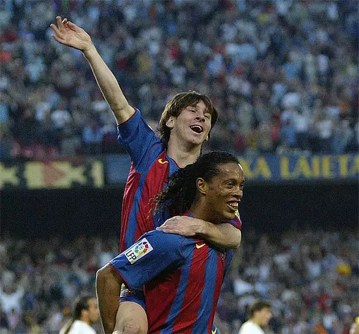

# 2005/2006

- Nothing significant happened this season as far as I know.

# 2006/2007

## Ankara Messi
- A masterpiece during the Copa del Rey semi-final.
    - [MYTAKE] My second favorite Messi goal of all time. Truly beautiful and amazing.

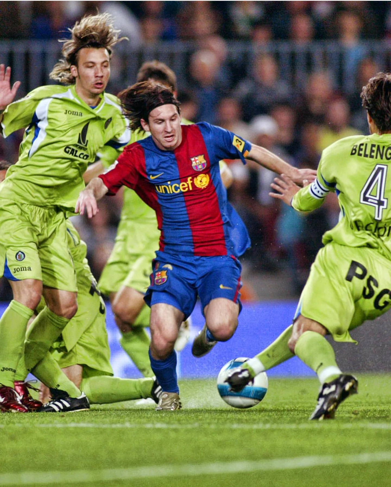

## Comparisons with Maradona
- Early in his career, Messi scored a goal with his hand and another where he dribbled past everyone. These goals were scored in a short period, drawing comparisons to Maradona's iconic performances in the 1986 World Cup against England.
    - [MYTAKE] Messi's career is filled with moments that feel like acts of destiny.

## Copa América
- Runner-up, losing to Brazil in the final 3-0. Notably, Brazil's best players, like Ronaldinho, Roberto Carlos, and Kaká, were absent.

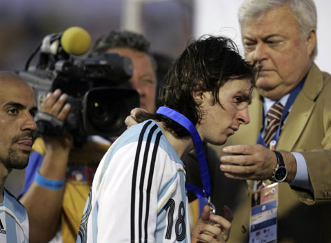

# 2007/2008

## Champions League
### First Match Against Cristiano Ronaldo
- Messi faced Cristiano Ronaldo for the first time in the Champions League semi-final. It was a tight game with few opportunities; Paul Scholes scored the only goal across both legs.
    - [MYTAKE] Watching this game, no one could have imagined how great these two would become.

# 2008/2009

## Ronaldinho's Departure
- Ronaldinho was released from the team by Guardiola due to his party lifestyle.

## Champions League
### Quarter-Finals vs. Bayern Munich
#### First Leg
- Barcelona won 4-0.
- Messi scored 2 goals and provided 1 assist.

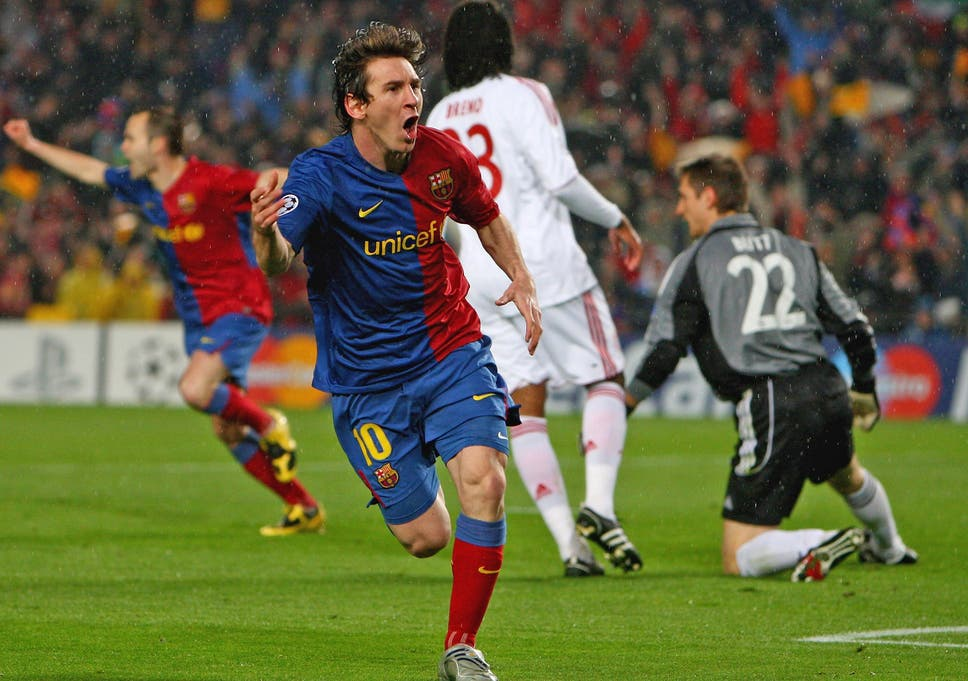

### Semi-Final vs Chelsea

**Second Leg**  
- Score: 0 - 1  
- At the buzzer  
- First leg ended 0-0 at Camp Nou  
- Second leg was controversial  
- In the final moments, Messi assisted Iniesta, who scored a stunning goal with the outside of his foot  

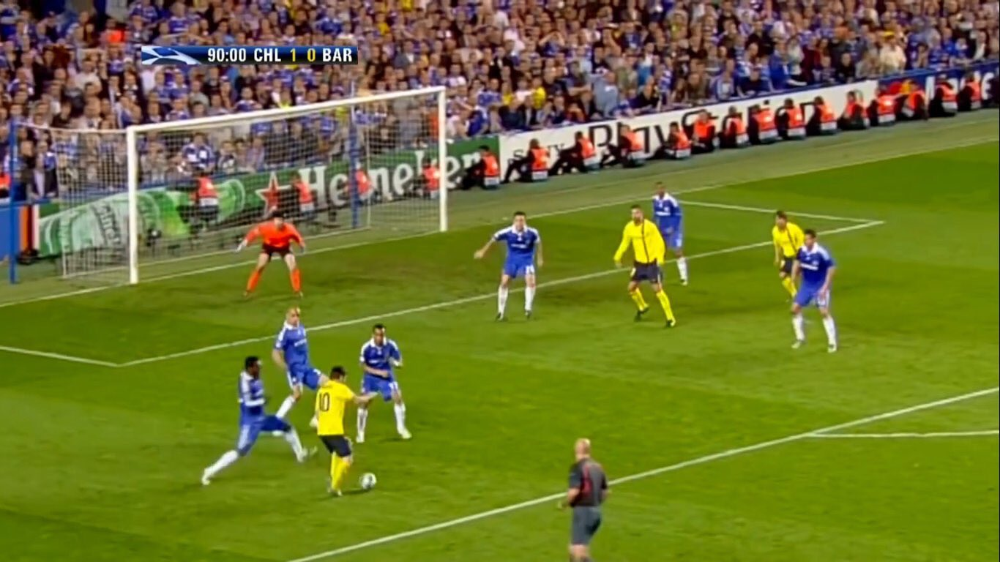

### Final vs Manchester United

**Prelude**  
- In the Champions League final, Messi faced Cristiano Ronaldo and Manchester United for the second time  
- Eto'o scored a brilliant goal  

**Score: 2-0**  
- Messi scored an iconic header, one of the few headers in his career  
- Epic moment where Messi kissed his boot  

**Victory**  
- First Champions League title for the trio of Messi, Xavi, and Iniesta  

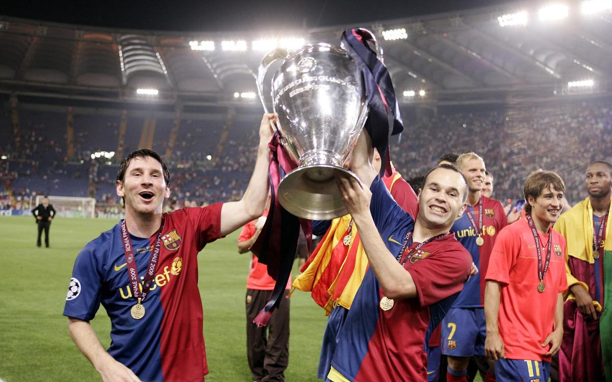

## Ballon d'Or, #1

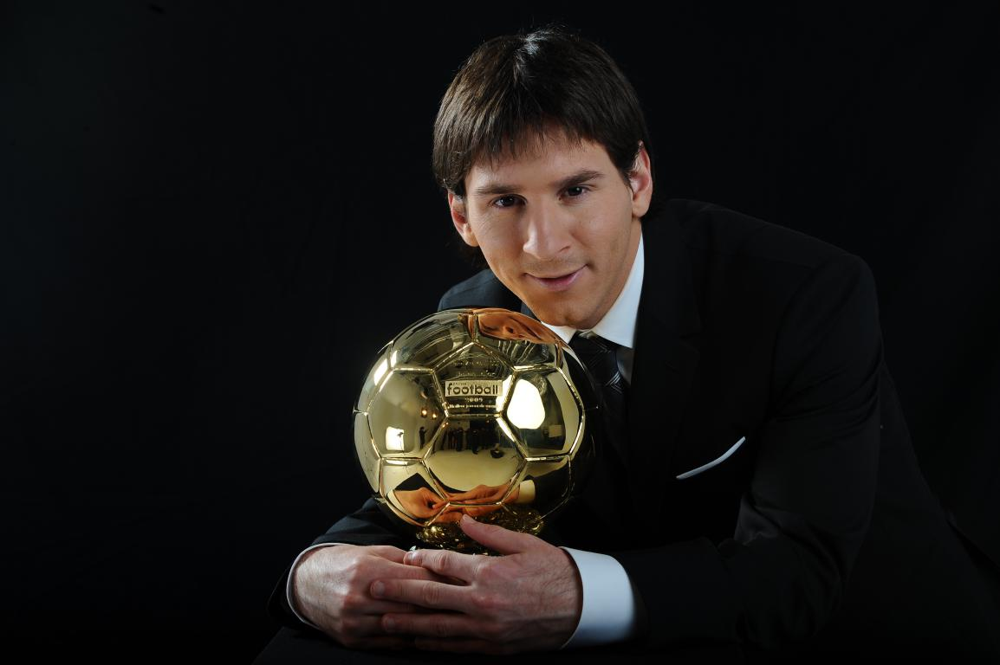

# 2009/2010

**Prelude**  
- Ronaldo transferred to Real Madrid  

**Masterpiece**  
- Dribbled past 4 defenders against Zaragoza  

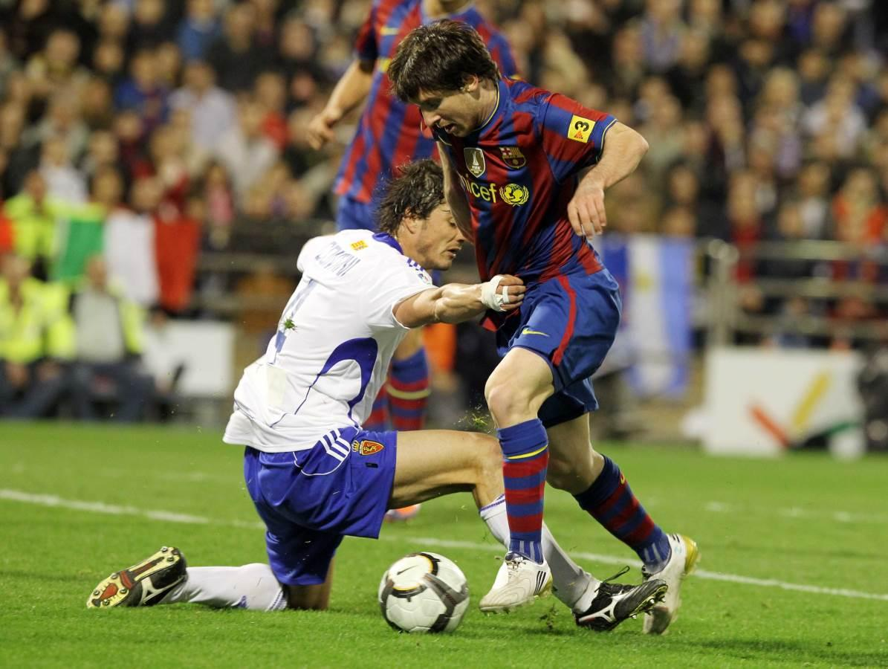

## Champions League

### Quarter-Finals vs Arsenal

**First Leg**  
- Score: 4 - 0  
- Messi scored four goals, an incredible performance  

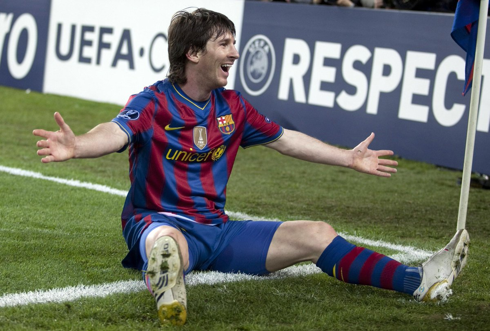

### Semi-Final vs Inter Milan

**First Leg**  
- Score: 3 - 1  
- Mourinho's defensive "bus" included Sneijder, Eto'o, Maicon, Lucio, and Julio Cesar  

## World Cup

- Maradona was the coach  
- Messi didn't score any goals but provided an assist  
- Argentina was eliminated in a crushing defeat against Germany  
- Argentina's defense was very disorganized at the time, marking the third consecutive loss to Germany in a World Cup  
- After the defeat, Maradona said some players were already planning their trips for the next day, while Messi "cried like a 5-year-old child"  

- Spain won the World Cup, and much was said about how Messi could have played for Spain if he wanted to  
- It was tough for him to see his Barcelona teammates become world champions  

## Ballon d'Or, #2

# 2010/2011

## Champions League

### Group Stage

**Masterpiece**  
- Tiki-taka brilliance against Panathinaikos  

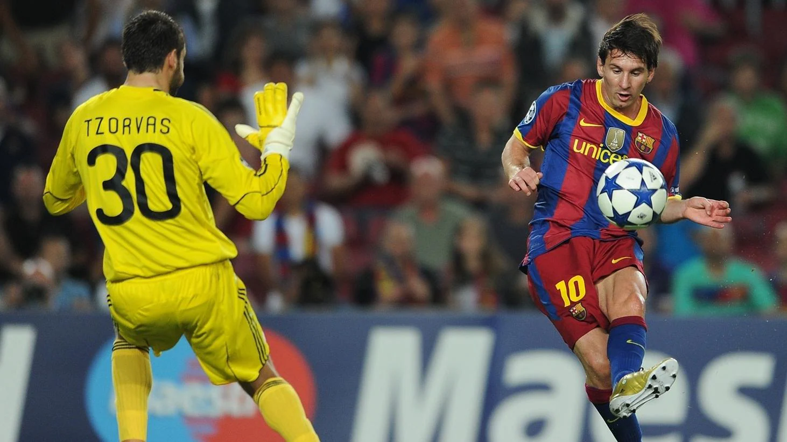

### Round of 16 vs Arsenal

**First Leg**  
- Score: 1 - 2  

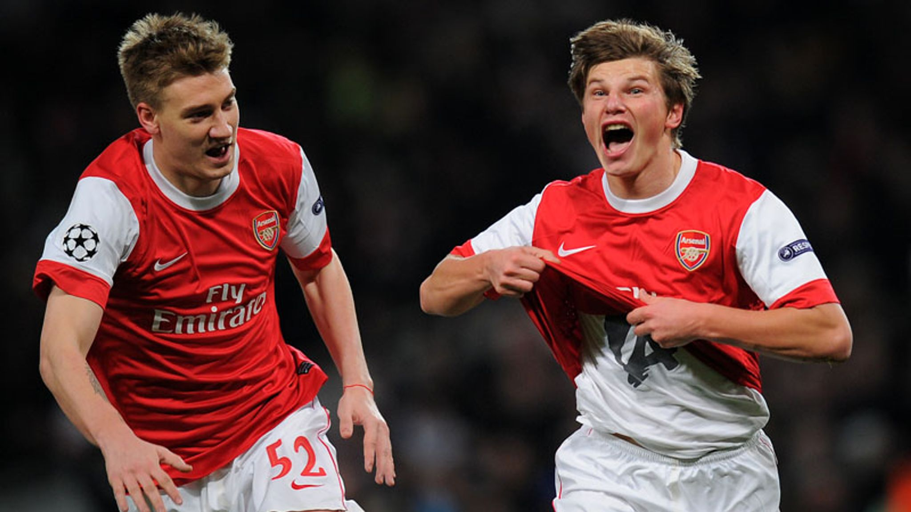

**Second Leg**  
- Score: 3 - 1  
- Messi scored 2 goals and provided 1 assist out of Barcelona's 5 goals against Arsenal. All were crucial as Barcelona barely advanced. One of the goals was stunning, with a beautiful pass from Iniesta.  

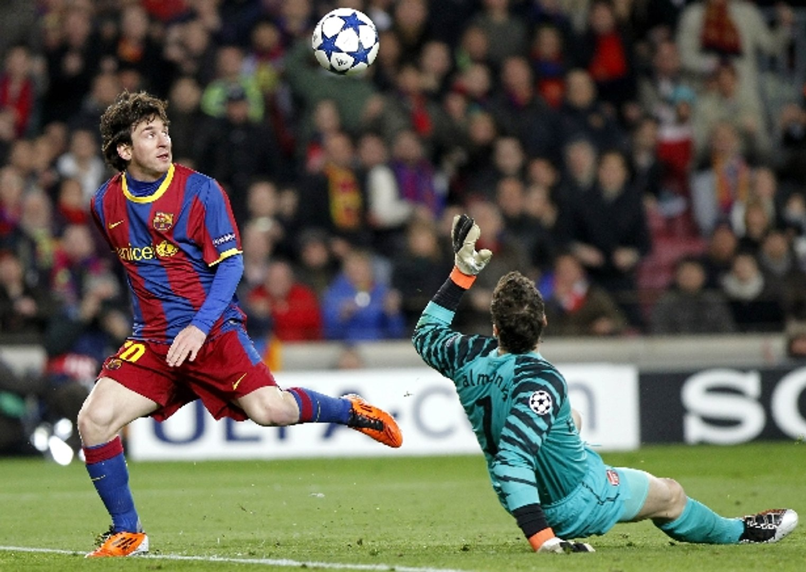

### Quarter-Finals vs Shakhtar

### Semi-Finals vs Real Madrid

**Prelude**  
- Mourinho, who had defeated Messi's Barcelona in the previous year's Champions League, was now coaching Real Madrid. Messi faced Real Madrid four times, including this Champions League semi-final.  

**First Leg**  
- Score: 0 - 2  
- **Masterpiece**  
- "Away from two, three, four... wonderful, wonderful, wonderful! How good is he?"  
- [MYTAKE] This is my favorite Messi goal. He produced a masterpiece in a Champions League semi-final against Real Madrid at Santiago Bernabéu, his arch-rival's home. Truly divine.  

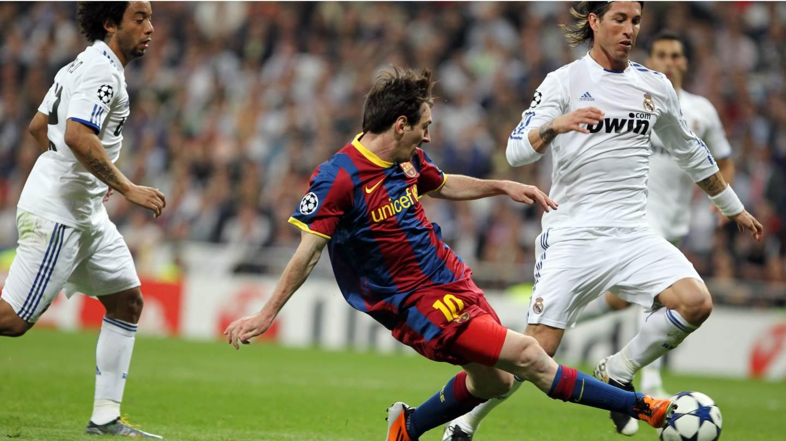

### Final vs Manchester United

**Score: 1 - 0**  
- Beautiful goal from outside the box  

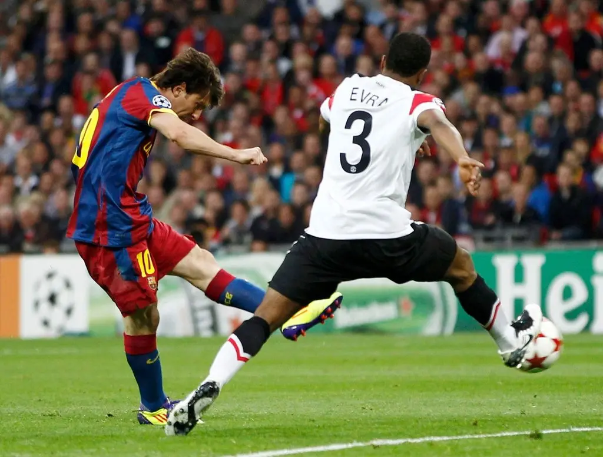

**Score: 3 - 1**  
- Messi initiated the play for the third goal, destabilizing the defense  

**Legacy**  
- This team is historic, representing the peak of one of football's greatest quartets: Messi, Xavi, Iniesta, and Guardiola  

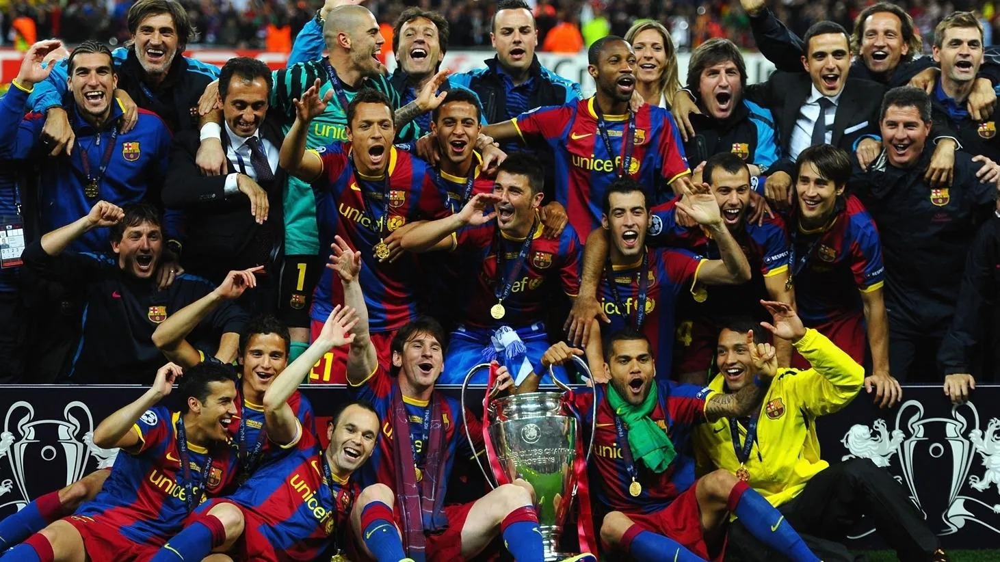

## Ballon d'Or, #3

# 2011/2012

Pep Guardiola once said: “Don’t write about him, don’t try to describe him. Just watch him.”

## Champions League

### Group Stage

**vs Bayern Leverkusen**  
- Messi scored 5 goals in a single match  

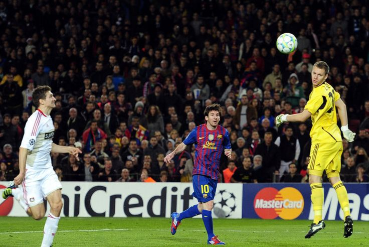

### Quarter-Finals

### Semi-Finals

**Prelude**  
- A rematch of the 2009 semi-final against Chelsea  

**Second Leg**  
- Score: 0 - 2  
- Messi missed a penalty, hitting the crossbar  

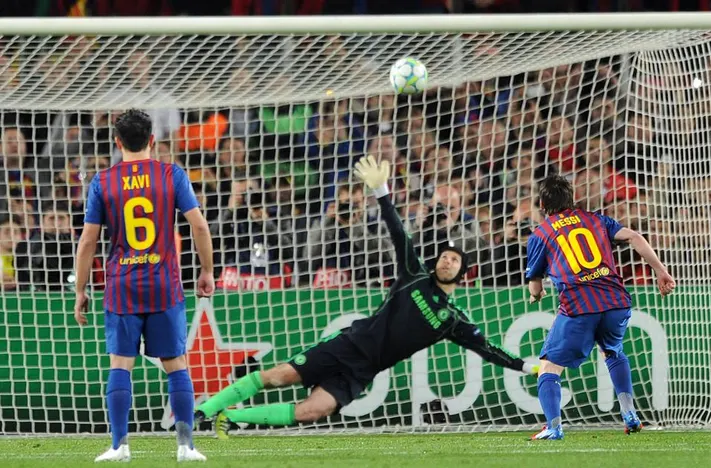  
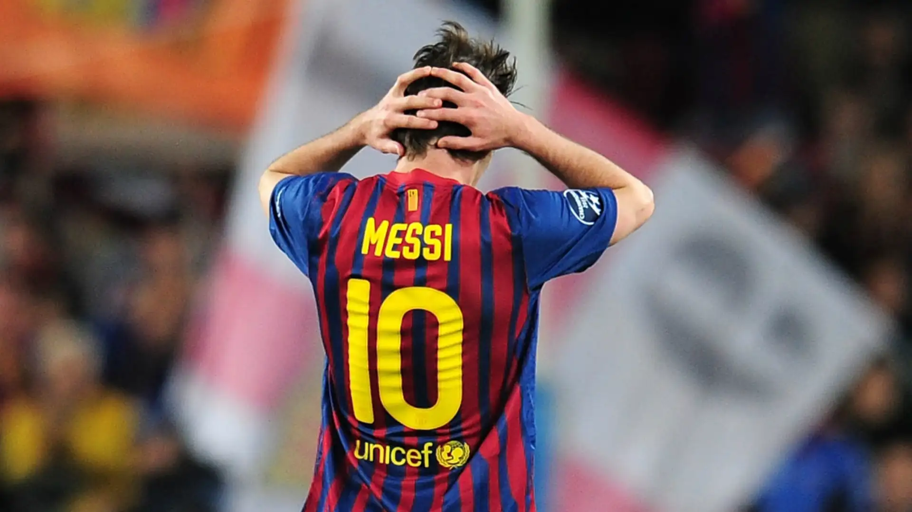

**Aftermath**  
- When Barcelona deserved to win, they lost; when they deserved to lose, they won  
- Guardiola left the club  

## Ballon d'Or, #4

- Messi became the player with the most Ballon d'Or awards in history  

# 2012/2013

91 goals, the most goals in a calendar year.

## Champions League

### Semi-Finals

**Aggregate**  
- Score: 7 - 1
- Sad

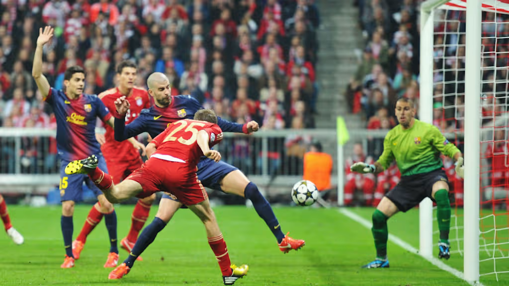

# 2013/2014

Villanova convinced Messi to stay in Barcelona, as he was considering leaving for Chelsea.

## Masterpiece
- Against Getafe, Messi dribbled past 4 players (including the goalkeeper).

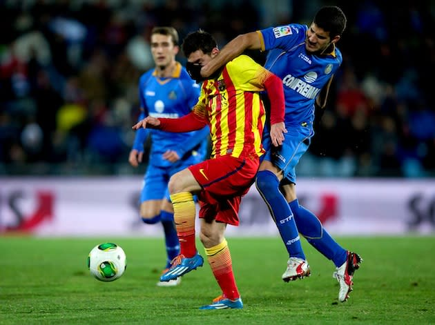

# Champions League

## Quarter-Finals

**First Leg**  
- Score: 1 - 0
- [MYTAKE] who could imagine, that of all teams Atletico de Madrid would give trouble to Barcelona, when they have been humilliated so many times in last 5 years by Barcelona

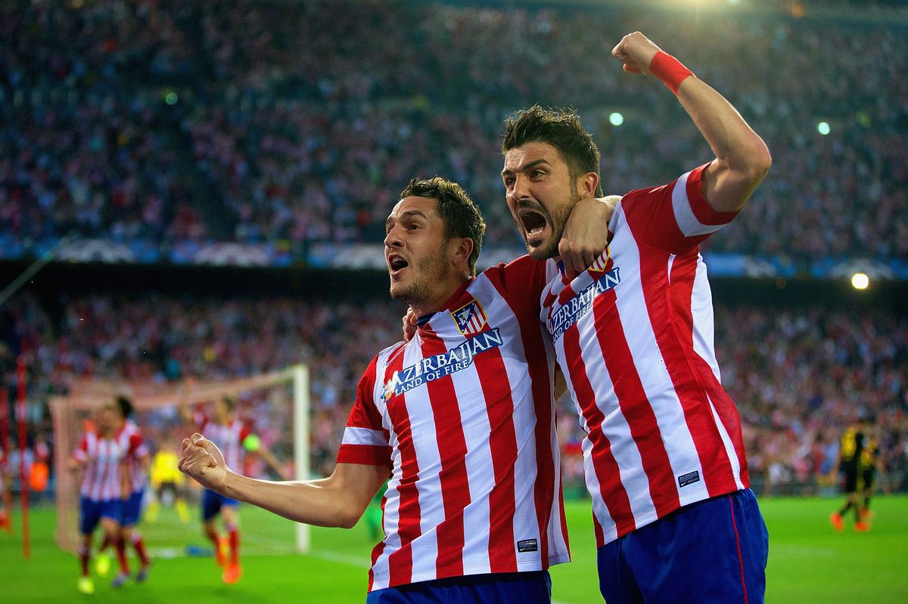

## World Cup

### Group Stage
- Messi was crucial in the group stage, scoring several goals, including a stunning one against Iran.

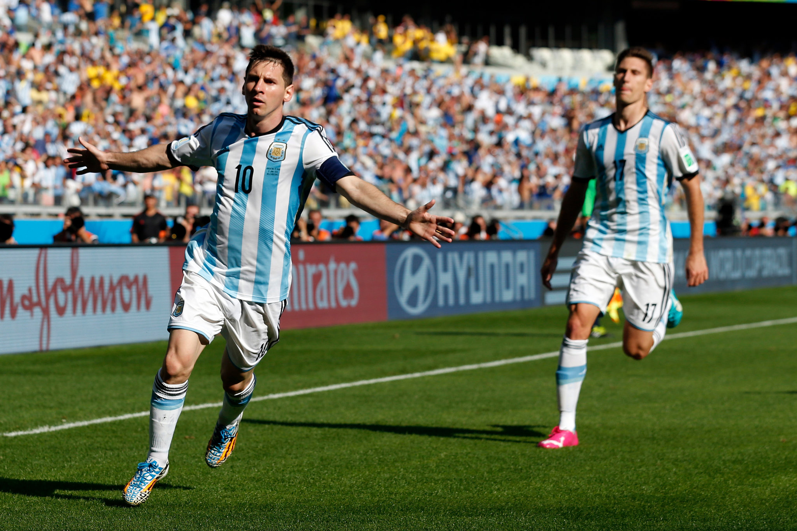

### Round of 16
- In the knockout stage, he only provided one assist in extra time against Switzerland.

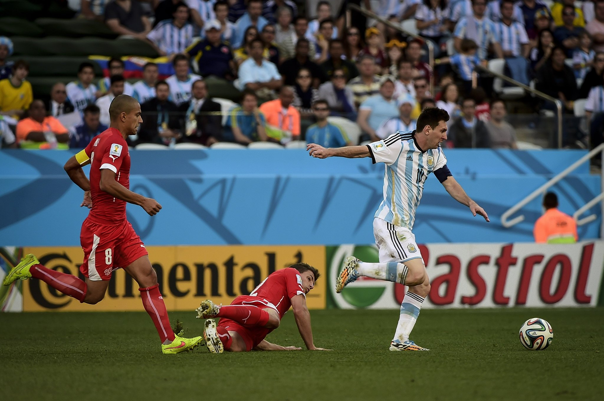

### Final

#### Regular Time
- Higuain missed a very easy chance.
- Messi also missed a clear opportunity.

#### The Rip Tide
- Goetze scored a goal in the final minutes.

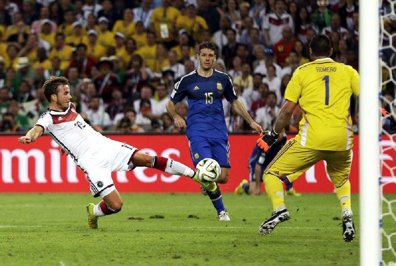

#### Aftermath
- Argentina lost 1-0, shortly after Brazil's infamous 7-1 loss.
- Messi won the award for the best player of the tournament.
- An iconic photo shows him staring at the trophy.

#### Similarity with Maradona
- Messi lost the World Cup to Germany, just like Maradona did, in a 1-0 game with a late goal.
- [MYTAKE] It's fascinating how time changes perspectives. Many criticized Messi as a "false messiah" for losing to Germany, but in hindsight, this loss mirrored Maradona's, further solidifying Messi's legendary status.

#### Impact After the Final
- His former agent Fabian Saldin shared a conversation: "Fabi, I've been waking up at night thinking about the final in Brazil for a year, I can't sleep."

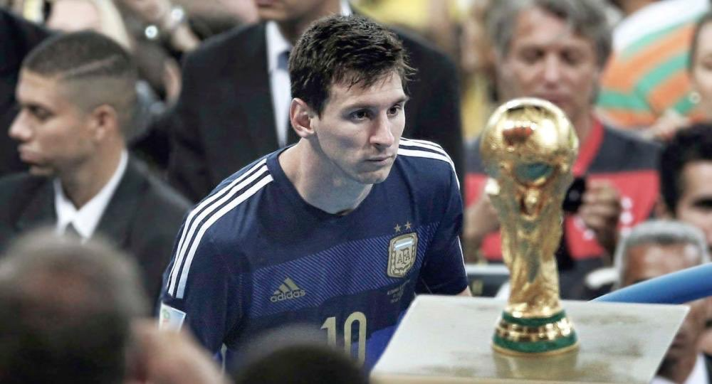

# 2014/2015

## Champions League

### Quarter-finals vs PSG

#### Second Leg
- Messi provided an assist.
- Suarez scored a beautiful nutmeg goal.

### Semi-finals vs Bayern Munich

#### Prelude
- Faced Guardiola (former Barcelona coach) and Neuer (World Cup final opponent).

#### First Leg
- Barcelona won 3-0.
- "Here he is again, here he is again, it's astonishing, absolutely world-class."
- Messi scored 2 goals.

#### Second Leg
- Barcelona lost 3-2, but Neymar scored two goals.

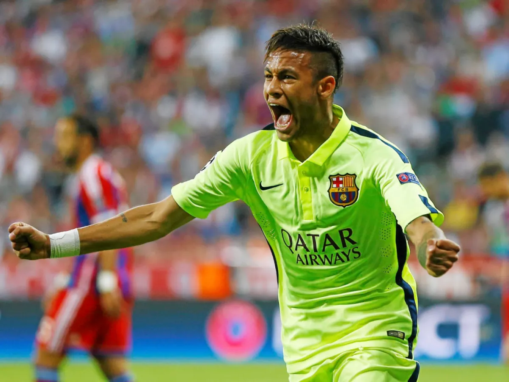

### Final vs Juventus
- 1-0

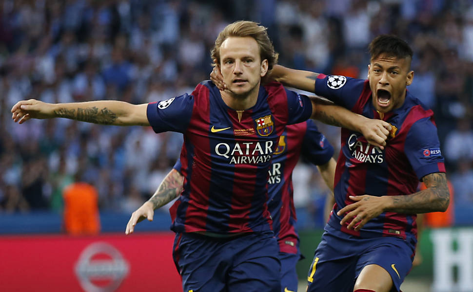

- 2-0

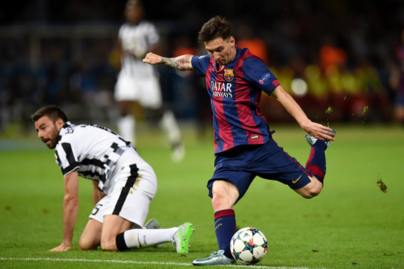

- 3-0

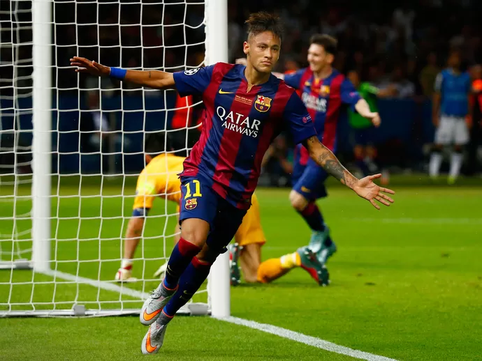

- The only Champions League win of the MSN trio.

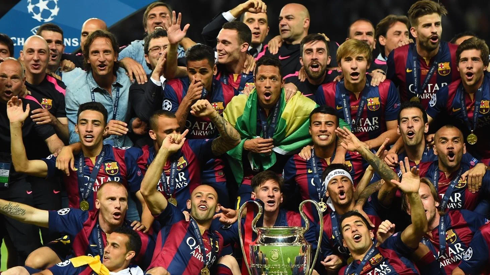

## Copa América
The following year, Messi was a runner-up in the 2015 Copa América with Argentina. He played a key role in the campaign, scoring a goal in the opener against Paraguay. In the final, Argentina lost to Chile on penalties, with Messi being the only Argentine to convert his penalty. The title went to the tournament hosts.

# 2015/2016

## Masterpiece
- Tiki-taka goal against Roma.

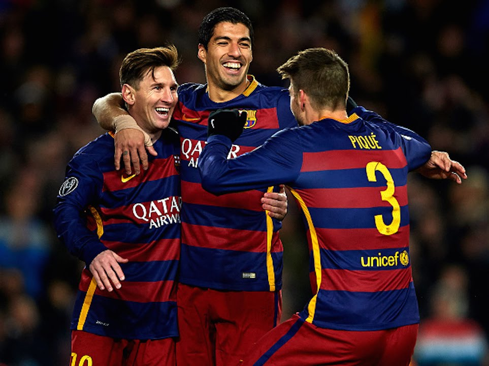

## Champions League

### Quater-Finals

Second Leg
- 2 - 0
- [MYTAKE] Can you imagine? MSN being defeated by Griezman. And when he joined our team he was trash as fuck. How bittersweet life can be at times.

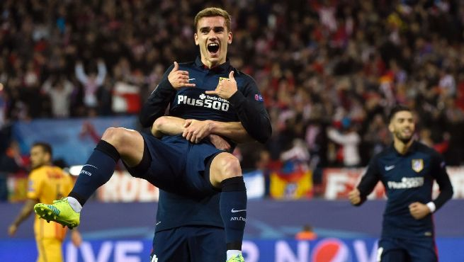

## Copa América

### Prelude
- Messi grew a beard, which gave him a confident and determined look, signaling he was ready to achieve something different for Argentina.

### Masterpiece vs United States

[MYTAKE] This felt like this is it, we are going to win this. He is finally playing well for Argentina, he is a beard now, everything will be different. This reminds me of the Simpsons episode where Homer starts using Minoxidill.

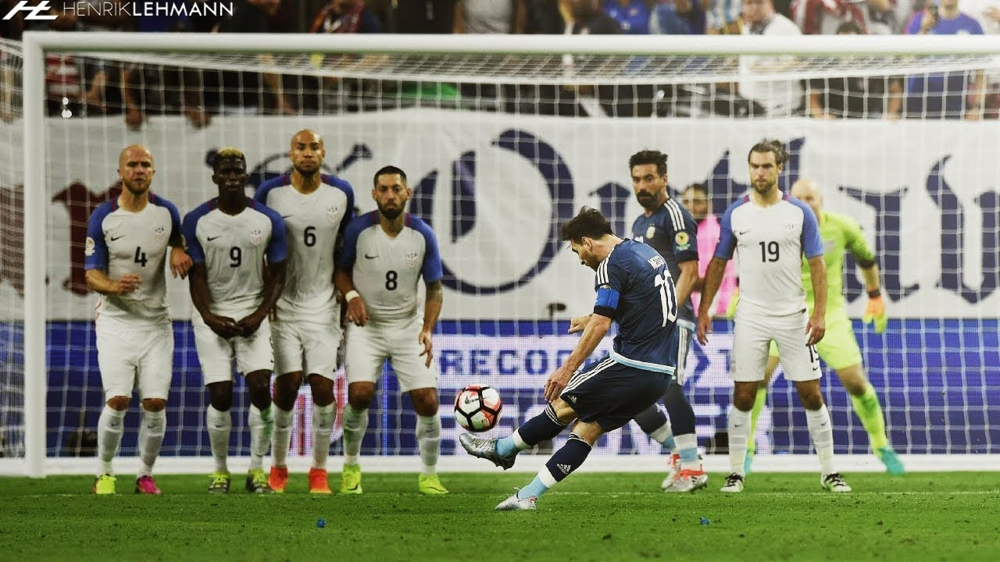

### Final
- In the final, just like the previous edition, Argentina lost to Chile. After a 0-0 draw, they were defeated 4-2 on penalties, with Messi missing his penalty.

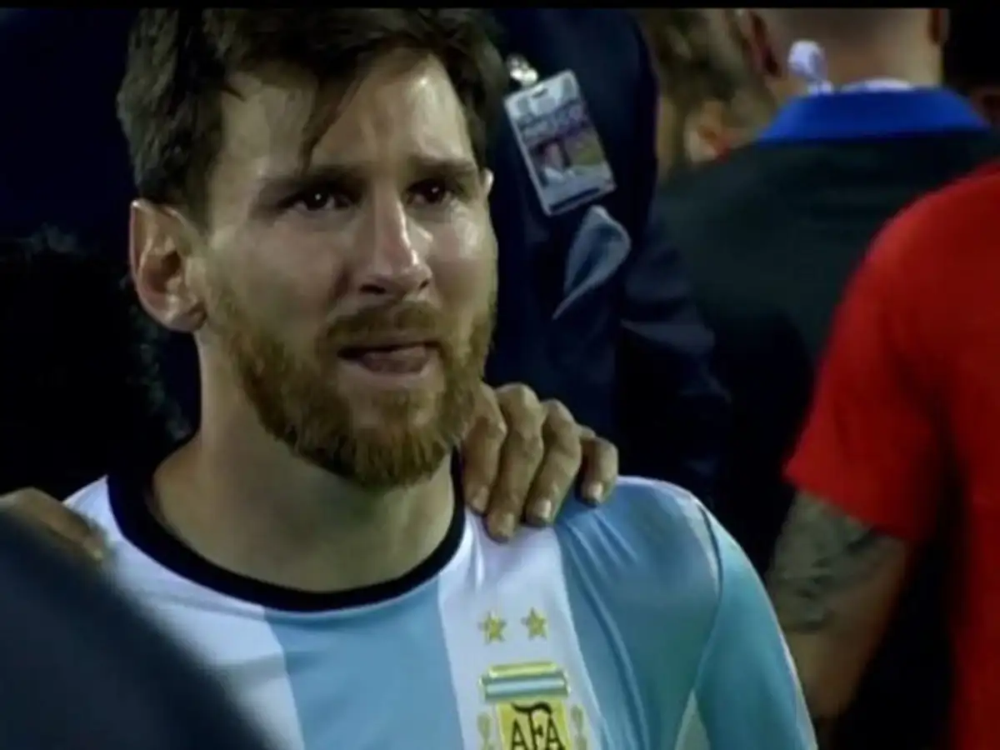

#### Aftermath
- Argentine fans turned on him, accusing him of caring more about Barcelona than Argentina.
- This was Messi's fourth runner-up finish with the national team.

#### Emotional Statement
- "It's incredible, but it's not meant to be. We lost again on penalties. It's the third consecutive final. We tried, we fought. It's hard to analyze this moment. In the locker room, I thought it's over for me with the national team. It's not for me. That's how I feel now. It's a great sadness. Four finals, and I couldn't win. It was what I wanted the most. It's for the best, for everyone. Many people want this. They don't accept just reaching the final, and neither do we. We lost again on penalties."

#### Maradona Comparison
- Maradona himself said after the game that Messi lacked the personality to be a leader.
- Many compared Messi to Maradona, calling him a "choker."

# 2016/2017

## La Liga

### Masterpiece
- Dribbled past 4 players against Eibar.

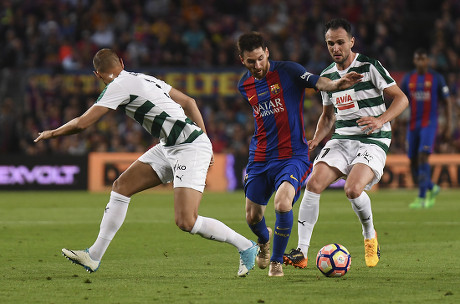

### Masterpiece
- An iconic goal where Messi dribbled past four players, took a shot, and Suarez scored on the rebound.

### Legendary El Clásico
- Scored a legendary last-minute goal against Real Madrid, which made me a fan of his.

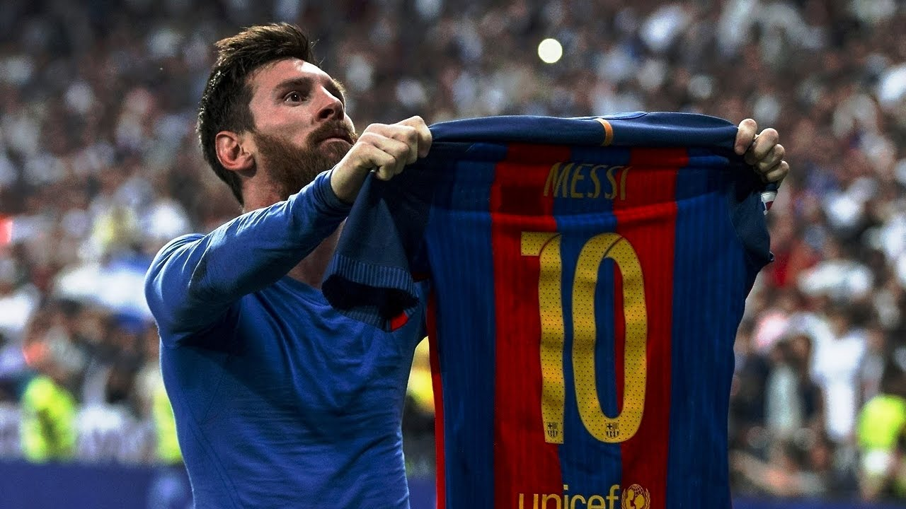

## Champions League

### Quater-Finals

First Leg
- 3 - 0
- [MYTAKE] The team was amazing from an offensive point of view. But just like Brazil's 1982 it was terrible in the defense, and in football you don't win by only attacking.

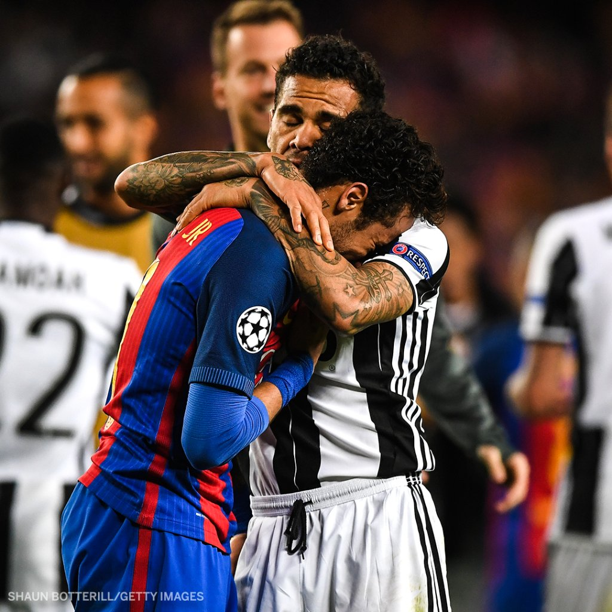

## World Cup Qualifiers

When Messi returned to play for Argentina, the team was on the verge of failing to qualify for the World Cup. Messi scored a hat trick against Ecuador, securing Argentina's spot in the tournament. The last goal was remarkable, as he scored while losing balance and chipping the ball over the goalkeeper.

During this period, Maradona attended an event with Pelé, where Pelé asked him about Messi. Maradona responded, "No tiene personalidad, no tiene personalidad para ser un líder" ("He doesn't have the personality, he doesn't have the personality to be a leader").

### Maradona's Quote
- Maradona also said: "It is useless trying to make a man into a leader when he goes to the toilet twenty times before a match."

---

## 2017/2018

### Copa del Rey Final
Messi provided an incredible assist in the final.

### Neymar's Departure
Neymar left the team at the end of the season.

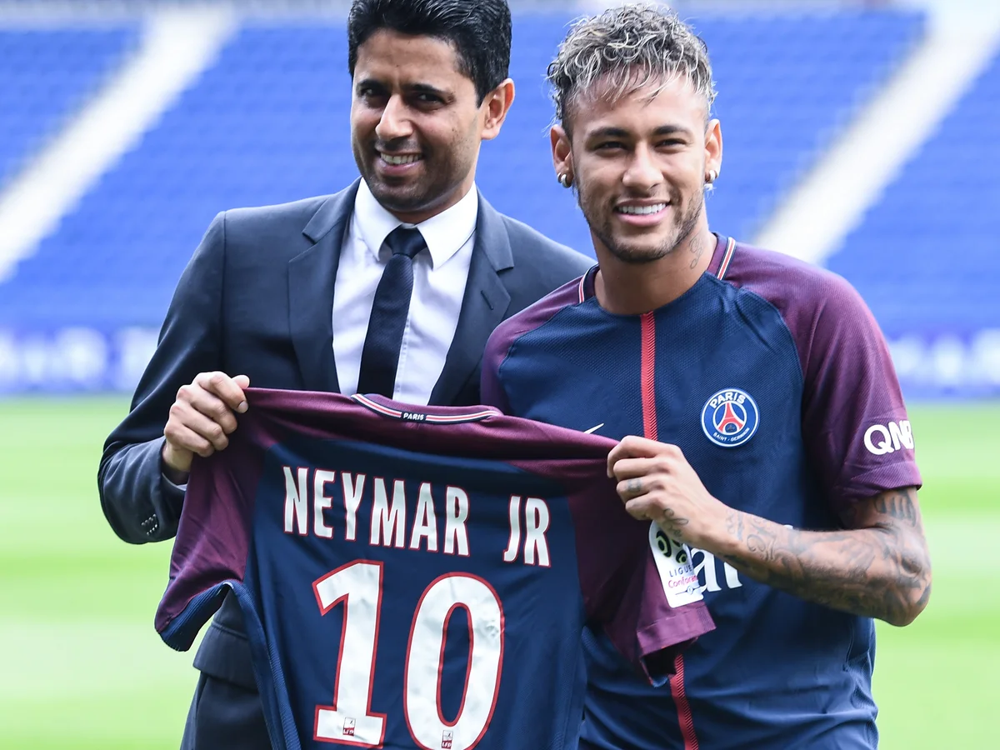

---

### World Cup

#### Group Stage

**First Game: Iceland**
- The first match was against Iceland, ending in a 1-1 draw where Messi missed a penalty.
- This added to his reputation as a "choker."
- Agüero scored Argentina's only goal in the match.

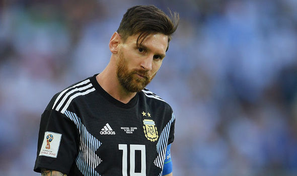

**Second Game: Croatia**
- Argentina faced Croatia in a must-win scenario after drawing the first game.
- A ridiculous mistake by Caballero led to a disastrous loss.
- Modric's final goal was a masterpiece.

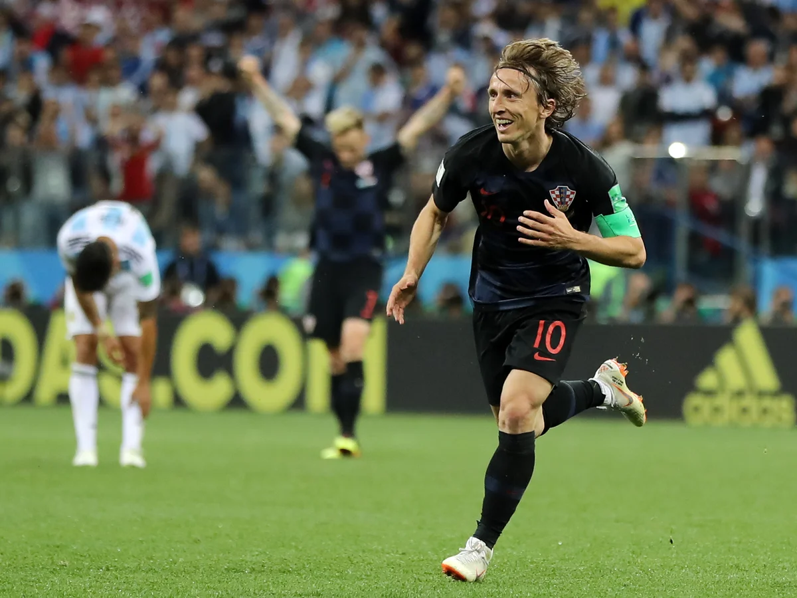

**Third Game: Nigeria**
- In the final group stage match, Argentina faced Nigeria, needing a win to advance.
- Messi's first goal was a masterpiece, one of his most memorable.
- Nigeria equalized, but Argentina fought hard and scored a late goal to progress.

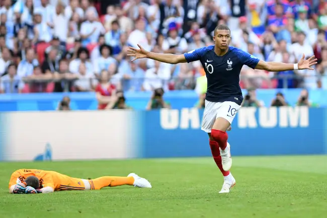

#### Round of 16: France
- Mbappé had the game of his life, running the entire field to win a penalty for the first goal.
- Di María scored a stunning goal to equalize, and Argentina briefly took the lead.
- However, Argentina's fragile defense conceded three more goals, losing 4-3.
- After the match, the commentator remarked that this was Messi's last chance to win the World Cup.

**Aftermath**
- Lionel Scaloni took his first job as a coach, becoming Argentina's manager after the World Cup. It didn't seem very promising at the time.

---

### Champions League

#### Quarterfinals: Roma

**Second Leg**
- Barcelona lost 3-0, a very sad result.

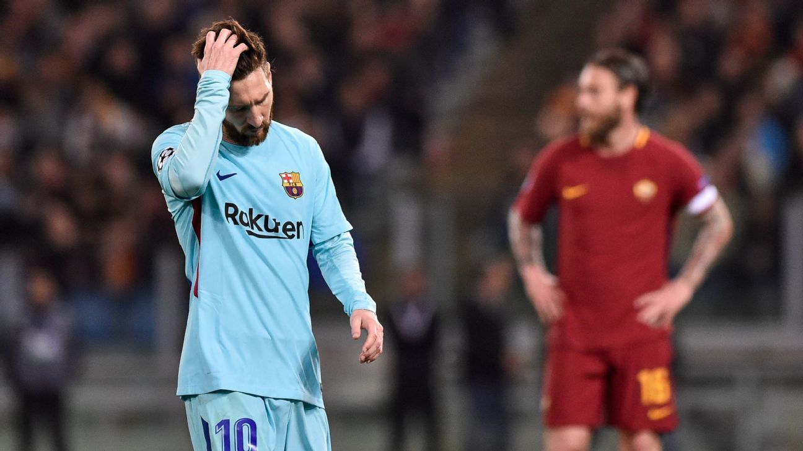

---

## 2018/2019

### La Liga
Messi performed exceptionally well in La Liga, and Barcelona was a very strong team.

**Masterpiece**
- Messi scored a stunning goal from outside the box, chipping the goalkeeper.

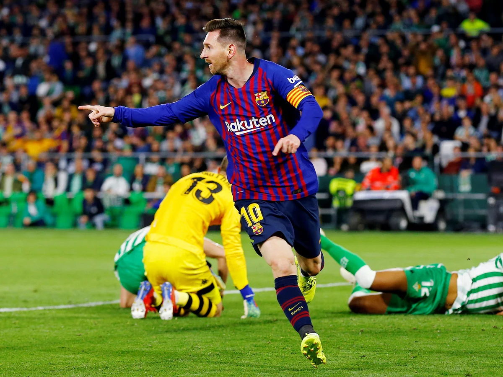

---

### Champions League

**Group Stage**
- Messi delivered several masterclass performances, including a hat trick against Ajax with a beautiful free-kick goal.
- He also scored multiple goals against Tottenham, including an incredible solo goal where he ran the entire field.

#### Round of 16: Lyon
- Messi scored several beautiful goals against Lyon.

#### Quarterfinals: Manchester United
- Messi scored a brilliant goal against Manchester United, nutmegging Fred, and added another goal in the same match.

#### Semifinals: Liverpool

**First Leg**
- Barcelona won 3-0, with Messi delivering a phenomenal performance and scoring two goals, one of which was a masterpiece.

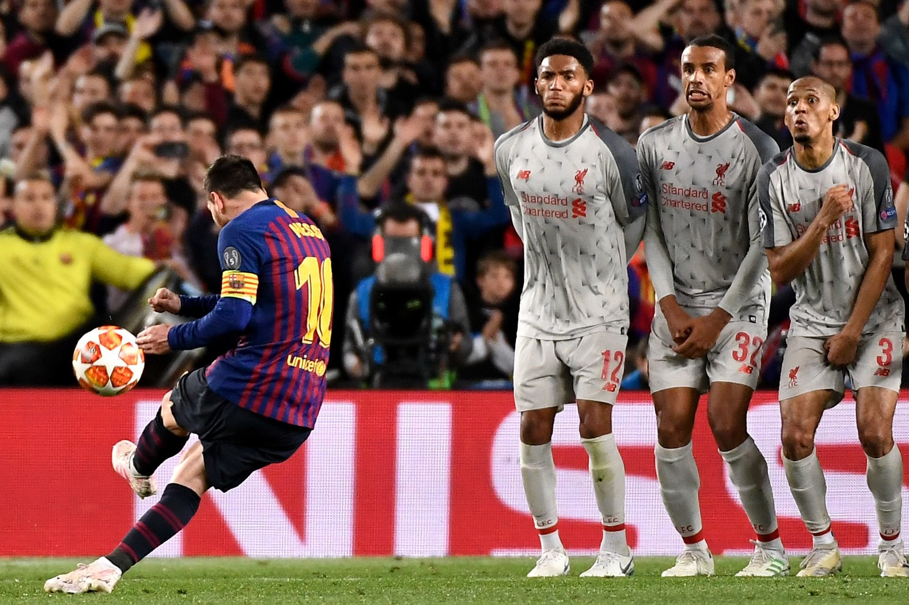

**Second Leg**
- Barcelona suffered a humiliating 4-0 defeat, getting eliminated once again after a heavy loss away from home.

---

### Copa América
Argentina lost to Brazil in the semifinals due to defensive disorganization. Messi hit the post in that match. However, they managed to secure third place by defeating Chile, which was an improvement compared to the previous two Copa Américas (both lost to Chile).

---

### Ballon d'Or #6
Messi surpassed Ronaldo, winning his sixth Ballon d'Or.

---

## 2019/2020

### Champions League

**Prelude**
- This Champions League season took place during COVID-19, so there were no home-and-away games. All matches were decided in a single leg.

#### Quarterfinals: Bayern Munich

**Game**
- Barcelona suffered an 8-2 defeat, a humiliating loss that marked the end of an era for the club. They had beaten Bayern in 2015, but this result showed how the tables had turned.
- This match symbolized the end of Messi's time at Barcelona.
- [MYTAKE] How Messi still believed he could win the World Cup after such a loss is something I will never understand.

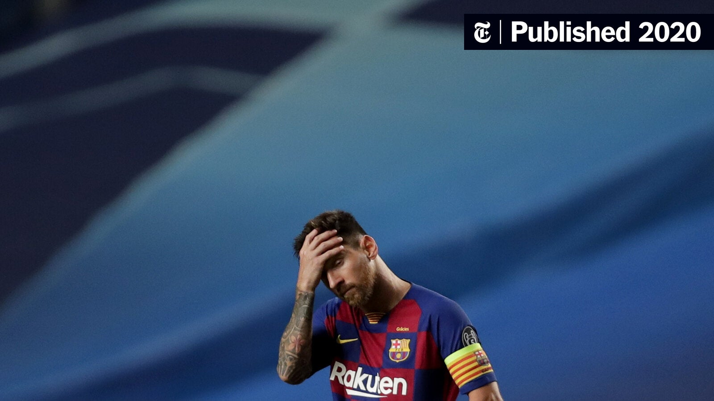

**Aftermath**
- Messi wanted to leave the club, but Barcelona prevented him from doing so.

# 2020/2021

Still very good Messi

## Champions League

### Round of 16 vs PSG

**First Leg**  
- Barcelona was eliminated from the Champions League by PSG, led by Mbappé (who would later play alongside Messi and had destroyed Argentina in the previous World Cup).
- [MYTAKE] This felt like a very depressing moment for me. It was as if, Messi was just an old lad, just a regular person. Like any team could defeat him.

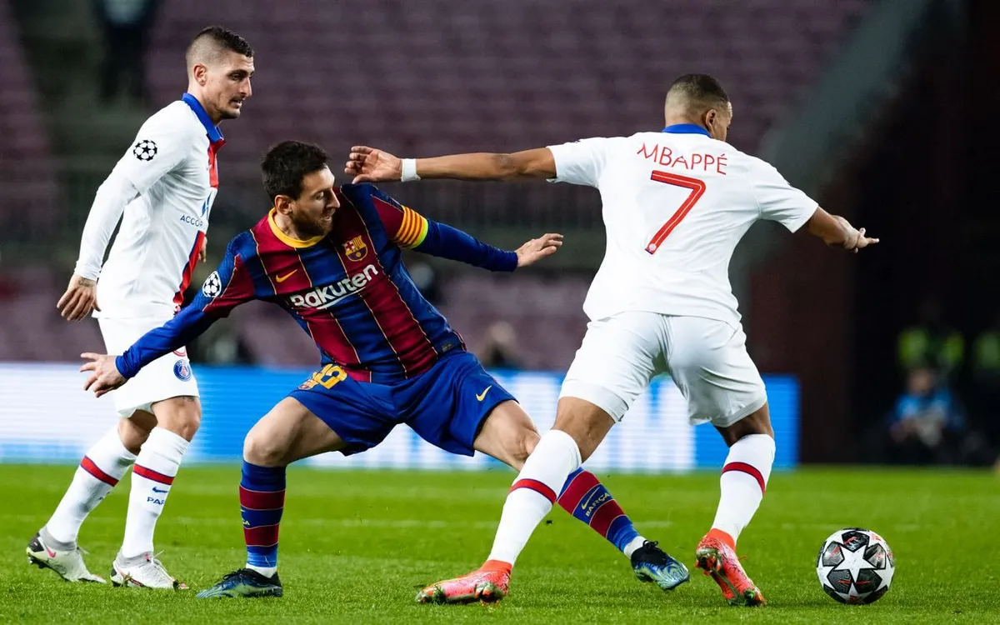

**Second Leg**  
- Messi missed a penalty in that game, further fueling his reputation as a "choker."
- [MYTAKE] What a depressive way to exit the Champions League by Messi, so bitter.

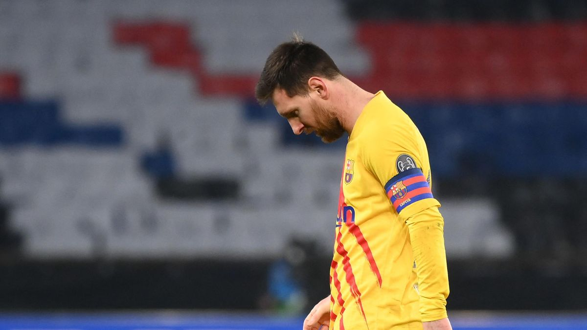

## Copa América

Messi performed exceptionally well in this Copa América, scoring many goals and providing assists, except in the final.

### Final

**Prelude**  
- The final was held at Maracanã Stadium.  
- Argentina had gone 28 years without winning a title (since 1993).  
- [MYTAKE] It's kind of funny how Argentina's title drought made the Copa América, which is usually considered a minor title, the most important thing in the world.

**0 - 1**  
- Goal by Di María, caused by a major mistake from Renan Lodi.

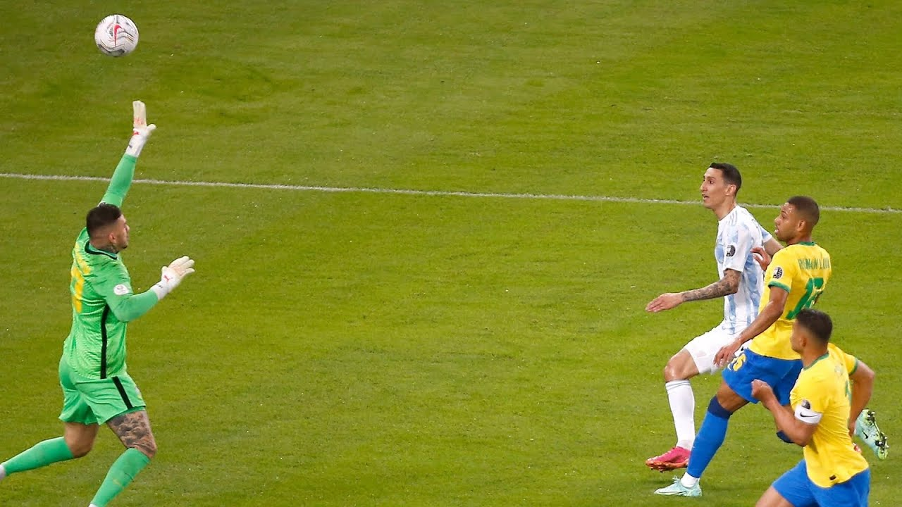

**The Final Whistle**  
- When the referee blew the final whistle, Messi knelt down and started crying, embraced by his teammates.

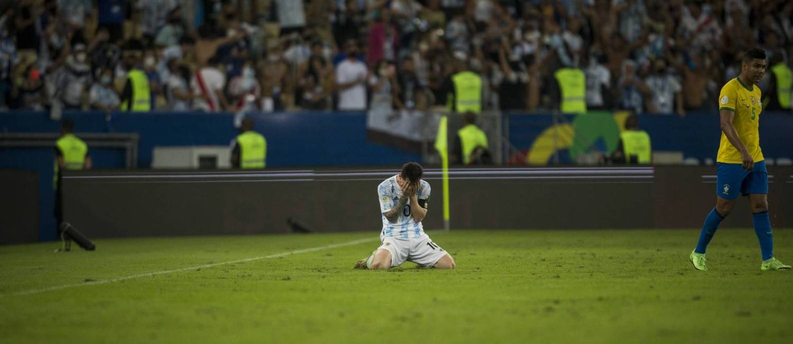

**Aftermath**  
- This Copa América win earned Messi the Ballon d'Or again.  
- The title completely changed the atmosphere around the Argentine national team, from 28 years of failure to a hopeful outlook.

Mbappé had previously stated that South American football was not as advanced as European football.

## Ballon d'Or, #7

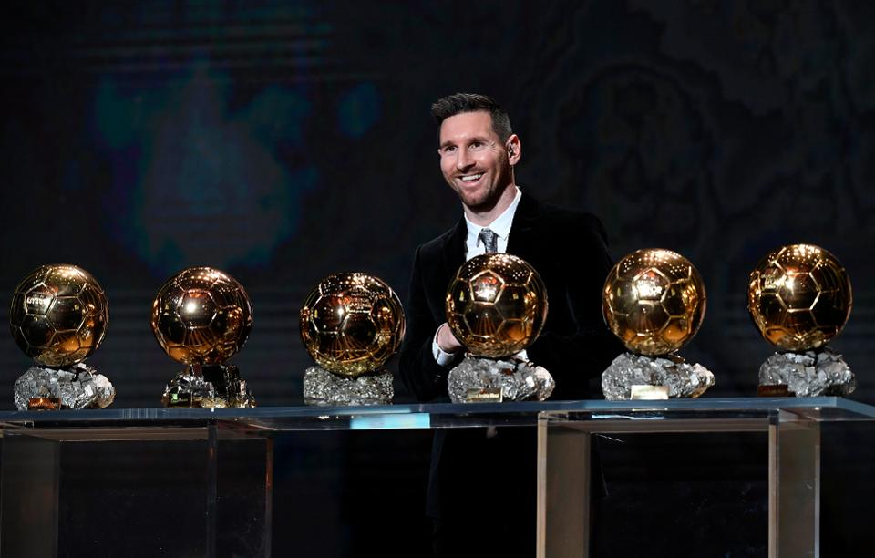

# 2021/2022

Messi left Barcelona for PSG.  
- He followed Neymar's path four years later.  
- [MYTAKE] I was very optimistic since PSG was a strong team, having reached the Champions League semi-finals the previous year. Would this finally be the moment I could see Messi win the Champions League?

## Champions League

PSG lost to Real Madrid, and Messi missed a penalty in that game.  
- [MYTAKE] So many years of failure—how was he able to endure that?

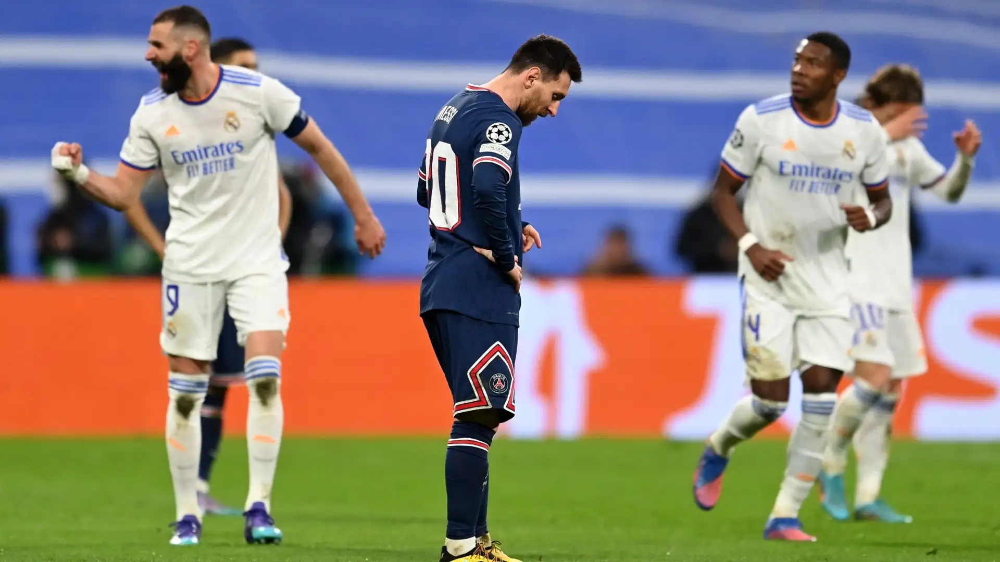

# 2022/2023

## World Cup

**Prelude**  
- Argentina had not won a World Cup title since 1986.  
- This was the first World Cup without Maradona alive.  
- Messi was 35 years old.  
- Argentina entered the tournament on a 36-game unbeaten streak.

### Group Stage

**vs Saudi Arabia**  
- 0 - 1  
- Argentina lost to Saudi Arabia in their opening match (I woke up at 2 a.m. in Seattle to watch this game).

**vs Mexico**  
- 2 - 0  
- The match against Mexico was very tough. Argentina was playing poorly, but Messi pulled off a moment of magic.  
- The coach made two bold substitutions:  
    - He replaced Lautaro Martínez (the team's second-best player in terms of reputation) with Julián Álvarez.  
    - He brought in Enzo Fernández, a very young player.  
- Messi later said this was the most difficult match of the tournament.  
- [MYTAKE] It's hard to pinpoint when Messi winning the World Cup stopped being a daydream and became a real possibility with at least a 10% chance.

**Masterpiece**  
- [Watch here](https://www.youtube.com/watch?v=zXbffJARk1Q)  
    - The first touch had to be very precise, with only 0.7 seconds.  
    - The shot had a 1.25-degree margin.

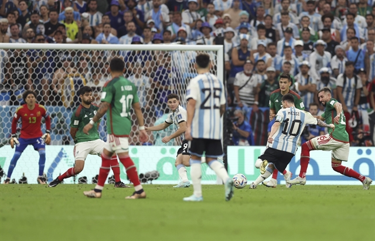

**vs Poland**  
- Messi missed a penalty against Poland, leaving me desperate, but Mac Allister scored the winning goal (Argentina wore their purple kit).  
- In 1978, Kempes missed a penalty in the third game of the World Cup. In 1986, Maradona also missed a penalty in the third game.  
- [MYTAKE] Someone should compile a list of all the prophetic signs in Messi's career. I understand overfitting, but this is absolutely insane.

### Round of 16 vs Australia

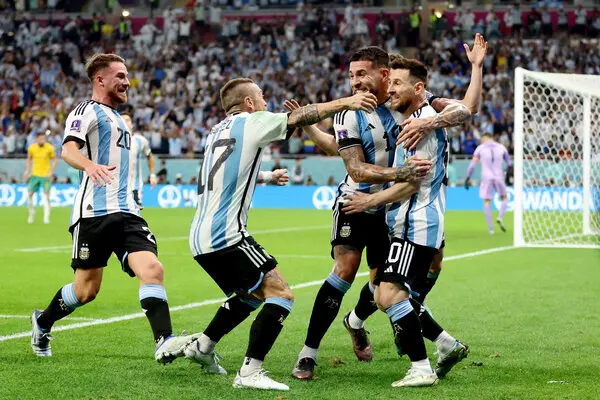

### Quarter-Finals vs Netherlands

**1 - 0**  
- Messi made an incredible assist for the first goal.  
- [MYTAKE] One of my favorite moments in Messi's career—he was truly divine on that play.

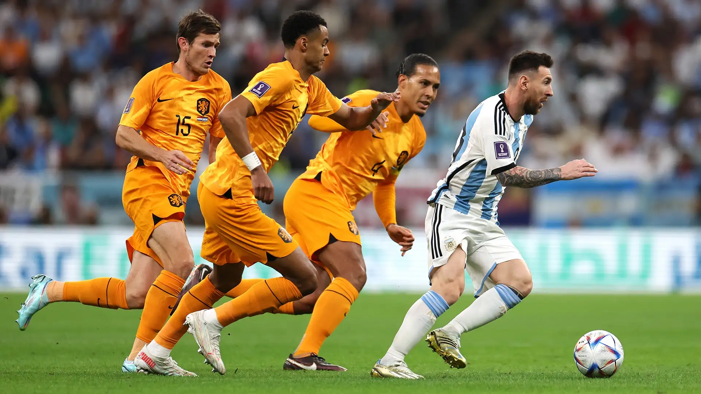

**2 - 0**  
- Messi scored a penalty and made a "talk too much" gesture toward Van Gaal (the Dutch coach, known for feuds with South American players).  
- He celebrated with Riquelme's iconic ear-cupping gesture.

Paredes kicked the ball into the Dutch bench, causing a commotion.

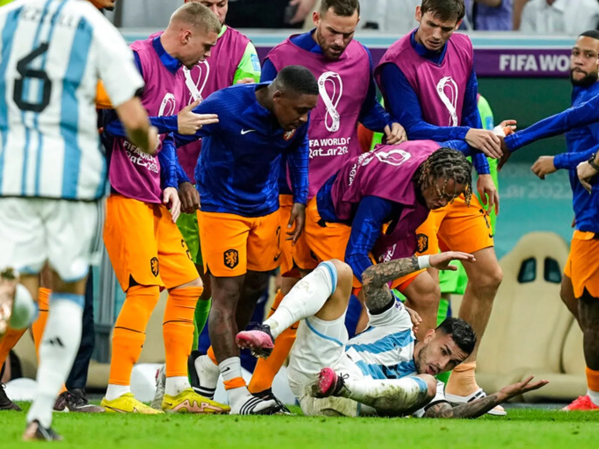

**Drama**  
- Argentina conceded an equalizer in the last minute of regular time (from a set-piece play).  
- The match went to penalties.  
- The Argentine team taunted the Dutch players after winning the shootout.  
- Messi said "What are you looking at, fool?" during the post-match interview.  
- [MYTAKE] The "What are you looking at, fool?" moment is iconic. After decades of Argentinians criticizing Messi for his lack of "Argentine behavior," he finally delivered a truly Argentine comment—something Maradona would have done.

### Semi-Final vs Croatia

**Prelude**  
- Argentina faced Croatia in the semi-finals. In the previous World Cup, Argentina had lost 3-0 to Croatia in the group stage. This time, Argentina won 3-0—a symmetrical revenge.  
- Brazil had lost to Croatia on penalties, but Argentina won comfortably.

**Masterpiece**  
- Comparable to Maradona's "Goal of the Century."  
- "History doesn't repeat itself, but it often rhymes" (Mark Twain).  
- [MYTAKE] Oh captain, my captain.

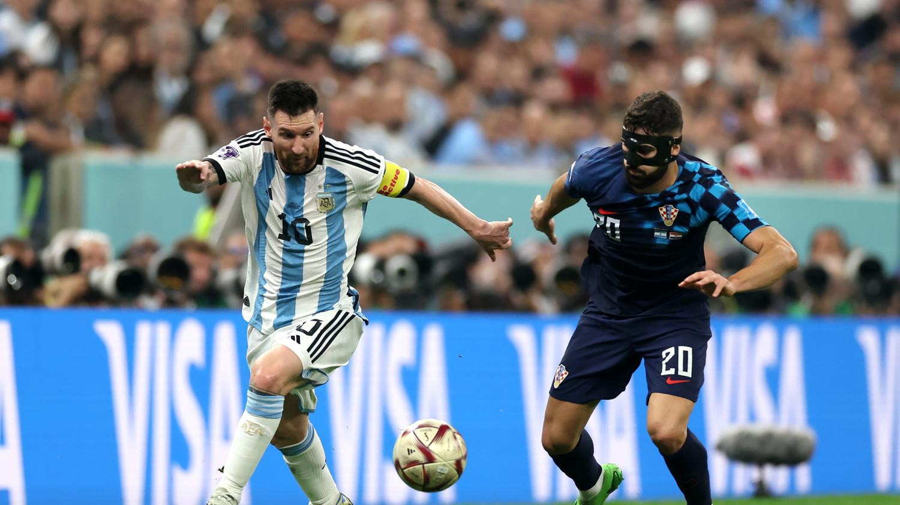

### Final vs France

**Prelude**  
- Argentina had lost to France in 2018 in a thrilling 4-3 match.  
- Messi became the player with the most World Cup appearances.  
- Di María, injured throughout the tournament, returned to play against France.

**1 - 0**  
- Di María won a penalty.  
- [MYTAKE] Oh captain, my captain.

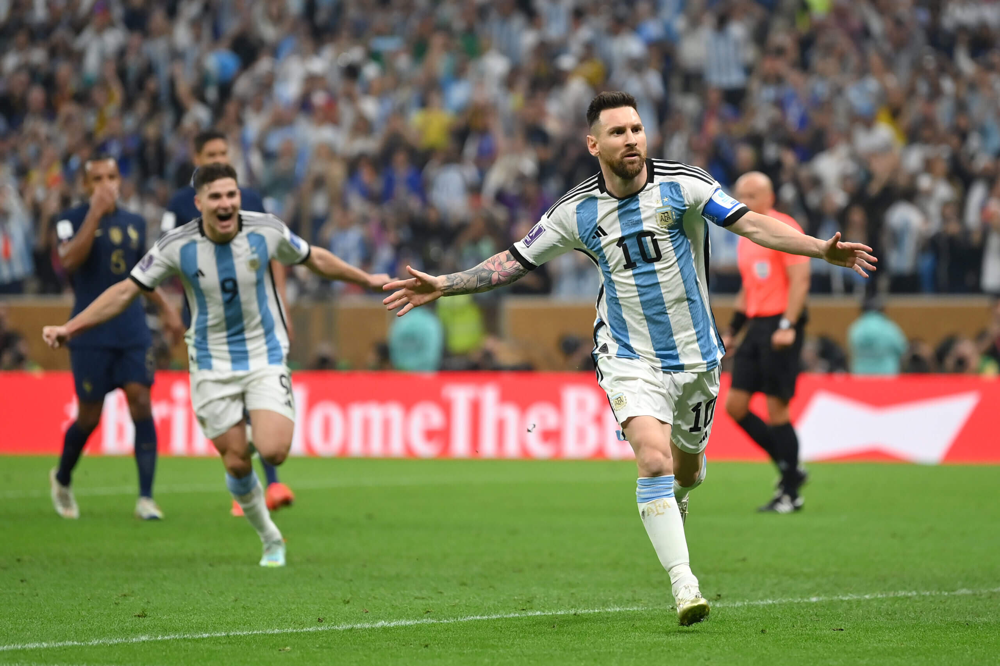

**2 - 0**  
- A beautiful counterattack by Argentina, featuring a difficult pass from Messi.

**2 - 1**  
- A silly penalty conceded—my goodness.

**2 - 2**  
- The goal started with Messi losing the ball.  
- It reminded me of Messi's previous failures with Barcelona, like the collapses against Roma and Liverpool.  
- [MYTAKE] For me, this felt like the downside of "All We Ever Knew" by The Head and the Heart. So much effort, years of waiting, so many lost games, 15 years of football—all potentially lost due to one penalty. How could this happen? Why would fate allow this? This was a tipping point in football history. Would Messi be remembered as the GOAT, alongside Pelé and Maradona, or as a player with a disappointing international career?

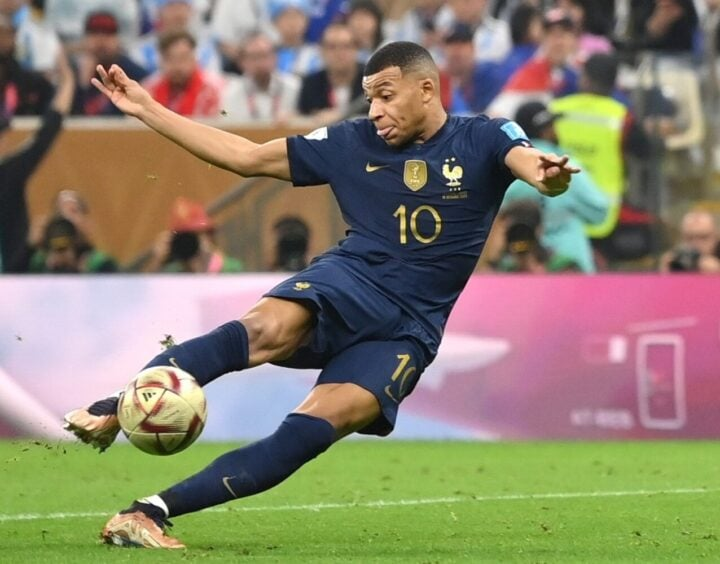

# Extra Time

## Match Highlights

### 3 - 2
- The third goal was suspenseful because it was unclear if the ball had crossed the line.

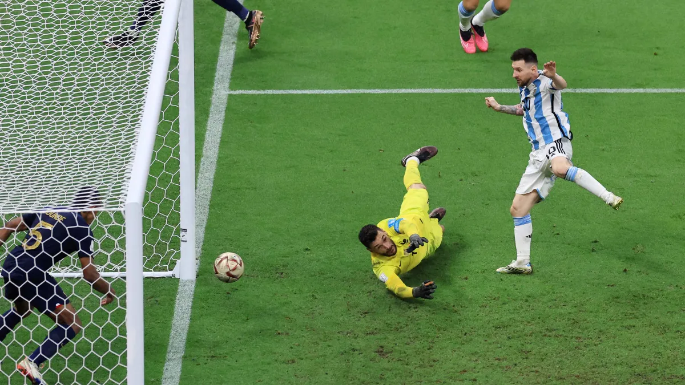

### 3 - 3
- Mbappé scored again, completing a hat-trick.
- Bruno Formiga broke a wall in the studio when Mbappé equalized for the second time.
- **[MY TAKE]** 😂 It can't get more Argentinian than this.

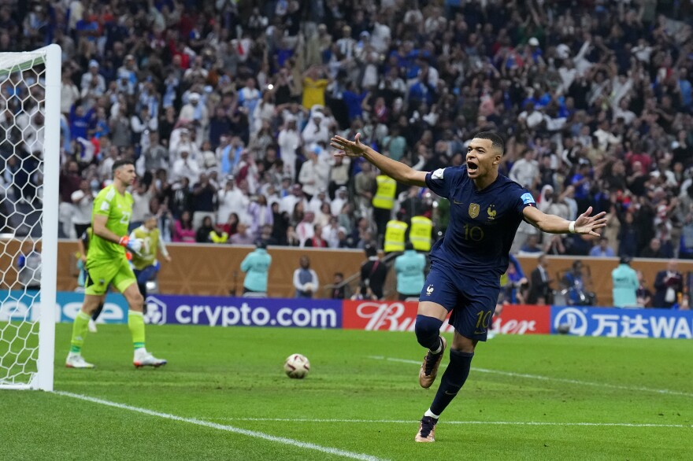

### Miracle Save
- Emiliano Martínez made a miraculous save just before the game ended, sending it to penalties.
- **[MY TAKE]** 😂 An unknown Aston Villa goalkeeper saving the GOAT's career.

## Penalty Kicks
- Emiliano Martínez saved a penalty.
- "Puede ser hoy, Abu" ("It could be today, Grandpa") — Messi said this before Montiel's decisive penalty.
- **[MY TAKE]** Montiel scored the title-winning penalty (ironically, he had conceded the penalty that led to Mbappé's 3-3 equalizer).
- **[MY TAKE]** Montiel's tears perfectly represent years of waiting and expectation for this moment.
- **[MY TAKE]** It's funny because, for most people, this game was just entertainment: "Oh, today is the World Cup final, let's watch for fun." But for me, this was literally what I had been waiting for my entire life. How many times had I daydreamed about this moment? I still can't believe it actually happened. After the 2018 World Cup, it seemed so unlikely. How did a struggling Argentinian team with a fading Messi manage to win the World Cup? If this isn't a miracle, I don't know what is.

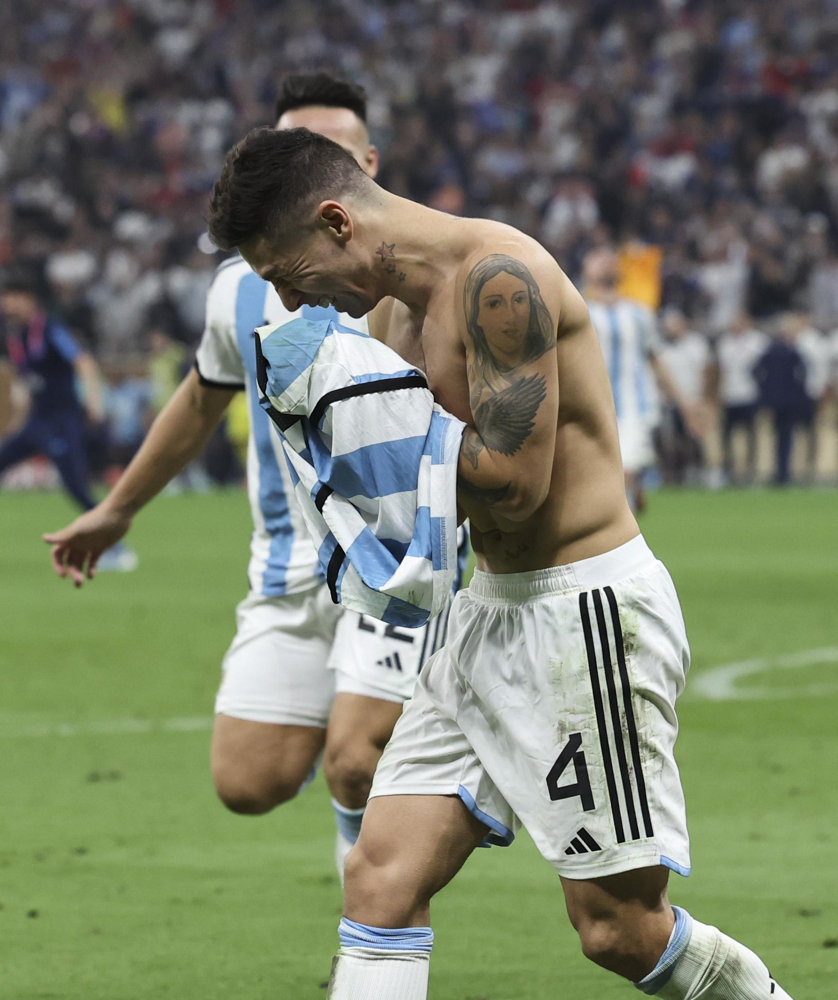

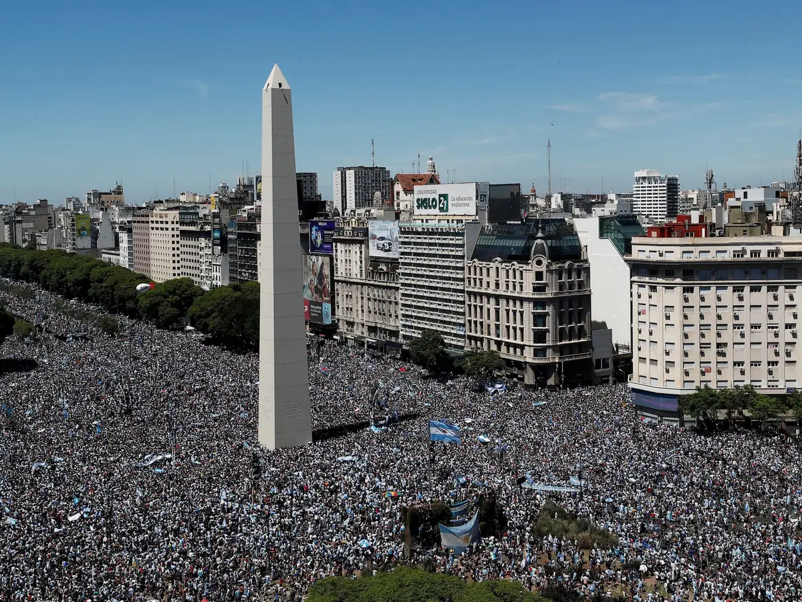

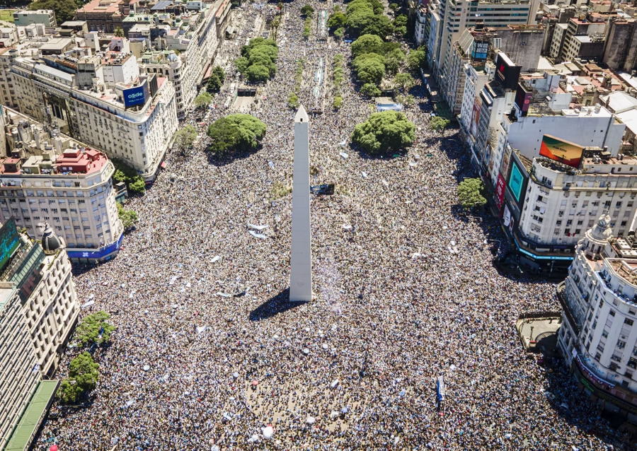

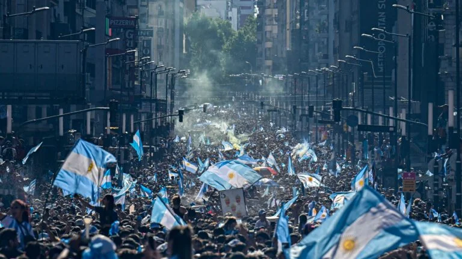

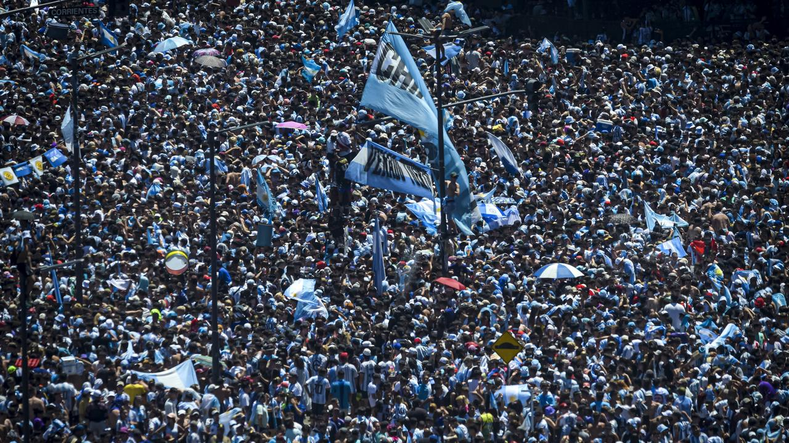

## Celebration with the Team
- 5 million people attended the celebration in Buenos Aires, a city with a population of 15 million.

## Aftermath
- Widely regarded as the greatest World Cup final ever.
- Emiliano Martínez made a cheeky gesture with the Best Goalkeeper trophy.
- 1 billion people watched the final.
- Messi's World Cup victory photo became the most-liked post on Instagram.

---

# Ballon d'Or #8

Messi won his eighth Ballon d'Or on Maradona's birthday and paid tribute to him.

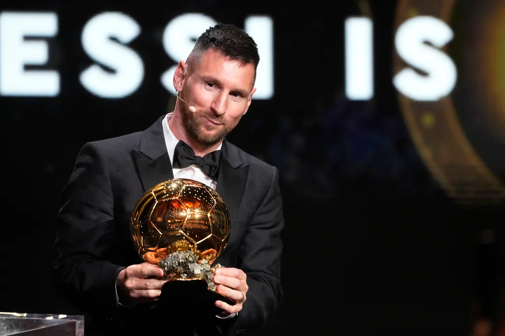

---

# World Cup Recap

When Messi retired, heartbroken, in 2016, a 15-year-old boy from San Martín tweeted to him, saying it was the Argentinian fans who had let him down, not the other way around. He urged Messi to play for fun, reminding him of the joy he brought to others. Six years later, that boy, Enzo Fernández, played alongside Messi and won the Young Player of the Tournament award.

It's ironic that Messi scored so many penalties in this World Cup, as penalties had always been his Achilles' heel, especially in decisive moments.

### Goalkeeper Lore
- Argentina suffered for years with poor goalkeepers, but Emiliano Martínez emerged as an unlikely hero, making crucial saves throughout the tournament.

### Mbappé Lore
- It's poetic that the final was against Mbappé, who had eliminated Messi in the 2018 World Cup and the 2021 Champions League. They were also teammates at PSG.

### Leadership Transformation
- It's remarkable that Messi finally became a true leader, overcoming one of his biggest challenges with the Argentinian national team.

### Redemption Arc
- It's crazy that Messi won the World Cup, his first major title in seven years, with the Argentinian national team — his long-standing Achilles' heel.

### Parallels to Maradona
- Messi played for PSG, a French team, during the World Cup, creating a parallel to Maradona, who defeated Italy in the 1990 World Cup while playing for an Italian club.
- Messi was born one year after Argentina's 1986 World Cup victory, just like the Avatar's reincarnation cycle.

### Parallels to Jesus
- Messi (the "Messiah") finally fulfilled the promise of saving Argentina, a nation founded by Maradona ("God").

---

# 2024

Messi moved to Inter Miami, a team that was in last place. Since his arrival:
- The team won a cup.
- They reached another final but lost because Messi was injured.
- Messi lost only one game as a starter.

David Beckham owns Inter Miami.

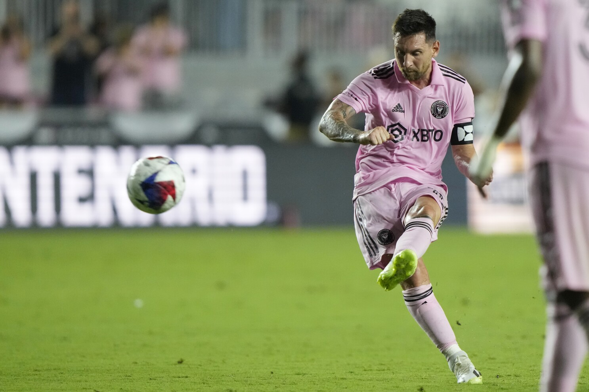

---

# Videos

- [Mauro Cezar on Messi's World Cup Win](https://www.youtube.com/watch?v=1nbavGjEtIM&t=65s)
- [Ronaldinho and Messi](https://www.youtube.com/watch?v=GA2z49VWR6U&t=324s)
- [Bruno Formiga After the World Cup](https://www.youtube.com/watch?v=TtQfaMBCI1o&t=1078s)

---

# My Favorite Things About Messi

1. The archetype of a genius.
2. Shinji Ikari syndrome (reluctant hero).
3. The archetype of a son who struggles to surpass his father.
4. Argentinian fans are crazy (Boca Juniors fans are the third wildest, and Newell's Old Boys fans are the seventh).
5. He became a leader and won a World Cup at 35 — highly improbable at that age.
6. He lost countless titles with the Argentinian national team.
