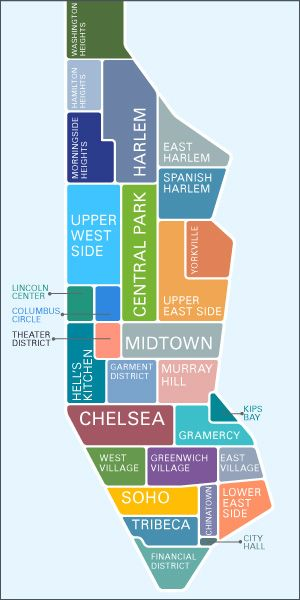
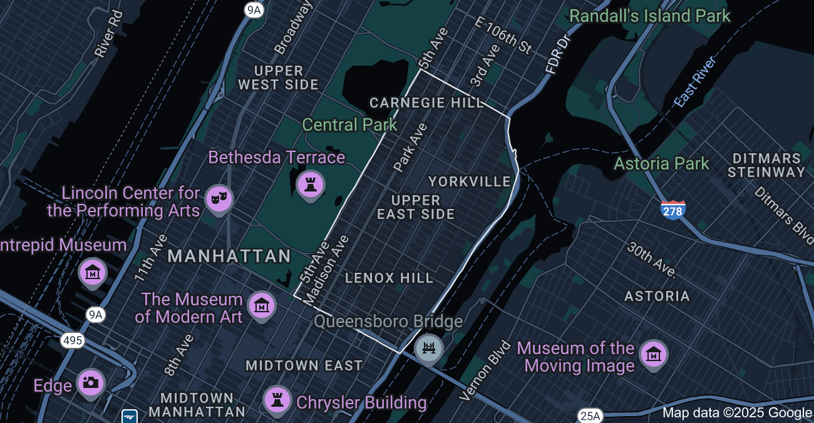
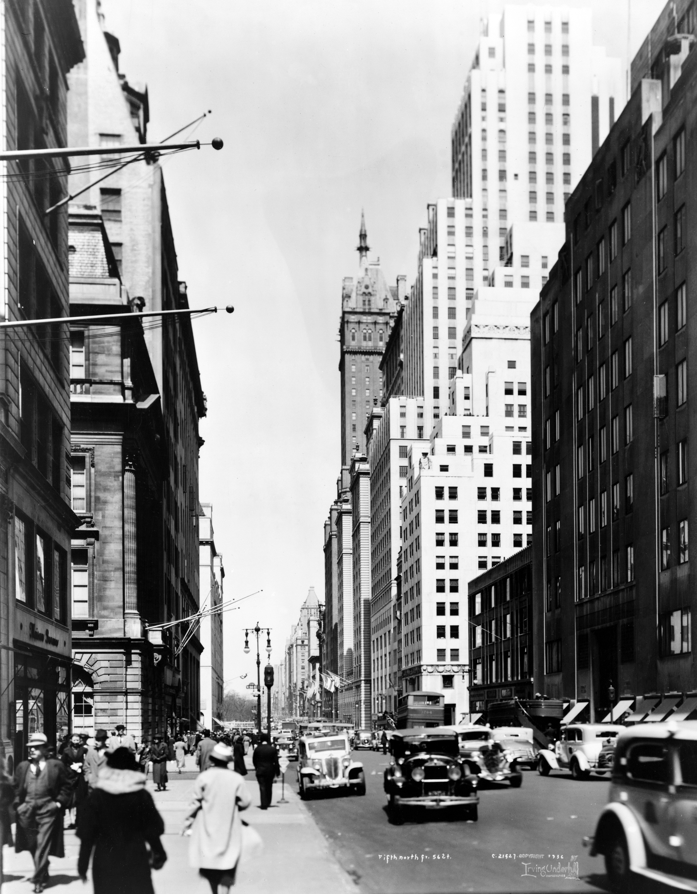
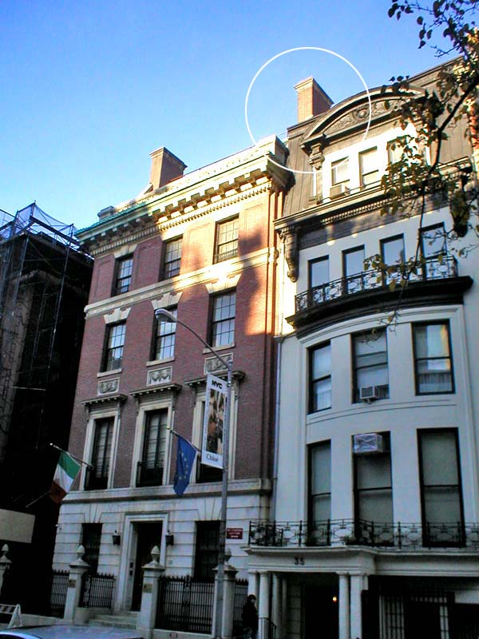
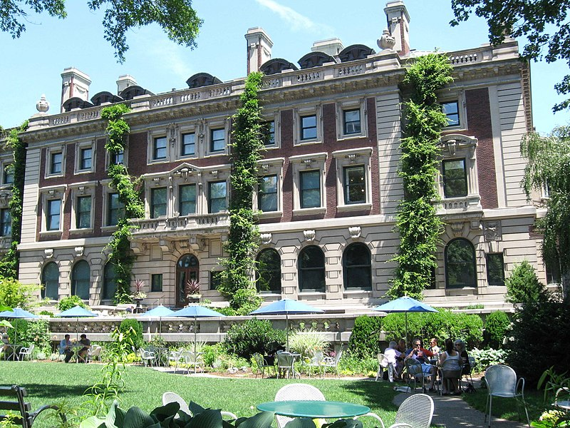
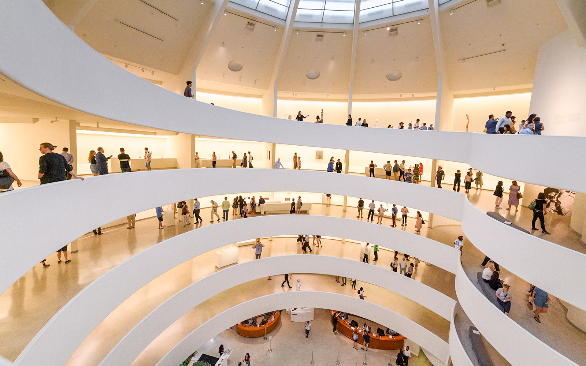
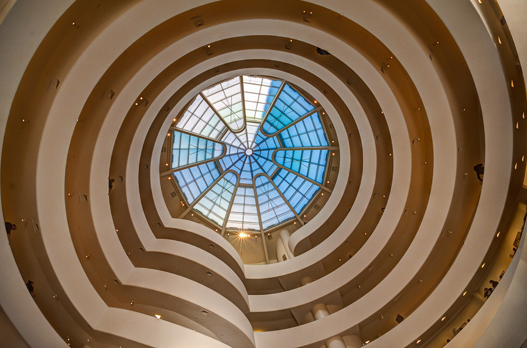
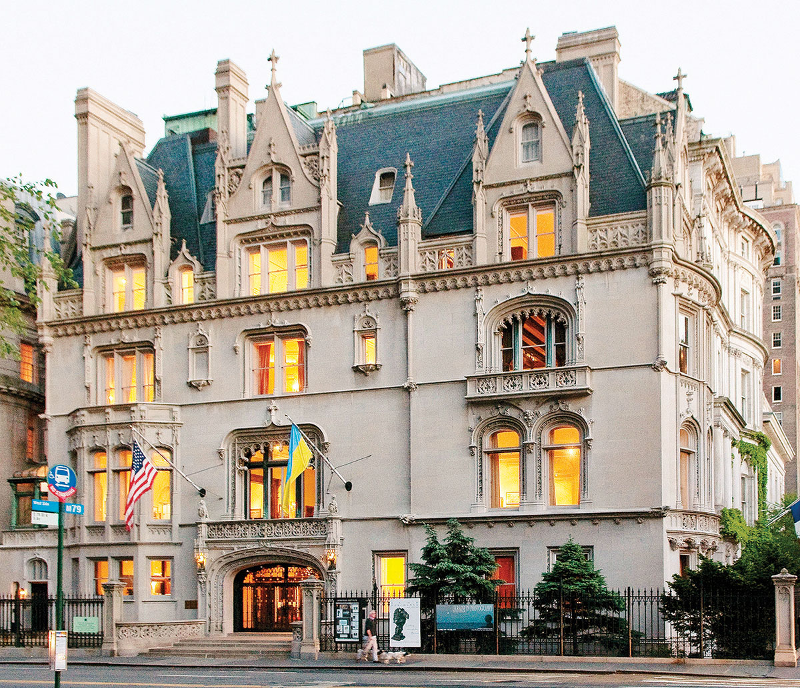

## History

As commerce moved further and further up Fifth Avenue in the post-Civil War period, New York’s upper class families became concerned that there would be no end to such encroachments (they were partly right, and the avenue from 14th to 63rd Streets is now largely commercial)

The rich people used to live in more south to upper east side, it was only in 1895 where Caroline Astor moved to upper east side that it became
socially acceptable for those old money people to move there as well

## Personalities

Most members of New York's upper-class families have made residences on the Upper East Side, including the oil-rich Rockefellers,[34] political Roosevelts, political dynastic Kennedys,[35] thoroughbred racing moneyed Whitneys,[36][37] and tobacco and electric power fortuned Dukes.[38]

## Woody Allen

### Annie Hall

Annie Hall's apartment
- [EXTREMELY IMPORTANT!!!!!!!!!!!!!!!!!!] which still exists on East 70th Street between Lexington Avenue and Park Avenue is by Allen's own confession his favorite block in the city
- Peter Cowie argues that the film shows "a romanticized view" of the borough, with the camera "linger[ing] on the Upper East Side [... and where] the fear of crime does not trouble its characters."[72] By contrast, California is presented less positively, and David Halle notes the obvious "invidious intellectual comparison" between New York City and Los Angeles.[73] While Manhattan's movie theaters show classic and foreign films, Los Angeles theaters run less-prestigious fare such as The House of Exorcism and Messiah of Evil.[72] Rob's demonstration of adding canned laughter to television demonstrates the "cynical artifice of the medium".[72] New York City serves as a symbol of Alvy's personality ("gloomy, claustrophobic, and socially cold, but also an intellectual haven full of nervous energy") while Los Angeles is a symbol of freedom for Annie.[70]

## Andrew Carnegie Mansion

The land was purchased in 1898 in secrecy by Carnegie, more than a mile north of what was then fashionable society, in part to ensure there was enough space for a garden.[8] He asked his architects Babb, Cook & Willard for the "most modest, plainest, and most roomy house in New York"
- This is fucking crazy to me. ThIS guy has a fucking mansion in the FUCKING FIFTH AVENUE!!! HOW MUCH MONEY DOES THIS GUY FUCKING HAVE!!!!

## Metropolitan Museum

- Most visited museum of the united states
- Fifth most visited art museumf of the world
- It has Autumn Rhythm by Jackson Pollock

## Guggenheim

- The museum has the world's largest collection of paintings by Wassily Kandinsky and rich holdings of works by Pablo Picasso, Paul Klee, and Joan Miró, among others
- Main focus is modern and contemporary art
- The architecture was done by Frank Lloyd Wright, a canonical example of contemporary art

- Spiral ramp

## Ukranian America Institute

French architecture
- An example of the ecletic architecture style of UES

## Lenox Hill

The only voting district that had more votes for Trump than Kamala in Manhattan
- So much old money

## Cook Block

In the 1870s Henry Cook, a banker, purchased the block between Fifth and Madison Avenues and East 78th and 79th Streets for the sole purpose of erecting a firewall of sorts against the incursions of hotels and department stores. He built a large, rather dour stone mansion on the corner of East 78th and Fifth and then parceled out the rest of the block with the stipulation that only single family houses would be permitted to be constructed and that these building should be in what an approving New York Times article of the day called a “splendid style

## Films

Breakfast at tifanny's

Kramer vs Kramer

Manhattan

The Devial wears Prada

## Books

Catcher in the Rye

