# Map

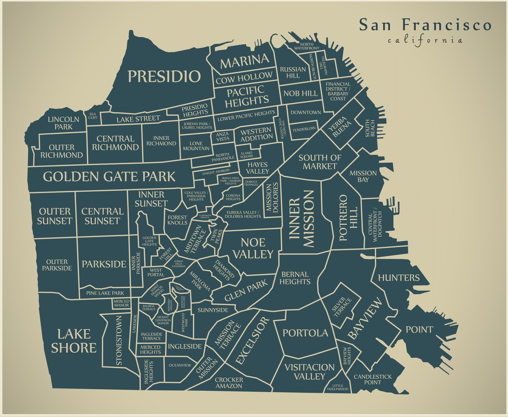

# Russian hill

Lombard street

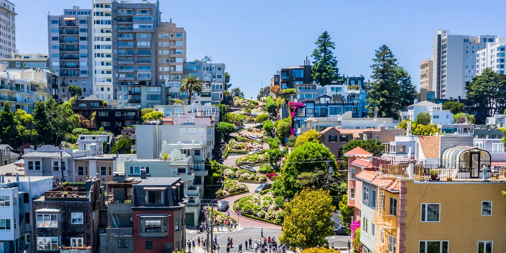

# Pacific Heights

- Billionaries row
- Founder of o

# South of Market

Prelude
- In 2024 this was the most expensive neighborhood per square foot in the united states
- $5,415 per square foot

Businesses
- Many major software and technology companies have headquarters and offices here, including Ustream,[33] Planet Labs,[34] Foursquare,[35] Cloudflare,[36][37] Wikia,[citation needed] Wired, GitHub, Pinterest,[38] CBS Interactive,[39] LinkedIn, Trulia, Dropbox,[40] IGN, Salesforce,[41] BitTorrent Inc., Yelp,[42] Zynga,[43] Airbnb,[44] Uber,[45] Advent Software,[46][47] Pac-12 Networks,[48] and Yeti

Airbnb Headquarters

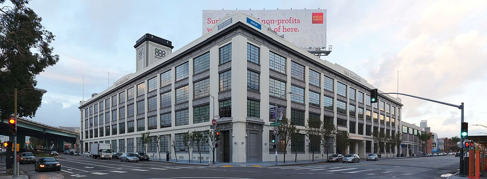

Inside Airbnb headquarters

Salesforce tower
- Tallest building in SF

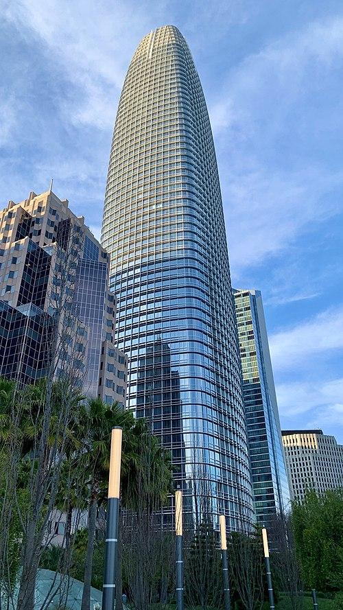

# Downtown

Transamerica building
- The CEO of transamerica wanted more light onto that street, and the
city planners wanted more vantage points, so they
reconciled with that shape
- They had to put some extra work to make sure that the windows were not
inclined

Haldie building
- Though credited as the first American building to feature glass curtain walls
- A lot of sky scrapers is a progeny of this idea

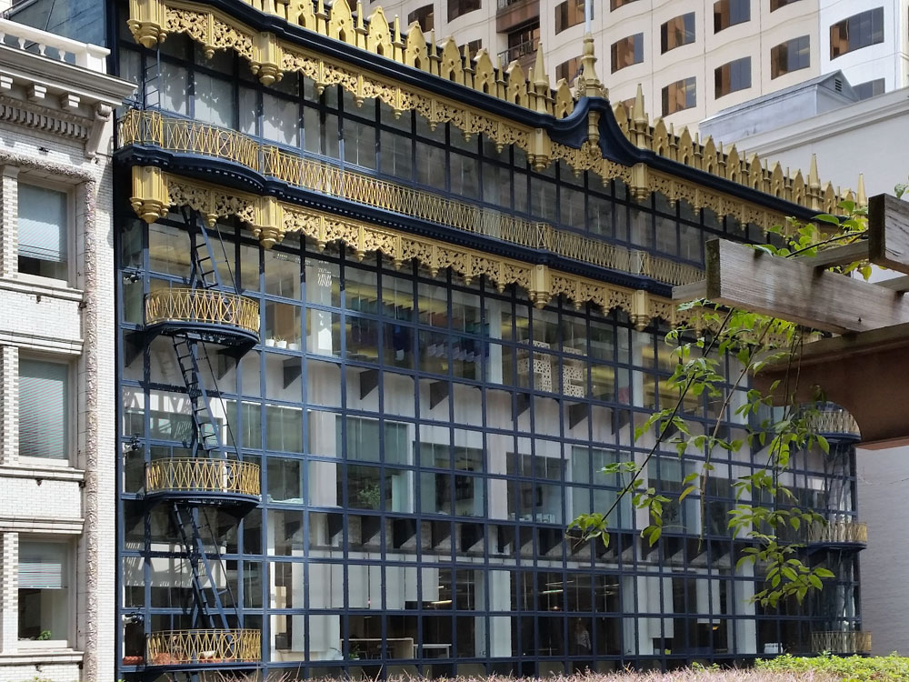

# Mission bay

Golden State Warriors
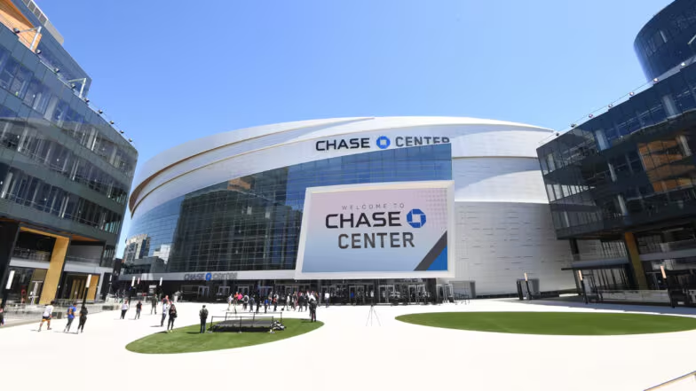

# Mission district

Mission dolores park

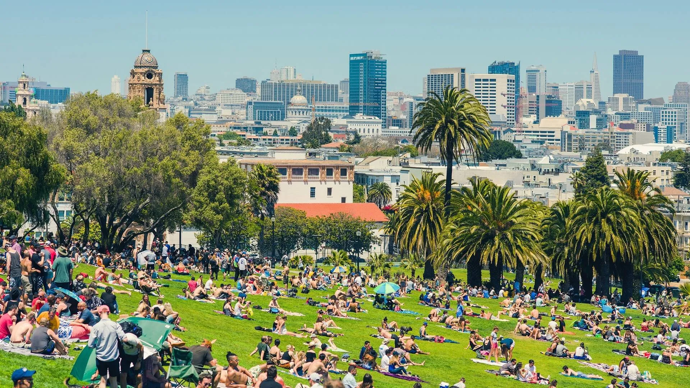

# Tenderloin

The area has a reputation for crime and has among the highest levels of homelessness and crime in the city. It is the center of the fentanyl crisis in San Francisco.

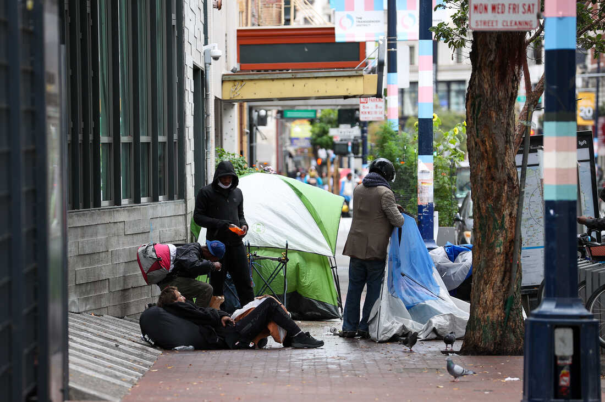

# Twin Peaks

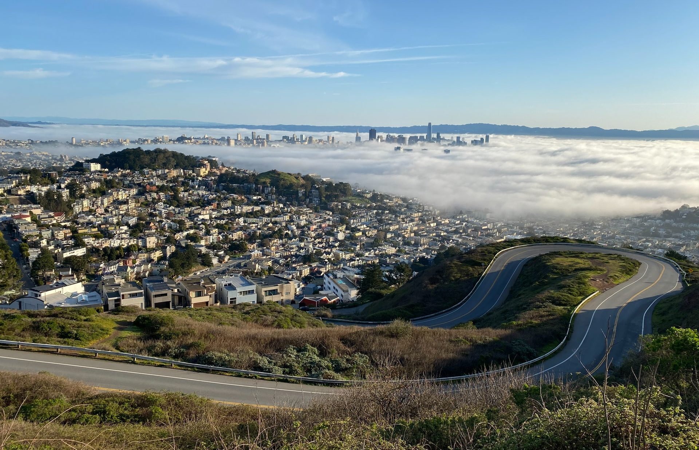

# Telegraph hill

Coit Tower
- art deco

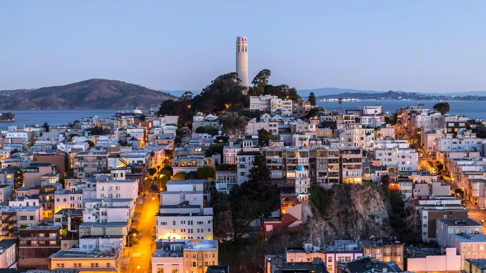

# Alamo Square

Painted ladies

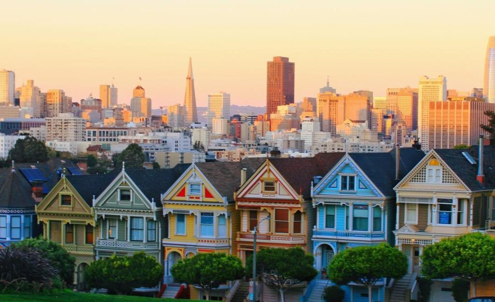

# Outer Sunset

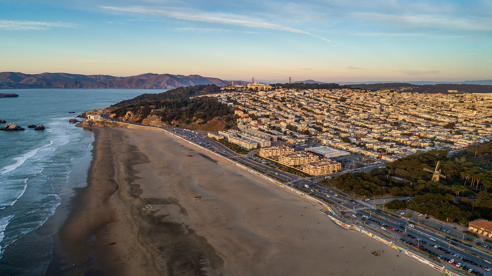

# Presidio

Prelude
- The Presidio has served as a military reservation from its establishment in 1776 as Spain's northern-most outpost of colonial power in the New World. It was one of the longest-garrisoned posts in the country and the oldest installation in the American West

