---

title: Sports/World cup
order: 3
description: The best thing every four years 

---

# FIFA World Cup Summary (1958 - Present)

## 1958 FIFA World Cup (Sweden)

### Quarter-finals
- France 4–0 Northern Ireland  
- West Germany 1–0 Yugoslavia  
- Brazil 1–0 Wales  
- Sweden 2–0 Soviet Union  

### Semi-finals
- Brazil 5–2 France  
- Sweden 3–1 West Germany  

### Final
- Brazil 5–2 Sweden  

## 1962 FIFA World Cup (Chile)

### Quarter-finals
- Chile 2–1 Soviet Union  
- Brazil 3–1 England
- - Garrincha played very well that game

- Yugoslavia 1–0 West Germany  
- Czechoslovakia 1–0 Hungary  

### Semi-finals
- Brazil 4–2 Chile  
- Czechoslovakia 3–1 Yugoslavia  

### Final
- Brazil 3–1 Czechoslovakia

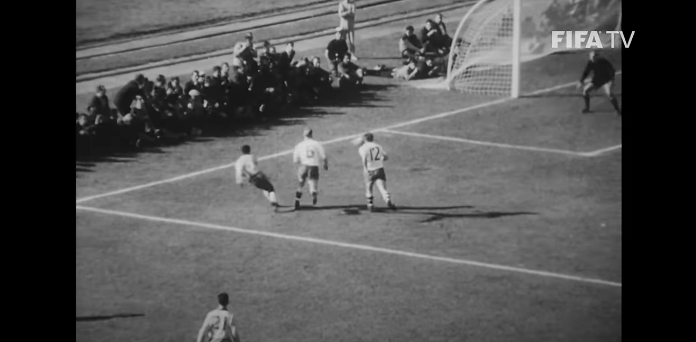

## 1966 FIFA World Cup (England)

### Quarter-finals
- England 1–0 Argentina  
- West Germany 4–0 Uruguay  
- Portugal 5–3 North Korea  
- Soviet Union 2–1 Hungary  

### Semi-finals
- England 2–1 Portugal  
- West Germany 2–1 Soviet Union  

### Final
- England 4–2 West Germany (AET)  

## 1970 FIFA World Cup (Mexico)

### Quarter-finals
- Brazil 4–2 Peru  

- Uruguay 1–0 Soviet Union (AET)  
- West Germany 3–2 England (AET)  
- Italy 4–1 Mexico  

### Semi-finals
- Brazil 3–1 Uruguay

- Italy 4–3 West Germany (AET)  

### Final
- Brazil 4–1 Italy  

## 1974 FIFA World Cup (West Germany)

## Group stage
Argentina vs Netherlands (4-0)
- Cruyff provided an amazing goal and a great assist as well

### Semi-finals (Second Group Stage Winners)
- Netherlands 2–0 Brazil
- West Germany 1–0 Poland

### Final
- West Germany 2–1 Netherlands  

## 1978 FIFA World Cup (Argentina)

### Semi-finals (Second Group Stage Winners)
- Argentina 6–0 Peru  
- Netherlands 2–1 Italy  

### Final
- Argentina 3–1 Netherlands (AET)
- - It's funny because the goals from argentina are disorganized. Whereas Holland had a football philosophy, theory, structure and all of that

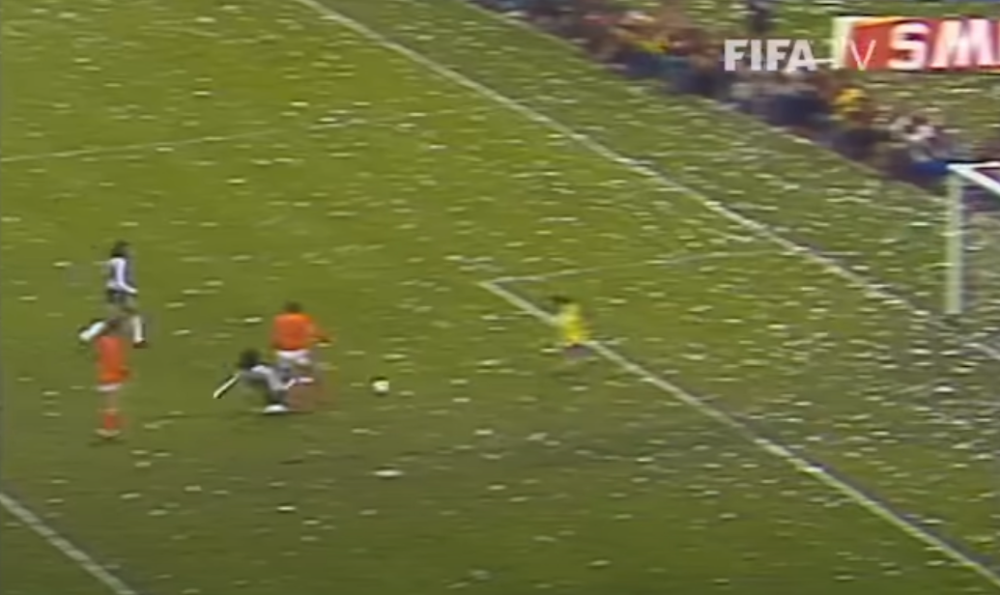
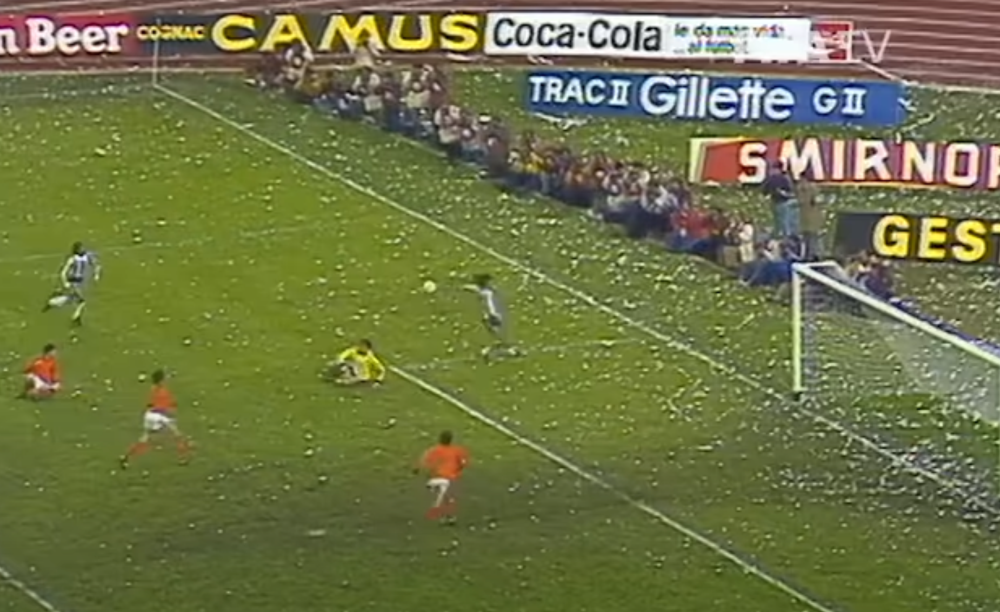

## 1982 FIFA World Cup (Spain)

### Group stage

On the group stage, Italy had three draws, no one could ever imagine that they would reach this far

### Quarter-finals
- Italy 3–2 Brazil  
- West Germany 5–4 France (Penalties, after 3–3 AET)  
- Poland 0–0 Soviet Union (Poland advanced)  
- France 4–1 Northern Ireland  

### Semi-finals
- Italy 2–0 Poland  
- West Germany 3–3 France (West Germany won on penalties)  

### Final
- Italy 3–1 West Germany  
- Paolo Rossi said in an interview that this goal epitomizes his football style

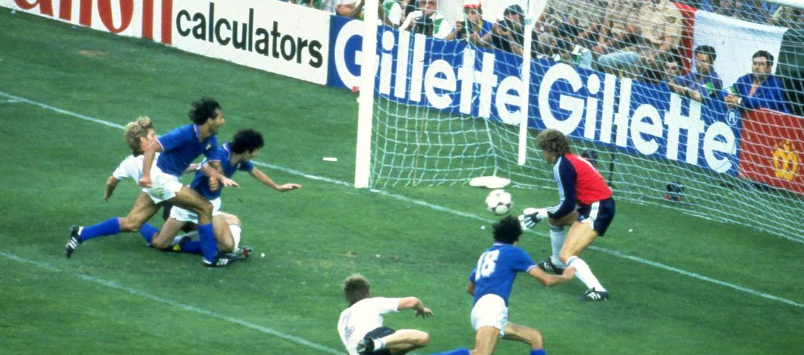

## 1986 FIFA World Cup (Mexico)

### Quarter-finals
- Argentina 2–1 England  
- West Germany 0–0 Mexico (West Germany won on penalties)  
- France 1–1 Brazil (France won on penalties)
- - There was a driver that taught me how to drive that, was named after this defaeat. His father promised that if France won, he would name his kid after Michel Platini

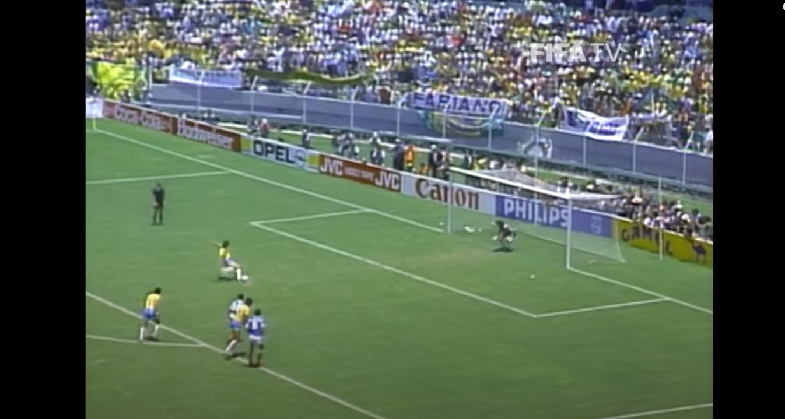

- Belgium 1–1 Spain (Belgium won on penalties)  

### Semi-finals
- Argentina 2–0 Belgium  
- West Germany 2–0 France  

### Final
- Argentina 3–2 West Germany  

## 1990 FIFA World Cup (Italy)

This world cup was so ugly

### Quarter-finals
- Argentina 3–2 Yugoslavia (Penalties)  
- Italy 1–0 Republic of Ireland  
- West Germany 1–0 Czechoslovakia  
- England 3–2 Cameroon (AET)  

### Semi-finals
- Argentina 1–1 Italy (Argentina won on penalties)
- West Germany 1–1 England (West Germany won on penalties)

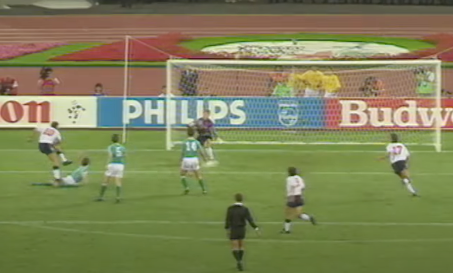

### Final
- West Germany 1–0 Argentina  

## 1994 FIFA World Cup (USA)

### Quarter-finals
- Brazil 3–2 Netherlands  
- Sweden 2–2 Romania (Sweden won on penalties)  
- Italy 2–1 Spain  
- Bulgaria 2–1 Germany

### Semi-finals
- Brazil 1–0 Sweden  

- Italy 2–1 Bulgaria  

### Final
- Brazil 0–0 Italy (Brazil won on penalties)  

## 1998 FIFA World Cup (France)

### Quarter-finals
- Brazil 3–2 Denmark

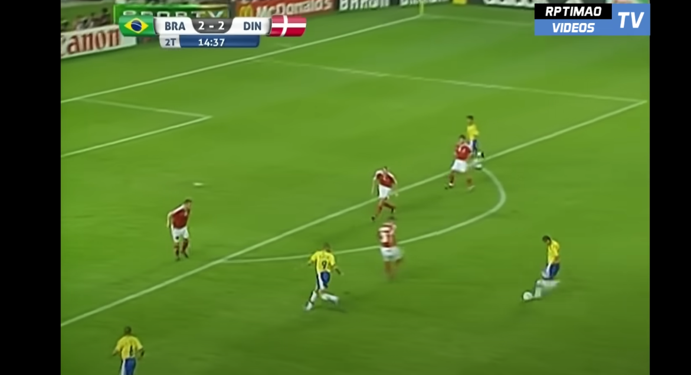

- Netherlands 2–1 Argentina

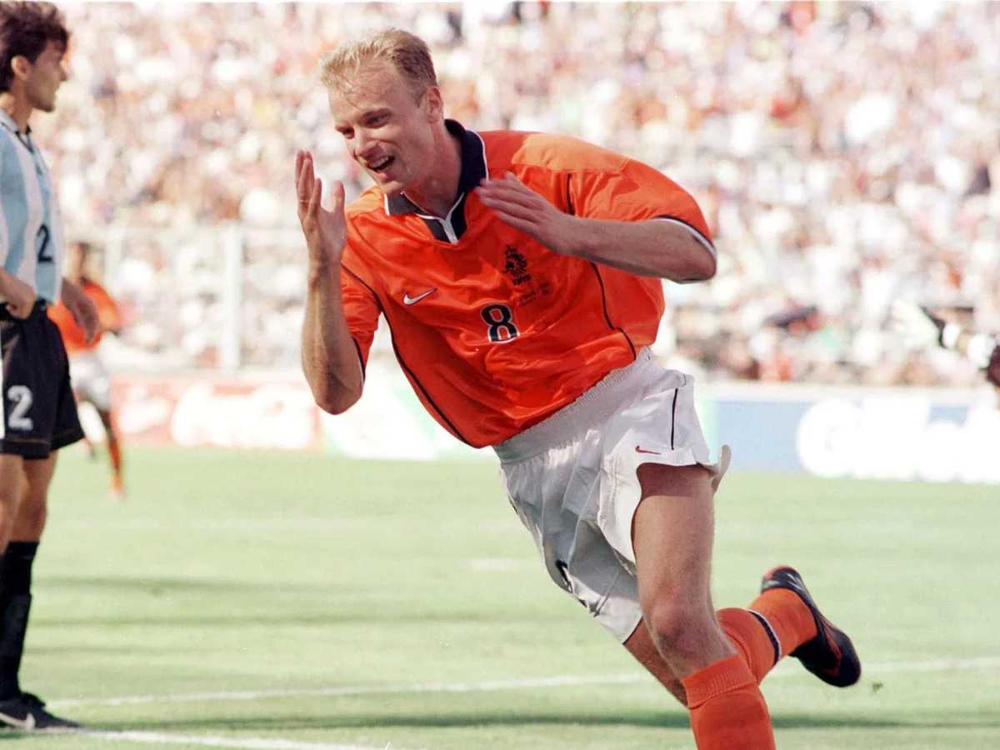

- France 0–0 Italy (France won on penalties)  
- Croatia 3–0 Germany  

### Semi-finals
- Brazil 1–1 Netherlands (Brazil won on penalties)

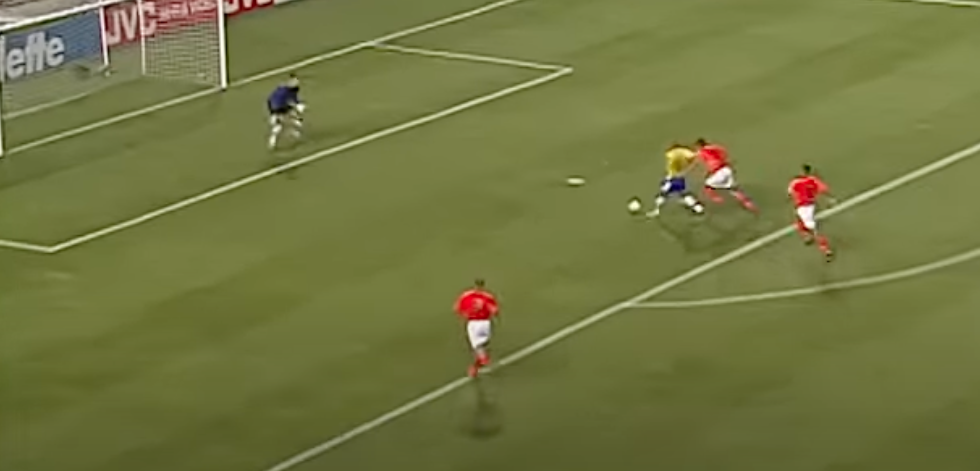

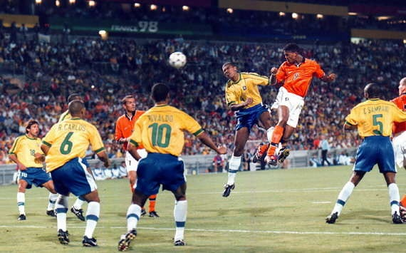
- France 2–1 Croatia  

### Final
- France 3–0 Brazil

## 2002 FIFA World Cup (South Korea/Japan)

### Quarter-finals
- Germany 1–0 USA

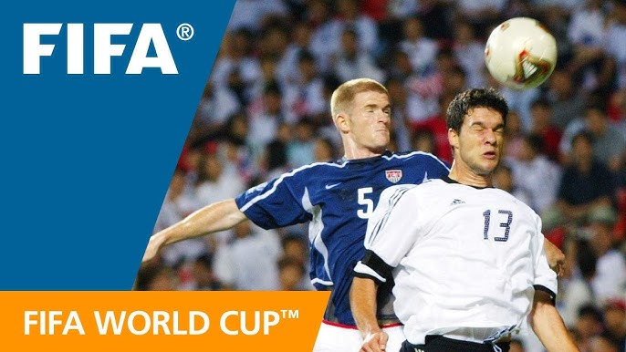

- South Korea 0–0 Spain (South Korea won on penalties)  
- Brazil 2–1 England
- - The most Brazilian victory of that world cup
- Turkey 1–0 Senegal (AET)  

### Semi-finals
- Germany 1–0 South Korea  
- This is a very typical Germany win, boring as fuck

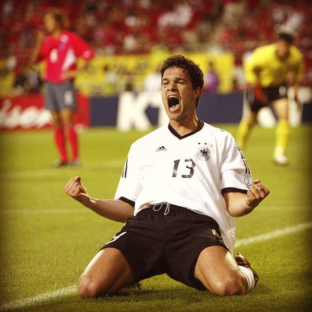
- Brazil 1–0 Turkey  

### Final
- Brazil 2–0 Germany  

## 2006 FIFA World Cup (Germany)

### Quarter-finals
- Germany 1–1 Argentina (Germany won on penalties)  
- Italy 3–0 Ukraine  
- Portugal 0–0 England (Portugal won on penalties)  
- France 1–0 Brazil  

### Semi-finals
- Italy 2–0 Germany (AET)  
- France 1–0 Portugal

### Final
- Italy 1–1 France (Italy won on penalties)  

## 2010 FIFA World Cup (South Africa)

### Quarter-finals
- Netherlands 2–1 Brazil  
- Uruguay 1–1 Ghana (Uruguay won on penalties)  
- Germany 4–0 Argentina  
- Spain 1–0 Paraguay  

### Semi-finals
- Netherlands 3–2 Uruguay  

- Spain 1–0 Germany  

### Final
- Spain 1–0 Netherlands (AET)  

## 2014 FIFA World Cup (Brazil)

### Quarter-finals
- Germany 1–0 France  
- Brazil 2–1 Colombia  
- Argentina 1–0 Belgium  
- Netherlands 0–0 Costa Rica (Netherlands won on penalties)  

### Semi-finals
- Germany 7–1 Brazil  
- Argentina 0–0 Netherlands (Argentina won on penalties)  

### Final
- Germany 1–0 Argentina (AET)  

## 2018 FIFA World Cup (Russia)

### Quarter-finals
- France 2–0 Uruguay  
- Belgium 2–1 Brazil  
- England 2–0 Sweden  
- Croatia 2–2 Russia (Croatia won on penalties)  

### Semi-finals
- France 1–0 Belgium  
- Croatia 2–1 England (AET)  

### Final
- France 4–2 Croatia  

## 2022 FIFA World Cup (Qatar)

### Quarter-finals
- Croatia 1–1 Brazil (Croatia won on penalties)  
- Argentina 2–2 Netherlands (Argentina won on penalties)  
- Morocco 1–0 Portugal  
- France 2–1 England  

### Semi-finals
- Argentina 3–0 Croatia  
- France 2–0 Morocco  

### Final
- Argentina 3–3 France (Argentina won on penalties)  